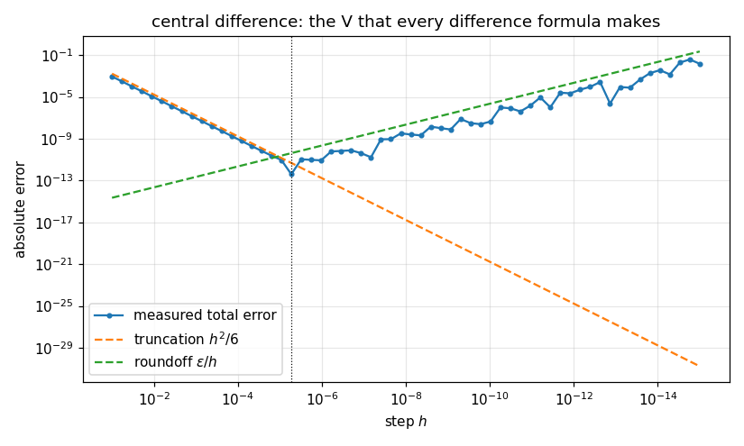

# 61. Numerical Differentiation

**Part 9: Numerical Differentiation and Integration**

## Learning objectives

By the end of this lesson you will be able to:

1. Derive finite difference weights two ways, from Taylor and from interpolation, and say which
   of the two you should actually compute with.
2. Measure a stencil's **order of accuracy** rather than quoting it, and explain the extra order
   a symmetric stencil gets for free.
3. Explain why differentiation is **ill conditioned** and derive the optimal step size
   $h^\ast \sim \varepsilon^{1/(p+m)}$.
4. Use **Richardson extrapolation** to gain orders without shrinking $h$.
5. Use the **complex step** derivative, which has no subtraction and therefore no cancellation,
   and say exactly when it fails.
6. Build a **differentiation matrix**, and see spectral differentiation beat any fixed order
   method until roundoff stops it.

## Prerequisites

Lesson 4 (forward and backward error, conditioning). Lesson 45 (Lagrange interpolation, which is
where the weights come from). Lesson 47 (why the power basis is a bad place to do business).
Lesson 56 (Chebyshev nodes). Lesson 63 will reuse Richardson extrapolation on integrals.

---

## 1. The problem

Differentiation takes a function you can evaluate and asks for its slope. Analytically that is
easy. Numerically it is the one operation in this course that is **fundamentally ill conditioned**,
and no algorithm fixes it.

The reason is the definition. $f'(x)$ is a limit of a quotient whose numerator tends to zero and
whose denominator tends to zero, and in floating point the numerator hits the rounding floor long
before the denominator does. Every method here is a way of managing that, not of escaping it.

Integration, in the next five lessons, is the opposite: it averages, so it is well conditioned,
and the whole difficulty there is efficiency rather than accuracy.

## 2. The weights, two ways

Pick offsets $o_0, \dots, o_{n-1}$ and ask for coefficients $c_j$ with

$$
f^{(m)}(x) \approx \frac{1}{h^m}\sum_{j} c_j\, f(x + o_j h).
$$

**Route one, Taylor.** Expand each $f(x + o_j h)$ and demand that the coefficient of $f^{(k)}(x)$
be $1$ when $k = m$ and $0$ otherwise. That is a linear system whose matrix is a Vandermonde in
the offsets.

**Route two, interpolation.** Build the Lagrange interpolant through the $n$ points,
differentiate it $m$ times, and evaluate at $0$. No linear system, just polynomial algebra.

They give the same weights, because both compute the same thing: the exact $m$th derivative of
the unique polynomial of degree $n-1$ through those points.

```python
# Standard setup, the same in every lesson of this course.
import sys, pathlib

_root = pathlib.Path.cwd()
while not (_root / "src" / "nalib").is_dir() and _root != _root.parent:
    _root = _root.parent
sys.path.insert(0, str(_root / "src"))

import numpy as np
import matplotlib.pyplot as plt

SEED = 42                                  # fixed so your numbers match the text
rng = np.random.default_rng(SEED)

np.set_printoptions(precision=6, linewidth=100, suppress=False)
plt.rcParams.update({
    "figure.figsize": (7.5, 4.5), "figure.dpi": 110,
    "axes.grid": True, "grid.alpha": 0.3, "font.size": 10,
})
```

```python
import math

from nalib import differentiation as df

print(f"{'stencil':>28}{'order':>7}{'points':>8}{'accuracy':>10}   weights")
for name, (offsets, order) in df.STENCILS.items():
    weights = df.fornberg(offsets, order)
    p = df.accuracy_order(offsets, order)
    print(f"{name:>28}{order:>7}{len(offsets):>8}{p:>10}   "
          f"{np.array2string(weights, precision=4, suppress_small=True)}")
    out = df.derivations_agree(offsets, order)
    assert out["agree"], name
```

*Output:*

```text
                     stencil  order  points  accuracy   weights
               forward first      1       2         1   [-1.  1.]
              backward first      1       2         1   [-1.  1.]
               central first      1       2         2   [-0.5  0.5]
    central first, 4th order      1       4         4   [ 0.0833 -0.6667  0.6667 -0.0833]
    forward first, 2nd order      1       3         2   [-1.5  2.  -0.5]
              central second      2       3         2   [ 1. -2.  1.]
   central second, 4th order      2       5         4   [-0.0833  1.3333 -2.5     1.3333 -0.0833]
              forward second      2       3         1   [ 1. -2.  1.]
               central third      3       4         2   [-0.5  1.  -1.   0.5]
              central fourth      4       5         2   [ 1. -4.  6. -4.  1.]
```

Two things in that table are worth stopping on.

**The weights sum to zero, always.** A derivative of any order annihilates constants, so the
coefficients must cancel. That is the cheapest possible check on a stencil and it catches most
typing errors.

**`central second` and `forward second` have identical weights $[1, -2, 1]$ and different
accuracy.** The weights do not determine the accuracy; the offsets do. Centred on $(-1, 0, 1)$
that stencil is second order, and shifted to $(0, 1, 2)$ it is first order. **A symmetric stencil
for a derivative of matching parity gains one order for free**, because the leftover odd Taylor
term cancels against itself.

## 3. Which route to compute with

The two derivations are equally valid and are not equally usable. The Vandermonde route is one
line of linear algebra and it falls apart as the stencil widens, because the condition number of
a Vandermonde grows exponentially in the number of nodes.

```python
from fractions import Fraction

def exact_weights(offsets, order):
    """The weights in exact rational arithmetic, by differentiating the Lagrange basis."""
    o = [Fraction(v).limit_denominator(10 ** 9) for v in offsets]
    n = len(o)
    out = []
    for j in range(n):
        poly = [Fraction(1)] + [Fraction(0)] * (n - 1)
        degree, denominator = 0, Fraction(1)
        for k in range(n):
            if k == j:
                continue
            new = [Fraction(0)] * n
            for i in range(degree + 1):
                new[i + 1] += poly[i]
                new[i] -= o[k] * poly[i]
            poly, degree = new, degree + 1
            denominator *= (o[j] - o[k])
        out.append(Fraction(math.factorial(order)) * poly[order] / denominator)
    return np.asarray([float(v) for v in out])

print("relative error in the weights, against exact rational arithmetic")
print(f"{'offsets':>9}{'from_taylor':>14}{'from_interpolation':>20}{'fornberg':>12}")
for n in (11, 21, 31, 41):
    half = n // 2
    offsets = (np.arange(n) - half) / float(half)
    exact = exact_weights(offsets, 1)
    scale = float(np.max(np.abs(exact)))
    row = [float(np.max(np.abs(fn(offsets, 1) - exact))) / scale
           for fn in (df.from_taylor, df.from_interpolation, df.fornberg)]
    print(f"{n:>9}{row[0]:>14.1e}{row[1]:>20.1e}{row[2]:>12.1e}")
    assert row[1] < 1e-12 and row[2] < 1e-12
```

*Output:*

```text
relative error in the weights, against exact rational arithmetic
  offsets   from_taylor  from_interpolation    fornberg
       11       2.7e-12             4.3e-16     6.4e-16
       21       1.6e-07             1.2e-15     7.8e-16
       31       1.5e-01             9.1e-16     9.5e-16
       41       2.9e+02             9.3e-16     8.1e-16
```

Every number in that table is measured against weights computed in exact rational arithmetic, so
none of the three columns is grading itself.

By 31 offsets the Vandermonde solve has **no correct digit left**, and by 41 it is wrong by a
factor of 300. The other two routes have lost nothing.

**The residual does not warn you.** `numpy.linalg.solve` is backward stable, so the weights it
returns satisfy the Taylor conditions to rounding no matter how wide the stencil is. Checking
"do the weights sum to zero" gives $5\times 10^{-16}$ for the broken weights too. This is forward
against backward error in its purest form: a small residual on an ill conditioned system says
nothing at all about the answer.

```python
print(f"{'offsets':>9}{'worst residual':>18}{'worst weight error':>22}")
for n in (11, 21, 31, 41):
    half = n // 2
    offsets = (np.arange(n) - half) / float(half)
    taylor = df.from_taylor(offsets, 1)
    stable = df.fornberg(offsets, 1)
    scale = float(np.max(np.abs(stable)))
    # check every condition the stencil was built to satisfy, not a fixed few
    residual = max(abs(float(np.sum(taylor * offsets ** k / math.factorial(k))
                              - (1.0 if k == 1 else 0.0)))
                   for k in range(offsets.size))
    print(f"{n:>9}{residual:>18.1e}{float(np.max(np.abs(taylor - stable))) / scale:>22.1e}")
```

*Output:*

```text
  offsets    worst residual    worst weight error
       11           6.7e-16               2.7e-12
       21           6.9e-16               1.6e-07
       31           1.8e-15               1.5e-01
       41           1.9e-12               2.9e+02
```

So: **derive with Taylor, compute with Fornberg.** Fornberg's recursion builds the weights for
every derivative order up to $m$ on every prefix of the offsets, using only differences and
quotients of node positions. Nothing large is subtracted to make something small, so nothing
cancels.

## 4. Order of accuracy, measured

A stencil's order is the power of $h$ in its leading error term. It is stated in every table and
it is easy to check: apply the stencil to a function with a known derivative and fit the slope.

```python
print(f"{'stencil':>28}{'predicted':>11}{'fitted':>9}{'best step':>12}{'best error':>13}")
for name in ("forward first", "central first", "central first, 4th order", "central second"):
    offsets, order = df.STENCILS[name]
    exact = math.cos(1.0) if order == 1 else -math.sin(1.0)
    out = df.error_against_step(np.sin, exact, 1.0, offsets, order)
    print(f"{name:>28}{df.accuracy_order(offsets, order):>11}{out['accuracy_order']:>9.3f}"
          f"{out['best_step']:>12.1e}{out['best_error']:>13.2e}")
    assert abs(out["accuracy_order"] - df.accuracy_order(offsets, order)) < 0.35
```

*Output:*

```text
                     stencil  predicted   fitted   best step   best error
               forward first          1    1.000     5.6e-09     2.53e-09
               central first          2    2.000     5.6e-06     3.76e-13
    central first, 4th order          4    4.000     1.0e-03     1.36e-13
              central second          2    2.000     5.6e-05     1.28e-09
```

The fitted orders match the predicted ones to three digits. Note the last two columns: **the best
step is not the smallest one tried**, and the best error is nowhere near machine precision. That
is section 5.

## 5. The step size, and why there is a best one

The total error of a difference formula has two parts that move in opposite directions.

$$
\underbrace{C h^p}_{\text{truncation}} \;+\; \underbrace{\frac{\varepsilon}{h^m}}_{\text{roundoff}}
$$

Truncation falls as $h$ shrinks. Roundoff rises, because $f$ is only known to a relative
$\varepsilon$, so the numerator carries an absolute error of about $\varepsilon$ however small it
is, and dividing by $h^m$ amplifies it.

Setting the derivative to zero gives

$$
h^\ast = \left(\frac{m\,\varepsilon}{p\,C}\right)^{1/(p+m)},
\qquad
\text{total error} \sim \varepsilon^{\,p/(p+m)} .
$$

**At the optimum the two error sources are not equal.** They satisfy $p \cdot \text{truncation}
= m \cdot \text{roundoff}$, so they are equal only when $p = m$. Asserting equality passes for
first order first derivatives and fails everywhere else, which is a pleasant trap.

```python
out = df.digits_lost()
print(f"{'order p':>9}{'error exponent':>16}{'best h':>12}{'best error':>13}"
      f"{'digits kept':>13}{'digits lost':>13}")
for p, e, a, k, l in zip(out["accuracy_orders"], out["error_exponents"],
                         out["achievable_error"], out["digits_kept"], out["digits_lost"]):
    step = df.optimal_step(int(p), 1)
    print(f"{p:>9}{e:>16.4f}{step['step']:>12.2e}{a:>13.2e}{k:>13.2f}{l:>13.2f}")
    # at the optimum p * truncation equals m * roundoff, with m = 1 here
    assert abs(p * step["truncation"] - step["roundoff"]) < 1e-6 * step["roundoff"]
```

*Output:*

```text
  order p  error exponent      best h   best error  digits kept  digits lost
        1          0.5000    2.11e-08     1.49e-08         7.83         8.17
        2          0.6667    6.06e-06     3.67e-11        10.44         5.56
        4          0.8000    6.44e-04     3.00e-13        12.52         3.48
        6          0.8571    4.96e-03     3.83e-14        13.42         2.58
        8          0.8889    1.56e-02     1.22e-14        13.91         2.09
       12          0.9231    5.45e-02     3.55e-15        14.45         1.55
       20          0.9524    1.61e-01     1.24e-15        14.91         1.09
```

**A first order formula can never do better than about 8 digits.** A second order one reaches
10.4, a fourth order one 12.5. You do not buy accuracy by shrinking $h$; you buy it by raising
$p$. That is the entire practical content of this section.

```python
offsets, order = df.STENCILS["central first"]
out = df.error_against_step(np.sin, math.cos(1.0), 1.0, offsets, order,
                            steps=np.logspace(-1, -15, 60))
fig, ax = plt.subplots()
ax.loglog(out["steps"], out["errors"], "o-", ms=3, label="measured total error")
ax.loglog(out["steps"], out["steps"] ** 2 / 6.0, "--", label=r"truncation $h^2/6$")
ax.loglog(out["steps"], np.finfo(float).eps / out["steps"], "--", label=r"roundoff $\varepsilon/h$")
ax.axvline(out["best_step"], color="k", lw=0.8, ls=":")
ax.set_xlabel("step $h$"); ax.set_ylabel("absolute error")
ax.set_title("central difference: the V that every difference formula makes")
ax.legend(); ax.invert_xaxis()
fig.tight_layout(); fig.savefig("../figures/61_step_size_v.png", dpi=110); plt.close(fig)
print("saved ../figures/61_step_size_v.png")
print(f"the two straight lines cross at h = {out['best_step']:.2e}, "
      f"where the measured error is {out['best_error']:.2e}")
```

*Output:*

```text
saved ../figures/61_step_size_v.png
the two straight lines cross at h = 5.36e-06, where the measured error is 3.94e-13
```



## 6. Richardson extrapolation

If the error is $C h^p + O(h^{p+q})$, then two evaluations at $h$ and $h/2$ give two equations
and the $h^p$ term can be eliminated:

$$
D_{\text{new}} = \frac{2^p D(h/2) - D(h)}{2^p - 1}.
$$

Repeat, and each level removes the next term. For a **centred** stencil the error series runs in
even powers only, so each level gains **two** orders instead of one.

```python
out = df.richardson_report(np.sin, math.cos(1.0), 1.0, 0.5, levels=5)
print(f"{'level':>7}{'forward error':>16}{'order':>8}{'central error':>16}{'order':>8}")
f_err, c_err = out["forward"]["errors"], out["central"]["errors"]
f_ord, c_ord = out["forward"]["orders"], out["central"]["orders"]
for k in range(len(f_err)):
    fo = f"{f_ord[k - 1]:>8.2f}" if k else f"{'':>8}"
    co = f"{c_ord[k - 1]:>8.2f}" if k else f"{'':>8}"
    print(f"{k:>7}{f_err[k]:>16.2e}{fo}{c_err[k]:>16.2e}{co}")
assert c_err[-1] < 1e-15
```

*Output:*

```text
  level   forward error   order   central error   order
      0        2.28e-01                2.22e-02        
      1        7.76e-03    1.00        6.98e-05    2.00
      2        5.99e-04    2.00        2.61e-08    4.00
      3        3.27e-06    3.00        1.42e-12    6.00
      4        3.84e-08    4.00        5.55e-16    8.00
      5        4.09e-11    5.00        6.66e-16   10.00
```

The forward column gains one order per level, $1, 2, 3, 4, 5, 6$. The central column gains two,
$2, 4, 6, 8, 10, 12$, and reaches $5.6\times10^{-16}$ at level 4. **Twelve function evaluations
and a step no smaller than $1/32$ deliver what shrinking $h$ could never deliver at all.**

That is the same trick that turns the trapezoid rule into Romberg integration in lesson 63, and
it works for the same reason: an error with a known expansion in powers of $h$ can be attacked
algebraically rather than by brute force.

## 7. The complex step, which has no cancellation

Here is the trick that looks like cheating. If $f$ is **holomorphic** near $x$, expand along the
imaginary axis:

$$
f(x + ih) = f(x) + ih f'(x) - \tfrac{h^2}{2}f''(x) - i\tfrac{h^3}{6}f'''(x) + \cdots
$$

Take the imaginary part and divide by $h$:

$$
f'(x) = \frac{\operatorname{Im} f(x + ih)}{h} + O(h^2).
$$

**There is no subtraction anywhere in that formula.** The $O(h^2)$ term is a truncation error and
nothing amplifies roundoff, so $h$ can be taken as small as you like. At $h = 10^{-200}$ the
truncation term is $10^{-400}$, which is zero, and the answer is exact to the last bit.

```python
out = df.complex_step_report(np.sin, math.cos(1.0), 1.0)
print(f"{'step h':>12}{'complex step error':>22}{'central difference error':>26}")
for h, cs, cd in zip(out["steps"], out["complex_step_errors"], out["central_errors"]):
    print(f"{h:>12.1e}{cs:>22.2e}{cd:>26.2e}")
print(f"\ncomplex step best: {out['complex_step_best']:.2e}   "
      f"central best: {out['central_best']:.2e}")
print(f"the complex step answer is exact: {out['complex_step_is_exact']}")
assert out["complex_step_best"] <= out["central_best"]
```

*Output:*

```text
      step h    complex step error  central difference error
     1.0e-01              9.01e-04                  9.00e-04
     3.3e-02              9.55e-05                  9.55e-05
     1.1e-02              1.01e-05                  1.01e-05
     3.5e-03              1.08e-06                  1.07e-06
     1.1e-03              1.14e-07                  1.14e-07
     3.7e-04              1.21e-08                  1.21e-08
     1.2e-04              1.28e-09                  1.28e-09
     3.9e-05              1.36e-10                  1.35e-10
     1.3e-05              1.44e-11                  1.44e-11
     4.1e-06              1.53e-12                  1.18e-11
     1.3e-06              1.63e-13                  2.85e-11
     4.4e-07              1.72e-14                  3.34e-11
     1.4e-07              1.78e-15                  1.56e-10
     4.6e-08              2.22e-16                  6.82e-10
     1.5e-08              0.00e+00                  1.67e-09
     4.9e-09              0.00e+00                  1.08e-09
     1.6e-09              0.00e+00                  3.60e-08
     5.2e-10              0.00e+00                  2.39e-08
     1.7e-10              0.00e+00                  1.30e-07
     5.5e-11              1.11e-16                  7.59e-07
     1.8e-11              0.00e+00                  1.72e-06
     5.9e-12              0.00e+00                  2.81e-07
     1.9e-12              0.00e+00                  2.21e-06
     6.2e-13              0.00e+00                  1.03e-04
     2.0e-13              0.00e+00                  7.19e-05
     6.6e-14              0.00e+00                  1.45e-04
     2.2e-14              0.00e+00                  7.84e-04
     7.0e-15              0.00e+00                  2.36e-03
     2.3e-15              0.00e+00                  5.95e-03
     7.4e-16              0.00e+00                  1.83e-02
     2.4e-16              0.00e+00                  8.24e-02
     7.9e-17              0.00e+00                  1.63e-01
     2.6e-17              0.00e+00                  5.40e-01
     8.4e-18              0.00e+00                  5.40e-01
     2.7e-18              0.00e+00                  5.40e-01
     8.9e-19              0.00e+00                  5.40e-01
     2.9e-19              0.00e+00                  5.40e-01
     9.4e-20              0.00e+00                  5.40e-01
     3.1e-20              0.00e+00                  5.40e-01
     1.0e-20              0.00e+00                  5.40e-01

complex step best: 0.00e+00   central best: 1.18e-11
the complex step answer is exact: True
```

Read that table carefully, because the interesting part is where the two columns **stop being
identical**.

Down to about $h = 10^{-5}$ they agree to three digits. Both formulas have an $O(h^2)$ truncation
error and at those step sizes truncation is all there is, so of course they agree. Nothing has
been gained yet.

Below that they separate completely. The central difference bottoms out at $1.4\times10^{-11}$
and then climbs by five orders of magnitude as cancellation takes over. The complex step keeps
falling, passes $10^{-15}$, and reaches **exactly zero**, where it stays for every smaller step.

So the complex step is not a better approximation. It is the same approximation with the
cancellation removed, which lets you take the limit that the formula always promised and floating
point never allowed.

### When it fails

The derivation used holomorphy, and that is a real requirement, not a formality. Any function
that inspects the real and imaginary parts separately breaks it.

```python
print(f"{'case':>20}{'exact':>10}{'complex step':>15}{'central':>11}{'wrong?':>9}")
for name in ("abs", "real", "conjugate", "sqrt of a square", "maximum"):
    out = df.complex_step_fails_on(name)
    print(f"{name:>20}{out['exact']:>10.4f}{out['complex_step']:>15.4f}"
          f"{out['central_difference']:>11.4f}{str(out['silently_wrong']):>9}")
    print(f"{'':>20}  {out['why']}")
```

*Output:*

```text
                case     exact   complex step    central   wrong?
                 abs    1.0000         0.0000     1.0000     True
                      np.abs of a complex number is the modulus, not the analytic continuation
                real    3.0000         0.0000     3.0000     True
                      np.real discards the imaginary part, so the derivative information is gone
           conjugate    3.0000         0.0000     3.0000     True
                      conj is not holomorphic anywhere
    sqrt of a square    1.0000         1.0000     1.0000    False
                      sqrt(z^2) is |x| for real x and z for complex z near the positive axis, so the two agree in value and not in derivative
             maximum    3.0000         3.0000     3.0000    False
                      a branch on a real comparison is not analytic, but numpy's maximum compares complex numbers lexicographically, so this one happens to work AWAY from the kink and fails only at it, where the derivative does not exist anyway
```

`abs`, `real` and `conjugate` are nowhere holomorphic and the complex step returns **zero** for
all three, silently. The central difference gets them right, because on the real line they are
perfectly ordinary functions.

The last two are the interesting ones. `sqrt(z**2)` and `maximum(z, c)` look non holomorphic and
the complex step handles them correctly, because **away from their kink they agree with a
holomorphic function on a whole neighbourhood**. The requirement is local holomorphy at the point
you are differentiating, not global smoothness of the expression you wrote down.

This matters in practice: it is why the complex step works on so much real code, and why it
fails so confusingly when it fails. A single `abs` or `max` in the wrong place turns an exact
derivative into a zero with no warning.

## 8. Differentiation matrices

Everything so far differentiates at one point. Collect the stencils for every node into a matrix
and one matrix-vector product differentiates everywhere at once.

$$
\mathbf{f}' \approx D \mathbf{f},
\qquad
D_{ij} = \text{weight of node } j \text{ in the stencil centred at node } i .
$$

On equally spaced nodes with a narrow stencil this is banded. On **all** the nodes it is dense,
and if the nodes are Chebyshev points it is the spectral differentiation matrix.

```python
for n in (5, 9):
    nodes = np.linspace(-1.0, 1.0, n)
    D = df.differentiation_matrix(nodes, 1)
    print(f"n = {n}: D has shape {D.shape}, row sums max |.| = "
          f"{float(np.max(np.abs(D @ np.ones(n)))):.2e}")
A = df.second_derivative_matrix(6, 1.0 / 7.0, "dirichlet")
print("\nsecond derivative matrix with Dirichlet ends, n = 6:")
print(A * (1.0 / 7.0) ** 2)
print(f"symmetric: {float(np.max(np.abs(A - A.T))):.1e}, "
      f"largest eigenvalue: {float(np.max(np.linalg.eigvalsh(A))):.4f} (negative definite)")
```

*Output:*

```text
n = 5: D has shape (5, 5), row sums max |.| = 3.05e-16
n = 9: D has shape (9, 9), row sums max |.| = 2.84e-14

second derivative matrix with Dirichlet ends, n = 6:
[[-2.  1.  0.  0.  0.  0.]
 [ 1. -2.  1.  0.  0.  0.]
 [ 0.  1. -2.  1.  0.  0.]
 [ 0.  0.  1. -2.  1.  0.]
 [ 0.  0.  0.  1. -2.  1.]
 [ 0.  0.  0.  0.  1. -2.]]
symmetric: 0.0e+00, largest eigenvalue: -9.7051 (negative definite)
```

That tridiagonal $[1, -2, 1]$ matrix is the discrete Laplacian, and it will be the whole
subject of Part 11. Its eigenvalues are known exactly, $-\frac{4}{h^2}\sin^2(k\pi h/2)$, which
makes it the standard test problem for every iterative solver in Part 6.

**Build the matrix with Fornberg, not with a Vandermonde solve.** On 25 equally spaced nodes the
Vandermonde route gives a matrix whose weights are wrong in the fourth digit, and the symptom is
easy to miss because low degree polynomials still come out fine.

## 9. Spectral differentiation

Put the nodes at the Chebyshev extreme points instead of equally spaced, and the dense
differentiation matrix stops being a finite difference approximation and starts being exact for
polynomials of degree $n-1$. For a smooth $f$ the accuracy improves **geometrically** in $n$
rather than at any fixed order.

```python
out = df.spectral_against_finite_difference(np.sin, np.cos)
print(f"{'nodes':>7}{'spectral (Chebyshev)':>24}{'3 point finite difference':>28}")
for n, s, f in zip(out["counts"], out["spectral_error"], out["finite_difference_error"]):
    print(f"{n:>7}{s:>24.2e}{f:>28.2e}")
assert float(np.min(out["spectral_error"])) < float(np.min(out["finite_difference_error"]))
```

*Output:*

```text
  nodes    spectral (Chebyshev)   3 point finite difference
      5                7.85e-03                    4.11e-02
      9                3.34e-07                    1.04e-02
     17                1.03e-14                    2.60e-03
     33                2.67e-13                    6.51e-04
     65                1.43e-12                    1.63e-04
```

The finite difference column falls by a factor of 4 per doubling, which is second order, exactly
as advertised. The spectral column falls from $7.8\times10^{-3}$ to $10^{-14}$ in three steps and
then **stops improving and starts getting worse**.

That turn is not a defect in the method. It is the dense matrix's entries growing like $n^2$, so
the matrix-vector product carries $O(n^2\varepsilon)$ of amplified rounding. There is nothing to
be gained past the minimum, and knowing roughly where the minimum is matters more than knowing
the convergence rate.

## 10. Exercises

**Level 1, conceptual**

1.1 Explain why numerical differentiation is ill conditioned and numerical integration is not,
in terms of what each operation does to a small perturbation of $f$.

1.2 The weights of every stencil sum to zero. Say why, and give the corresponding statement for
the second moment $\sum_j c_j o_j^2$ of a first derivative stencil.

1.3 `central second` and `forward second` have identical weights and different orders. Explain.

1.4 The complex step returns exactly zero for `abs` and the right answer for `sqrt(z**2)`, even
though both are built from operations that are not holomorphic. Explain the difference.

**Level 2, mathematical**

2.1 Derive the optimal step $h^\ast \sim (m\varepsilon/pC)^{1/(p+m)}$ and the resulting error
$\varepsilon^{p/(p+m)}$, and show that at the optimum $p\cdot\text{truncation} =
m\cdot\text{roundoff}$.

2.2 Prove that a symmetric stencil for an odd order derivative has even order of accuracy, and
therefore gains one order over the node count bound.

2.3 Derive the complex step formula and its $O(h^2)$ error term, and say precisely which
hypothesis on $f$ each step uses.

2.4 Show that the Richardson table for a centred stencil gains two orders per level, by writing
out the error series.

2.5 Prove that the eigenvalues of the tridiagonal second difference matrix with Dirichlet ends
are $-\frac{4}{h^2}\sin^2(k\pi h/2)$, and find the eigenvectors.

**Level 3, computational**

3.1 Implement Fornberg's recursion from the paper's Table 1 and check it against
`nalib.differentiation.fornberg` on random offsets in several derivative orders.

3.2 Build the Chebyshev spectral differentiation matrix from its closed form
($D_{ij} = \frac{c_i}{c_j}\frac{(-1)^{i+j}}{x_i - x_j}$ off the diagonal, negative row sums on it)
and compare it against the one this lesson builds from stencils.

3.3 Implement the complex step for the **second** derivative using a multicomplex or dual number
type, and say why the plain complex step cannot give it.

3.4 Implement one dimensional automatic differentiation with dual numbers, and compare its cost
and accuracy against the complex step on the same functions.

**Level 4, experimental**

4.1 Measure the achievable accuracy against the accuracy order $p$ for $p = 1 \dots 20$ and check
it against $\varepsilon^{p/(p+1)}$. Say where the prediction stops holding and why.

4.2 Measure how the spectral differentiation minimum moves as a function of the integrand's
smoothness, using $|x|^{a}$ for a range of $a$.

4.3 Differentiate a function known only to a few digits, by adding noise of a chosen size, and
measure how the optimal step and the achievable accuracy move with the noise level.

**Level 5, advanced**

5.1 **Regularised differentiation.** Differentiating noisy data by finite differences is hopeless.
Formulate it as a Tikhonov regularised inverse problem, implement it, and compare against
smoothing the data first with the splines of lesson 51.

5.2 **Why not just use symbolic differentiation?** Take a function defined by a long expression,
differentiate it symbolically, and measure the size of the resulting expression and its
evaluation cost against automatic differentiation. Say what each is for.

5.3 **The differentiation matrix as an operator.** Compute the eigenvalues of the Chebyshev
first derivative matrix and explain why they are not on the imaginary axis, what that means for
using it in a time dependent problem, and how the boundary condition changes the picture.

## 11. Key takeaways

- **Numerical differentiation is ill conditioned and no method fixes it.** A first order formula
  cannot reach better than about 8 correct digits, a second order one 10.4, a fourth order one
  12.5. Accuracy comes from raising the order, never from shrinking the step.

- **There is always a best step, and it is not small.** For the central difference on $\sin$ it is
  $5.6\times10^{-6}$, and going to $10^{-15}$ makes the answer about $10^4$ times worse.

- **Derive the weights with Taylor and compute them with Fornberg.** The Vandermonde solve has no
  correct digit left by 31 offsets, and its residual stays at $10^{-16}$ throughout, so the
  obvious check does not catch it. This is forward against backward error in its purest form.

- **A symmetric stencil gains an order for free.** The weights do not decide the order, the
  offsets do: $[1, -2, 1]$ is second order centred and first order shifted.

- **Richardson extrapolation gains two orders per level on a centred stencil.** Twelve
  evaluations at steps no smaller than $1/32$ reach $5.6\times10^{-16}$, which no choice of $h$
  could reach.

- **The complex step has no subtraction, so it has no cancellation, and it is exact.** It needs
  holomorphy at the point, which `abs`, `real` and `conj` never have and which `sqrt(z**2)` has
  everywhere except its kink.

- **Spectral differentiation converges geometrically and then turns around.** On $\sin$ it reaches
  $10^{-14}$ at 17 nodes and is worse at 65, because the matrix entries grow like $n^2$ and carry
  the rounding with them.

## Where this goes next

Lesson 62 turns to integration, where the same interpolate-then-operate idea gives the
Newton-Cotes rules, and where the conditioning is finally on our side. Lesson 63 applies this
lesson's Richardson extrapolation to the trapezoid rule and gets Romberg integration. Part 11
solves differential equations by replacing every derivative with the matrices of section 8, and
the eigenvalues computed there decide whether the resulting scheme is stable.
