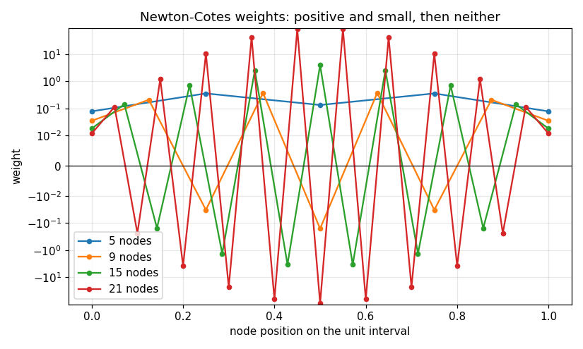

# 62. Newton-Cotes Quadrature

**Part 9: Numerical Differentiation and Integration**

## Learning objectives

By the end of this lesson you will be able to:

1. Derive the Newton-Cotes weights by integrating the Lagrange basis, and recognise the classical
   fractions that give trapezoid, Simpson, Boole and Weddle their names.
2. Measure a rule's **degree of precision** and explain the extra degree an odd node count gets.
3. Say why the family stops working past 8 nodes, by measuring the weights rather than quoting
   the result.
4. Build **composite** rules and measure their convergence order against the predicted one.
5. Derive the classical error terms and check them against a table, sign convention included.
6. Use the **open** rules where the integrand is singular at an endpoint.

## Prerequisites

Lesson 45 (Lagrange interpolation). Lesson 46 (why a high degree interpolant through equally
spaced nodes diverges). Lesson 61 (the same interpolate-then-operate idea, applied to
derivatives).

---

## 1. Interpolate, then integrate

The construction could not be simpler. Sample $f$ at $n$ equally spaced nodes, build the
interpolating polynomial, and integrate that exactly.

$$
\int_a^b f \;\approx\; \int_a^b p_{n-1}
= \int_a^b \sum_j f(x_j)\, \ell_j(x)\,dx
= (b-a)\sum_j w_j f(x_j),
\qquad
w_j = \frac{1}{b-a}\int_a^b \ell_j .
$$

The weights depend only on the node count, never on $f$. Compute them once and the rule is a
fixed weighted sum forever.

**Compute them in exact rational arithmetic.** The classical fractions are the whole point of the
low order members, and in floating point they come out as unrecognisable decimals.

```python
# Standard setup, the same in every lesson of this course.
import sys, pathlib

_root = pathlib.Path.cwd()
while not (_root / "src" / "nalib").is_dir() and _root != _root.parent:
    _root = _root.parent
sys.path.insert(0, str(_root / "src"))

import numpy as np
import matplotlib.pyplot as plt

SEED = 42                                  # fixed so your numbers match the text
rng = np.random.default_rng(SEED)

np.set_printoptions(precision=6, linewidth=100, suppress=False)
plt.rcParams.update({
    "figure.figsize": (7.5, 4.5), "figure.dpi": 110,
    "axes.grid": True, "grid.alpha": 0.3, "font.size": 10,
})
```

```python
import math
from fractions import Fraction

from nalib import newtoncotes as nc

print(f"{'rule':>18}{'nodes':>7}  weights")
for name, (n, closed) in nc.NAMED.items():
    exact = nc.exact_weights(n, closed)
    print(f"{name:>18}{n:>7}  {[str(v) for v in exact]}")
    assert sum(exact) == Fraction(1), name
    assert exact == list(reversed(exact)), name
```

*Output:*

```text
              rule  nodes  weights
         trapezoid      2  ['1/2', '1/2']
       Simpson 1/3      3  ['1/6', '2/3', '1/6']
       Simpson 3/8      4  ['1/8', '3/8', '3/8', '1/8']
             Boole      5  ['7/90', '16/45', '2/15', '16/45', '7/90']
         six point      6  ['19/288', '25/96', '25/144', '25/144', '25/96', '19/288']
            Weddle      7  ['41/840', '9/35', '9/280', '34/105', '9/280', '9/35', '41/840']
          midpoint      1  ['1']
    open two point      2  ['1/2', '1/2']
  open three point      3  ['2/3', '-1/3', '2/3']
   open four point      4  ['11/24', '1/24', '1/24', '11/24']
```

Trapezoid is $[\tfrac12, \tfrac12]$, Simpson is $[\tfrac16, \tfrac46, \tfrac16]$, and the 3/8 rule
is $[\tfrac18, \tfrac38, \tfrac38, \tfrac18]$. **The names come from those denominators.**

Two properties hold for every member and are worth asserting rather than assuming. The weights
**sum to one**, because the rule must reproduce $\int_a^b 1 = b - a$. And they are
**symmetric**, because the nodes are.

## 2. Degree of precision

An $n$ point rule integrates the interpolating polynomial exactly, and that polynomial has degree
$n-1$, so the rule is exact on degree $n-1$ at least. Sometimes it does better.

```python
print(f"{'nodes':>7}{'closed':>9}{'open':>7}{'closed bonus':>15}")
for n in range(2, 12):
    closed = nc.degree_of_precision(n, True)
    opened = nc.degree_of_precision(n, False)
    bonus = "yes" if closed > n - 1 else ""
    print(f"{n:>7}{closed:>9}{opened:>7}{bonus:>15}")
    assert closed == (n if n % 2 else n - 1)
```

*Output:*

```text
  nodes   closed   open   closed bonus
      2        1      1               
      3        3      3            yes
      4        3      3               
      5        5      5            yes
      6        5      5               
      7        7      7            yes
      8        7      7               
      9        9      9            yes
     10        9      9               
     11       11     11            yes
```

**An odd node count buys one extra degree.** The reason is symmetry: for a symmetric rule the
error term on $x^{n}$ integrates to zero over the symmetric interval, so the first degree it
actually misses is $n+1$.

That single fact settles a practical question. Simpson's 3/8 rule costs one more function
evaluation than Simpson's 1/3 rule and has **the same degree of precision**. The same holds at
every even count. **The even members of the family are not worth their extra node.**

This measurement is done in exact rational arithmetic, and that is not fussiness. Done in floating
point with a tolerance, the 21 point rule reports degree 24 for a 21 node rule: its weights sum to
544 in absolute value, so the monomials it genuinely misses are missed by less than the rounding
those weights produce. That is a measurement of the arithmetic, not of the rule.

## 3. Where the family dies

Raising the node count does not keep helping. It stops helping, and then it actively hurts, for
exactly the reason lesson 46 gave: the interpolating polynomial through many equally spaced nodes
diverges. The weights show it directly.

```python
out = nc.weight_report()
print(f"{'nodes':>7}{'all positive':>14}{'largest weight':>16}{'sum |w|':>14}{'degree':>9}")
for n, p, big, total, d in zip(out["counts"], out["all_positive"], out["largest_weight"],
                               out["sum_of_absolute_weights"], out["degree_of_precision"]):
    print(f"{n:>7}{str(p):>14}{big:>16.4f}{total:>14.4f}{d:>9}")
print(f"\nfirst node count with a negative weight: {out['first_negative']}")
assert out["first_negative"] == 9
```

*Output:*

```text
  nodes  all positive  largest weight       sum |w|   degree
      2          True          0.5000        1.0000        1
      3          True          0.6667        1.0000        3
      4          True          0.3750        1.0000        3
      5          True          0.3556        1.0000        5
      6          True          0.2604        1.0000        5
      7          True          0.3238        1.0000        7
      8          True          0.2070        1.0000        7
      9         False          0.3702        1.4512        9
     11         False          0.7138        3.0648       11
     15         False          3.9039       20.3435       15
     21         False         90.0054      544.1772       21

first node count with a negative weight: 9
```

Up to 8 nodes every weight is positive and $\sum|w_j| = 1$ exactly. **That makes the rule a
weighted average**, so its answer is bounded by $\max|f|$ times the interval length and it cannot
amplify anything.

From 9 nodes onward some weights are negative, $\sum|w_j|$ exceeds 1, and the guarantee is gone.
By 21 nodes the largest weight is 90 times the interval length and $\sum|w_j|$ is 544, so the rule
adds and subtracts numbers 544 times larger than the answer. On a perfectly smooth integrand, in
exact arithmetic, it still works. In floating point it throws away two and a half digits before it
starts.

```python
fig, ax = plt.subplots()
for n in (5, 9, 15, 21):
    ax.plot(np.linspace(0, 1, n), nc.weights(n, True), "o-", ms=4, label=f"{n} nodes")
ax.axhline(0.0, color="k", lw=0.8)
ax.set_xlabel("node position on the unit interval"); ax.set_ylabel("weight")
ax.set_yscale("symlog", linthresh=1e-2)
ax.set_title("Newton-Cotes weights: positive and small, then neither")
ax.legend()
fig.tight_layout(); fig.savefig("../figures/62_weights_diverge.png", dpi=110); plt.close(fig)
print("saved ../figures/62_weights_diverge.png")
```

*Output:*

```text
saved ../figures/62_weights_diverge.png
```



## 4. So compose instead

The answer is not to use a wider rule. It is to chop the interval into panels and apply a small
rule on each.

$$
\int_a^b f = \sum_{\text{panels}} \int_{\text{panel}} f
\;\approx\; \sum_{\text{panels}} (\text{small rule}).
$$

A rule with degree of precision $d$ has a one panel error of order $h^{d+2}$, and summing
$(b-a)/h$ panels gives a composite error of order $h^{d+1}$. **No high degree polynomial is ever
formed**, so nothing diverges.

```python
def antiderivative_sin(a, b):
    return math.cos(a) - math.cos(b)

print(f"{'rule':>16}{'nodes':>7}{'predicted':>11}{'fitted':>9}{'panels used':>13}  note")
for name, n in (("trapezoid", 2), ("Simpson 1/3", 3), ("Simpson 3/8", 4), ("Boole", 5),
                ("Weddle", 7)):
    out = nc.convergence(np.sin, antiderivative_sin(0.0, 1.0), 0.0, 1.0, n, True)
    fitted = "nan" if math.isnan(out["fitted_order"]) else f"{out['fitted_order']:.3f}"
    print(f"{name:>16}{n:>7}{out['predicted_order']:>11}{fitted:>9}"
          f"{out['points_used_in_the_fit']:>13}  {out['note']}")
```

*Output:*

```text
            rule  nodes  predicted   fitted  panels used  note
       trapezoid      2          2    2.002            8  fitted on the finest 8 refinements
     Simpson 1/3      3          4    4.004            8  fitted on the finest 8 refinements
     Simpson 3/8      4          4    4.004            8  fitted on the finest 8 refinements
           Boole      5          6    6.013            5  fitted on the finest 5 refinements
          Weddle      7          8      nan            0  only 2 refinements are above the roundoff floor
```

The fitted orders match the predicted ones. **Where they do not, the reason is stated rather than
averaged away.** A rule that is exact on the integrand has no rate to fit, and a high order rule
on a smooth integrand can reach the roundoff floor before any two refinements share a slope. Both
report `nan` and say which happened.

That second case is worth dwelling on. Fitting a slope through everything above the roundoff floor
is the obvious thing to do and it is wrong. Runge's function has a sharp peak that the first few
panel counts do not resolve at all, and including those panels in the fit inflates every order.

```python
def runge(x):
    return 1.0 / (1.0 + 25.0 * np.asarray(x, dtype=float) ** 2)

exact_runge = 2.0 * math.atan(5.0) / 5.0
print("composite rules on Runge's function over [-1, 1]")
print(f"{'rule':>16}{'true order':>12}{'fit over all':>14}{'tail fit':>10}{'dropped':>9}")
for name, n in (("trapezoid", 2), ("Simpson 1/3", 3), ("Boole", 5)):
    out = nc.convergence(runge, exact_runge, -1.0, 1.0, n, True)
    panels = np.asarray(out["panels"], dtype=float)
    errors = np.asarray(out["errors"], dtype=float)
    keep = errors > 1e-14
    naive = float(-np.polyfit(np.log(panels[keep]), np.log(errors[keep]), 1)[0])
    tail = "nan" if math.isnan(out["fitted_order"]) else f"{out['fitted_order']:.3f}"
    print(f"{name:>16}{out['predicted_order']:>12}{naive:>14.3f}{tail:>10}"
          f"{out['panels_dropped_from_the_head']:>9}")

out = nc.convergence(runge, exact_runge, -1.0, 1.0, 2, True)
print(f"\ntrapezoid in detail, panels {[int(v) for v in out['panels']]}:")
print(f"   errors {[f'{v:.1e}' for v in out['errors']]}")
assert abs(out["fitted_order"] - 2.0) < 0.25
```

*Output:*

```text
composite rules on Runge's function over [-1, 1]
            rule  true order  fit over all  tail fit  dropped
       trapezoid           2         2.816     1.999        5
     Simpson 1/3           4         5.226     4.062        5
           Boole           6         6.904       nan        8

trapezoid in detail, panels [1, 2, 4, 8, 16, 32, 64, 128]:
   errors ['4.7e-01', '4.9e-01', '1.1e-01', '7.5e-03', '1.4e-04', '4.8e-05', '1.2e-05', '3.0e-06']
```

The trapezoid rule is order 2 and a fit over everything reads 2.8. Those are not noisy
measurements of the right answer, they are the wrong answer, and the last line shows why: the
first two panel counts give almost the same error, because neither resolves the peak.

## 5. Sharing the endpoints

Neighbouring panels share a node, so a composite rule should evaluate it once.

```python
for n in (2, 3, 5):
    plain, shared = [0], [0]
    a = nc.composite(np.sin, 0.0, 1.0, 16, n, True, plain)
    b = nc.composite_shared(np.sin, 0.0, 1.0, 16, n, shared)
    print(f"{n} point rule, 16 panels: naive {plain[0]:>4} evaluations, "
          f"shared {shared[0]:>4}, answers agree to {abs(a - b):.1e}")
    assert abs(a - b) < 1e-14 and shared[0] < plain[0]
```

*Output:*

```text
2 point rule, 16 panels: naive   32 evaluations, shared   17, answers agree to 0.0e+00
3 point rule, 16 panels: naive   48 evaluations, shared   33, answers agree to 0.0e+00
5 point rule, 16 panels: naive   80 evaluations, shared   65, answers agree to 0.0e+00
```

The saving is a constant factor, not an order, and it is worth having for the same reason the
trapezoid ladder of lesson 63 is worth having: function evaluations are usually the expensive part.

## 6. The error terms

Every textbook carries a table like this one:

$$
\begin{aligned}
\text{trapezoid} &: && -\tfrac{1}{12}h^3 f''(\xi) \\
\text{Simpson } \tfrac13 &: && -\tfrac{1}{90}h^5 f^{(4)}(\xi) \\
\text{Simpson } \tfrac38 &: && -\tfrac{3}{80}h^5 f^{(4)}(\xi) \\
\text{Boole} &: && -\tfrac{8}{945}h^7 f^{(6)}(\xi) \\
\text{Weddle} &: && -\tfrac{9}{1400}h^9 f^{(8)}(\xi)
\end{aligned}
$$

The constant is derivable: apply the rule to the first monomial it cannot integrate exactly and
divide by the appropriate factorial.

```python
out = nc.error_constants_agree()
print(f"{'rule':>14}{'classical':>16}{'derived':>16}{'gap':>12}{'h power':>9}")
for name, c, d, gap, order in zip(out["names"], out["classical"], out["derived"],
                                  out["gap"], out["order"]):
    print(f"{name:>14}{c:>16.10f}{d:>16.10f}{gap:>12.1e}{order:>9}")
print(f"\nall agree: {out['all_agree']}")
assert out["all_agree"]
```

*Output:*

```text
          rule       classical         derived         gap  h power
     trapezoid   -0.0833333333   -0.0833333333     1.4e-17        3
   Simpson 1/3   -0.0111111111   -0.0111111111     4.0e-17        5
   Simpson 3/8   -0.0375000000   -0.0375000000     5.1e-16        5
         Boole   -0.0084656085   -0.0084656085     6.0e-16        7
        Weddle   -0.0064285714   -0.0064285714     9.9e-15        9

all agree: True
```

**Every classical constant is negative, and getting that sign right is the whole exercise.** The
tables state the error as $I_{\text{exact}} - I_{\text{rule}}$, so a rule that overestimates a
convex integrand has a negative constant. Computing $I_{\text{rule}} - I_{\text{exact}}$ instead
reproduces every magnitude in the table with every sign flipped, which looks like agreement until
you compare the signs.

## 7. Open rules

Everything above uses both endpoints. When $f$ blows up at one of them, that is fatal, and no
amount of refinement helps because the very first evaluation returns infinity.

The **open** rules use only interior nodes. They are one order worse for the same node count and
they turn an impossible problem into a merely slow one.

```python
def inverse_sqrt(x):
    return 1.0 / np.sqrt(np.asarray(x, dtype=float))

print(f"{'panels':>8}", end="")
first = nc.endpoint_singularity(inverse_sqrt, 2.0, 0.0, 1.0, 4)
for key in first:
    print(f"{key:>22}", end="")
print()
for panels in (4, 16, 64, 256):
    out = nc.endpoint_singularity(inverse_sqrt, 2.0, 0.0, 1.0, panels)
    print(f"{panels:>8}", end="")
    for key in out:
        cell = "inf" if not out[key]["finite"] else f"{out[key]['error']:.4f}"
        print(f"{cell:>22}", end="")
    print()
```

*Output:*

```text
  panels    trapezoid (closed)      Simpson (closed)       midpoint (open)      open three point
       4                   inf                   inf                0.3012                0.1843
      16                   inf                   inf                0.1511                0.0922
      64                   inf                   inf                0.0756                0.0461
     256                   inf                   inf                0.0378                0.0230
```

The two closed rules return infinity at every panel count, because the leftmost node **is** the
singularity. The two open rules produce a number and improve as the panels refine.

They improve slowly, and the table says how slowly: each fourfold refinement halves the error, so
the observed order is one half rather than the two the midpoint rule would have on a smooth
integrand.

```python
print(f"{'rule':>22}{'fitted order':>16}")
counts = np.asarray([4, 16, 64, 256, 1024], dtype=float)
rows = [nc.endpoint_singularity(inverse_sqrt, 2.0, 0.0, 1.0, int(m)) for m in counts]
for key in rows[0]:
    if not rows[0][key]["finite"]:
        print(f"{key:>22}{'no finite value':>16}")
        continue
    errors = np.asarray([r[key]["error"] for r in rows])
    order = float(-np.polyfit(np.log(counts), np.log(errors), 1)[0])
    print(f"{key:>22}{order:>16.4f}")
    assert 0.4 < order < 0.6
```

*Output:*

```text
                  rule    fitted order
    trapezoid (closed) no finite value

      Simpson (closed) no finite value
       midpoint (open)          0.4993
      open three point          0.5000
```

The integrand has no bounded derivatives at zero, so the classical error term does not apply and
the composite order collapses to what the singularity allows. Lesson 66 is about doing better than
this, by changing variables so the singularity goes away.

## 8. Which rule to actually use

Compare them at equal cost, which is the only comparison that means anything.

```python
out = nc.compare_rules(runge, exact_runge, -1.0, 1.0, evaluations_target=400)
print(f"{'rule':>18}{'nodes':>7}{'panels':>8}{'evaluations':>13}{'error':>13}")
for name, n, panels, ev, err in zip(out["names"], out["nodes"], out["panels"],
                                    out["evaluations"], out["errors"]):
    print(f"{name:>18}{n:>7}{panels:>8}{ev:>13}{err:>13.3e}")
print(f"\nbest at this budget: {out['best']}")
```

*Output:*

```text
              rule  nodes  panels  evaluations        error
         trapezoid      2     400          800    3.082e-07
       Simpson 1/3      3     200          600    5.470e-12
       Simpson 3/8      4     133          532    1.243e-11
             Boole      5     100          500    1.332e-15
         six point      6      80          480    2.998e-15
            Weddle      7      66          462    2.220e-16
          midpoint      1     200          200    6.164e-07
    open two point      2     133          266    9.291e-07
  open three point      3     100          300    7.656e-11
   open four point      4      80          320    1.299e-10

best at this budget: Weddle
```

At a fixed budget the higher order composite rules win, and the gap widens as the budget grows.
There is no reason to use the trapezoid rule for a smooth integrand.

**There are two large reasons to use it anyway**, and they are the next two lessons. Its error has
an expansion in even powers of $h$ that can be extrapolated away, which is lesson 63. And on a
periodic integrand that expansion vanishes entirely, which makes the worst rule here the best rule
there.

## 9. Exercises

**Level 1, conceptual**

1.1 Explain why the Newton-Cotes weights do not depend on $f$, and what that buys.

1.2 An odd node count buys one extra degree of precision. Say why, and say what it implies about
Simpson's 3/8 rule.

1.3 The weights of the 21 point rule sum to 544 in absolute value. Say precisely what goes wrong
as a result, and why it is not visible on a polynomial test.

1.4 Explain why a composite rule of many small panels is safe where one wide rule is not, given
that both use the same number of function evaluations.

**Level 2, mathematical**

2.1 Derive the trapezoid and Simpson weights by integrating the Lagrange basis, and check them
against the classical fractions.

2.2 Prove that a symmetric rule with an odd number of nodes has degree of precision $n$ rather
than $n-1$.

2.3 Derive the trapezoid error term $-\frac{1}{12}h^3f''(\xi)$ from the interpolation error
formula, and say where the mean value theorem is used.

2.4 Show that the composite error of a rule with one panel error $O(h^{d+2})$ is $O(h^{d+1})$.

2.5 Prove that the Newton-Cotes weights sum to 1 for every $n$, and that $\sum_j |w_j|$ is
unbounded as $n$ grows.

**Level 3, computational**

3.1 Implement Newton-Cotes weights by solving the moment equations $\sum_j w_j x_j^k =
\frac{1}{k+1}$ and compare against integrating the Lagrange basis, in both exact and floating
point arithmetic.

3.2 Implement a composite rule that reuses shared endpoints across panels **and** across
successive refinements, and count the evaluations saved.

3.3 Implement the **corrected trapezoid rule**, which adds the endpoint derivative term from
Euler-Maclaurin, and measure the order it achieves.

3.4 Implement Newton-Cotes rules on the half open interval, using the open weights on one side
and the closed weights on the other, for an integrand singular at exactly one end.

**Level 4, experimental**

4.1 Measure $\sum_j |w_j|$ against $n$ for both the closed and open families, and fit the growth
rate. Say at which $n$ a double precision computation loses all its digits.

4.2 Measure the composite convergence order for integrands of controlled smoothness, $|x|^a$ for
a range of $a$, and find the point where the smoothness rather than the rule limits the order.

4.3 Measure how much the asymptotic tail matters: fit the composite order over every window of
three successive panel counts and plot the fitted order against the window position.

**Level 5, advanced**

5.1 **Why the weights go negative.** Relate the sign change at 9 nodes to the Lebesgue constant
of equally spaced interpolation from lesson 46, and give the asymptotic growth rate of
$\sum_j|w_j|$.

5.2 **Newton-Cotes on Chebyshev nodes.** Integrating the interpolant through Chebyshev points
gives Clenshaw-Curtis quadrature. Implement it, show its weights stay positive, and compare it
against Gauss quadrature from lesson 65 at equal cost.

5.3 **The error term is not a bound.** The classical error terms contain an unknown $\xi$. Say
what can and cannot be concluded from them in practice, and construct an integrand where the
naive use of the formula gives a badly wrong error estimate.

## 10. Key takeaways

- **Newton-Cotes is interpolate then integrate.** The weights come from integrating the Lagrange
  basis and depend only on the node count, which is why the classical fractions exist at all.

- **An odd node count buys one degree for free**, so the even members of the family are wasted
  effort. Simpson's 3/8 rule costs more than Simpson's 1/3 rule and delivers the same degree.

- **The family dies at 9 nodes.** That is where the first negative weight appears and the rule
  stops being a weighted average. By 21 nodes $\sum|w_j| = 544$ and the arithmetic loses two and
  a half digits before the mathematics starts.

- **So compose, do not extend.** Small rules on many panels converge at the small rule's own
  order and never form a divergent interpolant.

- **Fit the convergence order on the asymptotic tail only.** Fitting through the pre-asymptotic
  panels gives order 2.8 for a rule of order 2, and that is a wrong answer rather than a noisy one.

- **The classical error constants are stated as $I_{\text{exact}} - I_{\text{rule}}$**, so they
  are all negative. Deriving them the other way round reproduces every magnitude and flips every
  sign.

- **Open rules exist for singular endpoints.** They cost one order and they turn an infinity into
  a number.

## Where this goes next

Lesson 63 takes the worst rule here, the trapezoid rule, and shows that its error has an
expansion in even powers of $h$ that Richardson extrapolation can strip away two orders at a time.
Lesson 64 stops using a uniform panel width. Lesson 65 stops using equally spaced nodes at all,
which doubles the degree of precision for the same cost, and finally explains why the negative
weights of section 3 never appear there.
