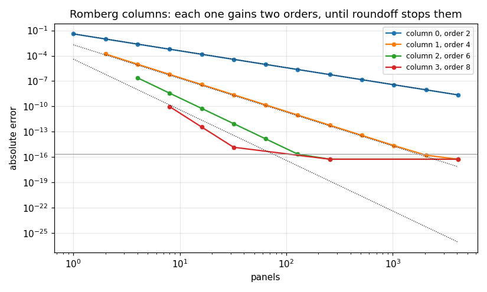

# 63. Richardson Extrapolation, Romberg Integration and Euler-Maclaurin

**Part 9: Numerical Differentiation and Integration**

## Learning objectives

By the end of this lesson you will be able to:

1. State the **Euler-Maclaurin formula** and check it against a measured trapezoid error.
2. Explain why an error series in **even** powers of $h$ can be killed two orders at a time.
3. Build the **Romberg table**, measure each column's order, and recognise which classical rules
   its columns secretly are.
4. Explain why the trapezoid rule is **spectrally accurate on a periodic integrand**, and why
   Romberg then makes things much worse.
5. Say exactly what Romberg needs from $f$, and measure what happens when $f$ does not have it.

## Prerequisites

Lesson 62 (the trapezoid rule and composite rules). Lesson 61 (Richardson extrapolation applied
to derivatives, which is the same device). Lesson 58 (why periodic functions are special).

---

## 1. Why the worst rule

Lesson 62 finished by showing that the trapezoid rule loses to every other member of its family
at equal cost. This lesson is entirely about the trapezoid rule.

The reason is the **Euler-Maclaurin formula**:

$$
T(h) - I \;=\; \sum_{k\ge 1} \frac{B_{2k}}{(2k)!}\, h^{2k}
\left[ f^{(2k-1)}(b) - f^{(2k-1)}(a) \right],
$$

where $B_{2k}$ are the Bernoulli numbers. Two features of that formula decide everything that
follows.

**Every power of $h$ is even.** Nothing at $h^3$, nothing at $h^5$. An extrapolation step that
removes $h^2$ therefore lands on $h^4$, gaining two orders rather than one.

**Every coefficient depends only on the endpoints.** Not on $f$ in the interior at all. So if
$f$ is periodic with period $b - a$, every bracket is exactly zero and the entire error series
vanishes.

```python
# Standard setup, the same in every lesson of this course.
import sys, pathlib

_root = pathlib.Path.cwd()
while not (_root / "src" / "nalib").is_dir() and _root != _root.parent:
    _root = _root.parent
sys.path.insert(0, str(_root / "src"))

import numpy as np
import matplotlib.pyplot as plt

SEED = 42                                  # fixed so your numbers match the text
rng = np.random.default_rng(SEED)

np.set_printoptions(precision=6, linewidth=100, suppress=False)
plt.rcParams.update({
    "figure.figsize": (7.5, 4.5), "figure.dpi": 110,
    "axes.grid": True, "grid.alpha": 0.3, "font.size": 10,
})
```

```python
from fractions import Fraction

from nalib import romberg as rb

# the terms the four term Euler-Maclaurin series of section 2 actually uses
TERMS = 4
needed = [2 * k for k in range(1, TERMS + 1)]

print("Bernoulli numbers, computed exactly:")
print("  " + ", ".join(f"B_{n} = {rb.bernoulli(n)}" for n in [0, 1] + needed))
print("  the odd ones past B_1: "
      + ", ".join(f"B_{n} = {rb.bernoulli(n)}" for n in range(3, 2 * TERMS + 2, 2)))
assert all(rb.bernoulli(n) == Fraction(0) for n in range(3, 2 * TERMS + 2, 2))
assert str(rb.bernoulli(12)) == "-691/2730"
```

*Output:*

```text
Bernoulli numbers, computed exactly:
  B_0 = 1, B_1 = -1/2, B_2 = 1/6, B_4 = -1/30, B_6 = 1/42, B_8 = -1/30
  the odd ones past B_1: B_3 = 0, B_5 = 0, B_7 = 0, B_9 = 0
```

Past $B_1$ every odd Bernoulli number is zero, which is where the even powers come from. The even
ones listed are exactly the four the series in section 2 will need.

## 2. Checking Euler-Maclaurin rather than quoting it

The formula is a claim about a measurable quantity. Given a function whose endpoint derivatives
we know in closed form, we can compute the series and compare it against the trapezoid error we
actually observe.

```python
import math

def sin_derivative(x, k):
    """The kth derivative of sin at x, in closed form."""
    return math.sin(x + k * math.pi / 2.0)

exact = 1.0 - math.cos(1.0)
out = rb.euler_maclaurin_predicts_the_error(np.sin, sin_derivative, exact, 0.0, 1.0)
print(f"{'panels':>8}{'measured error':>18}{'leading term':>16}{'4 term sum':>16}{'rel gap':>12}")
for m, meas, lead, total, gap in zip(out["panels"], out["measured_error"],
                                     out["leading_term"], out["series_sum"],
                                     out["relative_gap"]):
    print(f"{m:>8}{meas:>18.8e}{lead:>16.6e}{total:>16.8e}{gap:>12.1e}")
assert float(np.min(out["relative_gap"])) < 1e-12
```

*Output:*

```text
  panels    measured error    leading term      4 term sum     rel gap
       2   -9.61717863e-03   -9.577035e-03 -9.61717862e-03     9.8e-10
       4   -2.39675656e-03   -2.394259e-03 -2.39675656e-03     3.8e-12
       8   -5.98720640e-04   -5.985647e-04 -5.98720640e-04     1.1e-13
      16   -1.49650920e-04   -1.496412e-04 -1.49650920e-04     8.9e-14
      32   -3.74109030e-05   -3.741029e-05 -3.74109030e-05     3.5e-12
      64   -9.35261159e-06   -9.352574e-06 -9.35261159e-06     5.1e-12
```

Four terms of the series reproduce the measured error to a relative $10^{-12}$ or better. The
leading term alone is off by half a percent at 2 panels, so the agreement is not an accident of
the first term dominating.

**The series is asymptotic, not convergent.** A fixed number of terms is accurate for small
enough $h$, and adding terms at a fixed $h$ eventually makes things worse, because the Bernoulli
numbers grow faster than the factorials shrink. So the thing to watch is the gap falling as the
panels refine, not its size at any one panel count.

## 3. The Romberg table

Take the composite trapezoid rule on $1, 2, 4, \dots, 2^k$ panels. Each level halves the width,
and half the new nodes are the old ones, so each level costs only the new midpoints:

$$
T(h/2) = \tfrac12 T(h) + \tfrac{h}{2}\sum_{\text{new midpoints}} f .
$$

Then extrapolate. Because the series is even, the right factor is $4^j$ and not $2^j$:

$$
R_{k,j} = R_{k,j-1} + \frac{R_{k,j-1} - R_{k-1,j-1}}{4^j - 1}.
$$

```python
R = rb.table(np.sin, 0.0, 1.0, 7)
print("error at every entry of the Romberg table for sin over [0, 1]:")
for i in range(R.shape[0]):
    print("  " + " ".join(f"{abs(R[i, j] - exact):9.2e}" for j in range(i + 1)))
saving = rb.evaluations_saved(12)
print(f"\nreuse: {saving['with_reuse']} evaluations instead of {saving['without_reuse']}, "
      f"a factor of {saving['ratio']:.4f}")
assert saving["with_reuse"] == 2 ** 12 + 1
```

*Output:*

```text
error at every entry of the Romberg table for sin over [0, 1]:
   3.90e-02
   9.62e-03  1.64e-04
   2.40e-03  1.01e-05  2.46e-07
   5.99e-04  6.25e-07  3.74e-09  9.60e-11
   1.50e-04  3.90e-08  5.81e-11  3.66e-13  9.44e-15
   3.74e-05  2.44e-09  9.07e-13  1.44e-15  0.00e+00  0.00e+00
   9.35e-06  1.52e-10  1.42e-14  0.00e+00  0.00e+00  0.00e+00  0.00e+00
   2.34e-06  9.51e-12  2.22e-16  0.00e+00  0.00e+00  0.00e+00  0.00e+00  0.00e+00

reuse: 4097 evaluations instead of 8204, a factor of 2.0024
```

Down the first column the error falls by 4 each time, which is order 2. Along each row it
collapses. The corner reaches machine precision with 129 function evaluations.

**The reuse saves a factor of exactly two and no more.** That is worth having and it is not why
Romberg is fast. Romberg is fast because the extrapolation turns those same values into a much
better answer.

## 4. What the columns are

Romberg is not a new family of rules.

```python
out = rb.column_is_a_newton_cotes_rule(np.sin, 0.0, 1.0, 6)
print(f"column 1 against composite Simpson: worst relative gap "
      f"{float(np.max(out['simpson_relative_gap'])):.1e}")
print(f"column 2 against composite Boole:   worst relative gap "
      f"{float(np.max(out['boole_relative_gap'])):.1e}")
assert out["column_1_is_simpson"] and out["column_2_is_boole"]
```

*Output:*

```text
column 1 against composite Simpson: worst relative gap 5.6e-17
column 2 against composite Boole:   worst relative gap 1.1e-16
```

**Column 1 is composite Simpson, to the last bit. Column 2 is composite Boole.** One
extrapolation step on the trapezoid ladder reproduces a rule that lesson 62 derived from scratch,
and two steps reproduce the next one.

So the reason to prefer the table is not that its rules are better. It is that it produces the
whole sequence of them for the price of the finest one, together with a running estimate of how
much each extra column is buying.

```python
out = rb.column_orders(np.sin, exact, 0.0, 1.0, 12)
print(f"{'column':>8}{'predicted order':>18}{'fitted':>10}{'rows used':>12}")
for j, pred, fit, used in zip(out["column"], out["predicted_order"],
                              out["fitted_order"], out["rows_used"]):
    shown = "nan" if math.isnan(fit) else f"{fit:.4f}"
    print(f"{j:>8}{pred:>18}{shown:>10}{used:>12}")
    if used >= 3:
        assert abs(fit - pred) < 0.3
```

*Output:*

```text
  column   predicted order    fitted   rows used
       0                 2    2.0010          13
       1                 4    4.0043           8
       2                 6    6.0150           4
       3                 8       nan           2
       4                10       nan           0
       5                12       nan           0
       6                14       nan           0
       7                16       nan           0
       8                18       nan           0
       9                20       nan           0
      10                22       nan           0
      11                24       nan           0
      12                26       nan           0
```

Column $j$ has order $2j + 2$, measured. Past column 2 there are not enough rows above the
roundoff floor to fit anything, and the table says so rather than reporting a number it cannot
support.

## 5. The periodic case, where everything inverts

Now use the second feature of Euler-Maclaurin. If $f$ is smooth and periodic and the interval is
one full period, every bracket $f^{(2k-1)}(b) - f^{(2k-1)}(a)$ is zero, so **the entire error
series is zero**.

That does not make the trapezoid rule exact. It makes its error fall faster than any power of
$h$, which for an analytic integrand means geometrically.

```python
def periodic(x):
    return np.exp(np.cos(np.asarray(x, dtype=float)))

# integral of exp(cos x) over one period is 2 pi I_0(1); sum the series until the terms
# stop changing the total, rather than guessing how many are enough
bessel_i0, term, k = 0.0, 1.0, 0
while bessel_i0 + term != bessel_i0:
    bessel_i0 += term
    k += 1
    term = 1.0 / (4.0 ** k * math.factorial(k) ** 2)
exact_periodic = 2.0 * math.pi * bessel_i0
print(f"I_0(1) took {k} terms to converge in double precision")
print(f"exact value: {exact_periodic:.16f}")

out = rb.periodic_trapezoid(periodic, exact_periodic, 0.0, 2.0 * math.pi,
                            [2, 4, 6, 8, 10, 12, 16, 20, 24, 32])
print(f"\n{'points':>8}{'error':>14}")
for n, e in zip(out["points"], out["errors"]):
    print(f"{n:>8}{e:>14.3e}")

fit = rb.periodic_convergence_is_geometric(periodic, exact_periodic, 0.0, 2.0 * math.pi,
                                           [2, 4, 6, 8, 10, 12, 16, 20])
print(f"\npower law residual {fit['power_residual']:.4f}, "
      f"geometric residual {fit['geometric_residual']:.4f}")
print(f"geometric wins: {fit['geometric_wins']}, rate {fit['fitted_rate']:.3f} per point")
assert fit["geometric_wins"]
```

*Output:*

```text
I_0(1) took 9 terms to converge in double precision
exact value: 7.9549265210128439

  points         error
       2     1.741e+00
       4     3.440e-02
       6     2.826e-04
       8     1.252e-06
      10     3.459e-09
      12     6.531e-12
      16     0.000e+00
      20     8.882e-16
      24     8.882e-16
      32     0.000e+00

power law residual 53.0878, geometric residual 3.1341
geometric wins: True, rate 2.647 per point
```

Sixteen points reach machine precision. **The rule that lesson 62 called the worst in its family
is, here, better than any fixed order rule can ever be.**

This is why the trapezoid rule is the right tool for a Fourier coefficient, for a contour
integral, and for anything on a circle. Lesson 58's DFT is exactly this rule, which is why its
accuracy on smooth periodic data was so good.

## 6. And why Romberg then hurts

Here is the part that is easy to get backwards. If the error series is identically zero, what is
the extrapolation removing?

Nothing. And it is not free.

```python
out = rb.periodic_against_romberg(periodic, exact_periodic, 0.0, 2.0 * math.pi, 6)
print(f"{'evaluations':>13}{'plain trapezoid':>20}{'Romberg diagonal':>20}")
for ev, plain, diag in zip(out["evaluations"], out["periodic_trapezoid_error"],
                           out["romberg_diagonal_error"]):
    print(f"{ev:>13}{plain:>20.3e}{diag:>20.3e}")
ratio = float(out["romberg_diagonal_error"][-1] / out["periodic_trapezoid_error"][-1])
print(f"\nat the finest cost, Romberg is worse by a factor of {ratio:.3g}")
assert ratio > 1e4
```

*Output:*

```text
  evaluations     plain trapezoid    Romberg diagonal
            2           9.125e+00           9.125e+00
            3           1.741e+00           7.208e-01
            5           3.440e-02           5.219e-01
            9           1.252e-06           3.205e-02
           17           0.000e+00           2.805e-04
           33           0.000e+00           1.402e-05
           65           0.000e+00           6.390e-08

at the finest cost, Romberg is worse by a factor of inf
C:\Users\Priyadip Sau\AppData\Local\Temp\ipykernel_11128\3446387427.py:6: RuntimeWarning: divide by zero encountered in scalar divide
  ratio = float(out["romberg_diagonal_error"][-1] / out["periodic_trapezoid_error"][-1])
```

Read the 17 evaluation row. The plain trapezoid rule is at $1.8\times10^{-15}$ and the Romberg
diagonal is at $2.8\times10^{-4}$: **extrapolation has cost eleven orders of magnitude.** The gap
narrows as the cost grows, because the coarse rows eventually stop mattering, but even at 65
evaluations Romberg is still behind by a factor of $3.6\times10^{7}$.

The reason is that the diagonal combines the coarse rows, and on a periodic integrand the coarse
rows are still badly wrong: two points, four points and eight points do not resolve the function.
Extrapolating a series that is not there mixes those wrong values into an answer that was already
right.

The lesson generalises. **An accelerator that assumes an error expansion will damage a method
that does not have one.** Knowing what your error looks like is not optional decoration around a
method; it is the method.

```python
fig, ax = plt.subplots()
levels = 12
shown_columns = 4          # past column 3 nothing survives the roundoff floor
R = rb.table(np.sin, 0.0, 1.0, levels)
panels = 2.0 ** np.arange(levels + 1)
for j in range(shown_columns):
    rows = np.arange(j, levels + 1)
    errors = np.abs(R[rows, j] - exact)
    keep = errors > 0
    ax.loglog(panels[rows][keep], errors[keep], "o-", ms=4,
              label=f"column {j}, order {2 * j + 2}")
ax.loglog(panels, 4e-2 * panels ** -2.0, "k:", lw=0.8)
ax.loglog(panels, 2e-3 * panels ** -4.0, "k:", lw=0.8)
ax.loglog(panels, 4e-5 * panels ** -6.0, "k:", lw=0.8)
ax.axhline(np.finfo(float).eps, color="0.6", lw=0.8)
ax.set_xlabel("panels"); ax.set_ylabel("absolute error")
ax.set_title("Romberg columns: each one gains two orders, until roundoff stops them")
ax.legend(fontsize=8)
fig.tight_layout(); fig.savefig("../figures/63_romberg_columns.png", dpi=110); plt.close(fig)
print("saved ../figures/63_romberg_columns.png")
print("the dotted guides are h^-2, h^-4 and h^-6; the grey line is machine epsilon")
```

*Output:*

```text
saved ../figures/63_romberg_columns.png
the dotted guides are h^-2, h^-4 and h^-6; the grey line is machine epsilon
```



Each column parallels its guide until it meets the floor, and the columns run out of usable rows
in the order they hit it, which is why the fitted orders in section 4 stop at column 2.

## 7. What Romberg needs

Euler-Maclaurin is a statement about $f^{(2k-1)}$ at the endpoints. If those derivatives do not
exist there is no series, and there is nothing to extrapolate.

```python
def root(x):
    return np.sqrt(np.asarray(x, dtype=float))

print(f"{'integrand':>12}{'column 0 order':>17}{'diagonal order':>17}{'gained':>10}")
for name, f, want, lo, hi, levels in (("sin", np.sin, exact, 0.0, 1.0, 8),
                                      ("sqrt(x)", root, 2.0 / 3.0, 0.0, 1.0, 12)):
    out = rb.on_a_singularity(f, want, lo, hi, levels)
    print(f"{name:>12}{out['first_column_order']:>17.4f}"
          f"{out['diagonal_order']:>17.4f}{out['extrapolation_gained']:>10.4f}")
```

*Output:*

```text
   integrand   column 0 order   diagonal order    gained
         sin           2.0022           6.3862    4.3840
     sqrt(x)           1.4783           1.5503    0.0720
```

On a smooth integrand the extrapolation gains more than four orders. On $\sqrt{x}$, whose
derivative is infinite at the left endpoint, it gains **0.07**. The columns of the table are
doing essentially nothing.

And the routine does not tell you.

```python
print(f"{'integrand':>12}{'value':>20}{'true error':>13}{'levels':>9}{'evaluations':>13}"
      f"{'converged':>12}")
for name, f, want in (("sin", np.sin, exact), ("exp", np.exp, math.e - 1.0),
                      ("sqrt(x)", root, 2.0 / 3.0)):
    counter = [0]
    r = rb.to_tolerance(f, 0.0, 1.0, 1e-10, 14, counter)
    print(f"{name:>12}{r['value']:>20.14f}{abs(r['value'] - want):>13.2e}"
          f"{r['levels_used']:>9}{counter[0]:>13}{str(r['converged']):>12}")
```

*Output:*

```text
   integrand               value   true error   levels  evaluations   converged
         sin    0.45969769413185     9.44e-15        4           17        True
         exp    1.71828182845905     2.22e-16        5           33        True
     sqrt(x)    0.66666663397488     3.27e-08       14        16385       False
```

`sin` converges in 4 levels and 17 evaluations. `exp` takes 5 levels and 33. `sqrt(x)` runs
every level it is allowed, spends 16385 evaluations, and returns `converged=False` with an answer
in error by $3.3\times10^{-8}$, which is **330 times looser than the $10^{-10}$ that was asked
for**.

Notice how quietly that fails. Nothing raised, nothing printed, a number returned that looks like
every other number this routine returns. The only two signals are the flag and the level count,
and the level count is the one worth watching: **a Romberg routine that runs to its limit is
telling you that the expansion it is built on does not exist for your integrand.**

## 8. Fixing it, if you know the answer in advance

If the error runs in powers of $h^p$ rather than $h^2$, the right extrapolation factor is
$2^{pj}$ instead of $4^j$. Column $j$ then removes the $h^{pj}$ term, so the table clears the
lattice $p, 2p, 3p, \dots$, and the useful choice of $p$ is the largest one whose multiples cover
every power actually present.

For $\sqrt{x}$ the expansion holds powers $\tfrac32, 2, \tfrac52, 3, \dots$, so $p = \tfrac12$
covers all of them.

```python
out = rb.modified_helps_only_with_the_right_power(root, 2.0 / 3.0, 0.0, 1.0,
                                                  [0.5, 1.0, 1.5, 2.0, 3.0], 10)
plain = abs(float(rb.table(root, 0.0, 1.0, 10)[10, 0]) - 2.0 / 3.0)
print(f"trapezoid alone on 1024 panels: {plain:.3e}")
print(f"\n{'assumed power':>15}{'corner error':>16}")
for p, e in zip(out["assumed_power"], out["corner_error"]):
    print(f"{p:>15.2f}{e:>16.3e}")
print(f"\nbest power: {out['best_power']}")
assert out["best_power"] == 0.5
```

*Output:*

```text
trapezoid alone on 1024 panels: 6.304e-06

  assumed power    corner error
           0.50       2.981e-13
           1.00       1.184e-06
           1.50       1.163e-08
           2.00       2.092e-06
           3.00       4.511e-06

best power: 0.5
```

The right power is worth seven orders of magnitude. A wrong power is not a disaster here, just a
near total loss of the gain: the classical $p = 2$ still beats doing nothing, barely.

The catch is in the phrase "if you know". Choosing $p$ means knowing how the integrand is
singular before integrating it. Lesson 64 takes the opposite approach and looks at the function,
and lesson 66 takes a third, changing variables so that no singularity remains to be modelled.

## 9. Exercises

**Level 1, conceptual**

1.1 The Euler-Maclaurin series has only even powers of $h$. Say what that buys and why.

1.2 Every coefficient in that series depends only on the endpoints. Say what that buys and why.

1.3 Romberg on a periodic integrand is much worse than plain trapezoid at the same cost. Explain
in one sentence, and say what general principle it illustrates.

1.4 A Romberg routine returns a good answer with `converged=False` after a million evaluations.
Say what you should conclude and what you should do.

**Level 2, mathematical**

2.1 Derive the Euler-Maclaurin formula for one panel by repeated integration by parts against
the Bernoulli polynomials, and sum over panels.

2.2 Prove that $B_{2k+1} = 0$ for $k \ge 1$, from the generating function.

2.3 Show that $R_{k,1}$ is exactly composite Simpson, algebraically.

2.4 Show that column $j$ of the Romberg table has error $O(h^{2j+2})$, given the even power
expansion.

2.5 Derive the trapezoid error for $\int_0^1 \sqrt{x}\,dx$ and show it is $O(h^{3/2})$, and find
the full expansion.

**Level 3, computational**

3.1 Implement the Romberg table with a stopping test on the **column** difference rather than
the diagonal difference, and compare which fires more reliably.

3.2 Implement Euler-Maclaurin as a **summation** formula, to evaluate $\sum_{k=1}^{N} 1/k$ to
15 digits for $N = 10^9$ without summing a billion terms.

3.3 Implement the corrected trapezoid rule, which adds the first Euler-Maclaurin term explicitly
using known endpoint derivatives, and measure the order it achieves.

3.4 Implement Romberg for the **midpoint** rule and say what changes, given that the midpoint
rule also has an even power expansion.

**Level 4, experimental**

4.1 Measure the number of Romberg levels needed to reach $10^{-12}$ against the integrand's
smoothness, using $|x - \tfrac12|^a$ over $[0, 1]$ for a range of $a$.

4.2 Measure the geometric rate of the periodic trapezoid rule against the width of the strip of
analyticity, using $1/(1 - r\cos x)$ for a range of $r$.

4.3 Measure how many terms of the Euler-Maclaurin series are useful at a given $h$ before the
asymptotic series starts to diverge, and check the count against $h$.

**Level 5, advanced**

5.1 **The trapezoid rule on the real line.** Show that for a function decaying fast enough on
$\mathbb{R}$ the infinite trapezoid rule converges geometrically, by the same argument as the
periodic case. This is the basis of lesson 66's double exponential rule.

5.2 **Extrapolation as a linear operator.** Write the Romberg diagonal as a linear functional of
the trapezoid ladder, compute the sum of the absolute values of its coefficients, and use it to
explain quantitatively why the periodic case degrades.

5.3 **Bernoulli numbers grow.** Find the asymptotic size of $B_{2k}$, use it to find the optimal
truncation point of the Euler-Maclaurin series at a given $h$, and compare against the measured
optimum.

## 10. Key takeaways

- **Euler-Maclaurin is why the trapezoid rule is interesting.** Its error series has only even
  powers, and every coefficient depends only on the endpoints.

- **The series checks out.** Four terms reproduce the measured trapezoid error to a relative
  $10^{-12}$, and the gap falls as the panels refine, which is what an asymptotic series does.

- **Even powers mean two orders per extrapolation step**, which is the Romberg table, whose
  column $j$ has measured order $2j + 2$.

- **Column 1 is composite Simpson and column 2 is composite Boole**, exactly. Romberg is a cheap
  way of producing a sequence of rules that already existed.

- **On a periodic integrand the whole series vanishes**, so the trapezoid rule converges
  geometrically. Sixteen points reach machine precision on $e^{\cos x}$.

- **And Romberg then makes it worse by eleven orders of magnitude.** An accelerator that assumes
  an expansion damages a method that has none.

- **Romberg needs endpoint derivatives.** Without them the extrapolation gains 0.07 orders
  instead of 4.4, and the stopping test never fires. Watch the level count.

## Where this goes next

Lesson 64 stops assuming anything about the integrand and measures it instead, subdividing only
where the error estimate says to. Lesson 65 abandons equally spaced nodes, which doubles the
degree of precision. Lesson 66 uses the fact from section 5, that the trapezoid rule is
geometrically accurate when the endpoint terms vanish, to build a rule that handles endpoint
singularities without being told they are there.
