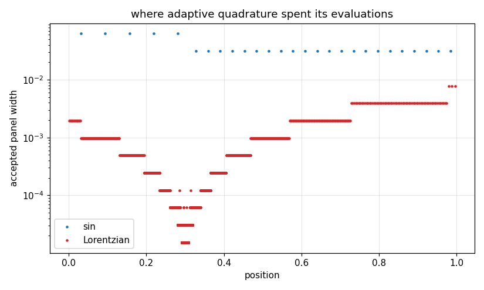

# 64. Adaptive Quadrature

**Part 9: Numerical Differentiation and Integration**

## Learning objectives

By the end of this lesson you will be able to:

1. Derive the local error estimate from comparing a rule against itself on two halves, and get
   the Richardson divisor right.
2. Explain why the corrected value is better than the tolerance test claims, and measure by how
   much.
3. Implement adaptive subdivision with a **split** tolerance and say why splitting matters.
4. Measure when adaptivity is worth its overhead and when it is not.
5. Construct an integrand that adaptive quadrature misses **entirely**, and say why no amount of
   forced subdivision fixes the general case.

## Prerequisites

Lesson 62 (Simpson's rule and composite rules). Lesson 63 (Richardson extrapolation, which is
where the error estimate comes from and also where the free accuracy comes from).

---

## 1. The idea

A composite rule uses the same panel width everywhere. That is exactly wrong for the usual case:
an integrand that is flat over most of its range and difficult over a little of it.

Adaptive quadrature estimates the error on each interval and subdivides only the intervals that
fail. The work goes where the integrand is hard, and the flat parts cost almost nothing.

Everything then depends on the error estimate, so that is where we start.

## 2. The local error estimate, and the divisor

Compare a rule against itself on the two halves. Simpson's rule on a single interval of width
$h$ has error $C h^5 f^{(4)}(\xi)$: that is the **local** order, one higher than the composite
order 4, because a composite rule uses $(b-a)/h$ of them.

Applying it to the two halves gives two errors of size $C(h/2)^5$, so

$$
I - S = C h^5,
\qquad
I - S_2 = 2 C (h/2)^5 = \frac{C h^5}{16},
$$

and subtracting,

$$
S_2 - S = C h^5\left(1 - \tfrac{1}{16}\right) = \tfrac{15}{16} C h^5,
\qquad\text{so}\qquad
I - S_2 \approx \frac{S_2 - S}{15}.
$$

**The 15 comes from the local order 5, not the composite order 4.** Writing $2^{p-1} - 1$ with
$p = 4$ gives 7, and that is the single easiest mistake to make here. It does not announce
itself: an estimate $15/7$ too large just makes the routine conservative, so it passes every
accuracy test while spending roughly twice the evaluations it needs.

```python
# Standard setup, the same in every lesson of this course.
import sys, pathlib

_root = pathlib.Path.cwd()
while not (_root / "src" / "nalib").is_dir() and _root != _root.parent:
    _root = _root.parent
sys.path.insert(0, str(_root / "src"))

import numpy as np
import matplotlib.pyplot as plt

SEED = 42                                  # fixed so your numbers match the text
rng = np.random.default_rng(SEED)

np.set_printoptions(precision=6, linewidth=100, suppress=False)
plt.rcParams.update({
    "figure.figsize": (7.5, 4.5), "figure.dpi": 110,
    "axes.grid": True, "grid.alpha": 0.3, "font.size": 10,
})
```

```python
import math

from nalib import adaptive as ad

exact = 1.0 - math.cos(1.0)
out = ad.local_error_estimate(np.sin, 0.0, 1.0)
print(f"divisor: {out['divisor']:.0f}")
for key in ("coarse", "fine", "corrected"):
    print(f"{key:>12}  value {out[key]:.16f}   error {abs(out[key] - exact):.3e}")
print(f"\n  estimate of (I - fine): {out['estimate']:.6e}")
print(f"  true value of (I - fine): {exact - out['fine']:.6e}")
print(f"  ratio: {out['estimate'] / (exact - out['fine']):.4f}")
assert out["divisor"] == 15.0
```

*Output:*

```text
divisor: 15
      coarse  value 0.4598621898707848   error 1.645e-04
        fine  value 0.4597077449273108   error 1.005e-05
   corrected  value 0.4596974485977459   error 2.455e-07

  estimate of (I - fine): -1.029633e-05
  true value of (I - fine): -1.005080e-05
  ratio: 1.0244
```

The estimate predicts the true error of the finer rule to within 2.5 percent. With a divisor of 7
that ratio would read 2.14, which is exactly the kind of error that survives testing.

## 3. The correction is free accuracy

Look again at that table. `corrected = fine + estimate` is one Richardson step, it uses **no
extra function values**, and it is two orders more accurate than `fine`.

Most implementations return the corrected value while testing the uncorrected estimate. That is
not a bug and it is worth knowing about, because it means the routine is quietly much more
accurate than the tolerance it was given.

```python
def root(x):
    return np.sqrt(np.asarray(x, dtype=float))

out = ad.correction_is_free_accuracy(root, 2.0 / 3.0, 0.0, 1.0)
print(f"{'tolerance':>11}{'corrected error':>18}{'uncorrected error':>20}{'same cost':>11}")
for tol, c, u, ce, ue in zip(out["tolerance"], out["corrected_error"],
                             out["uncorrected_error"], out["corrected_evaluations"],
                             out["uncorrected_evaluations"]):
    print(f"{tol:>11.0e}{c:>18.3e}{u:>20.3e}{str(ce == ue):>11}")
assert out["same_cost"]
```

*Output:*

```text
  tolerance   corrected error   uncorrected error  same cost
      1e-04         2.366e-06           3.831e-06       True
      1e-06         1.954e-08           2.748e-07       True
      1e-08         2.551e-11           3.247e-09       True
      1e-10         2.787e-14           3.584e-11       True
```

Identical evaluation counts, and the corrected answer is a thousand times better. **That accuracy
is free and it is also unearned**: nothing in the tolerance test knows about it, so it cannot be
relied on.

## 4. The recursion

The rest is bookkeeping, with two decisions that matter.

**Split the tolerance.** When an interval is subdivided, each half gets half the budget. Then the
accepted intervals' errors sum to the requested tolerance. Passing the full tolerance to both
halves, which is easier and common, asks for an answer up to $2^{\text{depth}}$ times looser than
the caller requested.

**Use a stack, not recursion.** A hard integrand needs depths that overflow the interpreter's
stack, and an explicit stack has no such limit.

```python
def lorentzian(half_width):
    w = float(half_width)

    def f(x):
        return 1.0 / (w ** 2 + (np.asarray(x, dtype=float) - 0.3) ** 2)

    return f, (math.atan(0.7 / w) - math.atan(-0.3 / w)) / w

hard, exact_hard = lorentzian(1e-2)
out = ad.where_the_work_went(hard, 0.0, 1.0, 1e-10)
smooth = ad.where_the_work_went(np.sin, 0.0, 1.0, 1e-10)
print(f"{'integrand':>24}{'panels':>9}{'widest':>12}{'narrowest':>12}{'ratio':>10}")
for name, o in (("sin, smooth", smooth), ("Lorentzian, peaked", out)):
    print(f"{name:>24}{o['panel_count']:>9}{o['widest']:>12.2e}"
          f"{o['narrowest']:>12.2e}{o['width_ratio']:>10.1f}")
```

*Output:*

```text
               integrand   panels      widest   narrowest     ratio
             sin, smooth       27    6.25e-02    3.12e-02       2.0
      Lorentzian, peaked     3694    7.81e-03    1.53e-05     512.0
```

On a smooth integrand every accepted panel is the same width to within a factor of two, so
**adaptivity bought nothing at all**. On the peaked one the widest panel is hundreds of times the
narrowest, which is a picture of the integrand drawn by the algorithm.

```python
fig, ax = plt.subplots()
for name, f, exact_value, colour in (("sin", np.sin, exact, "tab:blue"),
                                     ("Lorentzian", hard, exact_hard, "tab:red")):
    o = ad.where_the_work_went(f, 0.0, 1.0, 1e-10)
    centres = 0.5 * (o["edges"][:, 0] + o["edges"][:, 1])
    ax.semilogy(centres, o["widths"], ".", ms=4, color=colour, label=name)
ax.set_xlabel("position"); ax.set_ylabel("accepted panel width")
ax.set_title("where adaptive quadrature spent its evaluations")
ax.legend()
fig.tight_layout(); fig.savefig("../figures/64_panel_widths.png", dpi=110); plt.close(fig)
print("saved ../figures/64_panel_widths.png")
```

*Output:*

```text
saved ../figures/64_panel_widths.png
```



## 5. Is it worth it?

The only comparison that means anything is at equal cost. Run the adaptive routine, count its
evaluations, and give composite Simpson the same budget.

```python
def sqrt_case():
    return root, 2.0 / 3.0, 0.0, 1.0

very_hard, exact_very_hard = lorentzian(1e-4)
cases = (("sqrt(x), endpoint singularity",) + sqrt_case(),
         ("Lorentzian, half width 1e-2", hard, exact_hard, 0.0, 1.0),
         ("Lorentzian, half width 1e-4", very_hard, exact_very_hard, 0.0, 1.0))
for name, f, want, lo, hi in cases:
    out = ad.against_uniform(f, want, lo, hi, [1e-4, 1e-6, 1e-8])
    print(f"\n{name}")
    print(f"{'tolerance':>11}{'evaluations':>13}{'adaptive':>13}{'uniform':>13}{'wins':>7}")
    for tol, ev, ae, ue, win in zip(out["tolerance"], out["adaptive_evaluations"],
                                    out["adaptive_error"], out["uniform_error"],
                                    out["adaptive_wins"]):
        print(f"{tol:>11.0e}{ev:>13}{ae:>13.2e}{ue:>13.2e}{str(win):>7}")
```

*Output:*

```text

sqrt(x), endpoint singularity
  tolerance  evaluations     adaptive      uniform   wins
      1e-04          171     2.37e-06     3.66e-05   True
      1e-06          459     1.95e-08     8.28e-06   True
      1e-08         1413     2.55e-11     1.53e-06   True

Lorentzian, half width 1e-2
  tolerance  evaluations     adaptive      uniform   wins
      1e-04         2133     7.43e-07     2.79e-12  False
      1e-06         6345     1.65e-09     5.68e-13  False
      1e-08        20655     1.31e-12     1.02e-12  False

Lorentzian, half width 1e-4
  tolerance  evaluations     adaptive      uniform   wins
      1e-04        24075     7.89e-07     8.79e+00   True
      1e-06        73935     1.73e-09     1.39e-06   True
      1e-08       239319     1.82e-11     3.53e-10   True
```

Two of these three go to adaptivity by a wide margin. **One does not**, and that one is the
useful result: a Lorentzian of half width $10^{-2}$ on the unit interval is resolved everywhere
by composite Simpson at the budgets adaptivity spends, so the bookkeeping overhead simply loses.

Adaptivity is not free and it is not always right. It pays when the integrand has structure on
very different scales, and it costs when it does not.

## 6. Does it meet the tolerance?

The local estimate is an estimate. Summed over the accepted intervals it is a guess at the global
error, not a bound.

```python
for name, f, want, lo, hi in cases:
    out = ad.tolerance_is_met(f, want, lo, hi, [1e-6, 1e-8, 1e-10, 1e-12])
    print(f"\n{name}")
    print(f"{'tolerance':>11}{'achieved':>13}{'error / tol':>14}{'evaluations':>13}")
    for tol, err, ratio, ev in zip(out["tolerance"], out["achieved_error"],
                                   out["error_over_tolerance"], out["evaluations"]):
        print(f"{tol:>11.0e}{err:>13.2e}{ratio:>14.3f}{ev:>13}")
    print(f"   always met: {out['always_met']}, worst ratio {out['worst_ratio']:.3f}")
```

*Output:*

```text

sqrt(x), endpoint singularity
  tolerance     achieved   error / tol  evaluations
      1e-06     1.95e-08         0.020          459
      1e-08     2.55e-11         0.003         1413
      1e-10     2.79e-14         0.000         4419
      1e-12     2.22e-16         0.000        13815
   always met: True, worst ratio 0.020

Lorentzian, half width 1e-2
  tolerance     achieved   error / tol  evaluations
      1e-06     1.65e-09         0.002         6345
      1e-08     1.31e-12         0.000        20655
      1e-10     2.84e-13         0.003        66483
      1e-12     7.39e-13         0.739       200961
   always met: True, worst ratio 0.739

Lorentzian, half width 1e-4
  tolerance     achieved   error / tol  evaluations
      1e-06     1.73e-09         0.002        73935
      1e-08     1.82e-11         0.002       239319
      1e-10     2.33e-10         2.328      1753965
      1e-12     2.15e-10       214.641      3911805
   always met: False, worst ratio 214.641
```

On the first two the tolerance is comfortably met, mostly thanks to the free correction of
section 3.

On the third it is **not**. At $10^{-12}$ the routine spends millions of evaluations and returns
an answer two orders of magnitude worse than requested, because the accumulated roundoff of
summing millions of panels is itself larger than the tolerance. **The tolerance was
unachievable and nothing said so.**

```python
for tol in (1e-8, 1e-12):
    counter = [0]
    out = ad.integrate(very_hard, 0.0, 1.0, tol, max_depth=30, _counter=counter)
    print(f"tolerance {tol:.0e}: error {abs(out['value'] - exact_very_hard):.2e}, "
          f"deepest {out['deepest']}, hit the limit {out['hit_the_depth_limit']}, "
          f"{counter[0]} evaluations")
```

*Output:*

```text
tolerance 1e-08: error 1.82e-11, deepest 24, hit the limit False, 239319 evaluations
tolerance 1e-12: error 3.97e-10, deepest 30, hit the limit True, 2386035 evaluations
```

The depth limit at least is reported. A routine that hits it has stopped subdividing intervals
that its own estimate says are not good enough, and the answer it returns is whatever those
intervals happened to give.

## 7. The integrand it cannot see

Now the failure that matters. The estimate assumes $f$ has the derivatives its error term names.
Put a tall narrow spike where the algorithm does not sample and it sees nothing at all.

The first accept decision of adaptive Simpson on $[a, b]$ evaluates at exactly five points: the
two ends, the midpoint and the two quarter points. **That is the entire grid the decision is made
on.**

```python
out = ad.spike_centre_decides_everything(width=1e-3)
print("a Gaussian bump of width 1e-3 on [0, 1], moved around:")
print(f"{'centre':>10}{'relative error':>17}{'evaluations':>13}{'found':>8}")
for c, e, ev, found in zip(out["centre_fraction"], out["relative_error"],
                           out["evaluations"], out["found"]):
    print(f"{c:>10.6f}{e:>17.3e}{ev:>13}{str(found):>8}")
```

*Output:*

```text
a Gaussian bump of width 1e-3 on [0, 1], moved around:
    centre   relative error  evaluations   found
  0.500000        4.846e-08         1611    True
  0.250000        4.846e-08         1593    True
  0.375000        1.000e+00            9   False
  0.400000        1.000e+00            9   False
  0.333333        1.000e+00            9   False
```

A spike **on** one of those five points is found immediately. A spike anywhere else is not there
as far as the routine can tell: the coarse rule and both halves all read zero, the estimate is
zero, the interval is accepted, and the answer comes back as nine evaluations of nothing, with a
relative error of exactly 1.

Note that $0.375$ is a perfectly good dyadic rational and still fails. Being dyadic is not
enough; it has to be one of the five points this particular first step visits.

**A demonstration that puts the spike at the midpoint therefore proves the opposite of what it
appears to prove.** That is why the rest of this section places it at two fifths, which is never
dyadic.

## 8. Forcing depth, and why it is not a fix

The cheapest protection is to refuse to accept any interval before a minimum depth.

```python
out = ad.fooled_by_a_narrow_spike(width=1e-3)
print(f"exact value {out['exact']:.6e}, spike centred at {out['centre']:.3f}")
print(f"\n{'min_depth':>11}{'relative error':>17}{'evaluations':>13}")
for d, e, ev in zip(out["min_depth"], out["relative_error"], out["evaluations"]):
    print(f"{d:>11}{e:>17.3e}{ev:>13}")
print(f"\nfirst depth that finds it: {out['first_depth_that_finds_it']}")
assert out["first_depth_that_finds_it"] == 5
```

*Output:*

```text
exact value 1.772454e-03, spike centred at 0.400

  min_depth   relative error  evaluations
          0        1.000e+00            9
          1        1.000e+00           27
          2        1.000e+00           63
          3        1.000e+00          135
          4        1.000e+00          279
          5        8.360e-10         2043
          6        8.360e-10         2601
          8        8.360e-10         6003

first depth that finds it: 5
```

The answer is not slightly wrong at shallow depths. It is **the whole integral missing**, and it
stays that way until the forced subdivision is fine enough that some node lands within a few
widths of the peak.

```python
out = ad.spike_width_against_depth([1e-1, 5e-2, 1e-2, 5e-3, 1e-3, 1e-4])
print(f"{'spike width':>13}{'depth needed':>15}{'error at depth 0':>20}")
for w, d, e in zip(out["width"], out["depth_needed"], out["error_at_depth_zero"]):
    print(f"{w:>13.0e}{str(d):>15}{e:>20.3e}")
print(f"\n{out['note']}")
```

*Output:*

```text
  spike width   depth needed    error at depth 0
        1e-01              0           1.584e-09
        5e-02              0           6.034e-10
        1e-02              1           1.000e+00
        5e-03              3           1.000e+00
        1e-03              5           1.000e+00
        1e-04           None           1.000e+00

a depth of None means the spike was still missed at the deepest forced level tried, which is 8, not that no depth would find it
```

Each halving of the width costs about one more level, because the subdivision is binary. So
`min_depth` protects against spikes down to roughly $(b-a)/2^{\text{depth}}$ wide and no
narrower, and at the depths swept here a spike of width $10^{-4}$ is still missed completely.

**No finite choice protects against every spike.** A quadrature routine cannot find structure it
never samples, and no amount of adaptivity changes that. If you know the integrand has a feature
somewhere, the fix is to tell the routine where, by splitting the interval at that point yourself.

## 9. Exercises

**Level 1, conceptual**

1.1 Simpson's local error is $O(h^5)$ and its composite error is $O(h^4)$. Explain the difference
and say which one sets the Richardson divisor.

1.2 The corrected value is more accurate than the tolerance test knows about. Say why that is
both good and not something to rely on.

1.3 An adaptive routine returns a good answer for a Lorentzian and loses to uniform Simpson at
equal cost. Say when adaptivity pays.

1.4 A spike at $x = 0.5$ is found instantly and one at $x = 0.4$ is missed entirely. Explain, and
say what that implies about how to demonstrate the failure honestly.

**Level 2, mathematical**

2.1 Derive the divisor $2^{p} - 1$ from the local error order, and say what goes wrong with
$2^{p-1} - 1$.

2.2 Show that $\text{fine} + \text{estimate}$ is one Richardson step and gains two orders.

2.3 Show that splitting the tolerance at each level makes the sum of accepted local errors bounded
by the requested tolerance, and that not splitting it does not.

2.4 The error estimate can be near zero while both estimates are wrong. Construct an integrand
on which that happens for Simpson's rule, and say what symmetry causes it.

**Level 3, computational**

3.1 Implement adaptive quadrature with a **priority queue** on the local error estimate, popping
the worst interval each step, and compare its evaluation count against the depth first version.

3.2 Implement adaptive **Gauss-Kronrod**, using lesson 65's pair for the local estimate, and
compare it against adaptive Simpson at equal cost.

3.3 Implement an adaptive routine that returns its accepted intervals and their estimates, and
use them to produce a genuine error bound rather than an estimate, given a bound on $f^{(4)}$.

3.4 Add **user supplied breakpoints**, so a caller who knows where the trouble is can say so, and
measure what that buys on the spike integrand.

**Level 4, experimental**

4.1 Measure the ratio of achieved error to requested tolerance across many integrands and
tolerances, and find where the routine is conservative and where it fails.

4.2 Measure the crossover in dimension one: for a family of integrands parameterised by how
localised the difficulty is, find where adaptive starts beating uniform.

4.3 Measure the effect of the divisor: run the whole routine with 7 instead of 15 and report the
change in evaluation count and in achieved accuracy.

**Level 5, advanced**

5.1 **A globally adaptive strategy.** The routine here is locally adaptive: it decides each
interval on its own. Implement a globally adaptive one that always refines the worst interval in
the whole partition, and say which is better and under what measure.

5.2 **The estimate as a hypothesis test.** The local test asks whether $|S_2 - S|/15$ is below a
threshold. Formulate what is really being assumed, and design a test that also detects when the
assumption is violated rather than only when the error is large.

5.3 **Adaptive quadrature is not reliable, and QUADPACK ships anyway.** Read what QUADPACK's
`qags` does beyond what is here: the epsilon algorithm for extrapolation, the singularity
detection, the roundoff detection. Implement one of the three and measure what it adds.

## 10. Key takeaways

- **The Richardson divisor for adaptive Simpson is 15, not 7.** It comes from the local order 5,
  not the composite order 4, and the wrong value does not announce itself: it just doubles the
  cost while passing every test.

- **The correction is free accuracy.** `fine + estimate` uses no extra evaluations and is a
  thousand times more accurate on a hard integrand, and nothing in the tolerance test knows it.

- **Split the tolerance between the halves**, or the answer can be $2^{\text{depth}}$ times
  looser than requested.

- **Adaptivity is worth nothing on a smooth integrand.** It buys a factor of a few hundred in
  panel width on a peaked one, and it loses outright to uniform Simpson when the integrand is
  resolved everywhere at the budget in play.

- **The tolerance is an estimate, not a bound.** Ask for $10^{-12}$ on a hard integrand and you
  get an answer two orders worse, several million evaluations, and no warning.

- **A narrow spike between the sample points is invisible.** The relative error is exactly 1, the
  cost is nine evaluations, and no error estimate fires. Where the spike sits relative to the
  first five sample points decides everything.

- **Forcing a minimum depth helps and does not fix it.** Each halving of the spike width costs one
  more level, so no finite depth protects against every spike.

## Where this goes next

Lesson 65 replaces the equally spaced nodes inside each panel with Gauss nodes, doubling the
degree of precision at the same cost, and provides the Gauss-Kronrod pair that production
adaptive integrators actually use for their local estimate. Lesson 66 handles the singular and
infinite cases that this lesson only subdivides towards.
