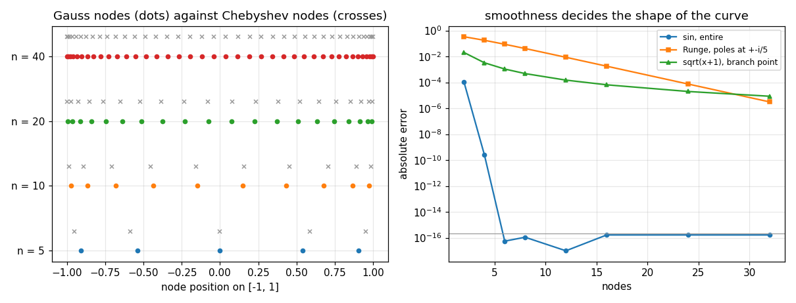

# 65. Gaussian Quadrature

**Part 9: Numerical Differentiation and Integration**

## Learning objectives

By the end of this lesson you will be able to:

1. Give the counting argument for why $n$ nodes can reach degree $2n-1$, and verify it.
2. Prove and then check numerically why the nodes must be the roots of the orthogonal polynomial.
3. Compute Gauss nodes and weights by **Golub-Welsch**, and measure why root finding in the power
   basis is not an option.
4. Say why Gauss weights are always positive when Newton-Cotes weights are not.
5. Use the classical families for their own weight functions and infinite domains.
6. Build the **Gauss-Kronrod** pair, and say what its error estimate is actually estimating.

## Prerequisites

Lesson 55 (orthogonal polynomials, the three term recurrence, the Jacobi matrix). Lesson 62
(degree of precision, and where Newton-Cotes fails). Lesson 47 (why the power basis is a bad
place to do business).

---

## 1. The counting argument

A Newton-Cotes rule fixes the nodes in advance and solves for $n$ weights. That is $n$ free
parameters, and $n$ conditions $\sum_j w_j x_j^k = \int x^k$ for $k = 0, \dots, n-1$, so degree
$n-1$.

Let the nodes move too and there are $2n$ free parameters. The reachable degree is $2n-1$.
Gaussian quadrature achieves it.

That is not a small gain, and it is not only about the degree.

```python
# Standard setup, the same in every lesson of this course.
import sys, pathlib

_root = pathlib.Path.cwd()
while not (_root / "src" / "nalib").is_dir() and _root != _root.parent:
    _root = _root.parent
sys.path.insert(0, str(_root / "src"))

import numpy as np
import matplotlib.pyplot as plt

SEED = 42                                  # fixed so your numbers match the text
rng = np.random.default_rng(SEED)

np.set_printoptions(precision=6, linewidth=100, suppress=False)
plt.rcParams.update({
    "figure.figsize": (7.5, 4.5), "figure.dpi": 110,
    "axes.grid": True, "grid.alpha": 0.3, "font.size": 10,
})
```

```python
import math

from nalib import gaussquad as gq

out = gq.degree_against_newton_cotes()
print(f"{'nodes':>7}{'Gauss degree':>15}{'Newton-Cotes':>15}{'ratio':>8}"
      f"{'Gauss w > 0':>13}{'N-C w > 0':>12}")
for n, g, c, r, gp, cp in zip(out["nodes"], out["gauss_degree"], out["newton_cotes_degree"],
                              out["ratio"], out["gauss_weights_positive"],
                              out["newton_cotes_weights_positive"]):
    print(f"{n:>7}{g:>15}{c:>15}{r:>8.3f}{str(gp):>13}{str(cp):>12}")
```

*Output:*

```text
  nodes   Gauss degree   Newton-Cotes   ratio  Gauss w > 0   N-C w > 0
      2              3              1   3.000         True        True
      3              5              3   1.667         True        True
      4              7              3   2.333         True        True
      5              9              5   1.800         True        True
      6             11              5   2.200         True        True
      7             13              7   1.857         True        True
      8             15              7   2.143         True        True
      9             17              9   1.889         True       False
     11             21             11   1.909         True       False
```

A 5 point Gauss rule is exact on degree 9. The 5 point Newton-Cotes rule is exact on degree 5,
and to reach degree 9 it needs 9 nodes, by which point it has picked up its first negative
weight. **The Gauss column never does.**

## 2. Where the nodes come from

The nodes are the roots of the degree $n$ orthogonal polynomial for the weight function, and this
single fact is what makes the whole thing work. The argument is three lines.

Let $p_n$ be orthogonal to every polynomial of lower degree against the weight $w$, and let the
nodes be its roots. Take any $f$ of degree $2n-1$ and divide:

$$
f = q\,p_n + r,
\qquad \deg q < n, \quad \deg r < n .
$$

Then $\int w\,q\,p_n = 0$ by orthogonality, so $\int w f = \int w r$. And $q(x_j)p_n(x_j) = 0$ at
every node because the nodes are roots, so the rule applied to $f$ equals the rule applied to
$r$. The rule is exact on $r$ because $\deg r < n$ and any $n$ point interpolatory rule is. Done.

Each of those steps is checkable.

```python
for n in (3, 8, 12):
    out = gq.why_the_roots(n, "legendre")
    print(f"n = {n:>2}: p_n at the nodes, relative to its typical size: "
          f"{out['relative_residual_at_the_nodes']:.2e}")
    print(f"        worst orthogonality residual over j < n: "
          f"{float(np.max(out['orthogonality_residuals'])):.2e}")
    print(f"        all weights positive: {out['all_weights_positive']}, "
          f"smallest {out['smallest_weight']:.4f}")
```

*Output:*

```text
n =  3: p_n at the nodes, relative to its typical size: 4.65e-16
        worst orthogonality residual over j < n: 1.17e-16
        all weights positive: True, smallest 0.5556
n =  8: p_n at the nodes, relative to its typical size: 5.44e-15
        worst orthogonality residual over j < n: 1.11e-17
        all weights positive: True, smallest 0.1012
n = 12: p_n at the nodes, relative to its typical size: 1.14e-14
        worst orthogonality residual over j < n: 9.37e-19
        all weights positive: True, smallest 0.0472
```

The positivity in that last line also follows from the argument. Apply the rule to
$\ell_j(x)^2$, where $\ell_j$ is the Lagrange basis polynomial for node $j$. It has degree
$2n-2 \le 2n-1$, so the rule is exact on it, and the rule's value is $w_j$ while the true
integral is positive. Hence $w_j > 0$, for every $n$.

**That is the property Newton-Cotes loses at 9 nodes and Gauss can never lose.**

```python
out = gq.weights_stay_positive()
print(f"{'nodes':>7}{'all positive':>14}{'smallest weight':>18}{'sum |w|':>12}")
for n, p, small, total in zip(out["counts"], out["all_positive"],
                              out["smallest_weight"], out["sum_of_absolute_weights"]):
    print(f"{n:>7}{str(p):>14}{small:>18.4e}{total:>12.6f}")
assert out["always_positive"]
```

*Output:*

```text
  nodes  all positive   smallest weight     sum |w|
      1          True        2.0000e+00    2.000000
      2          True        1.0000e+00    2.000000
      3          True        5.5556e-01    2.000000
      5          True        2.3693e-01    2.000000
      8          True        1.0123e-01    2.000000
     13          True        4.0484e-02    2.000000
     21          True        1.6017e-02    2.000000
     34          True        6.2291e-03    2.000000
     55          True        2.4083e-03    2.000000
     89          True        9.2629e-04    2.000000
```

$\sum_j |w_j| = 2$ at every node count, because the weights are positive and sum to the length of
$[-1, 1]$. Nothing cancels, nothing amplifies, and a Gauss rule can be used at any order.

## 3. Computing them

Finding the roots of $p_n$ is what the subject did for a century, and it is not how to do it.
**Golub and Welsch** observed that the three term recurrence

$$
p_{k+1}(x) = (x - \alpha_k)p_k(x) - \beta_k p_{k-1}(x)
$$

is an eigenvalue problem in disguise. Symmetrising it gives the **Jacobi matrix**, tridiagonal
with $\alpha_k$ on the diagonal and $\sqrt{\beta_k}$ off it, whose eigenvalues are the nodes and
whose weights are $\mu_0$ times the squared first components of the unit eigenvectors.

One symmetric eigenproblem. No root finding, no polynomial in any basis, and the backward
stability of a symmetric eigensolver comes along for free.

```python
for n in (1, 2, 3, 5):
    x, w = gq.nodes_and_weights(n)
    print(f"n = {n}")
    print(f"   nodes   {np.array2string(x, precision=12, suppress_small=True)}")
    print(f"   weights {np.array2string(w, precision=12)}")
print(f"\nknown: n=2 nodes are +-1/sqrt(3) = {1 / math.sqrt(3):.12f}")
print(f"       n=3 nodes are 0, +-sqrt(3/5) = {math.sqrt(0.6):.12f}, "
      f"weights 8/9 = {8 / 9:.12f} and 5/9 = {5 / 9:.12f}")
```

*Output:*

```text
n = 1
   nodes   [0.]
   weights [2.]
n = 2
   nodes   [-0.57735026919  0.57735026919]
   weights [1. 1.]
n = 3
   nodes   [-0.774596669241 -0.              0.774596669241]
   weights [0.555555555556 0.888888888889 0.555555555556]
n = 5
   nodes   [-0.906179845939 -0.538469310106  0.              0.538469310106  0.906179845939]
   weights [0.236926885056 0.478628670499 0.568888888889 0.478628670499 0.236926885056]

known: n=2 nodes are +-1/sqrt(3) = 0.577350269190
       n=3 nodes are 0, +-sqrt(3/5) = 0.774596669241, weights 8/9 = 0.888888888889 and 5/9 = 0.555555555556
```

The alternative is to expand $p_n$ in the power basis and call a root finder. Lesson 47 already
said what happens.

```python
out = gq.golub_welsch_beats_root_finding([4, 8, 16, 24, 32])
print(f"{'nodes':>7}{'Golub-Welsch':>16}{'power basis roots':>21}{'coefficient range':>21}")
for n, gw, pb, spread in zip(out["nodes"], out["golub_welsch_residual"],
                             out["power_basis_residual"], out["coefficient_range"]):
    print(f"{n:>7}{gw:>16.2e}{pb:>21.2e}{spread:>21.2e}")
assert float(out["power_basis_residual"][-1] / out["golub_welsch_residual"][-1]) > 1e6
```

*Output:*

```text
  nodes    Golub-Welsch    power basis roots    coefficient range
      4        5.46e-16             2.13e-15             1.17e+01
      8        2.22e-15             2.77e-14             3.43e+02
     16        1.19e-14             1.13e-11             2.84e+05
     24        8.35e-14             3.57e-09             2.65e+08
     32        4.80e-14             5.33e-06             2.61e+11
```

Both columns measure the same thing, $|p_n(x_i)|$ evaluated by the stable three term recurrence,
so neither method is grading its own arithmetic. At 32 nodes the power basis coefficients span
eleven orders of magnitude and the roots are wrong by $5\times10^{-6}$, while the eigenvalue route
is at $5\times10^{-14}$.

## 4. Degree of precision, and where it stops being measurable

The rule should be exact on every monomial up to $2n-1$ and not on $x^{2n}$. That is easy to
check against the closed form moments.

```python
print(f"{'nodes':>7}{'measured degree':>18}{'2n - 1':>9}")
for n in (1, 2, 3, 4, 5, 8, 12, 16):
    print(f"{n:>7}{gq.degree_of_precision(n):>18}{2 * n - 1:>9}")
    assert gq.degree_of_precision(n) == 2 * n - 1
```

*Output:*

```text
  nodes   measured degree   2n - 1
      1                 1        1
      2                 3        3
      3                 5        5
      4                 7        7
      5                 9        9
      8                15       15
     12                23       23
     16                31       31
```

It is easy up to about 16 nodes and then it stops working, for a reason worth understanding.

```python
out = gq.degree_boundary_report()
print(f"{'nodes':>7}{'true degree':>14}{'measured':>11}{'margin':>12}{'measurable':>13}")
for n, t, m, margin, ok in zip(out["nodes"], out["true_degree"], out["measured_degree"],
                               out["margin"], out["measurable"]):
    print(f"{n:>7}{t:>14}{m:>11}{margin:>12.2e}{str(ok):>13}")
print(f"\nlast measurable node count: {out['last_measurable']}")
print(out["note"])
```

*Output:*

```text
  nodes   true degree   measured      margin   measurable
      2             3          3    4.44e-01         True
      3             5          5    1.60e-01         True
      5             9          9    1.61e-02         True
      8            15         15    3.96e-04         True
     12            23         23    2.29e-06         True
     16            31         31    1.19e-08         True
     20            39         41    5.79e-11        False
     24            47         49    2.74e-13        False
     28            55         57    1.19e-15        False

last measurable node count: 16
the margin is the relative error on x^(2n); once it drops below the tolerance the measured degree overshoots the true one
```

The margin is the rule's relative error on $x^{2n}$, the very first monomial it cannot integrate
exactly. It falls fast: $1.6\times10^{-2}$ at 5 nodes, $1.2\times10^{-8}$ at 16,
$5.8\times10^{-11}$ at 20. Once it drops below the tolerance a tolerance based walk steps straight
past the true boundary and reports degree 41 for a 20 node rule.

**That is not a defect in the rule; it is the rule being too good to measure this way.** The
honest response is to report which node counts can still be trusted, which is what the table does.

## 5. Convergence

For an integrand analytic in a neighbourhood of the interval, Gauss quadrature converges
**geometrically** in $n$, not at any algebraic order. For one with limited smoothness it converges
at a rate set by that smoothness. Fitting both laws and comparing residuals distinguishes them
without anyone having to assert which applies.

```python
def runge(x):
    return 1.0 / (1.0 + 25.0 * np.asarray(x, dtype=float) ** 2)

def branch(x):
    return np.sqrt(np.asarray(x, dtype=float) + 1.0)

cases = (("sin, entire", np.sin, 0.0, 1.0, 1.0 - math.cos(1.0)),
         ("Runge, poles at +-i/5", runge, -1.0, 1.0, 2.0 * math.atan(5.0) / 5.0),
         ("sqrt(x+1), endpoint branch", branch, -1.0, 1.0, 2.0 / 3.0 * 2.0 ** 1.5))
print(f"{'integrand':>28}{'geometric?':>12}{'rate':>9}{'power':>8}{'used':>7}")
for name, f, a, b, want in cases:
    out = gq.convergence(f, want, a, b)
    print(f"{name:>28}{str(out['geometric_wins']):>12}{out['fitted_rate']:>9.3f}"
          f"{out['fitted_power']:>8.2f}{out['points_used']:>7}")
    print(f"{'':>28}  errors: " + " ".join(f"{v:.1e}" for v in out["errors"][:8]))
```

*Output:*

```text
                   integrand  geometric?     rate   power   used
                 sin, entire        True    6.049   12.58      4
                              errors: 2.0e-02 1.1e-04 2.4e-07 2.7e-10 5.6e-17 1.1e-16 0.0e+00 1.7e-16
       Runge, poles at +-i/5        True    0.403    3.45     10
                              errors: 1.5e+00 3.4e-01 4.1e-01 1.8e-01 8.8e-02 4.1e-02 8.7e-03 1.8e-03
  sqrt(x+1), endpoint branch       False    0.274    2.76     10
                              errors: 1.1e-01 2.0e-02 7.1e-03 3.3e-03 1.1e-03 4.8e-04 1.5e-04 6.5e-05
```

An entire function reaches machine precision at 6 nodes. Runge's function converges geometrically
too, just slowly, because its poles at $\pm i/5$ sit close to the interval. The branch point at
the endpoint destroys the geometry entirely and leaves an algebraic rate near 3, which is what
the theory predicts for a square root singularity at an endpoint.

**Smoothness sets the rate and no rule can manufacture what is not there.** That is the same
statement lesson 46 made about interpolation, and lesson 66 is about changing the problem so that
the smoothness is there.

```python
out = gq.against_newton_cotes(runge, 2.0 * math.atan(5.0) / 5.0, -1.0, 1.0)
print(f"{'evaluations':>13}{'Gauss':>14}{'composite Simpson':>20}{'Gauss wins':>12}")
for ev, g, s, win in zip(out["evaluations"], out["gauss_error"],
                         out["simpson_error"], out["gauss_wins"]):
    print(f"{ev:>13}{g:>14.3e}{s:>20.3e}{str(win):>12}")
```

*Output:*

```text
  evaluations         Gauss   composite Simpson  Gauss wins
            5     1.576e-01           1.930e-02       False
            9     2.934e-02           2.588e-02       False
           17     1.197e-03           2.696e-03        True
           33     2.076e-06           1.816e-05        True
           65     6.235e-12           9.100e-09        True
```

At the smallest budget Simpson wins. From 17 evaluations on, Gauss wins and the gap widens to
three orders of magnitude by 65. Quoting "Gauss is better" without the first row would be the
usual half truth.

## 6. The other families

Nothing above used $w(x) = 1$. Change the weight and the same construction gives a rule that
carries the weight inside itself.

```python
print(f"{'family':>14}{'interval':>26}  weight")
for name, (interval, weight) in gq.FAMILIES.items():
    print(f"{name:>14}{str(interval):>26}  {weight}")

print(f"\n{'family':>14}{'nodes':>7}{'all moments exact':>20}{'worst relative gap':>22}")
for name in sorted(gq.FAMILIES):
    for n in (2, 5, 12):
        out = gq.moments_are_exact(n, name)
        print(f"{name:>14}{n:>7}{str(out['all_exact']):>20}{out['worst_gap']:>22.2e}")
        assert out["all_exact"]
```

*Output:*

```text
        family                  interval  weight
      legendre               (-1.0, 1.0)  w(x) = 1
   chebyshev_t               (-1.0, 1.0)  w(x) = 1 / sqrt(1 - x^2)
   chebyshev_u               (-1.0, 1.0)  w(x) = sqrt(1 - x^2)
      laguerre                (0.0, inf)  w(x) = exp(-x)
       hermite               (-inf, inf)  w(x) = exp(-x^2)

        family  nodes   all moments exact    worst relative gap
   chebyshev_t      2                True              2.83e-16
   chebyshev_t      5                True              9.59e-16
   chebyshev_t     12                True              4.41e-15
   chebyshev_u      2                True              2.83e-16
   chebyshev_u      5                True              1.52e-15
   chebyshev_u     12                True              3.62e-15
       hermite      2                True              2.51e-16
       hermite      5                True              1.10e-15
       hermite     12                True              2.86e-15
      laguerre      2                True              0.00e+00
      laguerre      5                True              3.25e-15
      laguerre     12                True              1.07e-15
      legendre      2                True              2.22e-16
      legendre      5                True              2.50e-15
      legendre     12                True              1.58e-15
```

Every moment up to degree $2n-1$ is exact for every family, checked against closed form Gamma and
Beta function values rather than against some other quadrature.

**Those gaps are measured against the size of the terms being summed, not against the answer.**
For Hermite at 16 nodes the moment of $x^{31}$ is exactly zero while the terms adding up to it
reach $3\times10^{11}$, so the best any arithmetic can do is about $10^{-5}$. Judged against a
scale of 1 that reads as a catastrophic failure; judged against the terms it is $10^{-16}$, which
is the truth. **An odd moment of a symmetric weight is pure cancellation and can only be as
accurate as the numbers cancelling.**

One more measured fact about the exponential families.

```python
for family in ("hermite", "laguerre"):
    out = gq.weight_underflow(family=family)
    print(f"\n{family}: any negative weight? {out['any_negative']}")
    print(f"{'nodes':>7}{'smallest > 0':>16}{'underflowed':>14}{'largest node':>15}"
          f"{'mass error':>14}")
    for n, small, zero, big, mass in zip(out["counts"], out["smallest_positive_weight"],
                                         out["weights_that_underflowed"], out["largest_node"],
                                         out["total_mass_error"]):
        print(f"{n:>7}{small:>16.2e}{zero:>14}{big:>15.2f}{mass:>14.2e}")
```

*Output:*

```text

hermite: any negative weight? False
  nodes    smallest > 0   underflowed   largest node    mass error
     21        3.72e-14             0           5.55      6.66e-16
     34        1.81e-24             0           7.38      6.66e-16
     55        1.96e-41             0           9.68      4.44e-16
     89        4.21e-52             1          12.59      1.33e-15
    120        4.58e-59             0          14.78      8.88e-16

laguerre: any negative weight? False
  nodes    smallest > 0   underflowed   largest node    mass error
     21        4.04e-30             0          70.26      1.11e-16
     34        9.34e-46             0         119.36      0.00e+00
     55        4.08e-56             0         199.99      4.44e-16
     89        3.89e-60             2         332.04      4.44e-16
    120        3.50e-61             5         453.25      4.44e-16
```

In exact arithmetic every Gauss weight is strictly positive. In double precision the outermost
Laguerre weights reach $3.5\times10^{-61}$ by 120 nodes, and squaring an eigenvector component
that small flushes some of them to zero.

It costs nothing. Those nodes sit at $x = 453$, where $e^{-x}$ is far below anything
representable, and the total mass still comes out right to $10^{-15}$. Worth knowing about, so
that a positivity test written as `w > 0` does not look like a discovery.

```python
fig, (left, right) = plt.subplots(1, 2, figsize=(11.0, 4.2))

shown_counts = (5, 10, 20, 40)
for row, n in enumerate(shown_counts):
    x, w = gq.nodes_and_weights(n)
    left.plot(x, np.full(n, row), "o", ms=4)
    cx = np.cos(np.pi * (np.arange(n) + 0.5) / n)
    left.plot(cx, np.full(n, row + 0.3), "x", ms=4, color="0.6")
left.set_yticks(range(len(shown_counts)))
left.set_yticklabels([f"n = {n}" for n in shown_counts])
left.set_xlabel("node position on [-1, 1]")
left.set_title("Gauss nodes (dots) against Chebyshev nodes (crosses)")

counts = [2, 4, 6, 8, 12, 16, 24, 32]
for name, f, exact, style in (
        ("sin, entire", np.sin, 1.0 - math.cos(1.0), "o-"),
        ("Runge, poles at +-i/5", runge, 2.0 * math.atan(5.0) / 5.0, "s-"),
        ("sqrt(x+1), branch point", branch, 2.0 / 3.0 * 2.0 ** 1.5, "^-")):
    lo, hi = (0.0, 1.0) if name.startswith("sin") else (-1.0, 1.0)
    out = gq.convergence(f, exact, lo, hi, counts)
    errors = np.maximum(np.asarray(out["errors"], dtype=float), 1e-17)
    right.semilogy(out["counts"], errors, style, ms=4, label=name)
right.axhline(np.finfo(float).eps, color="0.6", lw=0.8)
right.set_xlabel("nodes"); right.set_ylabel("absolute error")
right.set_title("smoothness decides the shape of the curve")
right.legend(fontsize=8)

fig.tight_layout(); fig.savefig("../figures/65_gauss_nodes_and_rates.png", dpi=110)
plt.close(fig)
print("saved ../figures/65_gauss_nodes_and_rates.png")
```

*Output:*

```text
saved ../figures/65_gauss_nodes_and_rates.png
```



On the left, the Gauss nodes sit close to the Chebyshev nodes and cluster near the ends the same
way, with spacing $O(n^{-2})$ there against $O(n^{-1})$ in the middle. That clustering is what
makes an endpoint singularity easier for these rules than an interior one.

On the right, a straight line on a log scale against $n$ is geometric convergence. The entire
function falls off a cliff, Runge's function descends steadily, and the branch point bends,
which is the signature of an algebraic rate.

## 7. What Gauss costs

The nodes are irrational and they change completely with $n$. Nothing is reused when the rule is
refined, so there is no cheap way to compare two of them, and therefore no cheap error estimate.

**Gauss-Kronrod** fixes exactly that. Add $n+1$ new nodes to the $n$ Gauss nodes and choose all
$2n+1$ weights to maximise the degree. The Gauss nodes stay where they were, so the $n$ function
values already computed still count.

```python
print(f"{'Gauss n':>9}{'points':>8}{'contains Gauss':>16}{'degree':>9}{'predicted':>11}"
      f"{'w > 0':>8}{'measurable':>12}")
for n in (1, 2, 3, 5, 7, 10, 15):
    out = gq.kronrod_report(n)
    print(f"{n:>9}{out['point_count']:>8}{str(out['gauss_nodes_are_contained']):>16}"
          f"{out['measured_degree']:>9}{out['predicted_degree']:>11}"
          f"{str(out['weights_positive']):>8}{str(out['measurable']):>12}")
    assert out["gauss_nodes_are_contained"] and out["weights_positive"]
```

*Output:*

```text
  Gauss n  points  contains Gauss   degree  predicted   w > 0  measurable
        1       3            True        5          5    True        True
        2       5            True        7          7    True        True
        3       7            True       11         11    True        True
        5      11            True       17         17    True        True
        7      15            True       23         23    True       False
       10      21            True       39         31    True       False
       15      31            True       80         47    True       False
```

**The degree is $3n+1$ for even $n$ and $3n+2$ for odd $n$**, which the usual "at least $3n+1$"
statement leaves out. That parity bonus is why the standard pairs are the odd ones: 7 points
inside 15, 10 inside 21, 15 inside 31.

Past $n = 7$ the degree measurement runs into the same wall as section 4 and the report says so.

```python
quadpack_nodes = [0.991455371120813, 0.949107912342759, 0.864864423359769,
                  0.741531185599394, 0.586087235467691, 0.405845151377397,
                  0.207784955007898, 0.000000000000000]
quadpack_weights = [0.022935322010529, 0.063092092629979, 0.104790010322250,
                    0.140653259715525, 0.169004726639267, 0.190350578064785,
                    0.204432940075298, 0.209482141084728]
x, w = gq.kronrod(7)
print("the 15 point rule against the published QUADPACK table")
print(f"{'QUADPACK node':>20}{'ours':>22}{'gap':>10}{'QUADPACK weight':>20}{'gap':>10}")
for i, (qx, qw) in enumerate(zip(quadpack_nodes, quadpack_weights)):
    print(f"{qx:>20.15f}{x[14 - i]:>22.15f}{abs(qx - x[14 - i]):>10.1e}"
          f"{qw:>20.15f}{abs(qw - w[14 - i]):>10.1e}")
    assert abs(qx - x[14 - i]) < 1e-14 and abs(qw - w[14 - i]) < 1e-14
```

*Output:*

```text
the 15 point rule against the published QUADPACK table
       QUADPACK node                  ours       gap     QUADPACK weight       gap
   0.991455371120813     0.991455371120813   1.1e-16   0.022935322010529   4.9e-17
   0.949107912342759     0.949107912342758   5.6e-16   0.063092092629979   1.0e-15
   0.864864423359769     0.864864423359769   2.2e-16   0.104790010322250   3.2e-16
   0.741531185599394     0.741531185599394   3.3e-16   0.140653259715525   1.1e-15
   0.586087235467691     0.586087235467692   5.6e-16   0.169004726639267   0.0e+00
   0.405845151377397     0.405845151377397   4.4e-16   0.190350578064785   2.8e-17
   0.207784955007898     0.207784955007899   5.6e-16   0.204432940075298   8.3e-16
   0.000000000000000    -0.000000000000000   4.5e-16   0.209482141084728   5.8e-16
```

Every entry agrees with the published table to $10^{-15}$.

## 8. What the Kronrod estimate is estimating

Here is the part that is quietly misleading. The difference between the two rules estimates the
error of the **Gauss** value. The value returned is the **Kronrod** value, which is far better.

```python
out = gq.kronrod_estimate_quality(np.sin, 1.0 - math.cos(1.0), 0.0, 1.0)
print(f"{'Gauss n':>9}{'evaluations':>13}{'|G - K|':>13}{'Gauss error':>14}"
      f"{'Kronrod error':>16}{'diff / Gauss':>14}{'diff / Kronrod':>16}")
for n, ev, d, ge, ke, dg, dk in zip(out["gauss_points"], out["evaluations"], out["difference"],
                                    out["gauss_error"], out["kronrod_error"],
                                    out["difference_over_gauss_error"],
                                    out["difference_over_kronrod_error"]):
    print(f"{n:>9}{ev:>13}{d:>13.2e}{ge:>14.2e}{ke:>16.2e}{dg:>14.2f}{dk:>16.2e}")
```

*Output:*

```text
  Gauss n  evaluations      |G - K|   Gauss error   Kronrod error  diff / Gauss  diff / Kronrod
        3            7     2.36e-07      2.36e-07        6.11e-16          1.00        3.86e+08
        5           11     1.88e-13      1.88e-13        0.00e+00          1.00        8.47e+02
        7           15     4.44e-16      3.89e-16        8.33e-16          1.14        5.33e-01
       10           21     1.67e-16      5.55e-17        2.22e-16          0.75        7.50e-01
       15           31     2.22e-16      3.33e-16        1.11e-16          0.67        1.00e+00
```

At 3 Gauss points the difference matches the Gauss error to three digits, ratio $1.00$. And the
returned Kronrod value is already at $6\times10^{-16}$, so the reported error **overestimates the
error in the answer by eight orders of magnitude**.

That is the safe direction, and it is not what it looks like. A caller who reads the estimate as
"the error in what I am giving you" is wrong by a factor that varies with the integrand and the
node count, and who is wrong in their favour every time.

QUADPACK does not report the raw difference either. It reports $\min(|K|, (200|G-K|/|K|)^{1.5}|K|)$,
a heuristic that has no derivation and a great deal of experience behind it.

## 9. Exercises

**Level 1, conceptual**

1.1 Give the counting argument for degree $2n-1$, and say why it is an upper bound as well as an
achievable one.

1.2 Explain why Gauss weights are positive for every $n$, and why that matters more than the
degree.

1.3 The Kronrod difference estimates the error of a value that is not the one returned. Say what
the consequence is and in which direction.

1.4 A 20 point Gauss rule is measured to have degree 41. Say what actually happened.

**Level 2, mathematical**

2.1 Prove the exactness theorem: the $n$ point rule at the roots of $p_n$ is exact on degree
$2n-1$, and no $n$ point rule is exact on degree $2n$.

2.2 Prove that $w_j > 0$ by applying the rule to $\ell_j^2$.

2.3 Prove that the roots of $p_n$ are real, simple, and lie strictly inside the interval of
orthogonality.

2.4 Derive the Golub-Welsch result: the nodes are the eigenvalues of the Jacobi matrix and the
weights are $\mu_0 v_{1j}^2$.

2.5 Derive the Gauss error term $\frac{f^{(2n)}(\xi)}{(2n)!}\int w\,p_n^2$ and use it to explain
the geometric convergence for an analytic integrand.

**Level 3, computational**

3.1 Implement Gauss-Lobatto quadrature, which fixes both endpoints as nodes and reaches degree
$2n-3$, and say when you would want it.

3.2 Implement Gauss-Radau quadrature, which fixes one endpoint, and check its degree.

3.3 Implement the Stieltjes procedure from lesson 55 to compute the recurrence coefficients for a
**non classical** weight numerically, and build the Gauss rule for it.

3.4 Implement adaptive Gauss-Kronrod by combining this lesson's pair with lesson 64's recursion,
and compare against adaptive Simpson at equal cost.

**Level 4, experimental**

4.1 Measure the geometric convergence rate against the distance from the interval to the nearest
singularity of the integrand, and check it against the Bernstein ellipse parameter of lesson 56.

4.2 Measure the convergence rate for $|x|^a$ over $[-1, 1]$ for a range of $a$ and fit the
algebraic order against $a$.

4.3 Compare Gauss-Legendre against Clenshaw-Curtis, which uses Chebyshev nodes and has degree
only $n$, at equal cost on a range of integrands. Explain the result, which surprises most people.

**Level 5, advanced**

5.1 **Kronrod extension does not always exist.** For some weight functions the Kronrod nodes are
complex or the weights are negative. Find a case, and say what production integrators do about it.

5.2 **Gauss quadrature and the Lanczos algorithm.** Lesson 55 showed the Lanczos tridiagonal
matrix is the Jacobi matrix of the orthogonal polynomials for the measure defined by the starting
vector. Use that to compute a Gauss rule for an empirical measure given only by moments, and say
why the moment route is badly conditioned and the Lanczos route is not.

5.3 **Why Clenshaw-Curtis is nearly as good.** Gauss has twice the degree of precision and is
usually only a little better in practice. Explain, using the fact that both converge
geometrically for analytic integrands with rates set by the same ellipse.

## 10. Key takeaways

- **Letting the nodes move doubles the degree**, from $n-1$ to $2n-1$, for the same number of
  function evaluations.

- **The nodes must be the roots of the orthogonal polynomial**, and the proof is one polynomial
  division. Every step of it is checkable numerically and each one checks out.

- **Gauss weights are positive at every $n$**, so $\sum|w_j|$ stays at the interval length and
  nothing amplifies. This is the property Newton-Cotes loses at 9 nodes, and it is why Gauss
  rules can be used at any order.

- **Compute the nodes by Golub-Welsch.** At 32 nodes the power basis route is wrong by
  $5\times10^{-6}$ and the eigenvalue route by $5\times10^{-14}$, because the power basis
  coefficients span eleven orders of magnitude.

- **Past 16 nodes the degree of precision cannot be measured in double precision**, because the
  rule's error on the first monomial it misses falls below the tolerance. Report which counts are
  trustworthy rather than reporting a number.

- **Convergence is geometric for an analytic integrand and algebraic for a rough one.** An
  endpoint branch point leaves a rate near 3 no matter how many nodes are used.

- **Gauss loses to Simpson at the smallest budgets** and wins by three orders of magnitude at 65
  evaluations. Both halves of that belong in the claim.

- **Gauss-Kronrod has degree $3n+1$, or $3n+2$ for odd $n$**, and reuses every Gauss evaluation.
  Its difference estimates the error of the Gauss value while the Kronrod value is returned, so
  the reported error can overestimate the real one by eight orders of magnitude.

## Where this goes next

Lesson 66 takes the two cases every rule here fails on, an infinite range and an endpoint
singularity, and fixes them by changing variables. It also leaves one dimension for several,
where the tensor product of this lesson's rules meets the curse of dimensionality and loses to
random sampling. Part 11 uses Gauss rules inside the finite element method, where every element
integral is computed by exactly the rules built here.
