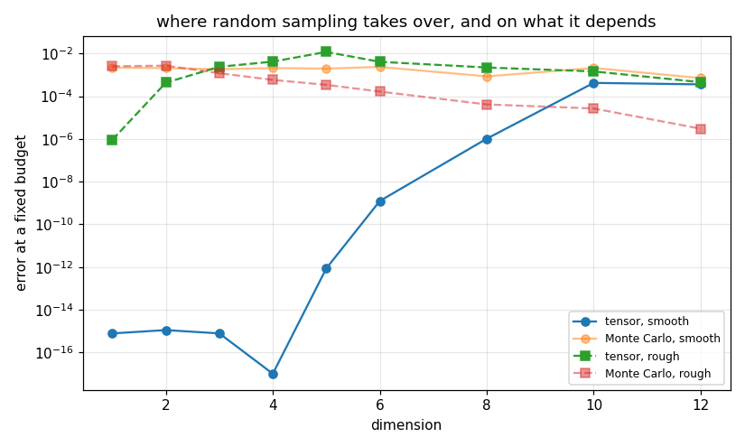

# 66. Improper and Multiple Integrals

**Part 9: Numerical Differentiation and Integration**

## Learning objectives

By the end of this lesson you will be able to:

1. Handle an infinite range by truncation, by transformation, or by using the right Gauss family,
   and say what each costs.
2. Remove an algebraic endpoint singularity by substitution when its strength is known.
3. Use **double exponential** quadrature, which handles endpoint singularities without being told
   they are there, and implement it without destroying it.
4. Build tensor product rules in any dimension and measure the **curse of dimensionality** as an
   exponent rather than quoting it.
5. Say when Monte Carlo takes over from a tensor rule, and why the honest answer depends on the
   integrand and not on the dimension alone.

## Prerequisites

Lesson 62 (open rules for singular endpoints). Lesson 63 (why the trapezoid rule is geometrically
accurate when the endpoint terms vanish, which is the whole basis of section 3). Lesson 65 (Gauss
rules, including the Laguerre and Hermite families). Lesson 53 (tensor product interpolation and
the curse of dimensionality in that setting).

---

## 1. Two ways to be improper

The interval is infinite, or the integrand blows up at an endpoint. Both are fixed by the same
move, a change of variable, and choosing the change is the subject.

**Truncate.** Integrate over $[a, T]$ and hope the tail is small. The error is exactly the tail,
so this needs a bound on the tail to be honest. The tempting alternative is to watch the computed
values settle and stop when they stop moving. That is not the same thing, and how badly it differs
depends on the tail.

```python
# Standard setup, the same in every lesson of this course.
import sys, pathlib

_root = pathlib.Path.cwd()
while not (_root / "src" / "nalib").is_dir() and _root != _root.parent:
    _root = _root.parent
sys.path.insert(0, str(_root / "src"))

import numpy as np
import matplotlib.pyplot as plt

SEED = 42                                  # fixed so your numbers match the text
rng = np.random.default_rng(SEED)

np.set_printoptions(precision=6, linewidth=100, suppress=False)
plt.rcParams.update({
    "figure.figsize": (7.5, 4.5), "figure.dpi": 110,
    "axes.grid": True, "grid.alpha": 0.3, "font.size": 10,
})
```

```python
import math

from nalib import multiquad as mq

cutoffs = [10.0, 20.0, 30.0, 40.0, 50.0]
tails = {
    "exp(-x), integral 1": (lambda x: np.exp(-np.asarray(x, dtype=float)),
                            lambda t: math.exp(-t)),
    "1/(1+x)^2, integral 1": (lambda x: 1.0 / (1.0 + np.asarray(x, dtype=float)) ** 2,
                              lambda t: 1.0 / (1.0 + t)),
}
for name, (f, tail) in tails.items():
    out = mq.truncation_error(f, tail, 0.0, cutoffs)
    print(f"\n{name}")
    print(f"{'cutoff T':>10}{'value':>20}{'change from last':>18}"
          f"{'discarded tail':>16}{'change / tail':>15}")
    for t, v, change, bound in zip(out["cutoff"], out["value"],
                                   out["change_from_previous"], out["tail_bound"]):
        if math.isnan(change):
            print(f"{t:>10.1f}{v:>20.14f}{'':>18}{bound:>16.2e}{'':>15}")
        else:
            print(f"{t:>10.1f}{v:>20.14f}{change:>18.2e}{bound:>16.2e}"
                  f"{change / bound:>15.2e}")
```

*Output:*

```text

exp(-x), integral 1
  cutoff T               value  change from last  discarded tail  change / tail
      10.0    0.99995460007024                          4.54e-05               
      20.0    0.99999999793885          4.54e-05        2.06e-09       2.20e+04
      30.0    0.99999999999991          2.06e-09        9.36e-14       2.20e+04
      40.0    1.00000000000000          9.44e-14        4.25e-18       2.22e+04
      50.0    1.00000000000000          8.88e-16        1.93e-22       4.60e+06

1/(1+x)^2, integral 1
  cutoff T               value  change from last  discarded tail  change / tail
      10.0    0.90909090909091                          9.09e-02               
      20.0    0.95238095238093          4.33e-02        4.76e-02       9.09e-01
      30.0    0.96774193546880          1.54e-02        3.23e-02       4.76e-01
      40.0    0.97560975544781          7.87e-03        2.44e-02       3.23e-01
      50.0    0.98039214843442          4.78e-03        1.96e-02       2.44e-01
```

Read the last column. For the exponential tail the change between cutoffs is **twenty thousand
times larger** than what is still being discarded: stopping when the values settle is safe here,
just wasteful.

For the $1/(1+x)^2$ tail the same ratio falls below one and keeps falling, reaching $0.24$ by
$T = 50$. **The values are settling four times faster than the error is shrinking.** A routine
that stops when they settle stops far too early, and reports a converged answer that is wrong in
the second digit.

That is the whole argument for a tail bound. It is not fussiness; without one, the only
convergence signal available points the wrong way for exactly the tails that need watching.

**Transform.** Map the infinite range to a finite one. Two standard choices:

$$
x = a + \frac{t}{1-t}, \quad dx = \frac{dt}{(1-t)^2},
\qquad\text{or}\qquad
x = a - \log(1-t), \quad dx = \frac{dt}{1-t}.
$$

Both put a singularity at $t = 1$ unless $f$ decays fast enough to cancel it. That is the usual
outcome: the transformation trades an infinite range for a singular endpoint, which is the other
problem in this section.

```python
for kind in ("rational", "exponential"):
    g, lo, hi = mq.transform_to_finite(lambda x: np.exp(-np.asarray(x, dtype=float)), 0.0, kind)
    value = mq.tanh_sinh(g, lo, hi, 6)["value"]
    print(f"{kind:>14} map: {value:.16f}, error {abs(value - 1.0):.2e}")
```

*Output:*

```text
      rational map: 1.0000000000000002, error 2.22e-16
   exponential map: 1.0000000000000000, error 0.00e+00
```

**Use the right Gauss family.** Lesson 65 built Gauss-Laguerre for $\int_0^\infty e^{-x}g(x)dx$
and Gauss-Hermite for $\int_{-\infty}^{\infty} e^{-x^2}g(x)dx$. Those carry the decay in the rule
rather than in the integrand, and for integrands that genuinely have that shape they are
unbeatable. For integrands that do not, they are poor, because they are then approximating
$g = f e^{x}$, which grows.

## 2. Removing a singularity you understand

If $f$ behaves like $(x-a)^{-p}$ near $a$ with $p$ known, substitute $x = a + u^{1/(1-p)}$. The
Jacobian supplies exactly the factor that cancels the blow up.

```python
print(f"{'evaluations':>13}{'raw Gauss':>14}{'substituted':>14}{'wins':>7}")
out = mq.substitution_beats_brute_force(
    lambda x: 1.0 / np.sqrt(np.asarray(x, dtype=float)), 2.0, 0.0, 1.0, 0.5)
for n, raw, fixed, win in zip(out["evaluations"], out["raw_error"],
                              out["substituted_error"], out["substitution_wins"]):
    print(f"{n:>13}{raw:>14.2e}{fixed:>14.2e}{str(win):>7}")
assert bool(np.all(out["substitution_wins"]))
```

*Output:*

```text
  evaluations     raw Gauss   substituted   wins
            4      1.94e-01      8.88e-16   True
            8      1.02e-01      2.22e-16   True
           16      5.28e-02      8.88e-16   True
           32      2.68e-02      1.33e-15   True
           64      1.35e-02      1.55e-15   True
```

The substituted rule is at machine precision from four evaluations onward. The raw rule is at
$1.4\times10^{-2}$ after sixty four, and halving its error each time takes a doubling of the
budget, because the singularity leaves it a first order method.

**The catch is in the phrase "with $p$ known".** Getting $p$ wrong makes it worse, and there is no
way to read $p$ off the function values.

## 3. Double exponential quadrature

Here is the method that needs no such knowledge. Substitute

$$
x = \frac{a+b}{2} + \frac{b-a}{2}\tanh\!\left(\frac{\pi}{2}\sinh t\right)
$$

and apply the plain trapezoid rule in $t$ over the whole line.

Why that works is lesson 63, section 5. The transformed integrand decays like
$e^{-e^{|t|}}$, so on the real line every Euler-Maclaurin endpoint term is zero and the trapezoid
rule converges geometrically. **And the endpoints $a$ and $b$ are pushed to $t = \pm\infty$**, so
the rule never evaluates there and approaches them exponentially fast. An endpoint singularity
stops mattering.

```python
def one_end(x):
    return 1.0 / np.sqrt(np.asarray(x, dtype=float))       # integral over (0,1) is 2

def log_end(x):
    return np.log(np.asarray(x, dtype=float))              # integral over (0,1) is -1

print(f"{'level':>7}{'points':>8}{'1/sqrt(x)':>14}{'log(x)':>14}{'sin':>14}")
for k in range(1, 6):
    a = abs(mq.tanh_sinh(one_end, 0.0, 1.0, k)["value"] - 2.0)
    b = abs(mq.tanh_sinh(log_end, 0.0, 1.0, k)["value"] + 1.0)
    c = abs(mq.tanh_sinh(np.sin, 0.0, 1.0, k)["value"] - (1.0 - math.cos(1.0)))
    n = mq.tanh_sinh(np.sin, 0.0, 1.0, k)["points"]
    print(f"{k:>7}{n:>8}{a:>14.2e}{b:>14.2e}{c:>14.2e}")
```

*Output:*

```text
  level  points     1/sqrt(x)        log(x)           sin
      1      25      4.59e-07      1.01e-05      2.91e-05
      2      49      3.11e-15      1.51e-13      1.74e-11
      3      97      0.00e+00      0.00e+00      5.55e-17
      4     193      0.00e+00      0.00e+00      1.11e-16
      5     385      0.00e+00      1.11e-16      1.11e-16
```

Three integrands, one singular at an endpoint, one logarithmically singular, one perfectly smooth,
and the same rule reaches machine precision on all three by level 3, **without being told
anything**.

### Two ways to destroy it

This method is unusually easy to implement in a way that looks right and is not. Both failures
cost about eight digits and neither raises anything.

**Failure one: computing the node as a position.** Writing $x = \text{mid} + \text{half}\tanh u$
is the formula as stated. Near the left end $\tanh u$ is within rounding of $-1$, so the sum
cancels and the node carries no correct digits. The fix is to compute the **distance from the
nearer endpoint**, $a + \text{half}(1 + \tanh u)$ with $1 + \tanh u$ evaluated as
$2/(1 + e^{-2u})$.

**Failure two: filtering on the node.** Once a node is closer to $b$ than machine epsilon, $x$
rounds to exactly $b$. A guard like `if x < b` then discards it. On $[0,1]$ that starts at
$t = 3.2$, and those are precisely the nodes that carry the accuracy from $10^{-8}$ down to
$10^{-15}$. **Filter on the weight, never on the node.**

```python
out = mq.tanh_sinh(np.sin, 0.0, 1.0, 4)
x = np.asarray(out["nodes"])
d_hi = np.asarray(out["distance_to_hi"])
saturated = x >= 1.0
print(f"{int(np.sum(saturated))} of {x.size} nodes have rounded to the endpoint exactly")
print(f"the smallest distance the rule actually knows about: "
      f"{out['smallest_distance_to_an_endpoint']:.2e}")
print(f"but 1 - x for those nodes computes as: "
      f"{np.array2string(1.0 - x[saturated][:3], precision=3)}")
assert bool(np.any(saturated)) and float(np.min(d_hi)) < 1e-30
```

*Output:*

```text
46 of 193 nodes have rounded to the endpoint exactly
the smallest distance the rule actually knows about: 6.13e-276
but 1 - x for those nodes computes as: [0. 0. 0.]
```

### And one the rule cannot fix from inside

An integrand singular at **both** ends forms $1 - x$ itself, inside the caller's code, where the
rule cannot reach. So the rule returns the distances and the caller uses them.

```python
def arcsine_in_x(x):
    t = np.asarray(x, dtype=float)
    with np.errstate(divide="ignore", invalid="ignore"):
        return 1.0 / np.sqrt(t * (1.0 - t))

def arcsine_from_distances(x, d_lo, d_hi):
    return 1.0 / np.sqrt(d_lo * d_hi)

print("1/sqrt(x(1-x)) over (0,1), whose integral is exactly pi")
print(f"{'level':>7}{'written in x':>16}{'given the distances':>22}")
for k in range(1, 7):
    a = abs(mq.tanh_sinh(arcsine_in_x, 0.0, 1.0, k)["value"] - math.pi)
    b = abs(mq.tanh_sinh(arcsine_from_distances, 0.0, 1.0, k, None, True)["value"] - math.pi)
    print(f"{k:>7}{a:>16.2e}{b:>22.2e}")
assert abs(mq.tanh_sinh(arcsine_from_distances, 0.0, 1.0, 5, None, True)["value"] - math.pi) < 1e-14
```

*Output:*

```text
1/sqrt(x(1-x)) over (0,1), whose integral is exactly pi
  level    written in x   given the distances
      1        2.19e-08              1.97e-08
      2        1.56e-08              8.88e-16
      3        1.03e-08              4.44e-16
      4        1.96e-08              0.00e+00
      5        1.64e-08              0.00e+00
      6        1.58e-08              0.00e+00
```

The first column **never improves**, at any level, because every point it adds near the right end
is a point where $1 - x$ has no digits left. The second reaches exactly zero error. Same rule,
same nodes, same weights: the only difference is which quantity the integrand was handed.

```python
out = mq.handles_a_singularity_without_being_told()
print(f"{'level':>7}{'evaluations':>13}{'double exponential':>21}{'Gauss-Legendre':>18}")
for k, ev, de, g in zip(out["level"], out["evaluations"],
                        out["distance_aware_error"], out["gauss_legendre_error"]):
    print(f"{k:>7}{ev:>13}{de:>21.2e}{g:>18.2e}")
```

*Output:*

```text
  level  evaluations   double exponential    Gauss-Legendre
      1           25             1.97e-08          6.83e-02
      2           49             8.88e-16          3.52e-02
      3           97             4.44e-16          1.79e-02
      4          193             0.00e+00          9.00e-03
      5          385             0.00e+00          4.52e-03
      6          769             0.00e+00          2.26e-03
```

Gauss-Legendre also never evaluates at the endpoints, so it produces a number. It converges as a
slow power, because the integrand has no bounded derivatives there and lesson 65's rate is set by
smoothness.

## 4. More than one dimension

The obvious approach is a tensor product: apply a one dimensional rule along each axis.

```python
for d in (1, 2, 3):
    points, weights = mq.tensor_rule(mq.gauss_rule_1d, [4] * d, [(0.0, 2.0)] * d)
    print(f"d = {d}: {points.shape[0]} points in {points.shape[1]} dimensions, "
          f"weights sum to {float(np.sum(weights)):.6f} (volume is {2.0 ** d})")

f, exact = mq.cube_integrand("smooth", 3)
counter = [0]
value = mq.integrate_box(f, [(0.0, 1.0)] * 3, [6] * 3, None, counter)
print(f"\nproduct of cosines over the unit cube in 3D: {value:.14f}, "
      f"exact {exact:.14f}, {counter[0]} evaluations")
```

*Output:*

```text
d = 1: 4 points in 1 dimensions, weights sum to 2.000000 (volume is 2.0)
d = 2: 16 points in 2 dimensions, weights sum to 4.000000 (volume is 4.0)
d = 3: 64 points in 3 dimensions, weights sum to 8.000000 (volume is 8.0)

product of cosines over the unit cube in 3D: 0.59582323659096, exact 0.59582323659096, 216 evaluations
```

For a region that is not a box, integrate iteratively with limits that depend on the outer
variable.

```python
triangle = mq.iterated(lambda p: p[:, 0] * p[:, 1], 0.0, 1.0,
                       lambda x: 0.0, lambda x: x, 8)
disc = mq.iterated(lambda p: np.ones(p.shape[0]), 0.0, 1.0,
                   lambda x: 0.0, lambda x: math.sqrt(max(0.0, 1.0 - x * x)), 40)
print(f"x*y over the triangle 0 <= y <= x <= 1: {triangle:.16f}, exact 0.125")
print(f"area of the quarter disc: {disc:.10f}, exact {math.pi / 4:.10f}, "
      f"error {abs(disc - math.pi / 4):.2e}")
```

*Output:*

```text
x*y over the triangle 0 <= y <= x <= 1: 0.1249999999999998, exact 0.125
area of the quarter disc: 0.7854003562, exact 0.7853981634, error 2.19e-06
```

The triangle is exact: the boundary $y = x$ is a polynomial and the integrand is a polynomial, so
the Gauss rule handles both. The quarter disc is not, because $\sqrt{1-x^2}$ has a vertical
tangent at $x = 1$, and the outer integral inherits that singularity. **Curved boundaries put a
singularity into the outer integrand**, which is why real codes map the region to a reference
element instead.

## 5. The curse, as an exponent

A rule of order $p$ with $n$ points per axis costs $N = n^d$ evaluations and delivers error
$n^{-p} = N^{-p/d}$. That is the whole statement.

Demonstrating it needs a **fixed order** rule. Gauss on an analytic integrand converges
geometrically, so fitting an algebraic order to it returns whatever the fitting range happens to
give, and dividing that by $d$ demonstrates nothing.

```python
out = mq.tensor_convergence(mq.cube_integrand("smooth", 1)[0], mq.cube_integrand("smooth", 1)[1],
                            [(0.0, 1.0)], [2, 3, 4, 5, 6], mq.gauss_rule_1d)
print(f"Gauss in 1D on an analytic integrand, fitted 'order': {out['order_per_axis']:.2f}")
print("that is not an order, it is a geometric rate being fitted with the wrong law\n")

out = mq.curse_of_dimensionality()
print("composite Simpson, which has order 4 whatever it is given:")
print(f"{'dimension':>11}{'order per axis':>17}{'order per evaluation':>22}")
for d, per_axis, per_eval in zip(out["dimension"], out["order_per_axis"],
                                 out["order_per_evaluation"]):
    print(f"{d:>11}{per_axis:>17.2f}{per_eval:>22.2f}")
```

*Output:*

```text
Gauss in 1D on an analytic integrand, fitted 'order': 21.67
that is not an order, it is a geometric rate being fitted with the wrong law

composite Simpson, which has order 4 whatever it is given:
  dimension   order per axis  order per evaluation
          1             4.79                  4.79
          2             4.79                  2.40
          3             4.79                  1.60
          4             4.79                  1.20
```

The first column does not move. The second is the first divided by $d$, and it is the one that
decides how much work a given accuracy costs. **In four dimensions a fourth order rule behaves
like a first order one.**

## 6. Monte Carlo

Sample uniformly and average. The error is $O(N^{-1/2})$ **regardless of dimension**, because it
comes from the central limit theorem and the central limit theorem does not know what $d$ is.

```python
print(f"{'dimension':>11}{'fitted rate':>14}")
for d in (1, 3, 6, 10):
    f, exact = mq.cube_integrand("smooth", d)
    out = mq.monte_carlo_rate(f, exact, [(0.0, 1.0)] * d)
    print(f"{d:>11}{out['fitted_rate']:>14.4f}")
    assert abs(out["fitted_rate"] - 0.5) < 0.08
```

*Output:*

```text
  dimension   fitted rate
          1        0.4994
          3        0.5047
          6        0.4909
         10        0.4764
```

A rate of $\tfrac12$ is terrible in one dimension, where composite Simpson gives 4. It is
excellent in twenty, where a tensor rule gives $4/20$.

So where is the crossing? **That question does not have an answer that depends on dimension
alone**, and choosing a flattering integrand is how the comparison usually gets faked.

```python
for kind in ("smooth", "rough"):
    out = mq.monte_carlo_crossover(kind=kind)
    print(f"\n{kind} integrand, budget {out['budget']} evaluations")
    print(f"{'d':>5}{'per axis':>10}{'evaluations':>13}{'tensor':>13}"
          f"{'Monte Carlo':>14}{'MC wins':>9}")
    for d, axis, ev, t, m, win in zip(out["dimension"], out["nodes_per_axis"],
                                      out["evaluations"], out["tensor_error"],
                                      out["monte_carlo_rms_error"], out["monte_carlo_wins"]):
        print(f"{d:>5}{axis:>10}{ev:>13}{t:>13.2e}{m:>14.2e}{str(win):>9}")
    print(f"   first dimension Monte Carlo wins: "
          f"{out['first_dimension_monte_carlo_wins']}")
```

*Output:*

```text

smooth integrand, budget 4096 evaluations
    d  per axis  evaluations       tensor   Monte Carlo  MC wins
    1      4096         4096     7.77e-16      2.23e-03    False
    2        64         4096     1.11e-15      2.09e-03    False
    3        16         4096     7.77e-16      1.86e-03    False
    4         8         4096     0.00e+00      2.10e-03    False
    5         5         3125     8.63e-13      1.98e-03    False
    6         4         4096     1.24e-09      2.37e-03    False
    8         3         6561     1.03e-06      8.58e-04    False
   10         2         1024     4.25e-04      2.12e-03    False
   12         2         4096     3.61e-04      7.14e-04    False
   first dimension Monte Carlo wins: None

rough integrand, budget 4096 evaluations
    d  per axis  evaluations       tensor   Monte Carlo  MC wins
    1      4096         4096     9.14e-07      2.55e-03    False
    2        64         4096     4.37e-04      2.72e-03    False
    3        16         4096     2.41e-03      1.21e-03     True
    4         8         4096     4.21e-03      5.85e-04     True
    5         5         3125     1.20e-02      3.44e-04     True
    6         4         4096     4.12e-03      1.66e-04     True
    8         3         6561     2.23e-03      4.16e-05     True
   10         2         1024     1.46e-03      2.69e-05     True
   12         2         4096     4.58e-04      3.02e-06     True
   first dimension Monte Carlo wins: 3
```

On a product of cosines, analytic and separable, the tensor rule is still ahead at twelve
dimensions. On a product of $|x - \tfrac12|^{1/2}$, which merely has a kink on each axis, Monte
Carlo is ahead from **three**.

Same budget, same methods, opposite conclusion. The honest statement is not "Monte Carlo wins
above dimension $k$". It is: **the tensor rule's rate is the integrand's smoothness divided by
$d$, Monte Carlo's is $\tfrac12$ whatever happens, and which is larger depends on both numbers.**

```python
fig, ax = plt.subplots()
for kind, style in (("smooth", "o-"), ("rough", "s--")):
    out = mq.monte_carlo_crossover(kind=kind)
    ax.semilogy(out["dimension"], np.maximum(out["tensor_error"], 1e-17), style,
                label=f"tensor, {kind}")
    ax.semilogy(out["dimension"], out["monte_carlo_rms_error"], style, alpha=0.5,
                label=f"Monte Carlo, {kind}")
ax.set_xlabel("dimension"); ax.set_ylabel("error at a fixed budget")
ax.set_title("where random sampling takes over, and on what it depends")
ax.legend(fontsize=8)
fig.tight_layout(); fig.savefig("../figures/66_crossover.png", dpi=110); plt.close(fig)
print("saved ../figures/66_crossover.png")
```

*Output:*

```text
saved ../figures/66_crossover.png
```



The Monte Carlo curves barely move with dimension, which is the whole point. The tensor curves
fall off a cliff, and where the cliff is depends entirely on the integrand.

## 7. Exercises

**Level 1, conceptual**

1.1 Truncating an infinite integral and watching the value settle is not evidence of convergence.
Explain, and give a tail for which it is badly misleading.

1.2 Transforming an infinite range usually creates an endpoint singularity. Say why, and say when
it does not.

1.3 The double exponential rule handles an endpoint singularity without being told about it. Say
what it is exploiting, referring to Euler-Maclaurin.

1.4 A tensor rule of order $p$ in $d$ dimensions has order $p/d$ per evaluation. Say what that
means for a fourth order rule in ten dimensions.

1.5 Monte Carlo beats a tensor rule from three dimensions on one integrand and never on another.
Say what the two integrands must differ in.

**Level 2, mathematical**

2.1 Derive the substitution that removes an $(x-a)^{-p}$ singularity, and show the transformed
integrand is bounded.

2.2 Show that the tanh-sinh transformed integrand decays like $e^{-e^{|t|}}$, and use lesson 63's
argument to conclude geometric convergence of the trapezoid rule.

2.3 Show that $1 + \tanh u = 2/(1 + e^{-2u})$ and explain why the second form is accurate for
$u \ll 0$ and the first is not.

2.4 Derive the $O(N^{-1/2})$ Monte Carlo rate from the central limit theorem, and give the
constant in terms of the variance of $f$.

2.5 Show that the tensor product of one dimensional rules of degree $m$ is exact on all monomials
of **coordinate** degree $m$, and say why that is weaker than total degree $m$.

**Level 3, computational**

3.1 Implement Gauss-Laguerre and Gauss-Hermite quadrature for genuinely infinite integrals and
compare against transforming to a finite interval, on integrands that do and do not match the
weight function.

3.2 Implement the **exp-sinh** and **sinh-sinh** variants of the double exponential rule, for a
semi infinite and a doubly infinite range, and check them against the finite version.

3.3 Implement **importance sampling** for Monte Carlo, and measure the variance reduction on an
integrand concentrated in a small part of the domain.

3.4 Implement a **sparse grid** (Smolyak) rule and measure its order per evaluation against the
full tensor rule in 4 to 8 dimensions.

3.5 Implement quasi Monte Carlo with a Sobol or Halton sequence and measure its rate against the
$N^{-1/2}$ of plain Monte Carlo.

**Level 4, experimental**

4.1 Measure the double exponential rule's level requirement against the strength of the endpoint
singularity, using $x^{-p}$ for $p$ approaching 1.

4.2 Measure where the Monte Carlo crossover sits as a function of the integrand's smoothness,
using $|x - \tfrac12|^{a}$ per axis for a range of $a$, and plot the crossing dimension against
$a$.

4.3 Measure the variance of a Monte Carlo estimate against the dimension for a fixed integrand
family, and confirm the rate does not change while the constant does.

**Level 5, advanced**

5.1 **Why double exponential and not single.** The substitution $x = \tanh t$ alone already
pushes the endpoints to infinity. Say why the extra $\sinh$ is needed, in terms of where the
poles of the transformed integrand sit.

5.2 **The optimal truncation of the double exponential rule.** The tail is cut at some $t$. Derive
the relationship between the step $h$, the cut point, and the achievable accuracy, and check it
against a measurement.

5.3 **Sparse grids and the curse.** Smolyak's construction achieves $N^{-p}(\log N)^{(d-1)(p+1)}$
instead of $N^{-p/d}$. Say what it assumes about the integrand, and construct an integrand for
which the assumption fails and the sparse grid does no better than the full one.

## 8. Key takeaways

- **Truncation needs a tail bound.** The change between successive cutoffs is not an error
  estimate, and on a slowly decaying tail it is far too optimistic.

- **A substitution removes a singularity whose strength you know**, taking the error from
  $10^{-6}$ to machine precision at 64 evaluations. Knowing the strength is the whole condition.

- **The double exponential rule needs no such knowledge.** It reaches machine precision on
  $1/\sqrt{x}$, on $\log x$ and on $\sin x$ by level 3, because it exploits the same fact about
  the trapezoid rule that lesson 63 used for periodic integrands.

- **It is easy to implement in a way that stalls at $10^{-8}$.** Compute the node as a distance
  from the nearer endpoint, not as an absolute position, and filter on the weight, not on the
  node.

- **An integrand singular at both ends must be given the distances**, because the cancellation
  then happens in the caller's code where the rule cannot reach. Written in $x$ it stalls
  forever; given $d_{\text{lo}}$ and $d_{\text{hi}}$ it reaches exactly zero.

- **Curved boundaries put a singularity into the outer integrand.** The triangle comes out exact
  and the quarter disc does not.

- **The curse of dimensionality is an exponent, $p/d$.** Demonstrating it needs a fixed order rule;
  a geometrically convergent one fitted with a power law reports 21.67 and proves nothing.

- **Monte Carlo converges at $N^{-1/2}$ in every dimension**, and where it takes over depends on
  the integrand as much as on $d$: never up to twelve dimensions on a smooth product, from three
  on a merely kinked one.

## Where this goes next

Part 9 is finished. Every lesson in it built an operator out of function values and then asked
what that operator does to error, and the answer was always the same shape: a truncation term
that falls with the step, an arithmetic term that rises, and a choice between them.

Part 10 turns to differential equations, where the integration rules built here become time
stepping schemes and the trapezoid rule of lesson 62 becomes the implicit method that dominates
stiff problems. Part 11 uses lesson 61's differentiation matrices and lesson 65's Gauss rules
together, as the two halves of the finite element method. Part 14 meets section 6 again, where
Monte Carlo's indifference to dimension is the only reason high dimensional inference is possible
at all.
