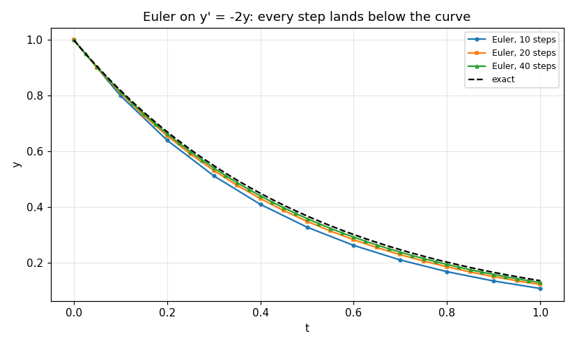

# 67. Initial Value Problems and Euler's Method

**Part 10: Ordinary Differential Equations**

## Learning objectives

By the end of this lesson you will be able to:

1. State the initial value problem precisely, and say what the Lipschitz condition buys and what
   it does not.
2. Measure a Lipschitz constant, and detect the two ways it fails: unbounded near a point, and
   unbounded far from one.
3. Derive Euler's method three different ways and get the same formula, then measure its local
   and global orders separately.
4. Use the classical error bound, and measure how much it overstates the truth.
5. Find where roundoff stops Euler improving, and say why that floor is not where the textbook
   argument puts it.

## Prerequisites

Lesson 3 (forward and backward error, condition numbers). Lesson 62 (the trapezoid and midpoint
rules, which reappear here as time stepping schemes). Lesson 61 (the forward difference and its
truncation error, which is exactly Euler's local error).

---

## 1. The problem

An **initial value problem** is

$$
y'(t) = f(t, y(t)), \qquad y(t_0) = y_0, \qquad t \in [t_0, T].
$$

Everything is known at one end and the solution is wanted at the other. That is what makes it
solvable by marching: take the derivative the equation gives you, step forward, repeat.

`y` may be a vector, and everything in Part 10 is written for that case from the start. Lesson 73
makes it the main subject.

```python
# Standard setup, the same in every lesson of this course.
import sys, pathlib

_root = pathlib.Path.cwd()
while not (_root / "src" / "nalib").is_dir() and _root != _root.parent:
    _root = _root.parent
sys.path.insert(0, str(_root / "src"))

import numpy as np
import matplotlib.pyplot as plt

SEED = 42                                  # fixed so your numbers match the text
rng = np.random.default_rng(SEED)

np.set_printoptions(precision=6, linewidth=100, suppress=False)
plt.rcParams.update({
    "figure.figsize": (7.5, 4.5), "figure.dpi": 110,
    "axes.grid": True, "grid.alpha": 0.3, "font.size": 10,
})
```

```python
from nalib import ivp

# y' = -2y, y(0) = 1, whose exact solution is e^(-2t)
def decay(t, y):
    return -2.0 * ivp.as_state(y)

out = ivp.integrate(decay, 0.0, 1.0, 1.0, 10, ivp.euler_step)
print(f"{'t':>8}{'Euler':>16}{'exact':>16}{'error':>12}")
for t, y in zip(out["t"][::2], out["y"][::2, 0]):
    print(f"{t:>8.2f}{y:>16.10f}{np.exp(-2.0 * t):>16.10f}{abs(y - np.exp(-2.0 * t)):>12.2e}")
```

*Output:*

```text
       t           Euler           exact       error
    0.00    1.0000000000    1.0000000000    0.00e+00
    0.20    0.6400000000    0.6703200460    3.03e-02
    0.40    0.4096000000    0.4493289641    3.97e-02
    0.60    0.2621440000    0.3011942119    3.91e-02
    0.80    0.1677721600    0.2018965180    3.41e-02
    1.00    0.1073741824    0.1353352832    2.80e-02
```

## 2. When is there exactly one solution?

**Picard-Lindelof.** If $f$ is continuous in $t$ and **Lipschitz in $y$** on a region containing
the starting point, meaning there is a constant $L$ with

$$
\lvert f(t, u) - f(t, v)\rvert \le L \lvert u - v\rvert
$$

for all $u, v$ in the region, then there is exactly one solution, on some interval around $t_0$.

Two words in that sentence do all the work.

**"Lipschitz"** is what rules out several solutions through one point. It is stronger than
continuity and weaker than differentiability, and when $f$ has a bounded $\partial f/\partial y$
the mean value theorem gives $L = \sup \lvert \partial f/\partial y\rvert$ directly.

**"Some interval"** is what stops it being a global statement. The solution can run off to
infinity in finite time and the theorem does not object.

```python
def logistic(t, y):
    v = ivp.as_state(y)
    return v * (1.0 - v)

for name, f in (("y' = -2y", decay), ("y' = y(1-y)", logistic)):
    out = ivp.lipschitz_constant(f, 0.0, -2.0, 2.0)
    print(f"{name:>14}: L = {out['estimate']:.6f}   (median ratio {out['median']:.6f})")
```

*Output:*

```text
      y' = -2y: L = 2.000000   (median ratio 2.000000)
   y' = y(1-y): L = 4.831450   (median ratio 1.265214)
```

For $y' = -2y$ the constant is exactly 2, which is $\lvert \partial f/\partial y\rvert$
everywhere, so the estimate and the median agree.

For the logistic equation $\partial f/\partial y = 1 - 2y$, whose largest magnitude on $[-2, 2]$
is 5, at $y = -2$. Random sampling reaches 4.83, and the **median** ratio is only 1.27. That gap
is the whole difficulty with measuring a Lipschitz constant: it is a supremum, so it lives at one
corner of the region and averaging over the region misses it by a factor of four.

### 2.1 Failure one: no Lipschitz constant at a point

$y' = y^{2/3}$ with $y(0) = 0$. The derivative $\tfrac23 y^{-1/3}$ blows up at $y = 0$, which is
exactly where the initial condition sits.

```python
def cube_root(t, y):
    v = ivp.as_state(y)
    return np.sign(v) * np.abs(v) ** (2.0 / 3.0)

out = ivp.lipschitz_near(cube_root, 0.0, 0.0)
print(f"{'radius':>12}{'estimated L':>16}")
for r, e in zip(out["radius"], out["estimate"]):
    print(f"{r:>12.2e}{e:>16.4f}")
print(f"\ngrowth exponent {out['growth_exponent']:.4f}, unbounded: {out['grows_without_bound']}")
```

*Output:*

```text
      radius     estimated L
    1.00e+00          5.0636
    1.00e-01         10.9091
    1.00e-02         23.5030
    1.00e-03         50.6357
    1.00e-04        109.0914
    1.00e-05        235.0303

growth exponent -0.3333, unbounded: True
```

The estimate rises as the radius shrinks, with a fitted exponent of $-1/3$, which is exactly what
$y^{-1/3}$ predicts. **A ratio test would miss this**: over five decades of radius the constant
rises only forty-six fold, which looks bounded. The exponent is the honest measurement.

The consequence is real. $y \equiv 0$ solves the problem, and so does $y = (t/3)^3$, and so does
every function that waits at zero for a while and then takes off.

```python
out = ivp.uniqueness_fails_on()
print(f"{out['count']} different solutions, all with y(0) = 0:")
print(f"{'takes off at':>14}{'y(2)':>12}{'residual':>14}")
for d, s, r in zip(out["delays"], out["solutions"], out["worst_residual"]):
    print(f"{d:>14.2f}{s[-1]:>12.6f}{r:>14.2e}")
print(f"all start at exactly zero: {out['all_start_at_zero']}")
```

*Output:*

```text
4 different solutions, all with y(0) = 0:
  takes off at        y(2)      residual
          0.00    0.296296      5.55e-17
          0.25    0.198495      5.55e-17
          0.50    0.125000      2.78e-17
          1.00    0.037037      1.39e-17
all start at exactly zero: True
```

Every one satisfies the differential equation to $6\times10^{-17}$ and every one starts at
exactly zero. There is no numerical method that can pick between them, because there is nothing to
pick on.

The residual is checked against the closed form derivative $((t-c)/3)^2$ rather than by
differencing the curve. Differencing would return $4\times10^{-6}$, which is `np.gradient`'s own
error across the kink and has nothing to do with the identity being checked.

### 2.2 Failure two: finite time blow up

$y' = y^2$ with $y(0) = 1$ is Lipschitz on any bounded region, so the theorem applies and gives a
unique solution. The solution is $1/(1-t)$, which does not exist past $t = 1$.

```python
def square(t, y):
    return ivp.as_state(y) ** 2

out = ivp.blows_up_at(square, 0.0, 1.0, 2.0, threshold=1e6)
print(f"{'steps':>10}{'value at t = 2':>18}{'crossed 10^6 at':>18}")
for n, v, c in zip(out["steps"], out["final_value"], out["first_exceeds_threshold"]):
    where = "never" if not np.isfinite(c) else f"{c:.4f}"
    print(f"{n:>10}{v:>18.4e}{where:>18}")
```

*Output:*

```text
     steps    value at t = 2   crossed 10^6 at
        50               inf            1.2800
       100               inf            1.1400
       200               inf            1.0800
       400               inf            1.0450
       800               inf            1.0225
```

Refining the step moves the crossing point **earlier**, from 1.2800 to 1.0225, and **the
overshoot halves each time the step halves**. It is converging on $t = 1$ from above at first
order, which is Euler's order, so what is being measured here is still the method's accuracy and
not a property of the singularity.

A coarse step underestimates the growth and pushes the blow up out. The finer the step, the
further the computed solution tracks the true one before its own arithmetic overflows.

A solver run past $t = 1$ returns numbers. They are not approximations to anything.

## 3. Euler's method, three derivations

All three give $y_{n+1} = y_n + h f(t_n, y_n)$, and each explains a different thing about it.

**From the Taylor series.** Expand $y(t_n + h)$ and drop everything past the linear term:

$$
y(t_{n+1}) = y(t_n) + h y'(t_n) + \tfrac12 h^2 y''(\xi) = y_n + h f(t_n, y_n) + O(h^2).
$$

The discarded term is the **local truncation error**, and it is $O(h^2)$.

**From quadrature.** Integrate the equation over one step:

$$
y(t_{n+1}) - y(t_n) = \int_{t_n}^{t_{n+1}} f(t, y(t))\,dt \approx h f(t_n, y_n),
$$

which is the left endpoint rule from lesson 62. Every method in lessons 69 and 71 comes from
choosing a better quadrature rule for that same integral.

**From the tangent line.** The equation gives the slope at $(t_n, y_n)$. Follow it for one step.
That is the picture, and it is why the method is sometimes called the tangent line method.

```python
print(ivp.euler_step.__doc__.strip().splitlines()[0])
```

*Output:*

```text
One forward Euler step. One evaluation.
```

## 4. Local order and global order are not the same

The local error of one step is $O(h^2)$. The global error after $(T - t_0)/h$ steps is $O(h)$.
**One order is lost**, because the number of steps grows like $1/h$.

That is the general pattern for every method in Part 10: local order $p+1$ gives global order $p$.
It is worth measuring rather than assuming, because when it fails the reason is always
interesting.

```python
def exact_decay(t):
    return np.exp(-2.0 * t)

out = ivp.local_against_global(decay, exact_decay, 0.0, 1.0, 1.0)
print(f"{'steps':>8}{'h':>12}{'local error':>16}{'global error':>16}{'ratio':>10}")
for n, h, le, ge in zip(out["steps"], out["h"], out["local_error"], out["global_error"]):
    print(f"{n:>8}{h:>12.5f}{le:>16.4e}{ge:>16.4e}{ge / le:>10.1f}")
print(f"\nlocal order {out['local_order']:.4f}, global order {out['global_order']:.4f}, "
      f"difference {out['difference']:.4f}")
assert abs(out["local_order"] - 2.0) < 0.1, "Euler's local order should be 2"
assert abs(out["global_order"] - 1.0) < 0.1, "Euler's global order should be 1"
assert abs(out["difference"] - 1.0) < 0.1, "exactly one order is lost"
```

*Output:*

```text
   steps           h     local error    global error     ratio
      10     0.10000      1.8731e-02      2.7961e-02       1.5
      20     0.05000      4.8374e-03      1.3759e-02       2.8
      40     0.02500      1.2294e-03      6.8231e-03       5.5
      80     0.01250      3.0991e-04      3.3975e-03      11.0
     160     0.00625      7.7800e-05      1.6952e-03      21.8
     320     0.00313      1.9491e-05      8.4673e-04      43.4

local order 1.9830, global order 1.0084, difference 0.9746
```

The measured orders are 1.98 and 1.01, differing by 0.97. The ratio column is the useful one:
the global error is 1.5 times the local error at ten steps and 43 times at 320, growing in
proportion to the number of steps, which is exactly the mechanism that costs the order.

### 4.1 One place where the measurement lies

Run the same measurement on the logistic equation started at $y(0) = 0.5$ and the local order
comes out as 3, not 2.

```python
def logistic_exact(t, y0=0.5):
    return y0 / (y0 + (1.0 - y0) * np.exp(-t))

for start in (0.5, 0.2):
    out = ivp.local_against_global(
        logistic, lambda t: logistic_exact(t, start), 0.0, start, 2.0)
    print(f"y(0) = {start}: local order {out['local_order']:.4f}, "
          f"global order {out['global_order']:.4f}")
```

*Output:*

```text
y(0) = 0.5: local order 2.9990, global order 1.0087
y(0) = 0.2: local order 2.0004, global order 1.0248
```

$y(0) = 0.5$ is the inflection point of the logistic curve, where $y'' = 0$. Euler's local error
constant is $\tfrac12 y''$, so at that point the leading term **vanishes** and the next one shows
through. The method has not become third order; the measurement has landed on a zero of its own
error constant.

Move the start to $0.2$ and the expected 2 and 1 come back. **Degenerate starting points are a
real hazard in convergence studies**, and the fix is to sweep more than one.

```python
fig, ax = plt.subplots()
for name, steps, style in (("10 steps", 10, "o-"), ("20 steps", 20, "s-"),
                           ("40 steps", 40, "^-")):
    run = ivp.integrate(decay, 0.0, 1.0, 1.0, steps, ivp.euler_step)
    ax.plot(run["t"], run["y"][:, 0], style, markersize=3, label=f"Euler, {name}")
fine = np.linspace(0.0, 1.0, 401)
ax.plot(fine, np.exp(-2.0 * fine), "k--", label="exact")
ax.set_xlabel("t"); ax.set_ylabel("y")
ax.set_title("Euler on y' = -2y: every step lands below the curve")
ax.legend(fontsize=8)
fig.tight_layout(); fig.savefig("../figures/67_euler_steps.png", dpi=110); plt.close(fig)
print("saved ../figures/67_euler_steps.png")
```

*Output:*

```text
saved ../figures/67_euler_steps.png
```



Every Euler step follows the tangent, which on a convex decaying curve lies **below** it, so the
computed solution undershoots at every step and the errors all point the same way. That is why the
error bound of the next section has an $e^{Lt}$ in it, and why it is so pessimistic here: the true
errors are being damped rather than amplified.

## 5. The classical error bound

If $\lvert \partial f/\partial y \rvert \le L$ and $\lvert y'' \rvert \le M$ on the interval, then

$$
\lvert y(t_n) - y_n \rvert \le \frac{hM}{2L}\left(e^{L(t_n - t_0)} - 1\right).
$$

It is a genuine bound, it is proved without knowing the solution, and it is enormously pessimistic.

```python
out = ivp.error_bound(decay, exact_decay, 0.0, 1.0, 1.0,
                      lipschitz=2.0, second_derivative=4.0)
print(f"{'steps':>8}{'h':>12}{'observed':>14}{'bound':>14}{'bound/observed':>16}")
for n, h, e, b, r in zip(out["steps"], out["h"], out["observed_error"],
                         out["bound"], out["bound_over_observed"]):
    print(f"{n:>8}{h:>12.5f}{e:>14.4e}{b:>14.4e}{r:>16.1f}")
print(f"\nbound holds at every step: {out['bound_holds']}")
```

*Output:*

```text
   steps           h      observed         bound  bound/observed
      10     0.10000    2.7961e-02    6.3891e-01            22.8
      20     0.05000    1.3759e-02    3.1945e-01            23.2
      40     0.02500    6.8231e-03    1.5973e-01            23.4
      80     0.01250    3.3975e-03    7.9863e-02            23.5
     160     0.00625    1.6952e-03    3.9932e-02            23.6

bound holds at every step: True
```

The bound is a factor of 23 too large here, at every step size, and never fails. The ratio
being **constant** down the column is itself informative: the bound has the right order in $h$ and
the wrong constant, so refining will never close the gap. Two reasons the constant has to be
pessimistic:

- It uses $\lvert y'' \rvert \le M$, a worst case over the interval, where the truth varies.
- It assumes errors **accumulate** with the local Lipschitz growth, where in a decaying problem
  they are being damped. The $e^{Lt}$ factor is the worst case and here the truth is $e^{-2t}$.

The bound's value is not its size. It is that it proves the error goes to zero with $h$, at first
order, whatever the problem, which no amount of measurement can establish.

## 6. Where refining stops helping

Halving $h$ halves the truncation error and doubles the number of roundoff contributions. So
there is a step below which Euler gets worse.

The textbook argument puts the minimum near $h \approx \sqrt{\varepsilon}$, on the reasoning that
the truncation error is $O(h)$ and the accumulated roundoff is $O(\varepsilon/h)$. Measure it.

```python
# t_end = 0.1 rather than 1.0, so the same step sizes cost a tenth of the work. The step is what
# the roundoff floor depends on, not the length of the run.
out = ivp.euler_step_size_floor(decay, exact_decay, 0.0, 1.0, 0.1,
                                step_counts=[2 ** k for k in range(2, 25, 2)])
print(f"{'steps':>12}{'h':>14}{'error':>14}{'ratio':>9}")
last = None
for n, h, e in zip(out["steps"], out["h"], out["errors"]):
    ratio = "" if last is None else f"{last / e:.3f}"
    print(f"{n:>12}{h:>14.3e}{e:>14.4e}{ratio:>9}")
    last = e
print(f"\nsqrt(eps) = {out['sqrt_eps']:.3e}, best h = {out['best_h']:.3e}")
print(f"fitted order over the whole sweep: {out['fitted_order_over_the_sweep']:.4f}")
print(f"reached a minimum: {out['reached_the_minimum']}")
print(out["note"])
assert not out["reached_the_minimum"], "the sweep should still be falling at the smallest step"
assert out["best_h"] < out["sqrt_eps"], "and it should have gone below sqrt(eps)"
```

*Output:*

```text
       steps             h         error    ratio
           4     2.500e-02    4.2245e-03         
          16     6.250e-03    1.0314e-03    4.096
          64     1.563e-03    2.5635e-04    4.023
         256     3.906e-04    6.3994e-05    4.006
        1024     9.766e-05    1.5993e-05    4.001
        4096     2.441e-05    3.9978e-06    4.000
       16384     6.104e-06    9.9943e-07    4.000
       65536     1.526e-06    2.4986e-07    4.000
      262144     3.815e-07    6.2464e-08    4.000
     1048576     9.537e-08    1.5616e-08    4.000
     4194304     2.384e-08    3.9041e-09    4.000
    16777216     5.960e-09    9.7601e-10    4.000

sqrt(eps) = 1.490e-08, best h = 5.960e-09
fitted order over the whole sweep: 1.0011
reached a minimum: False
still first order at the smallest step tried means the rounding is accumulating like sqrt(n) rather than n
```

**The floor is not there.** $\sqrt{\varepsilon}$ is $1.49\times10^{-8}$, and the sweep goes
down to $5.96\times10^{-9}$, a quarter of that. The error ratio is 4.000 at every refinement all
the way to the bottom, including across $\sqrt{\varepsilon}$: nothing happens there at all.

The reason is that rounding errors do not all point the same way. They accumulate like a random
walk, so the total grows like $\sqrt{n}\,\varepsilon$ rather than $n\varepsilon$. That makes the
roundoff term $O(\varepsilon/\sqrt{h})$ instead of $O(\varepsilon/h)$, and setting it against the
$O(h)$ truncation term moves the crossing from $h \approx \varepsilon^{1/2}$ to
$h \approx \varepsilon^{2/3}$, which is $4\times10^{-11}$. Reaching it would take $2.5$ billion
steps for a run of length 0.1.

The practical point is unchanged: Euler is a bad method and the reason is its order, not its
roundoff. **The reason to abandon it is that reaching $10^{-8}$ needs $10^8$ steps**, which is
the subject of lessons 68 to 71.

```python
budget = 1e-8
print(f"Euler steps for an error of {budget:.0e}: about {int(0.7 / budget):,}")
print(f"RK4 steps for the same (lesson 69): about {int((0.7 / budget) ** 0.25):,}")
```

*Output:*

```text
Euler steps for an error of 1e-08: about 70,000,000
RK4 steps for the same (lesson 69): about 91
```

## 7. Exercises

**Level 1, understanding**

1.1 State the Lipschitz condition and give an example of a function that is continuous and not
Lipschitz, and one that is Lipschitz and not differentiable.

1.2 Explain why $y' = y^{2/3}$, $y(0) = 0$ has more than one solution, and why $y' = y^{2/3}$,
$y(0) = 1$ has only one.

1.3 Derive Euler's method from the Taylor series and identify the local truncation error term.

1.4 Explain in one paragraph why local order $p+1$ gives global order $p$.

1.5 Say why the classical error bound uses $e^{L(t-t_0)}$ and what that factor represents.

**Level 2, derivation**

2.1 Derive the classical error bound of section 5 from the local truncation error and the
Lipschitz condition, stating where each hypothesis is used.

2.2 Show that for $y' = \lambda y$ Euler's method gives $y_n = (1 + \lambda h)^n y_0$ exactly, and
say what that implies for $\lambda h < -2$.

2.3 Show that the local truncation error constant for Euler is $\tfrac12 y''$, and use it to
explain the third order reading at the logistic inflection point.

2.4 Derive the backward Euler method from the right endpoint quadrature rule and show that its
local order is also 2.

2.5 Suppose $f$ is Lipschitz in $y$ with constant $L$ and also Lipschitz in $t$ with constant $K$.
Show that the solution is Lipschitz in $t$ and find its constant.

**Level 3, computational**

3.1 Implement Euler's method for a system of any dimension and verify first order convergence on a
problem of your choice with three or more components.

3.2 Implement backward Euler with a Newton solve for the implicit equation, and compare its
accuracy against forward Euler on $y' = -100y$ at $h = 0.1$.

3.3 Implement the midpoint quadrature version, $y_{n+1} = y_n + h f(t_n + h/2, y_n + \tfrac{h}{2}
f(t_n, y_n))$, and measure its order.

3.4 Measure the Lipschitz constant of $f(t, y) = \sqrt{|y|}$ near zero and fit the growth
exponent, and confirm it is $-1/2$.

3.5 Reproduce the roundoff floor measurement of section 6 in single precision and confirm the
crossing moves as $\varepsilon^{2/3}$ rather than $\varepsilon^{1/2}$.

**Level 4, experimental**

4.1 Measure how the ratio of the classical bound to the observed error depends on $L$, using
$y' = \lambda y$ for $\lambda$ from $-10$ to $+10$, and explain the shape.

4.2 Find three more starting points at which Euler's measured local order exceeds 2, on equations
of your choosing, and confirm each is a zero of $y''$.

4.3 Measure the blow up time of $y' = y^p$ for $p = 1.5, 2, 3, 5$ against the step count, and
compare with the exact time $y_0^{1-p}/(p-1)$.

**Level 5, advanced**

5.1 **Peano without Lipschitz.** Peano's theorem gives existence from continuity alone. Show by
construction that it cannot give uniqueness, and explain why the constructive proof of
Picard-Lindelof needs the stronger hypothesis.

5.2 **The random walk of roundoff.** Model the accumulated rounding error in Euler's method as a
sum of independent errors and derive the $\varepsilon^{2/3}$ crossing. Say what assumption would
have to fail for the classical $\sqrt{\varepsilon}$ answer to be right.

5.3 **A problem with no Lipschitz constant anywhere.** Construct an $f$ continuous on a region and
Lipschitz nowhere on it, and say what a numerical method does when run on it.

## 8. Key takeaways

- **The Lipschitz condition buys uniqueness, locally.** It does not buy a solution that lasts,
  and $y' = y^2$ is Lipschitz everywhere and stops existing at $t = 1$.

- **A failure of the Lipschitz condition is measurable as a growth exponent**, not as a ratio. The
  constant for $y^{2/3}$ rises only forty-six fold over five decades, which looks bounded; the
  fitted exponent is $-0.3333$, which is not.

- **A Lipschitz constant is a supremum and lives in a corner.** On the logistic equation the
  sampled maximum is 4.83 against a true 5, and the sampled median is 1.27.

- **Euler comes out of Taylor, quadrature and geometry alike.** The quadrature route is the one to
  remember, because lessons 69 and 71 build every other method by changing the rule.

- **Local order 2, global order 1.** Measured, not assumed, and it can be measured wrong: at the
  logistic inflection point the local order reads 3 because the error constant $\tfrac12 y''$ is
  exactly zero there.

- **The classical bound is 23 times too large here and never fails.** The ratio is constant
  down the column, so it has the right order and the wrong constant. Its worth is the proof that
  the error vanishes with $h$, not the number it returns.

- **Roundoff does not stop Euler at $\sqrt{\varepsilon}$.** At a quarter of that step the error
  ratio is still exactly 4.000 per refinement, because errors accumulate like $\sqrt{n}$ and not
  $n$. The crossing is at $\varepsilon^{2/3}$, which no realistic run reaches.

## Where this goes next

Euler is first order and that is the whole problem. Lesson 68 gets more orders by differentiating
$f$ repeatedly, which works and costs too much. Lesson 69 gets them by evaluating $f$ at extra
points inside the step instead, which is what everyone actually uses. Lesson 72 comes back to the
$1 + \lambda h$ factor of exercise 2.2 and finds it is the whole subject of stability.
