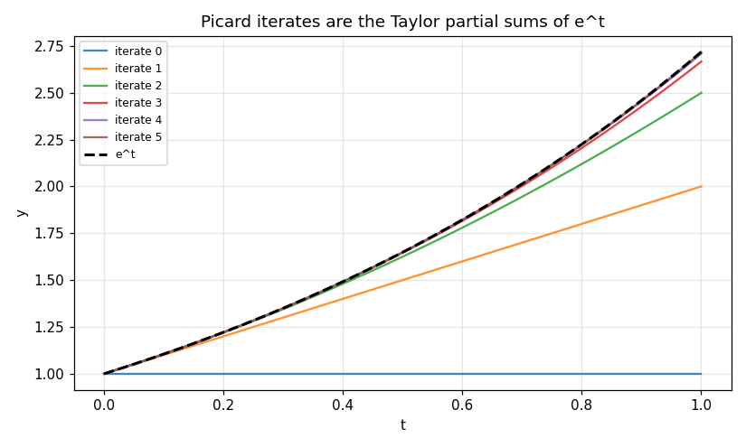

# 68. Taylor and Picard Methods

**Part 10: Ordinary Differential Equations**

## Learning objectives

By the end of this lesson you will be able to:

1. Run Picard's iteration, see it converge, and recognise its iterates as the partial sums of the
   solution's Taylor series.
2. Say precisely where the Lipschitz condition enters the proof, and watch the iteration fail
   when it is absent.
3. Build a Taylor method of any order from the total derivatives of the solution and confirm the
   order it was built for.
4. Count the derivative terms a Taylor method needs and see why order 5 is where it stops being
   worth it.
5. Compare Taylor against Euler **at equal cost**, and get an honest answer about when the extra
   derivatives pay.

## Prerequisites

Lesson 67 (Euler, local and global order). Lesson 8 (fixed point iteration and the contraction
mapping argument, which is exactly what Picard's proof is). Lesson 61 (the cost of differentiating
a function repeatedly). Lesson 39 (splines, used here only to interpolate the Picard iterates).

---

## 1. Picard's iteration

Integrate the differential equation from $t_0$ to $t$:

$$
y(t) = y_0 + \int_{t_0}^{t} f(s, y(s))\,ds.
$$

That is an integral equation, and it is exactly equivalent to the initial value problem: the
initial condition is built in, and differentiating it gives the equation back.

Now treat it as a **fixed point** problem and iterate:

$$
y_{k+1}(t) = y_0 + \int_{t_0}^{t} f(s, y_k(s))\,ds, \qquad y_0(t) \equiv y_0.
$$

This is lesson 8's fixed point iteration with functions in place of numbers.

```python
# Standard setup, the same in every lesson of this course.
import sys, pathlib

_root = pathlib.Path.cwd()
while not (_root / "src" / "nalib").is_dir() and _root != _root.parent:
    _root = _root.parent
sys.path.insert(0, str(_root / "src"))

import numpy as np
import matplotlib.pyplot as plt

SEED = 42                                  # fixed so your numbers match the text
rng = np.random.default_rng(SEED)

np.set_printoptions(precision=6, linewidth=100, suppress=False)
plt.rcParams.update({
    "figure.figsize": (7.5, 4.5), "figure.dpi": 110,
    "axes.grid": True, "grid.alpha": 0.3, "font.size": 10,
})
```

```python
from nalib import taylorode as to

def exponential(t, y):
    return np.asarray(y, dtype=float)

out = to.picard(exponential, 0.0, 1.0, 1.0, iterations=6)
changes = np.asarray(out["change_per_iteration"], dtype=float)
print(f"{'iteration':>10}{'value at t = 1':>18}{'change from last':>19}")
for k, curve in enumerate(out["iterates"]):
    label = "" if k == 0 else f"{changes[k - 1]:.3e}"
    print(f"{k:>10}{curve[-1, 0]:>18.10f}{label:>19}")
print(f"\nconverging: {out['converging']},   e = {np.e:.10f}")
```

*Output:*

```text
 iteration    value at t = 1   change from last
         0      1.0000000000                   
         1      2.0000000000          1.000e+00
         2      2.5000000000          5.000e-01
         3      2.6666666667          1.667e-01
         4      2.7083333333          4.167e-02
         5      2.7166666667          8.333e-03
         6      2.7180555555          1.389e-03

converging: True,   e = 2.7182818285
```

## 2. The iterates are the Taylor partial sums

For $y' = y$, $y(0) = 1$:

$$
y_1 = 1 + \int_0^t 1\,ds = 1 + t, \qquad
y_2 = 1 + \int_0^t (1+s)\,ds = 1 + t + \tfrac{t^2}{2}, \qquad \dots
$$

Iteration $k$ is the Taylor polynomial of $e^t$ of degree $k$. **That is not a coincidence of this
example**: each iteration integrates the previous one, which raises the polynomial degree by one
and reproduces the next Taylor coefficient.

```python
out = to.picard_matches_the_series(t_end=0.8, iterations=6)
print(f"{'iteration':>10}{'gap to exact':>16}{'gap to the Taylor partial sum':>32}")
for k, a, b in zip(out["iteration"], out["gap_to_the_exact_solution"],
                   out["gap_to_the_taylor_partial_sum"]):
    print(f"{k:>10}{a:>16.3e}{b:>32.3e}")
print(f"\niterates are the partial sums: {out['iterates_are_partial_sums']}")
assert out["iterates_are_partial_sums"], "iterate k is the Taylor polynomial of degree k"
```

*Output:*

```text
 iteration    gap to exact   gap to the Taylor partial sum
         0       1.226e+00                       0.000e+00
         1       4.255e-01                       2.220e-16
         2       1.055e-01                       2.220e-16
         3       2.021e-02                       4.441e-16
         4       3.141e-03                       4.441e-16
         5       4.103e-04                       1.323e-11
         6       4.617e-05                       2.156e-11

iterates are the partial sums: True
```

The middle column falls, which is convergence. The right column is the interesting one: it is at
the level of the interpolation used to represent the iterates, not at the level of the
approximation. **The Picard iterate and the Taylor partial sum are the same polynomial.**

This is why the lesson has both methods in it. Picard is the existence proof, and the Taylor
method is the same construction turned into an algorithm.

### 2.1 Why the interpolation matters

The iterates here are represented by their values at a grid and integrated numerically. With
**linear** interpolation between the grid points the identity above bottoms out at $10^{-5}$,
which looks like a failure of the identity and is a failure of the representation. With a
not-a-knot cubic spline it reaches $2\times10^{-11}$.

```python
print(to.picard.__doc__.strip().splitlines()[0])
print(f"\nnodes used: 81, quadrature nodes per panel: 12")
```

*Output:*

```text
Picard iterates, computed by quadrature on a fixed grid.

nodes used: 81, quadrature nodes per panel: 12
```

If you are checking an exact identity numerically, everything in the pipeline has to be more
accurate than the identity is tight. Otherwise you measure the pipeline.

```python
fig, ax = plt.subplots()
run = to.picard(exponential, 0.0, 1.0, 1.0, iterations=5)
for k, curve in enumerate(run["iterates"]):
    ax.plot(run["t"], curve[:, 0], label=f"iterate {k}", alpha=0.85)
ax.plot(run["t"], np.exp(run["t"]), "k--", lw=2, label="e^t")
ax.set_xlabel("t"); ax.set_ylabel("y")
ax.set_title("Picard iterates are the Taylor partial sums of e^t")
ax.legend(fontsize=8)
fig.tight_layout(); fig.savefig("../figures/68_picard.png", dpi=110); plt.close(fig)
print("saved ../figures/68_picard.png")
```

*Output:*

```text
saved ../figures/68_picard.png
```



Each iterate is a polynomial one degree higher than the last, peeling away from $e^t$ later each
time. That is what the identity in section 2 measures: the curves are not merely close to the
partial sums, they **are** the partial sums.

## 3. Where the Lipschitz condition enters

The proof that Picard's iteration converges is a contraction argument. If $f$ is Lipschitz in $y$
with constant $L$, then

$$
\lVert y_{k+1} - y_k \rVert \le L \int_{t_0}^{t} \lVert y_k - y_{k-1} \rVert\,ds,
$$

and iterating that gives $\lVert y_{k+1} - y_k\rVert \le \frac{(L(t-t_0))^k}{k!}\lVert y_1 - y_0
\rVert$, which is summable. **The Lipschitz constant is the contraction factor**, and without it
there is no reason for the differences to shrink.

Lesson 67 met $y' = y^{2/3}$, which has no Lipschitz constant at $y = 0$. Watch the iteration on it.

```python
out = to.picard_needs_lipschitz(t_end=1.0, iterations=8)
print(f"from y(0) = 0:      value at t = 1 is {out['from_zero_final'][-1]:.6e},  "
      f"stays zero: {out['from_zero_stays_zero']}")
print(f"from y(0) = 1e-6:   value at t = 1 is {out['from_small_final'][-1]:.6e},  "
      f"settles: {out['from_small_settles']}")
print(f"\n{'iteration':>10}{'change from zero':>20}{'change from 1e-6':>20}")
for k, (a, b) in enumerate(zip(out["from_zero_changes"], out["from_small_changes"])):
    print(f"{k:>10}{a:>20.3e}{b:>20.3e}")
```

*Output:*

```text
from y(0) = 0:      value at t = 1 is 0.000000e+00,  stays zero: True
from y(0) = 1e-6:   value at t = 1 is 3.699979e-02,  settles: False

 iteration    change from zero    change from 1e-6
         0           0.000e+00           1.000e-04
         1           0.000e+00           1.214e-03
         2           0.000e+00           4.431e-03
         3           0.000e+00           7.732e-03
         4           0.000e+00           8.530e-03
         5           0.000e+00           7.075e-03
         6           0.000e+00           4.901e-03
         7           0.000e+00           3.016e-03
```

Started at exactly zero the iteration never moves, because $f(t, 0) = 0$. Every change is
exactly $0$, it reports a clean convergence, and it is right: the zero function does solve the
problem.

Started a millionth away it climbs. After eight iterations it is at $0.03700$ and still moving,
and the number it is moving towards is $0.037037 = (1/3)^3$, which is the **other** exact
solution from lesson 67. A perturbation of $10^{-6}$ in the initial condition changes the answer
by $4\times10^{-2}$, and both answers are exactly right.

That is the shape of every non-uniqueness failure. Not an error, and not a convergence problem
either: a choice made by arithmetic, reported as an answer.

## 4. Taylor methods

Differentiate the equation to get the higher derivatives of the solution along it:

$$
y' = f, \qquad
y'' = f_t + f_y f, \qquad
y''' = f_{tt} + 2f_{ty}f + f_{yy}f^2 + f_y(f_t + f_y f),
$$

and then step with the truncated Taylor series:

$$
y_{n+1} = y_n + h y' + \frac{h^2}{2}y'' + \dots + \frac{h^k}{k!}y^{(k)}.
$$

The local error is the first omitted term, $O(h^{k+1})$, so the global order is $k$. **No
convergence argument is needed**: the method is the Taylor series, so it has the order by
construction.

```python
from nalib import ivp

# y' = y - t^2 + 1, y(0) = 0.5, the standard test problem
def f(t, y):
    return ivp.as_state(y) - t ** 2 + 1.0

def derivatives(t, y, k):
    """The kth total derivative of the solution, worked out by hand."""
    v = ivp.as_state(y)
    if k == 1:
        return v - t ** 2 + 1.0
    if k == 2:
        return v - t ** 2 + 1.0 - 2.0 * t
    if k == 3:
        return v - t ** 2 + 1.0 - 2.0 * t - 2.0
    return v - t ** 2 + 1.0 - 2.0 * t - 2.0          # every higher one repeats

def exact(t):
    return (t + 1.0) ** 2 - 0.5 * np.exp(t)

out = to.taylor_orders_are_exact(f, derivatives, exact, 0.0, 0.5, 2.0)
print(f"{'order':>7}{'fitted':>10}{'error at 320 steps':>22}{'derivative calls':>19}")
for k, fit, err, calls in zip(out["order"], out["fitted_order"],
                              out["finest_error"], out["derivative_evaluations"]):
    print(f"{k:>7}{fit:>10.4f}{err:>22.4e}{calls:>19}")
print(f"\nevery order matches: {out['all_match']}")
assert out["all_match"], "a wrong derivative formula shows up here as a missing order"
```

*Output:*

```text
  order    fitted    error at 320 steps   derivative calls
      1    0.9469            1.6721e-02                320
      2    1.9601            4.7881e-05                640
      3    2.9586            7.4791e-08                960
      4    3.9569            9.3470e-11               1280

every order matches: True
```

Order 1 is Euler. The fitted orders are 0.95, 1.96, 2.96 and 3.96, each within 0.06 of what it
was built for, and each row costs exactly $k$ derivative evaluations per step.

That measurement is a check on the derivative formulas above rather than on the theory. A mistake
in $y'''$ does not make the answer slightly worse; it drops the fitted order to 2, which is why
this is worth running rather than assuming.

## 5. What the derivatives cost

The derivative formulas above were easy because $f$ is nearly linear. In general $y^{(k)}$ is a
sum over **rooted trees** of $k-1$ nodes, and the counts grow fast.

```python
out = to.taylor_term_count([1, 2, 3, 4, 5, 6, 7])
print(f"{'order':>7}{'new terms':>12}{'cumulative':>13}")
for k, new, total in zip(out["order"], out["new_terms"], out["cumulative_terms"]):
    print(f"{k:>7}{new:>12}{total:>13}")
print(f"\n{out['note']}")
```

*Output:*

```text
  order   new terms   cumulative
      1           1            1
      2           1            2
      3           2            4
      4           4            8
      5           9           17
      6          20           37
      7          48           85

rooted tree counts; these are the elementary differentials of f
```

An order 5 method needs every partial derivative of $f$ up to order 4, in every combination, which
for a system of $m$ equations is $O(m^4)$ separate expressions. There are only three ways to get
them:

- **By hand**, which is where mistakes come from.
- **By symbolic differentiation**, which suffers expression swell: lesson 61 measured a symbolic
  fourth derivative running to thousands of terms.
- **By automatic differentiation**, which works and is the reason Taylor methods are used at all
  in the few places they are used, mostly in high precision celestial mechanics.

**The alternative is not to differentiate at all.** Lesson 69 gets the same orders by evaluating
$f$ at extra points inside the step, which is why Runge-Kutta and not Taylor is what everyone
runs.

## 6. Taylor against Euler at equal cost

A Taylor method of order 4 does 4 derivative evaluations per step. Euler does 1. So for a fixed
budget of evaluations, Euler takes four times as many steps. Which wins?

```python
out = to.taylor_against_euler_at_equal_cost(f, derivatives, exact, 0.0, 0.5, 2.0, order=4)
print(f"{'evaluations':>13}{'Taylor 4 steps':>16}{'Taylor error':>16}"
      f"{'Euler error':>16}{'advantage':>12}")
for e, s, te, ee, adv in zip(out["evaluations"], out["taylor_steps"], out["taylor_error"],
                             out["euler_error"], out["advantage"]):
    print(f"{e:>13}{s:>16}{te:>16.3e}{ee:>16.3e}{adv:>12.1e}")
print(f"\nTaylor wins at every budget: {out['taylor_wins']}")
```

*Output:*

```text
  evaluations  Taylor 4 steps    Taylor error     Euler error   advantage
           40              10       8.343e-05       1.275e-01     1.5e+03
           80              20       5.666e-06       6.550e-02     1.2e+04
          160              40       3.692e-07       3.321e-02     9.0e+04
          320              80       2.356e-08       1.672e-02     7.1e+05
          640             160       1.488e-09       8.390e-03     5.6e+06

Taylor wins at every budget: True
```

Taylor wins, by a factor that **grows** with the budget because the orders differ: 1500 times
ahead at 40 evaluations and 5.6 million times ahead at 640. Doubling the budget multiplies the
advantage by 8, which is $2^{4-1}$, the ratio of the two orders' convergence rates.

**So why is nobody using it?** Because the comparison counts evaluations of $f$ and its
derivatives as equal, and they are not. The order 4 derivative formula for this problem is three
additions. For a real problem it is a page of algebra that has to be derived, coded and
maintained, and it is wrong until it is tested. Lesson 69 gets the same order out of four
evaluations of $f$ itself, with nothing to derive.

## 7. Exercises

**Level 1, understanding**

1.1 Write out the first four Picard iterates for $y' = 2ty$, $y(0) = 1$ by hand, and identify the
series they are building.

1.2 Explain why the Picard iteration for $y' = y^{2/3}$, $y(0) = 0$ returns the zero function
whatever the number of iterations.

1.3 State the local and global order of a Taylor method of order $k$ and say why no convergence
theorem is needed to establish them.

1.4 Derive $y''$ and $y'''$ for $y' = t + y^2$.

1.5 Say why counting evaluations of $f$ and evaluations of $y^{(4)}$ as equal understates the cost
of a Taylor method.

**Level 2, derivation**

2.1 Carry out the contraction estimate of section 3 and obtain the factorial bound
$\lVert y_{k+1} - y_k\rVert \le (L(t-t_0))^k / k! \cdot \lVert y_1 - y_0\rVert$.

2.2 Show that the Picard iterates for a linear problem $y' = a(t)y + b(t)$ are the partial sums of
a convergent series and identify it.

2.3 Show that the Taylor method of order 2 can be written as one evaluation of $f$ plus one
evaluation of $f_t + f_y f$, and compare that with Heun's method of lesson 69.

2.4 Prove that the number of elementary differentials at order $k$ equals the number of rooted
trees with $k$ nodes, for $k$ up to 4, by writing them out.

2.5 Show that for $y' = \lambda y$ the Taylor method of order $k$ gives
$y_{n+1} = \left(\sum_{j=0}^{k} (\lambda h)^j / j!\right) y_n$, and say what that expression is
approximating.

**Level 3, computational**

3.1 Implement Picard's iteration with a spline representation of the iterates and reproduce the
identity of section 2 for three different equations.

3.2 Implement a Taylor method of order 4 for a system of two equations, deriving the derivative
formulas by hand, and verify fourth order convergence.

3.3 Use a symbolic differentiation library to generate the derivative formulas for order 5 on
$y' = \sin(ty)$, and count the terms in the result.

3.4 Implement a Taylor method using automatic differentiation for the derivatives, and compare
its cost against the hand coded version.

3.5 Measure the Picard iteration's convergence rate against $L(t - t_0)$ and confirm the
factorial bound of exercise 2.1.

**Level 4, experimental**

4.1 Measure the Picard iteration's radius of convergence for $y' = y^2$, $y(0) = 1$, and compare
it against the blow up time of lesson 67.

4.2 Measure how the interpolation order used to represent the Picard iterates limits the measured
identity in section 2, using linear, quadratic and cubic representations.

4.3 Measure the wall clock cost of Taylor order $k$ against $k$ for a problem whose derivatives
you generate symbolically, and find the $k$ at which generation dominates stepping.

**Level 5, advanced**

5.1 **The Cauchy-Kovalevskaya connection.** Taylor methods are the ordinary differential equation
case of a power series solution. Say what changes for partial differential equations and why the
analogous theorem needs analyticity rather than continuity.

5.2 **Butcher's trees.** Show that the elementary differentials of order $k$ are in bijection with
rooted trees on $k$ nodes, and use the bijection to predict the term counts of section 5.

5.3 **Taylor methods with automatic step control.** A Taylor method of order $k$ has the next term
of the series available for free. Design a step controller from it, and say why the same trick is
not available to a Runge-Kutta method without an embedded pair.

## 8. Key takeaways

- **Picard's iteration is fixed point iteration on an integral equation**, and its iterates are
  the Taylor partial sums of the solution. The existence proof and the algorithm are the same
  construction.

- **The Lipschitz constant is the contraction factor.** Without it the iteration still converges,
  to whichever solution the starting guess happens to be near, and reports nothing unusual.

- **Checking an exact identity needs an exact pipeline.** Representing the Picard iterates by
  linear interpolation caps the measured identity at $10^{-5}$; a cubic spline takes it to
  $2\times10^{-11}$.

- **A Taylor method has its order by construction**, so measuring it checks the derivative
  formulas rather than the theory.

- **The derivative count grows like the rooted trees**: 1, 1, 2, 4, 9, 20, 48 new terms per order,
  cumulative 1, 2, 4, 8, 17, 37, 85. Order 5 needs every fourth partial derivative of $f$.

- **Taylor beats Euler at equal evaluation count by orders of magnitude**, and loses anyway,
  because an evaluation of $y^{(4)}$ is not an evaluation of $f$.

## Where this goes next

Lesson 69 gets the same orders from evaluations of $f$ alone, by choosing where inside the step to
evaluate it. That choice is what a Butcher tableau records, and the conditions those choices have
to satisfy are exactly the elementary differentials counted in section 5. The rooted trees come
back there as the order conditions themselves.
