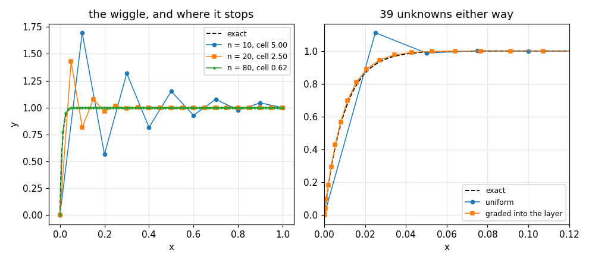

# 75. Boundary Value Problems

**Part 10: Ordinary Differential Equations**

## Learning objectives

By the end of this lesson you will be able to:

1. Turn a two point boundary value problem into a root finding problem by shooting, and solve a
   linear one with two initial value solves and no iteration.
2. Measure shooting's ill conditioning against its closed form, and see it destroy every digit.
3. Build the finite difference system, solve it in $O(n)$, and confirm second order.
4. Recognise a problem with no solution, and see how each method reports it.
5. Handle unequal grids, cell number oscillations and boundary layers, and know which norm to
   trust when measuring the truncation error.

## Prerequisites

Lessons 67 to 74 (the initial value solvers used inside shooting). Lesson 10 (the secant method).
Lesson 22 (the Thomas algorithm for tridiagonal systems). Lesson 20 (condition numbers). Lesson 61
(finite difference formulas, including on unequal grids).

---

## 1. What changes

Every method so far marched. It knew everything at $t_0$ and stepped forward.

A boundary value problem gives you part of the information at $a$ and part at $b$:

$$
y'' = f(x, y, y'), \qquad y(a) = \alpha, \quad y(b) = \beta.
$$

There is nothing to march from, so the whole solution has to be found at once, or the missing
initial condition has to be guessed.

Two consequences follow immediately, and neither has an analogue in Part 10 so far.

**A boundary value problem can have no solution, or infinitely many.** $y'' + \pi^2 y = 0$ with
$y(0) = y(1) = 0$ has a whole family of solutions $c\sin(\pi x)$; add a source term and it has
none. No Lipschitz condition rules that out, because the theorem it would come from does not
exist.

**The problem can be far worse conditioned than the equation.** That is section 3.

## 2. Shooting

Guess the missing initial slope $s$, solve the initial value problem, and see where you land:

$$
F(s) = y(b; s) - \beta.
$$

That is a root finding problem in one unknown, so lessons 8 to 12 apply, and every solver of
lessons 67 to 74 works inside it.

For a **linear** problem the map $s \mapsto y(b; s)$ is affine, so two solves determine it exactly
and no iteration is needed.

```python
# Standard setup, the same in every lesson of this course.
import sys, pathlib

_root = pathlib.Path.cwd()
while not (_root / "src" / "nalib").is_dir() and _root != _root.parent:
    _root = _root.parent
sys.path.insert(0, str(_root / "src"))

import numpy as np
import matplotlib.pyplot as plt

SEED = 42                                  # fixed so your numbers match the text
rng = np.random.default_rng(SEED)

np.set_printoptions(precision=6, linewidth=100, suppress=False)
plt.rcParams.update({
    "figure.figsize": (7.5, 4.5), "figure.dpi": 110,
    "axes.grid": True, "grid.alpha": 0.3, "font.size": 10,
})
```

```python
from nalib import bvp

problem = bvp.textbook_linear_problem()
out = bvp.linear_shooting(problem["p"], problem["q"], problem["r"], problem["a"],
                          problem["b"], problem["alpha"], problem["beta"], 200)
error = float(np.max(np.abs(out["y"] - problem["exact"](out["x"]))))
print(f"iterations: {out['iterations']}, initial slope found: {out['slope']:.10f}")
print(f"y(a) = {out['y'][0]:.10f}, y(b) = {out['y'][-1]:.10f}")
print(f"largest error against the exact solution: {error:.3e}")
```

*Output:*

```text
iterations: 0, initial slope found: 0.9176210395
y(a) = 1.0000000000, y(b) = 2.0000000000
largest error against the exact solution: 6.755e-13
```

For a **nonlinear** problem, use the secant method. It is the right root finder here because each
evaluation of $F$ costs a whole initial value solve, so a derivative would cost another one.

```python
from nalib import ivp

nonlinear = bvp.textbook_nonlinear_problem()

def system(t, state):
    return np.asarray([state[1], nonlinear["f"](t, state[0], state[1])])

out = bvp.shooting(system, nonlinear["a"], nonlinear["b"], nonlinear["alpha"],
                   nonlinear["beta"])
print(f"converged in {out['iterations']} secant steps, {out['solves']} solves")
print(f"slope found {out['slope']:.10f}, exact slope is 2 - 16 = -14")
print(f"largest error: {float(np.max(np.abs(out['y'] - nonlinear['exact'](out['x'])))):.3e}\n")
print(f"{'guess':>16}{'miss':>16}")
for g, m in zip(out["guess_history"], out["miss_history"]):
    print(f"{g:>16.10f}{m:>16.3e}")
```

*Output:*

```text
converged in 6 secant steps, 8 solves
slope found -14.0000000164, exact slope is 2 - 16 = -14
largest error: 5.388e-09

           guess            miss
   -1.3333333333       6.146e+00
    1.0000000000       7.080e+00
  -16.6826477168      -1.666e+00
  -13.3148019778       3.978e-01
  -13.9639779384       2.117e-02
  -14.0004674570      -2.749e-04
  -13.9999996949       1.891e-07
  -14.0000000164       1.695e-12
```

## 3. Why shooting fails

The sensitivity of the far boundary to the initial slope is the homogeneous solution evaluated at
$b$. For $y'' = \lambda^2 y$ on $[0,1]$ that is $\sinh(\lambda)/\lambda$, which grows like
$e^\lambda / (2\lambda)$.

```python
out = bvp.shooting_amplifies_the_guess()
print(f"{'rate':>6}{'measured sensitivity':>24}{'sinh(lam)/lam':>20}"
      f"{'shooting error':>17}{'floor from roundoff':>22}")
for r, m, c, e, f in zip(out["rate"], out["measured_sensitivity"],
                         out["closed_form_sensitivity"], out["shooting_error"],
                         out["unavoidable_slope_error"]):
    print(f"{r:>6.0f}{m:>24.6e}{c:>20.6e}{e:>17.3e}{f:>22.3e}")
print(f"\ngrows exponentially: {out['grows_exponentially']}")
assert out["grows_exponentially"]
for got, want in zip(out["measured_sensitivity"], out["closed_form_sensitivity"]):
    assert abs(got - want) < 1e-6 * abs(want), "measured against sinh(lam)/lam"
```

*Output:*

```text
  rate    measured sensitivity       sinh(lam)/lam   shooting error   floor from roundoff
     1            1.175201e+00        1.175201e+00        4.496e-15             2.609e-16
     5            1.484064e+01        1.484064e+01        1.201e-13             3.295e-15
    10            1.101323e+03        1.101323e+03        6.248e-12             2.445e-13
    20            1.212913e+07        1.212913e+07        9.133e-08             2.693e-09
    30            1.781079e+11        1.781079e+11        1.465e-03             3.955e-05
    40            2.942316e+15        2.942316e+15        3.200e+01             6.533e-01

grows exponentially: True
```

The measured sensitivity matches the closed form to seven digits, which is the check that the
right quantity is being measured.

Then read the last two columns. At $\lambda = 40$ the sensitivity is $2.9\times10^{15}$, which is
larger than $1/\varepsilon$: **no double precision initial slope exists that hits the target**,
and the error is 32, which is more than the solution's whole range.

The failure is in the reformulation. The boundary value problem is perfectly well conditioned; the
initial value problem you turned it into is not, and nothing about the integrator or the root
finder can help.

```python
out = bvp.shooting_against_finite_differences()
print(f"{'rate':>6}{'shooting':>15}{'finite differences':>21}{'amplification':>17}")
for r, se, fe, am in zip(out["rate"], out["shooting_error"],
                         out["finite_difference_error"], out["amplification"]):
    print(f"{r:>6.0f}{se:>15.3e}{fe:>21.3e}{am:>17.3e}")
print(f"\nfinite differences grow with an exponent of "
      f"{out['finite_difference_exponent_in_the_rate']:.3f} in the rate")
print(f"shooting wins at the smallest rate: {out['shooting_wins_at_the_smallest_rate']}, "
      f"crossover at rate {out['crossover_rate']:.0f}")
```

*Output:*

```text
  rate       shooting   finite differences    amplification
     1      3.408e-14            2.764e-08        1.175e+00
     5      7.544e-11            2.389e-06        1.484e+01
    10      1.223e-09            9.580e-06        1.101e+03
    20      2.960e-08            3.831e-05        1.213e+07
    30      4.883e-04            8.615e-05        1.781e+11
    40      1.600e+01            1.531e-04        2.942e+15

finite differences grow with an exponent of 1.999 in the rate
shooting wins at the smallest rate: True, crossover at rate 30
```

**Finite differences are not immune**, which is worth being clear about. The solution has a layer
of width $1/\lambda$, so a uniform grid resolves it worse as $\lambda$ grows and the error rises
with a fitted exponent of $2.00$. What they avoid is the **exponential** growth.

So the comparison is polynomial against exponential, not robust against fragile. And shooting is
the more accurate method at small $\lambda$, because RK4 is fourth order and central differences
are second.

### 3.1 Multiple shooting

The amplification over a piece of length $L$ is about $e^{\lambda L}$. Cut the interval into $k$
pieces and it falls to $e^{\lambda/k}$, with the states at the interior break points as extra
unknowns and continuity as extra equations.

```python
out = bvp.multiple_shooting_recovers_it()
print(f"{'pieces':>8}{'amplification per piece':>26}{'error':>14}{'converged':>12}")
for k, a, e, c in zip(out["pieces"], out["amplification_per_piece"], out["error"],
                      out["converged"]):
    print(f"{k:>8}{a:>26.3e}{e:>14.3e}{str(c):>12}")
print(f"\nthe first split gains a factor of {out['gain_from_the_first_split']:.3e}")
print(f"{out['enough_pieces']} pieces is enough")
```

*Output:*

```text
  pieces   amplification per piece         error   converged
       1                 1.069e+13     2.404e-04        True
       2                 3.269e+06     1.571e-10        True
       4                 1.808e+03     1.571e-10        True
       8                 4.252e+01     1.571e-10        True
      16                 6.521e+00     1.571e-10        True

the first split gains a factor of 1.530e+06
2 pieces is enough
```

**One extra piece recovers six orders of magnitude and the rest change nothing**, because by then
the amplification is no longer what limits the answer and RK4's own discretisation error is.

With one piece it is shooting and with a piece per node it is a finite difference method, so this
is where the two halves of the lesson meet.

## 4. Finite differences

Replace the derivatives by central differences at every interior node:

$$
\frac{y_{i-1} - 2y_i + y_{i+1}}{h^2}
= p_i \frac{y_{i+1} - y_{i-1}}{2h} + q_i y_i + r_i,
$$

giving a **tridiagonal** system, solved by the Thomas algorithm in $O(n)$. There is no marching,
no iteration, and nothing to amplify.

```python
out = bvp.order_of_finite_differences()
print(f"{'n':>7}{'h':>12}{'error':>14}{'ratio':>9}")
for i, (n, h, e) in enumerate(zip(out["n"], out["h"], out["error"])):
    ratio = "" if i == 0 else f"{out['ratio_per_halving'][i - 1]:.3f}"
    print(f"{n:>7}{h:>12.5f}{e:>14.4e}{ratio:>9}")
print(f"\nfitted order {out['fitted_order']:.4f}, second order: {out['second_order']}")
```

*Output:*

```text
      n           h         error    ratio
     10     0.10000    4.5494e-05         
     20     0.05000    1.1424e-05    3.982
     40     0.02500    2.8593e-06    3.995
     80     0.01250    7.1560e-07    3.996
    160     0.00625    1.7891e-07    4.000
    320     0.00313    4.4729e-08    4.000

fitted order 1.9983, second order: True
```

For a **nonlinear** problem the system is nonlinear, and Newton's method on it has a tridiagonal
Jacobian, so each Newton step is another $O(n)$ solve.

```python
out = bvp.newton_squares_the_residual()
print(f"roundoff floor for this grid: {out['roundoff_floor']:.3e}\n")
print(f"{'step':>6}{'Newton residual':>18}{'chord residual':>18}")
for k in range(max(len(out["residuals"]), 0)):
    chord = (f"{out['chord_residuals'][k]:.3e}"
             if k < len(out["chord_residuals"]) else "")
    print(f"{k:>6}{out['residuals'][k]:>18.3e}{chord:>18}")
print(f"\nNewton: {out['iterations']} steps, quadratic: {out['quadratic']}")
print(f"chord:  {out['chord_iterations']} steps, linear with ratio "
      f"{out['chord_ratio']:.4f}: {out['chord_is_linear']}")
print(f"both reach the same answer: {out['both_reach_the_same_answer']}, "
      f"error {out['error']:.3e}")
```

*Output:*

```text
roundoff floor for this grid: 1.510e-12

  step   Newton residual    chord residual
     0         1.282e+01         1.282e+01
     1         1.848e+00         1.848e+00
     2         5.746e-03         1.802e-01
     3         4.119e-08         1.997e-02
     4         1.027e-12         2.105e-03
     5         1.027e-12         2.367e-04

Newton: 5 steps, quadratic: True
chord:  18 steps, linear with ratio 0.1085: True
both reach the same answer: True, error 6.138e-04
```

The comparison run freezes the Jacobian at the initial guess, which is the chord method. It
reaches the same answer, linearly, in four times as many iterations. **A wrong Jacobian still
converges**, so measuring the rate is the only way to catch one.

The residual cannot be driven below $1.5\times10^{-12}$ here, because the operator divides by
$h^2$ and $\varepsilon\lvert y\rvert/h^2$ is that big. A tolerance below the floor would never be
met, so the iteration also stops when the residual stops falling.

## 5. When there is no solution

$y'' + ky = 1$ with $y(0) = y(1) = 0$ has no solution when $k = \pi^2$. Watch each method meet it.

```python
out = bvp.existence_can_fail()
print(f"continuous resonance pi^2 = {out['resonance']:.10f}")
print(f"discrete resonance          {out['discrete_resonance']:.10f}")
print(f"shift {out['shift']:.6e}, predicted {out['predicted_shift']:.6e}\n")
print(f"{'k':>12}{'condition number':>19}{'largest |y|':>15}"
      f"{'gap to the discrete':>22}{'cond x gap':>14}")
for k, c, v, g in zip(out["coefficient"], out["condition_number"], out["largest_value"],
                      out["distance_from_the_discrete_resonance"]):
    print(f"{k:>12.6f}{c:>19.4e}{v:>15.4e}{g:>22.4e}{c * g:>14.4e}")
print(f"\ncondition grows like 1/gap: {out['condition_grows_like_one_over_the_gap']}")
print(f"spread of cond x gap using the discrete resonance: "
      f"{out['spread_using_the_discrete_resonance']:.4f}")
print(f"spread using pi^2 instead:                         "
      f"{out['spread_using_pi_squared']:.4f}")
```

*Output:*

```text
continuous resonance pi^2 = 9.8696044011
discrete resonance          9.8694014672
shift 2.029339e-04, predicted 2.029356e-04

           k   condition number    largest |y|   gap to the discrete    cond x gap
    5.000000         3.2855e+04     2.5720e-01            4.8694e+00    1.5999e+05
    9.000000         1.8401e+05     1.4600e+00            8.6940e-01    1.5998e+05
    9.800000         2.3051e+06     1.8341e+01            6.9401e-02    1.5998e+05
    9.859401         1.5998e+07     1.2732e+02            1.0000e-02    1.5998e+05
    9.869301         1.5998e+09     1.2732e+04            1.0000e-04    1.5998e+05
   12.000000         7.5086e+04     6.0229e-01            2.1306e+00    1.5998e+05

condition grows like 1/gap: True
spread of cond x gap using the discrete resonance: 1.0000
spread using pi^2 instead:                         3.0286
```

Two things worth having.

**Finite differences announce it as a condition number**, which rises from $10^{5}$ to $10^{9}$ as
$k$ approaches the resonance. That is the honest warning: the answer near the resonance is
meaningless and the condition number says so.

**The discrete problem resonates in a different place.** The matrix is singular at
$(4/h^2)\sin^2(\pi h/2) = \pi^2(1 - (\pi h)^2/12 + \dots)$, below $\pi^2$ by $O(h^2)$. Measuring
the gap from $\pi^2$ makes the $1/\text{gap}$ law look broken, spreading the product by 3.03;
measuring from the discrete value gives a spread of exactly $1.000$.

Shooting meets the same problem quite differently.

```python
out = bvp.at_a_resonance_refining_makes_it_worse()
print(f"{'steps':>8}{'relative v(b)':>17}{'correction weight':>21}{'largest |y|':>16}"
      f"{'flagged':>10}")
for s, e, w, v, f in zip(out["steps"], out["relative_end_value"],
                         out["correction_weight"], out["largest_value"], out["flagged"]):
    print(f"{s:>8}{e:>17.3e}{w:>21.3e}{v:>16.3e}{str(f):>10}")
print(f"\nthe end value falls with order {out['end_value_order']:.3f}, which is RK4's")
print(f"the answer grows with refinement: {out['answer_grows_with_refinement']}")
assert out["answer_grows_with_refinement"], "more work, worse answer"
assert out["every_run_is_flagged"], "and the only warning is the reported v(b)"
```

*Output:*

```text
   steps    relative v(b)    correction weight     largest |y|   flagged
     100        2.549e-08            2.497e+07       7.949e+06      True
     200        1.594e-09            3.995e+08       1.272e+08      True
     400        9.961e-11            6.391e+09       2.034e+09      True
     800        6.226e-12            1.023e+11       3.255e+10      True
    1600        3.905e-13            1.630e+12       5.189e+11      True

the end value falls with order 3.999, which is RK4's
the answer grows with refinement: True
```

**It does not divide by zero.** The homogeneous solution vanishes at $b$ in exact arithmetic, so
what the integrator returns instead is its own $O(h^4)$ truncation error. The correction is
divided by a number that **shrinks as the step is refined**, and the answer grows from $8\times
10^6$ to $5\times10^{11}$ across the sweep.

More work, worse answer, and nothing in the run complains. The only protection is checking the
relative size of $v(b)$, which `linear_shooting` reports as `near_a_resonance`.

## 6. Unequal grids

The three point second difference on an unequal grid has truncation error
$(h_{\text{right}} - h_{\text{left}})\,y'''/3 + O(h^2)$, which is **first order** when the spacings
differ by $O(h)$. The solution error is second order anyway. That gap is called
**supraconvergence**.

```python
for pattern in ("alternating", "random", "uniform"):
    out = bvp.supraconvergence_on_an_unequal_grid(pattern=pattern)
    print(f"{pattern:>13}: truncation rms order {out['truncation_order']:.3f}, "
          f"max norm order {out['truncation_order_in_the_max_norm']:.3f}, "
          f"solution order {out['solution_order']:.3f}")
```

*Output:*

```text
  alternating: truncation rms order 0.991, max norm order 0.883, solution order 1.997
       random: truncation rms order 0.987, max norm order 0.636, solution order 2.012
      uniform: truncation rms order 1.979, max norm order 1.941, solution order 1.999
```

```python
out = bvp.supraconvergence_on_an_unequal_grid(pattern="alternating")
print(f"spacings alternate between 0.4h and 1.6h\n")
print(f"{'n':>7}{'h':>10}{'truncation max':>17}{'truncation rms':>17}{'solution':>14}")
for n, h, mx, rms, sol in zip(out["n"], out["h"], out["truncation_max"],
                              out["truncation_rms"], out["solution_error"]):
    print(f"{n:>7}{h:>10.5f}{mx:>17.4e}{rms:>17.4e}{sol:>14.4e}")
print(f"\nsolution beats consistency: {out['solution_beats_consistency']}")
print(f"the max norm hides the first order truncation: {out['the_max_norm_hides_it']}")
```

*Output:*

```text
spacings alternate between 0.4h and 1.6h

      n         h   truncation max   truncation rms      solution
     20   0.08000       4.3196e-03       2.3648e-03    2.3517e-05
     40   0.04000       2.7371e-03       1.2067e-03    5.9219e-06
     80   0.02000       1.5302e-03       6.0842e-04    1.4849e-06
    160   0.01000       8.0790e-04       3.0533e-04    3.7187e-07
    320   0.00500       4.1497e-04       1.5292e-04    9.2999e-08
    640   0.00250       2.1028e-04       7.6524e-05    2.3247e-08

solution beats consistency: True
the max norm hides the first order truncation: True
```

**Which norm you measure the truncation error in changes the answer.** The rms norm reads $0.99$
on both irregular patterns; the max norm reads $0.88$ and $0.62$, because it picks whichever node
has the largest $y'''$ and mixes the second order part of the error in.

The uniform row is the control: both orders are 2 there and there is nothing to explain.

## 7. Boundary layers, wiggles and where to put the nodes

For $\varepsilon y'' + y' = 0$ the off diagonal entries are $1/h^2 \mp p_i/(2h)$, and when
$h\lvert p\rvert > 2$ one of them changes sign. The matrix stops being an M-matrix and the
solution leaves the range of its own boundary values.

```python
out = bvp.oscillation_when_the_cell_number_is_too_big()
print(f"{'n':>7}{'h':>10}{'cell number':>14}{'overshoot':>13}{'wiggles':>10}"
      f"{'M-matrix':>11}{'error':>13}")
for n, h, c, o, w, m, e in zip(out["n"], out["h"], out["cell_number"], out["overshoot"],
                               out["wiggles"], out["is_an_m_matrix"], out["error"]):
    print(f"{n:>7}{h:>10.5f}{c:>14.3f}{o:>13.4e}{w:>10}{str(m):>11}{e:>13.3e}")
print(f"\novershoots exactly when the cell number exceeds 1: "
      f"{out['overshoots_exactly_when_the_cell_number_exceeds_one']}")
print(f"the M-matrix condition is the cell number: "
      f"{out['the_m_matrix_condition_is_the_cell_number']}")
```

*Output:*

```text
      n         h   cell number    overshoot   wiggles   M-matrix        error
     10   0.10000         5.000   6.9608e-01         9      False    6.961e-01
     20   0.05000         2.500   4.2857e-01        19      False    4.353e-01
     40   0.02500         1.250   1.1111e-01         9      False    1.932e-01
     80   0.01250         0.625   0.0000e+00         0       True    5.574e-02
    160   0.00625         0.312   0.0000e+00         0       True    1.213e-02
    320   0.00313         0.156   0.0000e+00         0       True    3.021e-03

overshoots exactly when the cell number exceeds 1: True
the M-matrix condition is the cell number: True
```

At $n = 10$ the computed values run $0, 1.70, 0.57, 1.32, 0.82, \dots$: a clean alternation about
the true answer, decaying inwards. The overshoot vanishes exactly when the cell number drops below
1, which is what the M-matrix condition predicts.

Two cures, and both cost something.

```python
out = bvp.upwinding_removes_the_wiggle()
print(f"{'n':>7}{'cell':>9}{'central':>13}{'upwind':>13}{'central over':>15}"
      f"{'upwind over':>14}{'resolved':>11}")
for n, c, ce, ue, co, uo, r in zip(out["n"], out["cell_number"], out["central_error"],
                                   out["upwind_error"], out["central_overshoot"],
                                   out["upwind_overshoot"], out["resolved"]):
    print(f"{n:>7}{c:>9.3f}{ce:>13.3e}{ue:>13.3e}{co:>15.3e}{uo:>14.3e}{str(r):>11}")
print(f"\norders where the layer is resolved: central {out['central_order']:.3f}, "
      f"upwind {out['upwind_order']:.3f}")
print(f"orders fitted over the whole sweep:  central "
      f"{out['central_order_over_the_whole_sweep']:.3f}, "
      f"upwind {out['upwind_order_over_the_whole_sweep']:.3f}")
print(f"fitting the whole sweep would be wrong: "
      f"{out['fitting_the_whole_sweep_would_be_wrong']}")
```

*Output:*

```text
      n     cell      central       upwind   central over   upwind over   resolved
     10    5.000    6.961e-01    9.086e-02      6.961e-01     0.000e+00      False
     20    2.500    4.353e-01    1.599e-01      4.286e-01     0.000e+00      False
     40    1.250    1.932e-01    2.036e-01      1.111e-01     0.000e+00      False
     80    0.625    5.574e-02    1.579e-01      0.000e+00     0.000e+00      False
    160    0.312    1.213e-02    9.219e-02      0.000e+00     0.000e+00      False
    320    0.156    3.021e-03    5.068e-02      0.000e+00     0.000e+00      False
    640    0.078    7.490e-04    2.698e-02      0.000e+00     0.000e+00       True
   1280    0.039    1.872e-04    1.392e-02      0.000e+00     0.000e+00       True
   2560    0.020    4.678e-05    7.071e-03      0.000e+00     0.000e+00       True

orders where the layer is resolved: central 2.000, upwind 0.966
orders fitted over the whole sweep:  central 1.820, upwind 0.546
fitting the whole sweep would be wrong: True
```

Upwinding never overshoots and is first order instead of second. It wins on the two coarsest
grids, loses from $n = 40$ onwards, and by $n = 2560$ it is **151 times worse**. A monotone wrong
answer is not automatically better than an oscillating one; which to prefer depends on whether the
wiggle would be fed into something that cannot take it, such as a logarithm or a reaction rate.

**The orders only appear once the layer is resolved.** Fitting the whole sweep gives 1.82 and
0.55, which is neither method's order; fitting the rows with a cell number below 0.1 gives 2.000
and 0.966. The head of the sweep is not a slow start, it is a different regime.

```python
for side in ("a", "b"):
    out = bvp.graded_grid_for_a_layer(towards=side)
    print(f"grading towards {side}: uniform error {out['uniform_error']:.4e}, "
          f"graded {out['graded_error']:.4e}, improvement {out['improvement']:.3f}x, "
          f"wins: {out['graded_wins']}")
print(f"\nsame number of unknowns either way: "
      f"{bvp.graded_grid_for_a_layer()['unknowns']}")
```

*Output:*

```text
grading towards a: uniform error 1.9320e-01, graded 1.8573e-02, improvement 10.402x, wins: True
grading towards b: uniform error 1.9320e-01, graded 5.1137e-01, improvement 0.378x, wins: False

same number of unknowns either way: 39
```

Grading the grid into the layer improves the error tenfold at the same node count. **Grading at
the wrong end makes it 2.6 times worse than not grading at all**, which is why the direction is an
explicit argument rather than a guess.

```python
fig, (left, right) = plt.subplots(1, 2, figsize=(9.0, 4.0))
layer = bvp.convection_diffusion_problem(0.01)
fine = np.linspace(0.0, 1.0, 2001)
left.plot(fine, layer["exact"](fine), "k--", lw=1.2, label="exact")
for n, style in ((10, "o-"), (20, "s-"), (80, ".-")):
    run = bvp.finite_difference_linear(layer["p"], layer["q"], layer["r"], 0.0, 1.0,
                                       0.0, 1.0, n)
    left.plot(run["x"], run["y"], style, markersize=4, lw=1.0,
              label=f"n = {n}, cell {1.0 / n / 0.02:.2f}")
left.set_xlabel("x"); left.set_ylabel("y"); left.set_title("the wiggle, and where it stops")
left.legend(fontsize=8)
graded = bvp.graded_grid_for_a_layer(towards="a")
right.plot(fine, layer["exact"](fine), "k--", lw=1.2, label="exact")
right.plot(graded["uniform_x"], graded["uniform_y"], "o-", markersize=4, lw=1.0,
           label="uniform")
right.plot(graded["graded_x"], graded["graded_y"], "s-", markersize=4, lw=1.0,
           label="graded into the layer")
right.set_xlim(0.0, 0.12); right.set_xlabel("x")
right.set_title("39 unknowns either way"); right.legend(fontsize=8)
fig.tight_layout(); fig.savefig("../figures/75_layer.png", dpi=110); plt.close(fig)
print("saved ../figures/75_layer.png")
```

*Output:*

```text
saved ../figures/75_layer.png
```



The left panel is the oscillation of section 7, decaying inwards from the layer and vanishing once
the cell number drops below 1. The right panel is zoomed into the first tenth of the interval,
where the uniform grid has three nodes and the graded one has fifteen, for the same total.

## 8. Cost

```python
out = bvp.cost_of_the_two_methods()
print(f"{'n':>7}{'FD evaluations':>17}{'FD error':>14}{'shooting evals':>17}"
      f"{'shooting error':>17}")
for n, fv, fe, sv, se in zip(out["n"], out["finite_difference_evaluations"],
                             out["finite_difference_error"],
                             out["shooting_evaluations"], out["shooting_error"]):
    print(f"{n:>7}{fv:>17}{fe:>14.3e}{sv:>17}{se:>17.3e}")
print(f"\n{out['note']}")
```

*Output:*

```text
      n   FD evaluations      FD error   shooting evals   shooting error
     20               38     9.502e-04              160        1.473e-05
     40               78     2.386e-04              320        8.288e-07
     80              158     5.970e-05              640        4.916e-08
    160              318     1.493e-05             1280        2.993e-09
    320              638     3.733e-06             2560        1.847e-10

shooting wins on a mild problem because RK4 is fourth order and central differences are second; it loses on a stiff one for reasons of conditioning, which no amount of order fixes
```

Shooting is more accurate on this mild problem and costs about four times as much per node. The
reason to prefer finite differences is the conditioning of section 3, not the cost.

## 9. Exercises

**Level 1, understanding**

1.1 Explain why a boundary value problem can have no solution while an initial value problem with
a Lipschitz right hand side always has exactly one.

1.2 Explain why linear shooting needs exactly two initial value solves and no iteration.

1.3 Say what the sensitivity $\partial y(b)/\partial s$ is, in terms of the homogeneous solution.

1.4 State the M-matrix condition on the cell number and say what it guarantees.

1.5 Explain what supraconvergence is and why it makes irregular meshes usable.

**Level 2, derivation**

2.1 Derive the linear shooting combination $y = u + \frac{\beta - u(b)}{v(b)}v$ and verify it
satisfies both boundary conditions.

2.2 Derive the sensitivity $\sinh(\lambda)/\lambda$ for $y'' = \lambda^2 y$ and find the largest
$\lambda$ for which double precision shooting can work.

2.3 Derive the three point second difference on an unequal grid and its truncation error.

2.4 Derive the condition $h\lvert p\rvert < 2$ from the requirement that both off diagonals be
positive, and connect it to the discrete maximum principle.

2.5 Derive the discrete resonance $(4/h^2)\sin^2(\pi h/2)$ and expand it to show the $O(h^2)$
shift.

**Level 3, computational**

3.1 Implement Newton shooting using the variational equation for $F'(s)$ and compare its cost per
digit against the secant method.

3.2 Implement finite differences for a mixed boundary condition $\alpha_1 y(a) + \alpha_2 y'(a) =
\gamma$ and verify second order.

3.3 Implement a Sturm-Liouville eigenvalue solver by finite differences and compare the computed
eigenvalues against $(m\pi)^2$.

3.4 Implement Richardson extrapolation on the finite difference solution and confirm it reaches
fourth order.

3.5 Implement a deferred correction scheme and compare against 3.4 at equal cost.

**Level 4, experimental**

4.1 Measure the largest $\lambda$ for which shooting still gives one correct digit, in single,
double and quadruple precision, and confirm the pattern.

4.2 Measure the optimal grading power for the boundary layer problem as a function of
$\varepsilon$, and compare against the Shishkin mesh.

4.3 Measure the crossover in section 3 as a function of the grid size $n$, and explain the shape.

**Level 5, advanced**

5.1 **Why supraconvergence happens.** Show that the first order part of the truncation error on an
irregular grid is a discrete divergence, and that applying the inverse operator to it recovers an
order.

5.2 **Shishkin meshes.** Derive the piecewise uniform mesh that gives an $\varepsilon$ independent
error bound for the convection diffusion problem, and say what it costs in implementation.

5.3 **Conditioning of the boundary value problem itself.** Define a condition number for the two
point problem, independent of the method, and use it to show that shooting's difficulty is a
property of the reformulation and not of the problem.

## 10. Key takeaways

- **A boundary value problem is a different kind of question.** It can have no solution or
  infinitely many, and no Lipschitz condition rules that out.

- **Linear shooting needs two solves and no iteration.** Nonlinear shooting needs the secant
  method, which converges in six or seven solves here.

- **Shooting's sensitivity is $\sinh(\lambda)/\lambda$**, measured to seven digits against the
  closed form. At $\lambda = 40$ it is $3\times10^{15}$ and no double precision slope hits the
  target.

- **Finite differences are polynomially sensitive, not immune**, with a fitted exponent of $2.00$
  in the growth rate. The comparison is polynomial against exponential.

- **Multiple shooting recovers it in one extra piece**, gaining six orders, and further splitting
  changes nothing.

- **At a resonance shooting divides by its own truncation error**, so refining the step makes the
  answer bigger. Finite differences report a condition number instead, and the resonance they see
  is below $\pi^2$ by $O(h^2)$.

- **Measure the truncation error in the rms norm.** On an irregular grid the max norm reads 0.62
  to 0.88 where the true order is 0.99, and the solution order is 2.00 either way.

- **Wiggles appear exactly when the cell number exceeds 1.** Upwinding removes them and costs an
  order, and it only pays on grids too coarse to resolve the layer.

- **Put the nodes where the solution varies.** Grading into the layer gains a factor of 10 at the
  same node count; grading away from it loses a factor of 2.6.

## Where this goes next

Lesson 76 stops asking for the solution at a set of points and asks for it as a **function**,
written in a basis. That gives two ways to fix the coefficients, collocation and Galerkin, and the
second one turns out to be the only formulation that exists at all when a coefficient jumps.
