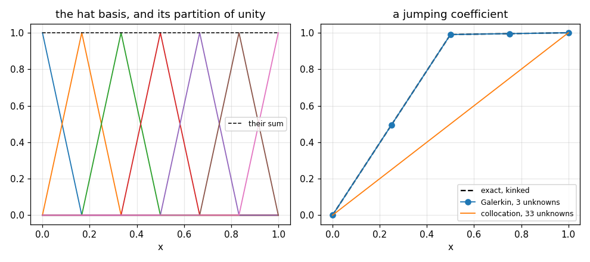

# 76. Collocation and Finite Elements

**Part 10: Ordinary Differential Equations**

## Learning objectives

By the end of this lesson you will be able to:

1. Write a solution in a basis and get equations for the coefficients two different ways.
2. Implement Chebyshev collocation and see it converge faster than any power.
3. Derive the weak form, implement Galerkin with hat functions, and assemble the system element by
   element.
4. Measure the error in the $L^2$ and energy norms and explain why they differ by one order.
5. Say what the weak form is really for, with a measurement that a smoothness argument alone does
   not give.

## Prerequisites

Lesson 75 (boundary value problems, finite differences and the tridiagonal solve). Lesson 65
(Gauss-Legendre quadrature, used for every element integral). Lesson 56 (Chebyshev polynomials).
Lesson 22 (the Thomas algorithm). Lesson 39 (piecewise polynomials).

---

## 1. A function, not a table of values

Lesson 75 asked for the solution at a set of points. Write it as a function instead:

$$
u_h(x) = \sum_{j} c_j \phi_j(x),
$$

for a basis $\{\phi_j\}$ you choose. Now the unknowns are the coefficients, and the differential
equation has to be turned into equations for them. Two ways to do that:

**Collocation** demands the equation hold exactly at $m$ chosen points. Obvious, needs no
integrals, and needs a basis smooth enough to differentiate twice.

**Galerkin** demands the residual be **orthogonal** to every basis function. That takes one
integration by parts, after which only first derivatives appear, so the basis can be merely
continuous.

## 2. Collocation with a global basis

Expand in Chebyshev polynomials on $[a, b]$, impose the equation at the interior Chebyshev-Lobatto
points and the boundary conditions at the two ends. The matrix is dense and unsymmetric.

```python
# Standard setup, the same in every lesson of this course.
import sys, pathlib

_root = pathlib.Path.cwd()
while not (_root / "src" / "nalib").is_dir() and _root != _root.parent:
    _root = _root.parent
sys.path.insert(0, str(_root / "src"))

import numpy as np
import matplotlib.pyplot as plt

SEED = 42                                  # fixed so your numbers match the text
rng = np.random.default_rng(SEED)

np.set_printoptions(precision=6, linewidth=100, suppress=False)
plt.rcParams.update({
    "figure.figsize": (7.5, 4.5), "figure.dpi": 110,
    "axes.grid": True, "grid.alpha": 0.3, "font.size": 10,
})
```

```python
from nalib import femode as fe

problem = fe.sine_problem(wavenumber=2)
probe = np.linspace(problem["a"], problem["b"], 1001)
want = problem["exact"](probe)
print(f"{'unknowns':>10}{'error':>14}{'ratio':>10}{'condition number':>19}{'symmetric':>12}")
last = None
for m in (4, 8, 12, 16, 20, 24):
    out = fe.collocation(problem["f"], problem["a"], problem["b"], problem["alpha"],
                         problem["beta"], m)
    error = float(np.max(np.abs(out["solution"](probe) - want)))
    ratio = "" if last is None else f"{last / error:.1f}"
    print(f"{out['unknowns']:>10}{error:>14.3e}{ratio:>10}{out['condition_number']:>19.3e}"
          f"{str(out['symmetric']):>12}")
    last = error
```

*Output:*

```text
  unknowns         error     ratio   condition number   symmetric
         5     3.291e-01                    1.365e+02       False
         9     6.024e-04     546.3          2.085e+03       False
        13     2.126e-07    2833.7          1.154e+04       False
        17     2.283e-11    9313.4          3.989e+04       False
        21     2.887e-15    7908.0          1.055e+05       False
        25     6.661e-16       4.3          2.345e+05       False
```

Read the ratio column: 546, 2834, 9313, 7908. Each extra four unknowns **multiplies** the
accuracy by thousands rather than adding to it, and the multiplier itself grows. That is spectral
convergence, faster than any fixed power of $1/m$, and it is what a global smooth basis buys on a
smooth problem.

The last row is the roundoff floor, where the ratio collapses to 4.3. Past 21 unknowns there is
nothing left to gain, and the condition number is still climbing.

The Chebyshev values and their two derivatives come from the recurrences

$$
T_{k+1} = 2tT_k - T_{k-1}, \qquad
T'_{k+1} = 2T_k + 2tT'_k - T'_{k-1}, \qquad
T''_{k+1} = 4T'_k + 2tT''_k - T''_{k-1},
$$

which are just the first one differentiated twice.

```python
theta = np.linspace(0.1, np.pi - 0.1, 5)
T, D1, D2 = fe.chebyshev_values(6, np.cos(theta))
print("T_k(cos theta) against cos(k theta):")
for k in (0, 2, 4, 6):
    print(f"  k = {k}: largest gap {float(np.max(np.abs(T[k] - np.cos(k * theta)))):.3e}")
```

*Output:*

```text
T_k(cos theta) against cos(k theta):
  k = 0: largest gap 0.000e+00
  k = 2: largest gap 2.220e-16
  k = 4: largest gap 8.882e-16
  k = 6: largest gap 2.220e-15
```

## 3. The weak form

Multiply $-(ku')' + cu = f$ by a test function $v$ vanishing at the boundary and integrate:

$$
-\int_a^b (ku')'v\,dx + \int_a^b cuv\,dx = \int_a^b fv\,dx.
$$

Integrate the first term by parts. The boundary term vanishes because $v$ does, leaving

$$
\int_a^b k u'v'\,dx + \int_a^b cuv\,dx = \int_a^b fv\,dx.
$$

**Only first derivatives appear.** That is the whole point of the manoeuvre, and it has two
consequences: the basis needs only one derivative, and $k$ is never differentiated.

Galerkin takes $v$ to be each basis function in turn, which is the same as demanding the residual
be orthogonal to the space.

```python
out = fe.galerkin_orthogonality()
print(f"worst relative residual against a basis function: {out['worst']:.3e}")
print(f"orthogonal: {out['orthogonal']}")
```

*Output:*

```text
worst relative residual against a basis function: 4.096e-15
orthogonal: True
```

Reported **relative to the size of the individual terms**, so a cancellation is not mistaken for
smallness. Galerkin does not make the residual small; it makes it invisible to the test space,
which is a weaker and different thing, and the whole error analysis follows from it.

## 4. Hat functions and assembly

The simplest basis that is continuous, has a square integrable derivative, and has **small
support**: $\phi_i$ is 1 at node $i$, 0 at every other node, and linear in between.

```python
def partition_of_unity(nodes, x):
    """Add up every hat function on the grid; the answer must be 1 everywhere."""
    grid = np.asarray(nodes, dtype=float)
    return sum(fe.hat(grid, i, x) for i in range(grid.size))

nodes = np.linspace(0.0, 1.0, 6)
x = np.linspace(0.0, 1.0, 9)
print("phi_2 on a grid of 6 nodes:")
print(f"  at the nodes: {fe.hat(nodes, 2, nodes)}")
print(f"  its derivative: {fe.hat_derivative(nodes, 2, x)}")
total = partition_of_unity(nodes, x)
print(f"\nthe hats sum to 1 everywhere: {np.allclose(total, 1.0)}")
assert np.allclose(total, 1.0), "which is what lets the basis represent a constant exactly"
```

*Output:*

```text
phi_2 on a grid of 6 nodes:
  at the nodes: [0. 0. 1. 0. 0. 0.]
  its derivative: [ 0.  0.  5.  5. -5.  0.  0.  0.  0.]

the hats sum to 1 everywhere: True
```

The derivative is piecewise constant and does not exist at the nodes. **The strong form cannot be
written down for a hat function at all**; the weak form can.

Only two hats are nonzero on any element, so everything one element contributes is 2 by 2. That is
the whole of assembly.

```python
local = fe.element_matrices(0.0, 0.25, k=lambda x: np.ones_like(x),
                            c=lambda x: np.ones_like(x),
                            f=lambda x: np.ones_like(x))
h = local["width"]
print(f"element [0, {h}]")
print(f"  stiffness: {local['stiffness'].tolist()}   (should be [[1,-1],[-1,1]]/h "
      f"= {(np.asarray([[1.0, -1.0], [-1.0, 1.0]]) / h).tolist()})")
print(f"  mass:      {local['mass'].tolist()}   (should be h/6 [[2,1],[1,2]] "
      f"= {(h / 6.0 * np.asarray([[2.0, 1.0], [1.0, 2.0]])).tolist()})")
print(f"  load:      {local['load'].tolist()}   (should be h/2 each = {h / 2.0})")
```

*Output:*

```text
element [0, 0.25]
  stiffness: [[4.0, -4.0], [-4.0, 4.0]]   (should be [[1,-1],[-1,1]]/h = [[4.0, -4.0], [-4.0, 4.0]])
  mass:      [[0.08333333333333331, 0.04166666666666667], [0.04166666666666667, 0.08333333333333331]]   (should be h/6 [[2,1],[1,2]] = [[0.08333333333333333, 0.041666666666666664], [0.041666666666666664, 0.08333333333333333]])
  load:      [0.12499999999999997, 0.125]   (should be h/2 each = 0.125)
```

### 4.1 The assembled matrix is the second difference

```python
out = fe.the_stiffness_matrix_is_the_second_difference()
print(f"{'n':>7}{'h':>10}{'|h*diag - 2|':>16}{'|h*offdiag + 1|':>19}"
      f"{'|load - h| for f = 1':>23}")
for n, h, d, o, l in zip(out["n"], out["h"], out["diagonal_gap"],
                         out["off_diagonal_gap"], out["load_gap_for_constant_f"]):
    print(f"{n:>7}{h:>10.5f}{d:>16.3e}{o:>19.3e}{l:>23.3e}")
print(f"\nthe same matrix: {out['same_matrix']}")
```

*Output:*

```text
      n         h    |h*diag - 2|    |h*offdiag + 1|   |load - h| for f = 1
      5   0.25000       0.000e+00          0.000e+00              5.551e-17
      9   0.12500       0.000e+00          0.000e+00              2.776e-17
     17   0.06250       0.000e+00          0.000e+00              1.388e-17
     33   0.03125       0.000e+00          0.000e+00              2.429e-17
     65   0.01562       0.000e+00          0.000e+00              1.214e-17

the same matrix: True
```

**Exactly zero.** On a uniform grid with $k = 1$ the assembled stiffness matrix **is** the second
difference of lesson 75, entry for entry. Finite elements and finite differences produce the same
matrix here.

What differs is the right hand side: finite differences use $hf(x_i)$ and Galerkin uses
$\int f\phi_i$, a weighted average over two elements.

```python
out = fe.the_load_vector_is_what_differs()
print(f"{'n':>7}{'h':>10}{'|difference|':>16}{'relative':>13}")
for n, h, d, r in zip(out["n"], out["h"], out["difference"], out["relative"]):
    print(f"{n:>7}{h:>10.5f}{d:>16.3e}{r:>13.3e}")
print(f"\nfitted order per entry: {out['fitted_order']:.3f}")
```

*Output:*

```text
      n         h    |difference|     relative
      9   0.12500       1.226e+00    1.104e-01
     17   0.06250       1.587e-01    2.858e-02
     33   0.03125       2.001e-02    7.208e-03
     65   0.01562       2.506e-03    1.806e-03
    129   0.00781       3.135e-04    4.517e-04

fitted order per entry: 2.985
```

Third order per entry, so second order after dividing by $h$, which is the order both methods
already have. **They have the same order and different constants**, and neither is a special case
of the other.

## 5. Nodal exactness, and why it is not a general fact

```python
out = fe.nodal_exactness()
print(f"{'n':>7}{'uniform grid':>16}{'irregular grid':>18}{'with a c u term':>19}")
for n, u, i, r in zip(out["n"], out["uniform_nodal_error"],
                      out["irregular_nodal_error"], out["with_reaction_nodal_error"]):
    print(f"{n:>7}{u:>16.3e}{i:>18.3e}{r:>19.3e}")
print(f"\nexact on a uniform grid: {out['exact_on_a_uniform_grid']}")
print(f"exact on an irregular grid: {out['exact_on_an_irregular_grid']}")
print(f"the reaction term destroys it: {out['reaction_term_destroys_it']}, "
      f"leaving order {out['reaction_order']:.3f}")
```

*Output:*

```text
      n    uniform grid    irregular grid    with a c u term
      5       1.225e-16         1.221e-15          4.601e-03
      9       1.225e-16         7.772e-16          1.174e-03
     17       3.053e-16         4.441e-16          2.951e-04
     33       3.109e-15         2.109e-15          7.386e-05
     65       9.326e-15         4.885e-15          1.847e-05

exact on a uniform grid: True
exact on an irregular grid: True
the reaction term destroys it: True, leaving order 1.991
```

For $-u'' = f$ the piecewise linear Galerkin answer is **exact at the nodes**, to machine
precision, on a uniform grid and an irregular one alike.

The reason is that the Green's function of $-d^2/dx^2$ is piecewise linear with a kink at the
source point, so it lies **in the finite element space** whenever the source sits at a node.
Adding $cu$ makes the Green's function a hyperbolic sine, which does not, and the last column is
ordinary second order convergence.

**This is a property of the operator, not of the method.** Quoting it as a general advantage of
finite elements would be wrong.

## 6. Two norms, two orders

```python
out = fe.orders_in_two_norms()
print(f"{'n':>7}{'h':>10}{'L2 error':>14}{'energy error':>16}{'nodal error':>15}")
for n, h, l2, en, nd in zip(out["n"], out["h"], out["l2_error"], out["energy_error"],
                            out["nodal_error"]):
    print(f"{n:>7}{h:>10.5f}{l2:>14.3e}{en:>16.3e}{nd:>15.3e}")
print(f"\nL2 order {out['l2_order']:.4f}, energy order {out['energy_order']:.4f}, "
      f"they differ by one: {out['they_differ_by_one']}")
assert out["l2_is_second_order"] and out["energy_is_first_order"]
assert out["they_differ_by_one"], "differentiating a piecewise linear fit costs an order"
```

*Output:*

```text
      n         h      L2 error    energy error    nodal error
      9   0.12500     9.921e-03       2.512e-01      1.225e-16
     17   0.06250     2.487e-03       1.258e-01      3.053e-16
     33   0.03125     6.220e-04       6.295e-02      3.109e-15
     65   0.01562     1.555e-04       3.148e-02      9.326e-15
    129   0.00781     3.888e-05       1.574e-02      8.771e-15
    257   0.00391     9.721e-06       7.870e-03      3.464e-14

L2 order 1.9992, energy order 0.9994, they differ by one: True
```

Piecewise linear elements are **second order in $L^2$ and first order in the energy norm**. Both
are correct statements about the same method, and they differ by one because the energy norm
measures the derivative and differentiating a piecewise linear approximation costs an order.

Quoting one of them as "the" order is the usual mistake. A temperature wants $L^2$ and a heat flux
wants the energy norm.

The nodal column is the third answer: at roundoff for every grid, so it reports nothing about the
order of anything. **Three norms, three different stories, one method.**

## 7. Symmetry, conditioning and quadrature

```python
out = fe.the_matrix_is_symmetric_positive_definite()
print(f"{'n':>7}{'h':>10}{'asymmetry':>13}{'smallest eigenvalue':>22}"
      f"{'condition number':>19}")
for n, h, a, e, c in zip(out["n"], out["h"], out["asymmetry"],
                         out["smallest_eigenvalue"], out["condition_number"]):
    print(f"{n:>7}{h:>10.5f}{a:>13.3e}{e:>22.4f}{c:>19.2f}")
print(f"\nsymmetric: {out['symmetric']}, positive definite: {out['positive_definite']}")
print(f"condition number grows with order {out['condition_order']:.3f} in h")
```

*Output:*

```text
      n         h    asymmetry   smallest eigenvalue   condition number
      9   0.12500    0.000e+00                1.2179              25.27
     17   0.06250    0.000e+00                0.6149             103.09
     33   0.03125    0.000e+00                0.3082             414.35
     65   0.01562    0.000e+00                0.1542            1659.38

symmetric: True, positive definite: True
condition number grows with order -2.012 in h
```

Symmetric because the bilinear form is, positive definite because the energy of a nonzero function
is positive. Together they mean Cholesky, or conjugate gradients with none of Part 5's worries
about nonsymmetric Krylov methods.

The condition number grows like $h^{-2}$, the same as every second order differential operator
discretised any way at all.

```python
out = fe.quadrature_that_is_too_crude()
print(f"{'n':>7}{'1 point':>14}{'2 point':>14}{'exact':>14}")
for n, a, b, c in zip(out["n"], out["one_point_error"], out["two_point_error"],
                      out["exact_error"]):
    print(f"{n:>7}{a:>14.3e}{b:>14.3e}{c:>14.3e}")
print(f"\norders: one point {out['one_point_order']:.3f}, "
      f"two point {out['two_point_order']:.3f}, exact {out['exact_order']:.3f}")
print(f"one point keeps the order: {out['one_point_keeps_the_order']}")
```

*Output:*

```text
      n       1 point       2 point         exact
      9     2.158e-01     1.486e-01     1.509e-01
     17     5.619e-02     3.912e-02     3.928e-02
     33     1.418e-02     9.910e-03     9.921e-03
     65     3.553e-03     2.486e-03     2.487e-03
    129     8.888e-04     6.220e-04     6.220e-04

orders: one point 1.983, two point 1.978, exact 1.983
one point keeps the order: True
```

**Crude quadrature costs a constant, not an order.** The one point rule is 43 per cent worse
throughout and converges at the same rate; the two point rule is indistinguishable from exact
integration. That is Strang's first lemma: a rule exact for degree $2m-2$ keeps the order of
degree $m$ elements, which for linear elements is degree 0.

## 8. What the weak form is really for

The usual argument is that the weak form lowers the smoothness needed from the basis. True, and
not the sharpest version.

Take $-(ku')' = 0$ with $k$ jumping from 1 to 100 at $x = 1/2$, $u(0) = 0$, $u(1) = 1$. The flux
$ku'$ is constant, so the solution is piecewise linear with a **kink** at the interface.

```python
problem = fe.jumping_coefficient_problem(1.0, 100.0, 0.5)
x = np.asarray([0.0, 0.25, 0.5, 0.75, 1.0])
print(f"exact solution at {x}: {problem['exact'](x)}")
print(f"flux k u' is constant at {problem['flux']:.6f}: "
      f"{np.allclose(problem['k'](np.asarray([0.2, 0.8])) * problem['exact_derivative'](np.asarray([0.2, 0.8])), problem['flux'])}")
```

*Output:*

```text
exact solution at [0.   0.25 0.5  0.75 1.  ]: [0.       0.49505  0.990099 0.99505  1.      ]
flux k u' is constant at 1.980198: True
```

```python
out = fe.a_jumping_coefficient()
print(f"{'n':>7}{'node on the interface':>24}{'aligned error':>16}{'offset error':>15}")
for n, on, a, o in zip(out["n"], out["interface_on_a_node"], out["aligned_error"],
                       out["offset_error"]):
    print(f"{n:>7}{str(on):>24}{a:>16.3e}{o:>15.3e}")
print(f"\naligned is exact: {out['aligned_is_exact']}, offset is not: {out['offset_is_not']}")
print(f"offset order {out['offset_order']:.3f}, ratio between them {out['ratio']:.3e}")
```

*Output:*

```text
      n   node on the interface   aligned error   offset error

      5                    True       2.220e-16      1.901e-01
      9                    True       2.220e-16      1.057e-01
     17                    True       1.110e-15      5.595e-02
     33                    True       1.110e-15      2.883e-02
     65                    True       5.773e-15      1.464e-02

aligned is exact: True, offset is not: True
offset order 0.927, ratio between them 3.293e+13
```

With a node on the interface the answer is **exact**, because the kinked solution lies in the
space. With the interface inside an element no piecewise linear function on that mesh has a kink
in the right place, and the error is first order and $10^{13}$ times larger. **The practical rule
is: put a node on the interface.**

Now the same problem by collocation.

```python
out = fe.collocation_cannot_do_a_kink()
print(f"{'unknowns':>10}{'collocation error':>20}")
for u, e in zip(out["unknowns"], out["collocation_error"]):
    print(f"{u:>10}{e:>20.6f}")
print(f"\nGalerkin with {out['galerkin_unknowns']} unknowns: {out['galerkin_error']:.3e}")
print(f"collocation stalls: {out['collocation_stalls']}, "
      f"Galerkin wins by {out['how_much_better']:.3e}")
assert out["collocation_stalls"], "no convergence at all: the strong form does not exist"
assert float(np.ptp(out["collocation_error"])) < 1e-10, "every degree returns the same answer"
```

*Output:*

```text
  unknowns   collocation error
         5            0.490099
         9            0.490099
        17            0.490099
        33            0.490099
        65            0.490099

Galerkin with 3 unknowns: 2.220e-16
collocation stalls: True, Galerkin wins by 2.207e+15
```

**The error does not move at all**, from 5 unknowns to 65. It is not slow convergence.

Collocation works from the strong form, which expanded is $-ku'' - k'u' + cu = f$. When $k$ jumps,
$k'$ is a delta function and **the strong form does not exist**. What gets imposed instead is
$-ku'' = 0$, whose solution is the straight line from 0 to 1, and every degree returns it exactly.
The 0.4901 is the gap between that line and the true kinked solution.

Galerkin never forms $k'$. The integration by parts moved one derivative onto the test function,
leaving $\int ku'v'$, which needs only $k$ itself.

**That is what the weak form is for.** Not a trick for lowering the smoothness requirement on the
basis: the only formulation that has a solution at all when the coefficient is not
differentiable, which in every real material problem it is not.

```python
fig, (left, right) = plt.subplots(1, 2, figsize=(9.0, 4.0))
nodes = np.linspace(0.0, 1.0, 7)
fine = np.linspace(0.0, 1.0, 601)
for i in range(nodes.size):
    left.plot(fine, fe.hat(nodes, i, fine), lw=1.2)
left.plot(fine, partition_of_unity(nodes, fine), "k--", lw=1.0, label="their sum")
left.set_xlabel("x"); left.set_title("the hat basis, and its partition of unity")
left.legend(fontsize=8)
jump = fe.jumping_coefficient_problem(1.0, 100.0, 0.5)
probe = np.linspace(0.0, 1.0, 1001)
right.plot(probe, jump["exact"](probe), "k--", lw=1.5, label="exact, kinked")
grid = np.linspace(0.0, 1.0, 5)
element = fe.galerkin(grid, jump["f"], k=jump["k"], alpha=0.0, beta=1.0, order=8)
right.plot(grid, element["u"], "o-", lw=1.2, label="Galerkin, 3 unknowns")
spectral = fe.collocation(jump["f"], 0.0, 1.0, 0.0, 1.0, 32, k=jump["k"])
right.plot(probe, spectral["solution"](probe), "-", lw=1.2,
           label="collocation, 33 unknowns")
right.set_xlabel("x"); right.set_title("a jumping coefficient")
right.legend(fontsize=8)
fig.tight_layout(); fig.savefig("../figures/76_hats_and_kink.png", dpi=110); plt.close(fig)
print("saved ../figures/76_hats_and_kink.png")
```

*Output:*

```text
saved ../figures/76_hats_and_kink.png
```



The right panel is section 8 in one picture. Galerkin with three unknowns sits exactly on the
kinked solution. Collocation with thirty three returns the straight line, and it would return the
straight line with three thousand.

## 9. The two methods side by side

```python
out = fe.collocation_against_galerkin()
print("on a smooth problem:")
print(f"{'method':>14}{'unknowns':>10}{'error':>14}{'condition':>14}")
for u, e, c in zip(out["collocation_unknowns"], out["collocation_error"],
                   out["collocation_condition"]):
    print(f"{'collocation':>14}{u:>10}{e:>14.3e}{c:>14.3e}")
for u, e, c in zip(out["galerkin_unknowns"], out["galerkin_error"],
                   out["galerkin_condition"]):
    print(f"{'galerkin':>14}{u:>10}{e:>14.3e}{c:>14.3e}")
print(f"\ncollocation reaches {out['collocation_reaches']:.3e}, "
      f"Galerkin reaches {out['galerkin_reaches']:.3e}")
print(f"collocation symmetric: {out['collocation_is_symmetric']}, "
      f"Galerkin symmetric: {out['galerkin_is_symmetric']}")
```

*Output:*

```text
on a smooth problem:
        method  unknowns         error     condition
   collocation         5     3.291e-01     1.365e+02
   collocation         9     6.024e-04     2.085e+03
   collocation        13     2.126e-07     1.154e+04
   collocation        17     2.283e-11     3.989e+04
   collocation        21     2.887e-15     1.055e+05
      galerkin         3     2.105e-01     5.828e+00
      galerkin         7     7.038e-02     2.527e+01
      galerkin        15     1.885e-02     1.031e+02
      galerkin        31     4.789e-03     4.143e+02
      galerkin        63     1.202e-03     1.659e+03

collocation reaches 2.887e-15, Galerkin reaches 1.202e-03
collocation symmetric: False, Galerkin symmetric: True
```

On a smooth problem collocation is simply better: $3\times10^{-15}$ at 21 unknowns against
Galerkin's $10^{-3}$ at 63. What it gives up is everything structural, and section 8 is the case
where that matters.

**The comparison is not accuracy against accuracy. It is smoothness against generality.**

## 10. Exercises

**Level 1, understanding**

1.1 Write the weak form of $-u'' + u = f$ with $u(0) = u(1) = 0$ and identify the bilinear form.

1.2 Explain why the hat basis is a partition of unity and what that buys.

1.3 Say why the assembled stiffness matrix is tridiagonal and symmetric.

1.4 Explain why the $L^2$ and energy orders differ by one.

1.5 State what collocation does with a jumping coefficient and why.

**Level 2, derivation**

2.1 Derive the element stiffness matrix $(k/h)[[1,-1],[-1,1]]$ and the element mass matrix
$(ch/6)[[2,1],[1,2]]$ by integrating the hat functions exactly.

2.2 Show that the assembled stiffness matrix on a uniform grid with $k = 1$ equals the second
difference divided by $h$, and find what it equals on an unequal grid.

2.3 Prove Cea's lemma: the Galerkin solution is within a constant of the best approximation in the
energy norm.

2.4 Prove the nodal exactness of section 5 using the Green's function argument.

2.5 State and prove Strang's first lemma for the quadrature question of section 7.

**Level 3, computational**

3.1 Implement quadratic elements and verify third order in $L^2$ and second in energy.

3.2 Implement Neumann and Robin boundary conditions in the weak form and verify each.

3.3 Implement an a posteriori error estimator from the element residuals and use it to drive an
adaptive mesh.

3.4 Implement collocation with cubic B-splines and compare against the Chebyshev version on both
problems of this lesson.

3.5 Implement the discontinuous Galerkin method for the same problem and compare its matrix
structure against the continuous one.

**Level 4, experimental**

4.1 Measure the constant in Cea's lemma numerically over a range of problems and see how close the
Galerkin solution is to the best approximation.

4.2 Measure the effect of the interface offset in section 8 as a fraction of an element, from 0
to 1, and describe the shape.

4.3 Measure the condition number of the collocation matrix against the degree and fit the growth.

**Level 5, advanced**

5.1 **Why Galerkin is optimal.** Show that the Galerkin solution is the orthogonal projection of
the true solution onto the finite element space in the energy inner product, and say what that
does and does not imply about the $L^2$ error.

5.2 **The Aubin-Nitsche duality argument.** Derive the extra order in $L^2$ over the energy norm
from a duality argument, and identify the regularity it assumes.

5.3 **Distributions.** Section 8 said the strong form does not exist when $k$ jumps. Make that
precise in terms of distributional derivatives, and say exactly which formulation survives.

## 11. Key takeaways

- **Choose a basis and the differential equation becomes equations for coefficients.**
  Collocation imposes the equation at points; Galerkin imposes orthogonality of the residual.

- **Collocation with a global smooth basis converges faster than any power**, multiplying its
  accuracy by hundreds every four unknowns, at the cost of a dense unsymmetric badly conditioned
  matrix.

- **The assembled stiffness matrix is exactly the second difference.** Finite elements and finite
  differences produce the same matrix on a uniform grid; only the right hand side differs, and
  that by $O(h^3)$ per entry.

- **The piecewise linear Galerkin answer to $-u'' = f$ is exact at the nodes**, on any grid,
  because the Green's function lies in the space. Adding $cu$ destroys it, so it is a property of
  the operator and not of the method.

- **Second order in $L^2$, first order in energy, roundoff at the nodes.** Three norms, three
  answers, and quoting one of them as the method's order is the usual mistake.

- **Crude quadrature costs a constant and not an order**: one point Gauss is 43 per cent worse
  throughout and converges at the same rate.

- **Put a node on a material interface.** Aligned, the answer is exact; offset by half an element
  it is first order and $10^{13}$ times worse.

- **The weak form is not a smoothness trick.** With a jumping coefficient the strong form does not
  exist, and collocation returns the same wrong straight line at every degree from 5 unknowns to
  65 while Galerkin gets the answer exactly with 3.

## Where this goes next

Part 10 is finished. Its last two lessons stopped marching and started solving the whole problem at
once, which is what Part 11 has to do everywhere: a partial differential equation has boundaries in
space and often an initial condition in time, and the two halves are handled by exactly the
machinery of lessons 75 and 76. The hat functions here become triangles and tetrahedra, the
tridiagonal matrix becomes a sparse one needing Part 5's iterative solvers, and the weak form is
what makes the whole thing well posed.
