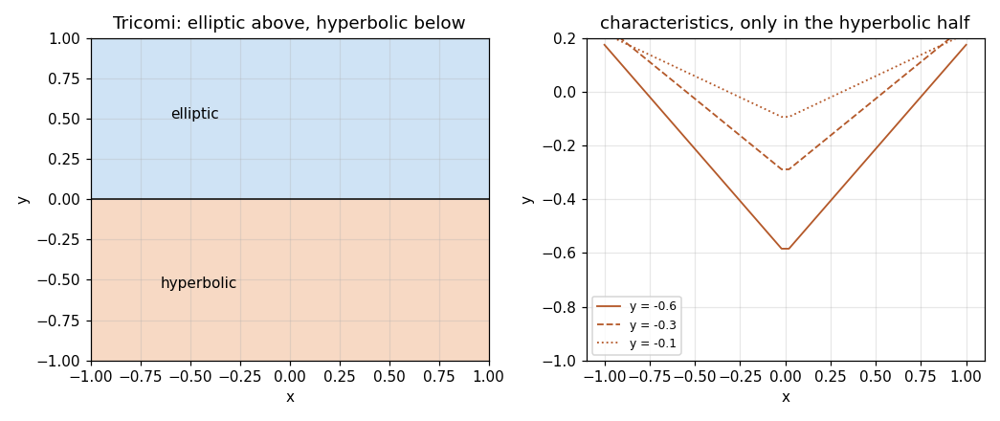

# 77. PDE Classification and Stencils

**Part 11: Partial Differential Equations**

## Learning objectives

By the end of this lesson you will be able to:

1. Classify a second order equation from its discriminant, at a point rather than globally, and
   say what the classification forces a method to do.
2. Say which conditions make each type well posed, and show by measurement what goes wrong when
   the type is ignored.
3. Build a finite difference stencil on any offsets and measure its accuracy order from its own
   Taylor moments, without fitting a convergence sweep.
4. Compare the five point and nine point Laplacians and state exactly when each is second, fourth
   or sixth order.
5. Impose a Neumann condition without losing the order of the interior scheme.

## Prerequisites

Lesson 61 (finite difference formulas and Fornberg's recursion). Lesson 75 (two point boundary
value problems, the second difference matrix and the discrete maximum principle). Lesson 72
(stability regions and why a scheme can be consistent and still useless). Lesson 22 (banded
solves), used from lesson 78 onward.

---

## 1. One sign decides everything

A second order quasi-linear equation in two variables is

$$
A u_{xx} + B u_{xy} + C u_{yy} = F(x, y, u, u_x, u_y),
$$

and its **discriminant** is $B^2 - 4AC$. The sign names the type:

| sign | type | example |
|---|---|---|
| negative | elliptic | $u_{xx} + u_{yy} = 0$ |
| zero | parabolic | $u_t = \alpha u_{xx}$ |
| positive | hyperbolic | $u_{tt} = c^2 u_{xx}$ |

This is the same discriminant that classifies conic sections, and the reason is the same: the
principal part is a quadratic form, and its signature is what survives a change of variables.

The classification is not a label. It decides three things a method has to respect.

**What has to be prescribed.** An elliptic problem needs one condition at every point of a closed
boundary. A parabolic problem needs an initial state and a condition on each side. A hyperbolic
problem needs an initial state **and an initial velocity**, because it is second order in time.

**Whether you can march.** Elliptic problems have no direction to march in: the answer at any
point depends on the data everywhere. The other two are marched forward in time.

**How fast information travels.** Infinitely fast for parabolic, at a finite speed for hyperbolic.
That difference is where the step size restriction in lesson 81 comes from, and why lesson 78's
restriction has a completely different form.

```python
# Standard setup, the same in every lesson of this course.
import sys, pathlib

_root = pathlib.Path.cwd()
while not (_root / "src" / "nalib").is_dir() and _root != _root.parent:
    _root = _root.parent
sys.path.insert(0, str(_root / "src"))

import numpy as np
import matplotlib.pyplot as plt

SEED = 42                                  # fixed so your numbers match the text
rng = np.random.default_rng(SEED)

np.set_printoptions(precision=6, linewidth=100, suppress=False)
plt.rcParams.update({
    "figure.figsize": (7.5, 4.5), "figure.dpi": 110,
    "axes.grid": True, "grid.alpha": 0.3, "font.size": 10,
})
```

```python
from nalib import pdeclass as pc

out = pc.every_standard_equation_is_classified_right()
print(f"{'equation':>34}{'B^2-4AC':>12}{'type':>13}{'real chars':>13}")
for row in out["rows"]:
    print(f"{row['equation']:>34}{row['discriminant']:>12.1f}"
          f"{row['measured']:>13}{row['real_characteristics']:>13}")
print(f"\nall five agree with the known answer: {out['all_agree']}")
print(f"two real characteristics exactly when hyperbolic: "
      f"{out['two_real_characteristics_exactly_when_hyperbolic']}")

assert out["all_agree"]
assert out["two_real_characteristics_exactly_when_hyperbolic"]
```

*Output:*

```text
                          equation     B^2-4AC         type   real chars
                   u_xx + u_yy = 0        -4.0     elliptic            0
                   u_xx + u_yy = f        -4.0     elliptic            0
                  u_t = alpha u_xx         0.0    parabolic            1
                   u_tt = c^2 u_xx         4.0   hyperbolic            2
     u_t + a u_x = 0 (as u_xt = 0)         1.0   hyperbolic            2

all five agree with the known answer: True
two real characteristics exactly when hyperbolic: True
```

The last column is the other half of the same statement. The **characteristics** through a point
have slopes solving $Am^2 - Bm + C = 0$, so there are two real ones when the discriminant is
positive, one when it is zero and none when it is negative. That is where the names come from, and
it is why hyperbolic problems have a finite speed of propagation: the characteristics are the
paths information travels along.

```python
for name in ("laplace", "heat", "wave"):
    a, b, c = pc.standard_equations()[name]["coefficients"]
    slopes = pc.characteristic_slopes(a, b, c)
    kind = pc.classify(a, b, c)
    needs = pc.conditions_for(kind)
    print(f"{name:>9}  {kind:>11}  slopes {slopes[0]:.3g}, {slopes[1]:.3g}")
    print(f"{'':>9}  needs: {needs['needs']}")
    print(f"{'':>9}  marched forward: {needs['marching']}")
```

*Output:*

```text
  laplace     elliptic  slopes 0+1j, 0-1j
           needs: one condition at every point of the whole boundary
           marched forward: False
     heat    parabolic  slopes 0+0j, 0+0j
           needs: the state at t = 0, plus one condition on each side boundary for all t
           marched forward: True
     wave   hyperbolic  slopes 1+0j, -1+0j
           needs: the state and its time derivative at t = 0, plus side conditions
           marched forward: True
```

## 2. The type belongs to a point, not to an equation

With variable coefficients the discriminant changes across the domain, and so does the type.
Tricomi's equation

$$
y\,u_{xx} + u_{yy} = 0
$$

has discriminant $-4y$: hyperbolic below the $x$ axis, elliptic above it, parabolic on the line
between. It is the model for transonic flow, where the subsonic region really is elliptic and the
supersonic one really is hyperbolic, and the sonic line is where they meet.

```python
out = pc.the_type_can_change_across_the_domain(points=41)
print("grid with a row on the axis:  ", {k: round(v, 4)
                                          for k, v in out["grid_through_the_axis"].items()})
print("grid that misses the axis:    ", {k: round(v, 4)
                                          for k, v in out["grid_missing_the_axis"].items()})
print(f"\nhyperbolic strictly below the axis: {out['hyperbolic_is_below_the_axis']}")
print(f"elliptic strictly above it:         {out['elliptic_is_above_it']}")
print(f"the parabolic set has measure zero: {out['the_parabolic_line_is_measure_zero']}")
```

*Output:*

```text
grid with a row on the axis:   {'elliptic': 0.4878, 'parabolic': 0.0244, 'hyperbolic': 0.4878}
grid that misses the axis:     {'elliptic': 0.5122, 'parabolic': 0.0, 'hyperbolic': 0.4878}

hyperbolic strictly below the axis: True
elliptic strictly above it:         True
the parabolic set has measure zero: True
```

The two rows differ by half a grid spacing and nothing else. One finds a parabolic set of about
2.4 per cent, the other finds none at all. **That fraction is a measurement of the grid, not of
the equation**: the parabolic set is a line, it has zero area, and whether a grid lands on it is
an accident. This is worth noticing early, because the same trap appears every time a continuous
property is read off a discrete sample.

```python
import numpy as np

fig, (left, right) = plt.subplots(1, 2, figsize=(9.5, 4.0))
xs = np.linspace(-1.0, 1.0, 201)
field = pc.classify_on_grid(pc.tricomi_coefficients, xs, xs)
codes = np.zeros(field["type"].shape)
for level, name in enumerate(pc.TYPES):
    codes[field["type"] == name] = level
left.contourf(field["x"], field["y"], codes.T, levels=[-0.5, 0.5, 1.5, 2.5],
              colors=["#cfe3f5", "#f2f2f2", "#f7d9c4"])
left.axhline(0.0, color="k", lw=1.0)
left.set_xlabel("x"); left.set_ylabel("y")
left.set_title("Tricomi: elliptic above, hyperbolic below")
left.text(-0.6, 0.5, "elliptic"); left.text(-0.65, -0.55, "hyperbolic")

for level, style in ((-0.6, "-"), (-0.3, "--"), (-0.1, ":")):
    speed = np.sqrt(-level)
    span = np.linspace(-1.0, 1.0, 50)
    right.plot(span, level + speed * np.abs(span), style, color="#b4592a", lw=1.2,
               label=f"y = {level}")
right.set_xlabel("x"); right.set_ylabel("y"); right.set_ylim(-1.0, 0.2)
right.set_title("characteristics, only in the hyperbolic half")
right.legend(fontsize=8)
fig.tight_layout(); fig.savefig("../figures/77_tricomi.png", dpi=110); plt.close(fig)
print("saved ../figures/77_tricomi.png")
```

*Output:*

```text
saved ../figures/77_tricomi.png
```



## 3. Why the wrong type is not a slow method but a wrong answer

The heat equation run **backwards** is the standard example, and it is worth doing because the
failure is not a discretization failure at all.

Forward, a mode $\sin(k\pi x)$ decays by $e^{-(k\pi)^2 t}$. Every wiggle in the data is smoothed
away, and the answer depends continuously on the data. Backward, the same mode is amplified by
$e^{+(k\pi)^2 t}$, which grows without bound in $k$. A grid of spacing $h$ carries modes up to
$k \sim 1/h$, so **refining the grid makes the amplification larger**.

```python
out = pc.the_backward_problem_is_ill_posed(time=0.05)
print(f"{'k':>5}{'grid that carries it':>22}{'forward factor':>18}{'backward factor':>18}")
for k, g, f, b in zip(out["wavenumber"], out["grid_that_supports_k"],
                      out["forward_factor"], out["backward_factor"]):
    print(f"{k:>5.0f}{g:>22.4f}{f:>18.3e}{b:>18.3e}")
print(f"\nfitted exponent of k in log(log(amplification)): "
      f"{out['fitted_exponent_in_k']:.6f}")
print(out["note"])

assert out["forward_is_a_contraction"]
assert out["backward_grows_without_bound"]
assert abs(out["fitted_exponent_in_k"] - 2.0) < 1e-9
```

*Output:*

```text
    k  grid that carries it    forward factor   backward factor
    1                1.0000         6.105e-01         1.638e+00
    2                0.5000         1.389e-01         7.199e+00
    4                0.2500         3.723e-04         2.686e+03
    8                0.1250         1.922e-14         5.202e+13
   16                0.0625         1.365e-55         7.325e+54

fitted exponent of k in log(log(amplification)): 2.000000
the amplification is exp(k^2 pi^2 t), so a finer grid makes it worse; this is a property of the equation and not of any scheme
```

At $k = 16$ the amplification is $7 \times 10^{54}$ over a time of $0.05$. No scheme survives
that, and no scheme should: the continuous problem is the thing that is wrong. Detecting this from
the classification takes one sign; detecting it from a divergent computation takes an afternoon.

## 4. Stencils on any offsets

A finite difference scheme is a set of stencils. Lesson 61 built them; here they are used on two
variables at once, and the only new question is how to know an unfamiliar stencil's order.

Do not fit a convergence sweep. The order is a property of the **weights**, and it can be read
straight off them: a stencil $w$ on offsets $s$ approximating the $k$-th derivative is exact for
$x^m$ exactly when

$$
\sum_j w_j s_j^m = m!\,[m = k].
$$

The accuracy order is the first $m$ where that fails, minus $k$. No test function is involved, so
a stencil that is not what its name says fails here rather than in a plot three lessons later.

Building the weights is one linear system. A stencil on offsets $s_1, \dots, s_n$ that
approximates the $k$-th derivative has to reproduce every monomial the Taylor expansion contains,
which is exactly the Vandermonde system

$$
\sum_j s_j^m w_j = m!\,[m = k], \qquad m = 0, 1, \dots, n - 1 .
$$

Written from scratch that is four lines. Lesson 61 explained why solving it directly is the wrong
way to do it for a wide stencil, and `pdeclass.stencil` uses Fornberg's recursion instead, so the
two are compared here rather than one being taken on trust.

```python
import math

def stencil_from_scratch(offsets, order):
    """Weights by the Vandermonde system, the definition rather than the algorithm."""
    s = np.asarray(offsets, dtype=float).ravel()
    n = s.size
    powers = np.arange(n)
    matrix = s[None, :] ** powers[:, None]
    rhs = np.zeros(n)
    rhs[order] = float(math.factorial(order))
    return np.linalg.solve(matrix, rhs)

for width in (3, 5, 7, 9):
    off = np.arange(-(width // 2), width // 2 + 1)
    for k in (1, 2):
        mine = stencil_from_scratch(off, k)
        theirs = pc.stencil(off, k)
        gap = float(np.max(np.abs(mine - theirs)))
        print(f"width {width}, derivative {k}: largest disagreement {gap:.3e}")
        assert gap < 1e-9

# and one that is not centred and not equally spaced, where there is no formula to look up
odd = np.asarray([-1.0, -0.25, 0.0, 0.75])
print(f"\nuneven offsets {odd}: weights {stencil_from_scratch(odd, 2)}")
assert np.allclose(stencil_from_scratch(odd, 2), pc.stencil(odd, 2), atol=1e-9)
```

*Output:*

```text
width 3, derivative 1: largest disagreement 0.000e+00
width 3, derivative 2: largest disagreement 0.000e+00
width 5, derivative 1: largest disagreement 0.000e+00
width 5, derivative 2: largest disagreement 4.441e-16
width 7, derivative 1: largest disagreement 1.575e-15
width 7, derivative 2: largest disagreement 3.109e-15
width 9, derivative 1: largest disagreement 2.606e-14
width 9, derivative 2: largest disagreement 6.661e-15

uneven offsets [-1.   -0.25  0.    0.75]: weights [ 0.761905  2.666667 -5.333333  1.904762]
```

```python
out = pc.stencils_are_what_they_claim()
print(f"{'points':>8}{'derivative':>13}{'order':>8}   weights")
for row in out["rows"]:
    weights = ", ".join(f"{v:+.4f}" for v in row["weights"])
    print(f"{row['points']:>8}{row['derivative']:>13}{row['order']:>8}   {weights}")
print(f"\nevery stencil sums to zero: {out['every_stencil_sums_to_zero']}")
print(out["note"])

assert out["every_stencil_sums_to_zero"]
assert out["first_derivative_orders"] == [2, 4, 6, 8]
assert out["second_derivative_orders"] == [2, 4, 6, 8]
```

*Output:*

```text
  points   derivative   order   weights
       3            1       2   -0.5000, +0.0000, +0.5000
       3            2       2   +1.0000, -2.0000, +1.0000
       5            1       4   +0.0833, -0.6667, +0.0000, +0.6667, -0.0833
       5            2       4   -0.0833, +1.3333, -2.5000, +1.3333, -0.0833
       7            1       6   -0.0167, +0.1500, -0.7500, -0.0000, +0.7500, -0.1500, +0.0167
       7            2       6   +0.0111, -0.1500, +1.5000, -2.7222, +1.5000, -0.1500, +0.0111
       9            1       8   +0.0036, -0.0381, +0.2000, -0.8000, -0.0000, +0.8000, -0.2000, +0.0381, -0.0036
       9            2       8   -0.0018, +0.0254, -0.2000, +1.6000, -2.8472, +1.6000, -0.2000, +0.0254, -0.0018

every stencil sums to zero: True
a stencil for any derivative has weights summing to zero, because it must annihilate a constant
```

Two things in that table are worth stopping on.

**A centred second derivative gets an order for free.** Three points give a first derivative to
order 2, which is $w - k$ with $w = 3, k = 1$. Three points also give a **second** derivative to
order 2, where $w - k$ would say 1. The odd term cancels by symmetry, so a centred stencil's order
rounds up to the next even number. That free order is the reason centred differences are used
everywhere in this part.

**Every stencil sums to zero**, whatever the derivative and whatever the offsets, because it has
to annihilate a constant. It is the cheapest possible check on a hand-derived stencil.

## 5. Two Laplacians, and what they are really worth

In two dimensions the obvious operator is the **five point** rule,

$$
\Delta_5 u = \frac{u_E + u_W - 2u_C}{h_x^2} + \frac{u_N + u_S - 2u_C}{h_y^2},
$$

and the standard alternative is the compact **nine point** rule on a square grid,

$$
\Delta_9 u = \frac{4(u_E + u_W + u_N + u_S) + (u_{NE} + u_{NW} + u_{SE} + u_{SW}) - 20u_C}{6h^2}.
$$

The nine point rule is usually introduced as "the fourth order Laplacian". **That is wrong twice
over.** Expand both:

$$
\Delta_5 u - \Delta u = \frac{h^2}{12}\left(u_{xxxx} + u_{yyyy}\right) + O(h^4),
$$

$$
\Delta_9 u - \Delta u = \frac{h^2}{12}\left(u_{xxxx} + 2u_{xxyy} + u_{yyyy}\right) + O(h^4)
= \frac{h^2}{12}\,\Delta^2 u + O(h^4).
$$

Both are second order in general. The nine point form happens to be the **biharmonic** of $u$,
which vanishes when $u$ is harmonic, and that is the only case where it does better.

```python
out = pc.orders_of_the_two_laplacians()
print(f"{'function':>14}{'rule':>12}{'whole sweep':>14}{'above the floor':>18}{'rows used':>11}")
for row in out["rows"]:
    for rule in ("five_point", "nine_point"):
        print(f"{row['function']:>14}{rule.replace('_', ' '):>12}"
              f"{row[rule + '_order']:>14.3f}"
              f"{row[rule + '_order_above_the_floor']:>18.3f}"
              f"{row[rule + '_rows_used']:>11}")
print(f"\non a function that is not harmonic the nine point error is "
      f"{out['nine_point_costs_twice_the_error_when_it_does_not_help']:.3f} times the five "
      f"point one")
print(f"fitting the whole sweep on the harmonic function would report order "
      f"{out['fitting_the_whole_sweep_would_say']:.2f}")

assert out["nine_point_is_only_second_order_otherwise"]
assert out["five_point_is_second_order_either_way"]
assert out["nine_point_beats_fourth_order_on_a_harmonic_function"]
```

*Output:*

```text
      function        rule   whole sweep   above the floor  rows used
      harmonic  five point         1.901             1.901         13
      harmonic  nine point         2.065             5.741          6
  not harmonic  five point         1.912             1.912         13
  not harmonic  nine point         1.911             1.911         13

on a function that is not harmonic the nine point error is 2.000 times the five point one
fitting the whole sweep on the harmonic function would report order 2.07
```

Two findings, and the second is the more useful one.

**On a harmonic function the nine point rule is not fourth order, it is sixth.** Its next term is
$\frac{h^4}{180}(u_{xxxxyy} + u_{xxyyyy})$, and for a harmonic function $u_{yy} = -u_{xx}$, so
$u_{xxyyyy} = -u_{xxxxyy}$ and that term cancels along with the $h^2$ one.

**Fitting a convergence sweep would have hidden it.** A second difference divides by $h^2$, so it
amplifies rounding error by $1/h^2$; on the harmonic function the nine point error reaches that
floor by the fourth grid, and a fit over the whole sweep reads about 2 for a sixth order rule.
Every order above is therefore reported twice: over the whole sweep, and over the rows still well
clear of the estimated floor $\varepsilon \max\lvert u\rvert / h^2$.

There is a way to state the same thing with no tolerance and no fitting at all. $\mathrm{Re}\,(x +
iy)^d$ is a harmonic polynomial of degree $d$, and a stencil is exact on it exactly when the
derivatives in its error term vanish. So ask which degrees each rule gets exactly right.

```python
out = pc.exact_on_harmonic_polynomials()
print(f"{'degree':>8}{'five point':>16}{'exact':>8}{'nine point':>16}{'exact':>8}")
for row in out["rows"]:
    print(f"{row['degree']:>8}{row['five_point']:>16.3e}{str(row['five_point_exact']):>8}"
          f"{row['nine_point']:>16.3e}{str(row['nine_point_exact']):>8}")
print(f"\nfive point exact up to degree {out['five_point_exact_up_to']}, "
      f"nine point up to degree {out['nine_point_exact_up_to']}")
print(f"implied orders: {out['five_point_order_implied']} and "
      f"{out['nine_point_order_implied']}")

assert out["five_point_exact_up_to"] == 3
assert out["nine_point_exact_up_to"] == 7
assert out["no_gaps"]
```

*Output:*

```text
  degree      five point   exact      nine point   exact
       0       0.000e+00    True       0.000e+00    True
       1       0.000e+00    True       0.000e+00    True
       2       0.000e+00    True       0.000e+00    True
       3       0.000e+00    True       0.000e+00    True
       4       6.250e-02   False       0.000e+00    True
       5       2.734e-01   False       0.000e+00    True
       6       7.031e-01   False       0.000e+00    True
       7       2.931e+00   False       0.000e+00    True
       8       1.026e+01   False       5.086e-05   False
       9       1.616e+01   False       4.005e-04   False
      10       1.697e+01   False       1.717e-03   False

five point exact up to degree 3, nine point up to degree 7
implied orders: 2 and 6
```

Those are integers read off a table of exact zeros. The five point rule stops at degree 3, so its
error starts at fourth derivatives, which is order 2. The nine point rule stops at degree 7, so
its error starts at eighth derivatives, which is order 6.

### 5.1 Getting fourth order on purpose

If the point is to solve $u_{xx} + u_{yy} = f$ rather than to differentiate a known $u$, the
$h^2$ term can be removed. For a solution of the equation, $\Delta^2 u = \Delta f$, and $f$ is
**known**, so the correction is computable:

$$
\Delta_9 u = f + \frac{h^2}{12}\Delta f .
$$

This is the Mehrstellen or "compact fourth order" scheme, and the trick is that the correction
uses only the data.

```python
out = pc.the_correction_restores_fourth_order()
print(f"{'h':>10}{'plain nine point':>20}{'with the correction':>22}{'discrete correction':>22}")
for h, p, c, m in zip(out["h"], out["plain_nine_point"], out["with_the_correction"],
                      out["mehrstellen_residual"]):
    print(f"{h:>10.5f}{p:>20.3e}{c:>22.3e}{m:>22.3e}")
print(f"\nplain order {out['plain_order']:.3f}, corrected order {out['corrected_order']:.3f}, "
      f"discrete correction order {out['mehrstellen_order']:.3f}")
print(f"using the discrete Laplacian of f rather than the exact one is smaller by "
      f"{out['the_discrete_correction_is_smaller_by']:.2f}")

assert out["gains_two_orders"]
assert out["the_discrete_correction_is_smaller_by"] > 1.0
```

*Output:*

```text
         h    plain nine point   with the correction   discrete correction
   0.10000           2.043e-03             2.044e-06             3.401e-07
   0.05000           5.512e-04             1.378e-07             2.296e-08
   0.02500           1.427e-04             8.920e-09             1.486e-09
   0.01250           3.628e-05             5.662e-10             9.557e-11

plain order 1.940, corrected order 3.940, discrete correction order 3.934
using the discrete Laplacian of f rather than the exact one is smaller by 5.92
```

The last column is worth a note. Replacing $\Delta f$ by its own five point approximation is not a
compromise: it is measurably **better** here, by a factor of about 6, because the two
discretization errors partly cancel. It is also what you would have to do anyway when $f$ is only
known at the grid points.

## 6. The boundary is where the order is lost

Every interior equation above is second order. That is not enough. A boundary condition
discretized to first order drags the whole solve down to first order, and the interior looks
innocent the entire time.

Take $-u'' = f$ on $[0,1]$ with $u'(0) = g$ given and $u(1)$ given. Two ways to write the first
row:

**One sided.** $(u_1 - u_0)/h = g$. Simple, and first order.

**Ghost point.** Write the centred difference at node 0 itself, which needs a value $u_{-1}$
outside the grid, then eliminate $u_{-1}$ using the differential equation at node 0. What is left
is second order and involves only grid values.

```python
out = pc.a_ghost_point_keeps_the_order()
print(f"{'h':>10}{'one sided':>16}{'ratio':>9}{'ghost point':>16}{'ratio':>9}")
prev = None
for h, a, b in zip(out["h"], out["one_sided_error"], out["ghost_point_error"]):
    ra = "" if prev is None else f"{prev[0] / a:.2f}"
    rb = "" if prev is None else f"{prev[1] / b:.2f}"
    print(f"{h:>10.5f}{a:>16.3e}{ra:>9}{b:>16.3e}{rb:>9}")
    prev = (a, b)
print(f"\nfitted orders: one sided {out['one_sided_order']:.3f}, "
      f"ghost point {out['ghost_point_order']:.3f}")
print(f"at the finest grid the ghost point answer is "
      f"{out['ratio_at_the_finest']:.0f} times more accurate")

assert abs(out["one_sided_order"] - 1.0) < 0.1
assert abs(out["ghost_point_order"] - 2.0) < 0.1
```

*Output:*

```text
         h       one sided    ratio     ghost point    ratio
   0.10000       4.769e-01                1.653e-02         
   0.05000       2.426e-01     1.97       4.117e-03     4.01
   0.02500       1.223e-01     1.98       1.028e-03     4.00
   0.01250       6.143e-02     1.99       2.570e-04     4.00
   0.00625       3.078e-02     2.00       6.426e-05     4.00
   0.00313       1.541e-02     2.00       1.606e-05     4.00

fitted orders: one sided 0.991, ghost point 2.001
at the finest grid the ghost point answer is 959 times more accurate
```

The ratio columns say it plainly: halving $h$ halves one error and quarters the other. **One row
out of hundreds sets the order of the whole solve.** Every scheme in this part has a boundary, and
this is the first place to look when a measured order is one lower than the derivation says.

## 7. What carries over from Part 10

The method of lines, which lesson 83 develops properly, is worth naming now: discretize space
only, and a parabolic or hyperbolic PDE becomes a large system of ODEs in $t$. Everything from
Part 10 then applies unchanged, including the answer to the question every scheme in lesson 78
raises.

The heat equation on $n$ interior points becomes $u' = \frac{\alpha}{h^2} T u$ with $T$ the second
difference matrix of lesson 75, whose eigenvalues are

$$
\lambda_j = -\frac{4\alpha}{h^2}\sin^2\!\left(\frac{j\pi h}{2}\right),
\qquad j = 1, \dots, n,
$$

running from about $-\alpha\pi^2$ down to nearly $-4\alpha/h^2$. The stiffness ratio is therefore
$O(h^{-2})$, and it grows as the grid is refined.

```python
import numpy as np

print(f"{'n':>6}{'h':>10}{'smallest |lambda|':>20}{'largest |lambda|':>19}{'ratio':>12}")
for n in (7, 15, 31, 63, 127):
    h = 1.0 / (n + 1)
    j = np.arange(1, n + 1)
    lam = -4.0 / h ** 2 * np.sin(j * np.pi * h / 2.0) ** 2
    print(f"{n:>6}{h:>10.5f}{np.min(np.abs(lam)):>20.4f}"
          f"{np.max(np.abs(lam)):>19.1f}{np.max(np.abs(lam)) / np.min(np.abs(lam)):>12.1f}")
print("\nthe ratio grows like h^-2, so a space discretization of the heat equation is stiff,")
print("and lesson 72's whole argument for implicit methods applies to it")

ratios = []
for n in (15, 31, 63, 127):
    h = 1.0 / (n + 1)
    j = np.arange(1, n + 1)
    lam = np.abs(-4.0 / h ** 2 * np.sin(j * np.pi * h / 2.0) ** 2)
    ratios.append(float(np.max(lam) / np.min(lam)))
growth = np.asarray(ratios[1:]) / np.asarray(ratios[:-1])
print(f"the ratio grows by {growth} each time the grid is doubled")
assert bool(np.all(np.abs(growth - 4.0) < 0.05))
```

*Output:*

```text
     n         h   smallest |lambda|   largest |lambda|       ratio
     7   0.12500              9.7434              246.3        25.3
    15   0.06250              9.8379             1014.2       103.1
    31   0.03125              9.8617             4086.1       414.3
    63   0.01562              9.8676            16374.1      1659.4
   127   0.00781              9.8691            65526.1      6639.5

the ratio grows like h^-2, so a space discretization of the heat equation is stiff,
and lesson 72's whole argument for implicit methods applies to it
the ratio grows by [4.019378 4.004825 4.001205] each time the grid is doubled
```

That table is the reason lesson 78 spends its time on implicit schemes. An explicit method needs
$h_t \lesssim h_x^2$, which is not a rounding detail: halving the space grid quarters the time
step and so multiplies the work by 8.

## 8. Exercises

**Level 1, understanding**

1.1 Classify $u_{xx} + 4u_{xy} + 4u_{yy} = 0$ and say which of the three sets of side conditions
it needs.

1.2 Explain why the parabolic fraction reported in section 2 depends on the grid and the elliptic
fraction does not.

1.3 State the discrete condition that makes a stencil exact for $x^m$, and use it to show every
stencil sums to zero.

1.4 Explain why the nine point Laplacian is sixth order on a harmonic function but only second
order in general.

1.5 Say why a first order Neumann condition costs the whole solve an order, and not just one row.

**Level 2, derivation**

2.1 Derive the discriminant condition from the change of variables that removes the $u_{xy}$ term,
and show the sign is invariant.

2.2 Derive the truncation error of the five point Laplacian, and of the nine point one, as far as
the $h^4$ term.

2.3 Derive $u_{xxyyyy} = -u_{xxxxyy}$ for a harmonic function and use it to explain the measured
order 6.

2.4 Derive the ghost point elimination for $-u'' = f$ with $u'(a) = g$, and confirm the resulting
first row is second order.

2.5 Derive the eigenvalues of the second difference matrix used in section 7 and show the
stiffness ratio is $O(h^{-2})$.

**Level 3, computational**

3.1 Implement a stencil generator on unequally spaced offsets and confirm the order drops as
expected when the spacing is irregular.

3.2 Implement the nine point Laplacian for a rectangular grid with $h_x \ne h_y$ and measure what
it costs. Say what the compact weights assume.

3.3 Implement a Robin condition $\alpha u + \beta u' = \gamma$ by the ghost point method and
confirm second order for several $(\alpha, \beta)$.

3.4 Implement the Mehrstellen scheme as an actual solve on a square and measure the order of the
solution rather than of the operator.

3.5 Implement a classifier for a general variable coefficient equation and run it on the full
potential equation of transonic flow, $(1 - M^2)\phi_{xx} + \phi_{yy} = 0$ with
$M = M(x, y)$.

**Level 4, experimental**

4.1 Measure the rounding floor of the second difference against $h$ and confirm the $1/h^2$ growth
predicted in section 5. Find the $h$ that minimizes the total error.

4.2 Measure the exactness degrees of section 5 for the fourth order **wide** nine point Laplacian
built from the five point rule on a doubled stencil, and compare with the compact one.

4.3 Measure how the fitted order of a scheme changes as the boundary treatment is varied from
first to second to third order, and find where the interior order stops mattering.

**Level 5, advanced**

5.1 **Isotropy.** Show that the five point Laplacian's leading error depends on the direction of
the wave vector and the nine point one's does not, and measure the anisotropy of each.

5.2 **Classification in more than two variables.** State the classification for
$\sum a_{ij} u_{x_i x_j}$ by the signature of the coefficient matrix, and say what happens when
the matrix is indefinite with more than one negative eigenvalue.

5.3 **Well posedness is not the same as stability.** Construct a well posed problem and a
consistent scheme for it that still diverges, and explain why the classification does not protect
you from that.

## 9. Key takeaways

- **One sign decides the method.** The discriminant fixes what has to be prescribed, whether you
  can march, and how fast information travels, before a single line of code is written.

- **The type belongs to a point.** Tricomi's equation is hyperbolic below the axis and elliptic
  above it. Reporting a parabolic fraction of 2.4 per cent from a grid that happens to sit on the
  axis, or 0 per cent from one that misses it, measures the grid.

- **Backward heat is not a hard problem, it is the wrong one.** A mode of wavenumber $k$ is
  amplified by $e^{k^2\pi^2t}$, so refining the grid makes it worse. The fitted exponent is
  $2.000000$.

- **Read a stencil's order off its own moments.** No test function, no fit, and a centred second
  derivative gets an extra order free because the odd term cancels.

- **The nine point Laplacian is not fourth order.** It is second in general, and **sixth** on a
  harmonic function. Exact on harmonic polynomials to degree 3 and 7 respectively, which is an
  integer answer with no tolerance in it.

- **Fitting past the rounding floor lies.** The same sixth order rule fits to 2.07 over a sweep
  that runs into the $1/h^2$ noise floor.

- **The Mehrstellen correction buys the fourth order back**, using only $f$, and using the
  discrete Laplacian of $f$ rather than the exact one is 6 times more accurate, not less.

- **One boundary row sets the order.** One sided Neumann fits 0.99 and the ghost point fits 2.00,
  and at the finest grid the difference is a factor of 959.

- **A space discretization of the heat equation is stiff**, with a ratio growing like $h^{-2}$,
  which is Part 10's argument for implicit methods arriving unchanged.

## Where this goes next

Lesson 78 takes the parabolic case and builds every scheme the sources name: Bender-Schmidt,
backward difference, Crank-Nicolson, the weighted family that contains all three, and the two
schemes that look reasonable and are not. Section 7's stiffness table is the reason the implicit
ones win.
