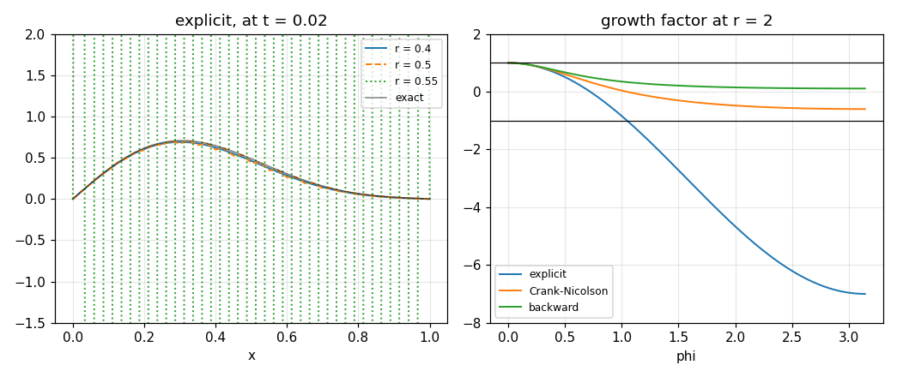

# 78. Parabolic Equations

**Part 11: Partial Differential Equations**

## Learning objectives

By the end of this lesson you will be able to:

1. Write every standard scheme for the heat equation as one weighted family in a single parameter.
2. Derive each scheme's amplification factor and read its stability limit off that one expression.
3. Explain why an unstable scheme can look fine for a long time, and predict how long.
4. Measure the order of a scheme in a sweep that can actually see it.
5. Say what Richardson's and Du Fort and Frankel's schemes get wrong, and why the second failure is
   the more interesting one.

## Prerequisites

Lesson 77 (classification, stencils, and the stiffness of the semi-discrete heat operator).
Lesson 22 (the Thomas algorithm, which is what makes an implicit step cheap). Lesson 72
(A-stability and L-stability, which is the same argument in the ODE setting). Lesson 66
(Gauss-Legendre quadrature) is not needed here.

---

## 1. One family, three famous members

The equation is

$$
u_t = \alpha u_{xx}, \qquad u(x,0) \text{ given}, \qquad u(a,t), u(b,t) \text{ given}.
$$

Put a grid on it: $x_j = a + jh$, $t_n = nk$, and write $u_j^n$ for the approximation. Every scheme
in this lesson comes from one choice: **at which time level do you evaluate the space derivative?**

$$
\frac{u_j^{n+1} - u_j^n}{k}
= \alpha\left[\theta\,\delta_x^2 u^{n+1} + (1-\theta)\,\delta_x^2 u^n\right]_j,
\qquad \delta_x^2 v_j = \frac{v_{j+1} - 2v_j + v_{j-1}}{h^2}.
$$

Write $r = \alpha k / h^2$, the **mesh ratio**. Then:

| $\theta$ | name | needs a solve | stability |
|---|---|---|---|
| $0$ | forward difference, explicit | no | $r \le 1/2$ |
| $1/2$ | Crank-Nicolson | yes | unconditional |
| $1$ | backward difference, implicit | yes | unconditional |

Writing them as one family is not tidiness. It turns the whole comparison into a sweep over one
number, and it makes both properties that matter, order and stability, functions of $\theta$.

The implicit members need a tridiagonal solve per step, which by lesson 22's Thomas algorithm is
$O(n)$. **An implicit step costs a small constant times an explicit one, not a factor of $n$.**
Every cost comparison in this lesson depends on that.

```python
# Standard setup, the same in every lesson of this course.
import sys, pathlib

_root = pathlib.Path.cwd()
while not (_root / "src" / "nalib").is_dir() and _root != _root.parent:
    _root = _root.parent
sys.path.insert(0, str(_root / "src"))

import numpy as np
import matplotlib.pyplot as plt

SEED = 42                                  # fixed so your numbers match the text
rng = np.random.default_rng(SEED)

np.set_printoptions(precision=6, linewidth=100, suppress=False)
plt.rcParams.update({
    "figure.figsize": (7.5, 4.5), "figure.dpi": 110,
    "axes.grid": True, "grid.alpha": 0.3, "font.size": 10,
})
```

```python
from nalib import parabolic as pb

problem = pb.sine_problem(mode=1)
for theta, name in ((0.0, "explicit"), (0.5, "Crank-Nicolson"), (1.0, "backward")):
    run = pb.solve(problem, 41, 200, 0.05, theta=theta)
    print(f"{name:>16}  r = {run['r']:.4f}  error = {run['error']:.3e}  "
          f"limit r <= {pb.stability_limit(theta)}")
```

*Output:*

```text
        explicit  r = 0.4000  error = 2.170e-04  limit r <= 0.5
  Crank-Nicolson  r = 0.4000  error = 1.547e-04  limit r <= inf
        backward  r = 0.4000  error = 5.257e-04  limit r <= inf
```

### 1.1 The whole scheme, from scratch

The implicit step is one tridiagonal solve, and both halves fit in a screen. Writing them out is
worth doing once, because the structure of the matrix, ``-theta r`` off the diagonal and
``1 + 2 theta r`` on it, is what every stability statement in this lesson is about.

```python
import numpy as np

def thomas_from_scratch(sub, diag, sup, rhs):
    """Tridiagonal solve by forward elimination and back substitution, lesson 22."""
    n = diag.size
    c = np.empty(n)
    d = np.empty(n)
    c[0] = sup[0] / diag[0]
    d[0] = rhs[0] / diag[0]
    for i in range(1, n):
        pivot = diag[i] - sub[i] * c[i - 1]
        c[i] = sup[i] / pivot if i + 1 < n else 0.0
        d[i] = (rhs[i] - sub[i] * d[i - 1]) / pivot
    out = np.empty(n)
    out[-1] = d[-1]
    for i in range(n - 2, -1, -1):
        out[i] = d[i] - c[i] * out[i + 1]
    return out

def weighted_step_from_scratch(u, r, theta, left=0.0, right=0.0):
    """One step of the weighted scheme, written out."""
    inner = u[1:-1]
    old_d2 = u[2:] - 2.0 * inner + u[:-2]
    rhs = inner + (1.0 - theta) * r * old_d2
    out = np.empty_like(u)
    out[0], out[-1] = left, right
    if theta == 0.0:
        out[1:-1] = rhs
        return out
    rhs = rhs.copy()
    rhs[0] += theta * r * out[0]
    rhs[-1] += theta * r * out[-1]
    m = inner.size
    out[1:-1] = thomas_from_scratch(np.full(m, -theta * r),
                                    np.full(m, 1.0 + 2.0 * theta * r),
                                    np.full(m, -theta * r), rhs)
    return out

rng_local = np.random.default_rng(SEED)
for n in (9, 17, 33):
    start = rng_local.normal(size=n)
    start[0] = start[-1] = 0.0
    for theta in (0.0, 0.25, 0.5, 1.0):
        mine = weighted_step_from_scratch(start, 0.37, theta)
        theirs = pb.theta_step(start, 0.37, theta)
        gap = float(np.max(np.abs(mine - theirs)))
        assert gap < 1e-12, (n, theta, gap)
print("the from-scratch stepper agrees with nalib at every size and every theta")

# and the same statement in Fourier space: one mode in, the growth factor times it out
index = np.arange(65)
phase = 41 * np.pi / 64
mode = np.sin(phase * index)
mode[0] = mode[-1] = 0.0
stepped = weighted_step_from_scratch(mode, 0.37, 0.5)
print(f"largest gap from g(phi) * mode: "
      f"{float(np.max(np.abs(stepped - pb.growth_factor(0.37, phase, 0.5) * mode))):.3e}")
assert np.allclose(stepped, pb.growth_factor(0.37, phase, 0.5) * mode, atol=1e-12)
```

*Output:*

```text
the from-scratch stepper agrees with nalib at every size and every theta
largest gap from g(phi) * mode: 2.554e-15
```

## 2. The amplification factor is the whole story

Put a single Fourier mode $u_j^n = g^n e^{ij\phi}$ into the scheme. Everything cancels except a
scalar:

$$
g(\phi) = \frac{1 - 4(1-\theta)r\,s}{1 + 4\theta r\,s},
\qquad s = \sin^2(\phi/2) \in [0, 1].
$$

The scheme is stable when $\lvert g\rvert \le 1$ for every $\phi$. The worst case is $s = 1$, and
requiring it there gives

$$
r \le \frac{1}{2 - 4\theta} \quad (\theta < 1/2), \qquad \text{no restriction} \quad (\theta \ge 1/2).
$$

At $\theta = 0$ that is the famous $r \le 1/2$. Lesson 79 does this properly and gives it its name,
von Neumann analysis; here it is used as a tool.

```python
import numpy as np

print(f"{'theta':>8}{'g at phi=pi, r=0.4':>22}{'g at r=5':>14}{'stability limit':>18}")
for theta in (0.0, 0.25, 0.4, 0.5, 0.75, 1.0):
    limit = pb.stability_limit(theta)
    shown = "unconditional" if np.isinf(limit) else f"r <= {limit:.4f}"
    print(f"{theta:>8.2f}{float(pb.growth_factor(0.4, np.pi, theta)):>22.6f}"
          f"{float(pb.growth_factor(5.0, np.pi, theta)):>14.6f}{shown:>18}")
```

*Output:*

```text
   theta    g at phi=pi, r=0.4      g at r=5   stability limit
    0.00             -0.600000    -19.000000       r <= 0.5000
    0.25             -0.142857     -2.333333       r <= 1.0000
    0.40              0.024390     -1.222222       r <= 2.5000
    0.50              0.111111     -0.818182     unconditional
    0.75              0.272727     -0.250000     unconditional
    1.00              0.384615      0.047619     unconditional
```

Notice the second column. At $r = 5$ the explicit factor is $-19$, Crank-Nicolson's is $-0.818$
and the backward scheme's is $+0.048$. All three are "correct" implementations of the same
equation, and only the sign and the modulus tell them apart.

## 3. Bender-Schmidt: the explicit scheme at its limit

At exactly $r = 1/2$ the centre value cancels:

$$
u_j^{n+1} = u_j^n + \tfrac12\left(u_{j+1}^n - 2u_j^n + u_{j-1}^n\right)
= \frac{u_{j-1}^n + u_{j+1}^n}{2}.
$$

**The new value is the average of the two old neighbours.** That is the Bender-Schmidt formula, and
it is why the older texts use it: you can run it by hand.

```python
out = pb.bender_schmidt_is_an_average()
print(f"{'points':>8}{'residual':>14}{'in roundings':>15}")
for n, res, ro in zip(out["points"], out["residual"], out["roundings"]):
    print(f"{n:>8}{res:>14.3e}{ro:>15.3f}")
print(f"\nexactly the average: {out['exactly_the_average']}")
print(f"agrees to one rounding: {out['agrees_to_one_rounding']}")

assert out["agrees_to_one_rounding"]
assert not out["exactly_the_average"]
```

*Output:*

```text
  points      residual   in roundings
      11     1.110e-16          0.256
      21     1.110e-16          0.233
      41     2.220e-16          0.594

exactly the average: False
agrees to one rounding: True
```

**It is not exactly the average in floating point**, and the residual above is one rounding unit
rather than zero. The scheme forms $u_j + \tfrac12(u_{j+1} - 2u_j + u_{j-1})$, which adds and
subtracts $u_j$ in separate roundings; the average form never forms $u_j$ at all. Coding the
$r = 1/2$ case as the average is both cheaper and exact, and the only way to know that is to
measure it.

The price of $r = 1/2$ is that the time step is not yours to choose:

```python
print(f"{'points':>8}{'r':>7}{'steps':>8}{'error':>13}")
for n, r, steps, err in zip(out["points"], out["r"], out["steps"], out["error"]):
    print(f"{n:>8}{r:>7.2f}{steps:>8}{err:>13.3e}")
print(f"\nstep count grows by {out['step_growth']} each time the grid is doubled")
print(out["note"])
```

*Output:*

```text
  points      r   steps        error
      11   0.50       4    2.733e-03
      21   0.50      16    6.705e-04
      41   0.50      64    1.668e-04

step count grows by [4. 4.] each time the grid is doubled
halving h quarters k, so the step count goes up by four and the work by eight
```

## 4. What "unstable" actually looks like

The limit $r \le 1/2$ is sharp. Running above it is the standard demonstration, and done carelessly
it demonstrates nothing, because **a scheme amplifies only what is in the data.**

On a single smooth mode the mode $\phi = \pi$ has amplitude exactly zero. The only seed is rounding
error at $10^{-16}$, so at $r = 0.75$, where the growth is $2$ per step, it needs about 52 steps
just to reach 1. A short run returns an ordinary looking error and the scheme appears stable. It is
not stable, it is counting down.

```python
out = pb.the_explicit_limit_is_sharp()
for label, key in (("smooth mode, short run", "short_run"),
                   ("smooth mode, 30x longer", "long_run"),
                   ("jump in the data, short run", "jump_data")):
    print(f"\n{label}")
    print(f"{'r':>8}{'steps':>8}{'seed':>12}{'predicted':>14}{'error':>13}{'blew up':>10}")
    for row in out[key]:
        print(f"{row['r']:>8.3f}{row['steps']:>8}{row['seed']:>12.2e}"
              f"{'10^' + format(row['predicted_decades'], '.1f'):>14}"
              f"{row['error']:>13.3e}{str(row['blew_up']):>10}")
print(f"\nthe prediction is right in all {out['rows_checked']} rows: "
      f"{out['the_prediction_is_right_in_every_row']}")
print(f"rounding needs {out['steps_for_rounding_to_take_over_at_the_largest_ratio']} steps "
      f"to take over at the largest ratio here")

assert out["the_prediction_is_right_in_every_row"]
assert out["nothing_below_the_limit_blew_up"]
assert out["a_short_run_on_a_smooth_mode_hides_it"]
```

*Output:*

```text

smooth mode, short run
       r   steps        seed     predicted        error   blew up
   0.250     128    2.22e-16   10^-38415.7    4.166e-05     False
   0.400      80    2.22e-16      10^-33.4    1.167e-04     False
   0.490      65    2.22e-16      10^-16.8    1.612e-04     False
   0.500      64    2.22e-16      10^-15.7    1.668e-04     False
   0.501      64    2.22e-16      10^-15.5    1.676e-04     False
   0.550      58    2.22e-16      10^-11.1    1.914e-04     False
   0.750      43    2.22e-16       10^-2.7    3.403e-04     False

smooth mode, 30x longer
       r   steps        seed     predicted        error   blew up
   0.250    3840    2.22e-16 10^-1152015.7    4.078e-06     False
   0.400    2400    2.22e-16     10^-548.1    1.141e-05     False
   0.490    1959    2.22e-16      10^-50.4    1.582e-05     False
   0.500    1920    2.22e-16      10^-15.7    1.630e-05     False
   0.501    1916    2.22e-16      10^-12.3    1.635e-05     False
   0.550    1745    2.22e-16      10^122.5   1.722e+118      True
   0.750    1280    2.22e-16      10^369.7          nan      True

jump in the data, short run
       r   steps        seed     predicted        error   blew up
   0.250     128    2.60e-02   10^-38401.6    2.493e-02     False
   0.400      80    2.60e-02      10^-19.3    2.475e-02     False
   0.490      65    2.60e-02       10^-2.7    2.647e-02     False
   0.500      64    2.60e-02       10^-1.6    4.976e-02     False
   0.501      64    2.60e-02       10^-1.5    5.709e-02     False
   0.550      58    2.60e-02        10^3.0    1.079e+03      True
   0.750      43    2.60e-02       10^11.4    3.081e+11      True

the prediction is right in all 21 rows: True
rounding needs 52 steps to take over at the largest ratio here
```

The prediction is one product:

$$
\text{final amplitude} \approx (\text{amplitude of the worst mode in the data}) \times
\lvert g(\pi)\rvert^{\,N}.
$$

For the jump data that is $0.026 \times 1.2^{58} \approx 10^{3.0}$, and the measured error is
$1.08 \times 10^{3}$. It is right in all 21 rows across all three sweeps, which is a far stronger
statement than "above one half is bad".

```python
fig, (left, right) = plt.subplots(1, 2, figsize=(9.5, 4.0))
prob = pb.step_problem()
for r, style in ((0.4, "-"), (0.5, "--"), (0.55, ":")):
    h = 1.0 / 40
    k = r * h ** 2
    steps = max(int(round(0.02 / k)), 1)
    run = pb.solve(prob, 41, steps, steps * k, theta=0.0)
    left.plot(run["x"], run["u"], style, lw=1.3, label=f"r = {r}")
left.plot(run["x"], run["exact"], color="k", lw=1.0, alpha=0.5, label="exact")
left.set_ylim(-1.5, 2.0); left.set_xlabel("x"); left.set_title("explicit, at t = 0.02")
left.legend(fontsize=8)

phi = np.linspace(0.0, np.pi, 400)
for theta, label in ((0.0, "explicit"), (0.5, "Crank-Nicolson"), (1.0, "backward")):
    right.plot(phi, pb.growth_factor(2.0, phi, theta), lw=1.3, label=label)
right.axhline(1.0, color="k", lw=0.8); right.axhline(-1.0, color="k", lw=0.8)
right.set_ylim(-8.0, 2.0); right.set_xlabel("phi")
right.set_title("growth factor at r = 2"); right.legend(fontsize=8)
fig.tight_layout(); fig.savefig("../figures/78_growth.png", dpi=110); plt.close(fig)
print("saved ../figures/78_growth.png")
```

*Output:*

```text
saved ../figures/78_growth.png
```



The right panel is the whole lesson in one picture. At $r = 2$ the explicit curve leaves the band
$[-1,1]$ near $\phi = \pi$ and keeps going; the other two never do.

## 5. Measuring the order, in a sweep that can see it

The error is $C_1 k^p + C_2 h^2$, with $p = 1$ for $\theta = 0$ and $\theta = 1$ and $p = 2$ for
Crank-Nicolson. The usual experiment refines space and time together at fixed $r$. That ties
$k$ to $h^2$, so the time term becomes $C_1 h^{2p}$ and **the space term dominates for every
$p \ge 1$**. Every member then measures order 2 in $h$, including Crank-Nicolson, and the sweep
cannot tell them apart.

```python
out = pb.orders_of_the_weighted_family()
print(f"refining space and time together at r = {out['ratio']}")
print(f"{'theta':>8}{'order in h':>13}{'order in k':>13}")
for row in out["together"]:
    print(f"{row['theta']:>8.1f}{row['order_in_h']:>13.3f}{row['order_in_k']:>13.3f}")
print(f"\nthis sweep says 2 for everything: "
      f"{out['the_joint_sweep_measures_two_for_everything']}")

print(f"\nfixing h = {out['fine_h']} and refining k only")
print(f"{'theta':>8}{'order in k':>13}")
for row in out["in_time"]:
    if row["can_be_measured"]:
        print(f"{row['theta']:>8.1f}{row['order_in_k']:>13.3f}")
    else:
        print(f"{row['theta']:>8.1f}{'cannot':>13}   largest stable k is "
              f"{row['largest_stable_k']:.3e}, smallest in the sweep is "
              f"{row['smallest_k_in_the_sweep']:.3e}")

assert out["the_joint_sweep_measures_two_for_everything"]
assert out["crank_nicolson_is_second_order_in_time"]
assert out["backward_is_first_order_in_time"]
```

*Output:*

```text
refining space and time together at r = 0.4
   theta   order in h   order in k
     0.0        1.998        0.999
     0.5        1.983        0.992
     1.0        1.980        0.990

this sweep says 2 for everything: True

fixing h = 0.0025 and refining k only
   theta   order in k
     0.0       cannot   largest stable k is 3.125e-06, smallest in the sweep is 1.563e-03
     0.5        2.098
     1.0        0.960
```

Fix a fine grid and refine only $k$, and the time order is what is left: **2.10 for
Crank-Nicolson, 0.96 for backward.** The explicit scheme cannot appear in that sweep at all, and
the reason is the point of the lesson: its step is bounded by $h^2/(2\alpha)$, which on this grid
is 500 times smaller than the smallest step in the sweep. **A scheme whose time step cannot be
chosen independently of the space step has no separate time order to measure.**

### 5.1 One ratio where the explicit scheme is fourth order

The explicit scheme's truncation error is

$$
\frac{k}{2}u_{tt} - \frac{\alpha h^2}{12}u_{xxxx} + \cdots,
$$

and on a solution of the heat equation $u_{tt} = \alpha^2 u_{xxxx}$, so the two terms are the same
function of $x$ and cancel when $\alpha k/2 = \alpha h^2/12$, that is at

$$
r = \frac{1}{6}.
$$

```python
out = pb.the_lucky_ratio()
print(f"{'r':>10}{'order in h':>13}{'|k/2 - h^2/12|':>18}{'finest error':>15}")
for row in out["rows"]:
    print(f"{row['r']:>10.4f}{row['order_in_h']:>13.3f}"
          f"{row['cancelling_factor']:>18.4f}{row['error'][-1]:>15.3e}")
print(f"\nfourth order at 1/6 and second everywhere else: "
      f"{out['fourth_order_at_one_sixth'] and out['second_order_everywhere_else']}")
print(f"gain at the finest grid: {out['gain_at_the_finest_grid']:.0f}x")
print(out["note"])

assert out["fourth_order_at_one_sixth"]
assert out["second_order_everywhere_else"]
```

*Output:*

```text
         r   order in h    |k/2 - h^2/12|   finest error
    0.1000        2.003            0.0333      1.549e-05
    0.1667        4.004            0.0000      1.327e-09
    0.2000        1.998            0.0167      7.743e-06
    0.2500        2.003            0.0417      1.936e-05
    0.4000        1.998            0.1167      5.422e-05
    0.5000        2.010            0.1667      7.746e-05

fourth order at 1/6 and second everywhere else: True
gain at the finest grid: 5835x
the cancellation uses u_tt = alpha^2 u_xxxx, so it is a property of this equation and not of the scheme
```

Order 4.00 at $1/6$ and 2.00 everywhere else, with the error nearly 6000 times smaller on the same
grid. It costs nothing to arrange, since $1/6$ is comfortably inside the limit of $1/2$.

Two things stop this being the answer to everything. The cancellation used the equation itself, so
it is exact only for constant $\alpha$; and it **fixes** the ratio, so refining $h$ still forces
$k \sim h^2$. What it buys is accuracy per step, not freedom in the step.

## 6. Unconditional stability is not monotonicity

Crank-Nicolson's growth factor at the worst mode is $(1-2r)/(1+2r)$. That is inside the unit circle
for every $r$, and **negative** once $r > 1/2$. A negative factor flips that mode's sign every
step, so the solution oscillates about the truth while decaying. The backward scheme's factor,
$1/(1+4r)$, is positive for every $r$ and cannot ring at all.

```python
out = pb.crank_nicolson_rings_on_a_step()
print(f"{'r':>7}{'steps':>7}   {'scheme':<16}{'g(pi)':>10}{'sign flips':>12}"
      f"{'undershoot':>13}{'error':>12}")
for row in out["rows"]:
    for name in ("crank nicolson", "backward"):
        d = row[name]
        print(f"{row['r']:>7.2f}{row['steps']:>7}   {name:<16}"
              f"{d['growth_at_the_worst_mode']:>10.4f}{d['mode_sign_flips']:>12}"
              f"{d['undershoot']:>13.3e}{d['error']:>12.3e}")
print(f"\nCrank-Nicolson flips that mode every step above r = 1/2: "
      f"{out['crank_nicolson_flips_the_mode_every_step_above_the_half']}")
print(f"the backward scheme never flips: {out['the_backward_scheme_never_flips']}")

assert out["crank_nicolson_flips_the_mode_every_step_above_the_half"]
assert out["the_backward_scheme_never_flips"]
assert out["both_stay_bounded"]
```

*Output:*

```text
      r  steps   scheme               g(pi)  sign flips   undershoot       error
   0.25     64   crank nicolson      0.3333           0   -0.000e+00   3.548e-02
   0.25     64   backward            0.5000           0   -0.000e+00   3.580e-02
   1.00     16   crank nicolson     -0.3333          16   -0.000e+00   3.547e-02
   1.00     16   backward            0.2000           0   -0.000e+00   3.774e-02
   5.00      3   crank nicolson     -0.8182           3   -0.000e+00   1.716e-01
   5.00      3   backward            0.0476           0   -0.000e+00   5.669e-02
  25.00      1   crank nicolson     -0.9608           1    5.110e-01   6.214e-01
  25.00      1   backward            0.0099           0   -0.000e+00   1.167e-01

Crank-Nicolson flips that mode every step above r = 1/2: True
the backward scheme never flips: True
```

The test is the **sign** of that mode's coefficient, read off by a discrete sine transform. It
needs no threshold, and it separates the two schemes exactly.

How bad the ringing looks in the profile is a separate question, and the answer depends on
$\lvert g\rvert$ rather than on its sign. At $r = 1$ the factor is $-1/3$, the oscillation dies in
a few steps, and the profile never dips below zero. At $r = 25$ it is $-0.96$, the oscillation
survives, and the profile undershoots by half the jump. **"Crank-Nicolson oscillates" is true of
the mode at every $r > 1/2$ and visible in the answer only when $\lvert g\rvert$ is near 1.**

## 7. Two schemes that fail, and one of them is interesting

### 7.1 Richardson: second order and useless

Leapfrog in time, central in space:

$$
\frac{u_j^{n+1} - u_j^{n-1}}{2k} = \alpha\,\delta_x^2 u_j^n .
$$

Second order in both variables and needing no solve, which is exactly what you would want. Its
amplification factor satisfies $g^2 + 8rs\,g - 1 = 0$, whose **product of roots is $-1$**. So
whenever one root is inside the unit circle the other is outside by the same factor, at every
$r > 0$, and the parasitic one takes over. There is no step size that saves it.

```python
out = pb.richardson_cannot_be_saved()
print(f"{'r':>8}{'steps':>8}{'roots':>28}{'product':>10}{'grew by':>13}")
for row in out["rows"]:
    roots = f"{row['roots'][0]:+.4f}, {row['roots'][1]:+.4f}"
    print(f"{row['r']:>8.2f}{row['steps']:>8}{roots:>28}"
          f"{row['product_of_roots']:>10.3f}{row['grew_by']:>13.3e}")
print(f"\n{out['note']}")

assert out["the_product_of_the_roots_is_always_minus_one"]
assert out["a_root_is_outside_at_every_ratio"]
```

*Output:*

```text
       r   steps                       roots   product      grew by
    0.05     400            +0.8198, -1.2198    -1.000    9.935e+16
    0.10     200            +0.6770, -1.4770    -1.000    1.562e+16
    0.25      80            +0.4142, -2.4142    -1.000    1.190e+13
    0.50      40            +0.2361, -4.2361    -1.000    9.231e+07

there is no stable mesh ratio, so the scheme is unconditionally unstable
```

Smaller $r$ only delays it: the root is closer to 1, so the seed takes more steps to grow, and the
run has more steps. That is the same countdown as section 4.

### 7.2 Du Fort and Frankel: stable, and solving a different equation

Replace the offending $u_j^n$ by a time average, $u_j^n \to (u_j^{n+1} + u_j^{n-1})/2$. Rearranged,
the scheme is still explicit, and its growth factor has modulus at most 1 for **every** $r$. An
explicit, unconditionally stable, second order scheme sounds like a free lunch.

It is not. The substitution costs a term. The scheme is consistent with

$$
u_t + \left(\frac{k}{h}\right)^2 u_{tt} = \alpha u_{xx},
$$

which is a telegraph equation, not the heat equation. The extra term vanishes only if $k/h \to 0$
as the grid is refined, so the scheme is **conditionally consistent**: its condition for
consistency is not its condition for stability.

```python
out = pb.dufort_frankel_solves_the_wrong_equation()
print("k/h held fixed while both shrink:")
print(f"{'k/h':>8}{'order in h':>13}{'last two ratio':>17}{'settles at':>14}")
for row in out["fixed_ratio"]:
    print(f"{row['k_over_h']:>8.4f}{row['order_in_h']:>13.4f}"
          f"{row['last_two_ratio']:>17.4f}{row['limit']:>14.3e}")
print(f"\nthe limits against k/h: exponent {out['exponent_over_the_whole_sweep']:.3f} over the "
      f"whole sweep, {out['exponent_over_the_small_ratios']:.3f} over the small ratios")
sh = out["shrinking_ratio"]
print(f"\nwith k tied to h^2 instead, so that k/h -> 0: order {sh['order']:.3f}")

assert out["the_error_stops_falling_at_fixed_k_over_h"]
assert out["the_limit_scales_like_the_square"]
assert out["it_converges_once_k_over_h_goes_to_zero"]
```

*Output:*

```text
k/h held fixed while both shrink:
     k/h   order in h   last two ratio    settles at
  0.4000       0.0010           1.0001     9.232e-02
  0.2000       0.0007           1.0001     6.688e-02
  0.1000      -0.0014           0.9999     2.758e-02
  0.0500      -0.0089           0.9991     7.366e-03
  0.0250      -0.0388           0.9961     1.853e-03
  0.0125      -0.1819           0.9843     4.620e-04

the limits against k/h: exponent 1.590 over the whole sweep, 1.997 over the small ratios

with k tied to h^2 instead, so that k/h -> 0: order 2.001
```

Every run is stable, every profile is smooth, and **the error stops falling**. It has converged, to
the wrong answer. Tie $k$ to $h^2$ instead and the same code converges at order 2.00.

The exponent of the limit in $k/h$ deserves the same care as lesson 77's rounding floor. Fitted
over the whole sweep it reads **1.59**, which is neither 1 nor 2, because at $k/h = 0.4$ the extra
term is 16 per cent of the equation and calling that a perturbation is optimistic. Fitted over the
small ratios alone it is **2.00**, which is what the modified equation predicts.

## 8. Cost at equal accuracy

Comparing schemes at the same grid measures the grid. Let each scheme choose the $h$ and $k$ that
suit it, and count unknown updates.

```python
out = pb.cost_at_equal_accuracy()
print(f"target error {out['target']:.0e}")
print(f"{'scheme':>16}{'points':>8}{'steps':>8}{'k/h^2':>10}{'error':>12}{'updates':>12}")
for row in out["rows"]:
    print(f"{row['scheme']:>16}{row['points']:>8}{row['steps']:>8}"
          f"{row['k'] / row['h'] ** 2:>10.3f}{row['error']:>12.3e}{row['updates']:>12}")
print(f"\ncheapest: {out['cheapest']}, by {out['explicit_over_crank_nicolson']:.0f}x over "
      f"explicit and {out['backward_over_crank_nicolson']:.0f}x over backward")

assert out["every_scheme_met_the_target"]
assert out["crank_nicolson_is_cheapest"]
```

*Output:*

```text
target error 1e-04
          scheme  points   steps     k/h^2       error     updates
        explicit      41     320     0.250   7.746e-05       12480
        backward      81    2048     0.156   7.500e-05      161792
  crank nicolson      41       8    10.000   5.940e-05         312

cheapest: crank nicolson, by 40x over explicit and 519x over backward
```

The balance the search lands on is what the error terms dictate. Setting $C_1k^p = C_2h^2$ gives

- $p = 1$: $k \sim h^2$, cost $\sim \text{tol}^{-3/2}$,
- $p = 2$: $k \sim h$, cost $\sim \text{tol}^{-1}$.

**The reason to prefer Crank-Nicolson is its order in time, not its implicitness.** The backward
scheme is implicit, unconditionally stable, and lands in the same asymptotic class as the explicit
one, because it too is first order in time.

## 9. Exercises

**Level 1, understanding**

1.1 Write down the weighted scheme and identify the three named members by their $\theta$.

1.2 Explain why an implicit step here costs $O(n)$ rather than $O(n^3)$.

1.3 State the stability limit of the weighted family as a function of $\theta$ and say where the
threshold $\theta = 1/2$ comes from.

1.4 Explain why an unstable explicit run on smooth data can return a small error.

1.5 Say what "conditionally consistent" means, and which scheme in this lesson is it.

**Level 2, derivation**

2.1 Derive the amplification factor $g(\phi)$ for the weighted family and get the stability limit
from it.

2.2 Derive the Bender-Schmidt averaging form from the explicit scheme at $r = 1/2$.

2.3 Derive the truncation error of the explicit scheme and show it is $O(h^4)$ at $r = 1/6$.

2.4 Derive Richardson's amplification quadratic and show the product of its roots is $-1$.

2.5 Derive Du Fort and Frankel's modified equation and identify the extra term.

**Level 3, computational**

3.1 Implement the weighted scheme with a Neumann condition at one end using lesson 77's ghost
point, and verify second order.

3.2 Implement a variable coefficient version, $u_t = (\alpha(x)u_x)_x$, in conservation form and
check that it conserves the discrete energy the continuous problem does.

3.3 Implement the scheme for a moving boundary by remapping the interval, and measure what the
remapping costs in order.

3.4 Implement a two level scheme with a source term $u_t = \alpha u_{xx} + f(x,t)$ and verify the
order for a manufactured solution.

3.5 Implement the $\theta$ that makes the scheme fourth order in space,
$\theta = \tfrac12 - \tfrac{1}{12r}$, and measure its order and its stability.

**Level 4, experimental**

4.1 Measure the number of steps an unstable explicit run survives, as a function of $r$ and of the
initial data, and compare with $\log(1/\text{seed})/\log\lvert g\rvert$.

4.2 Measure the ringing of Crank-Nicolson against $r$ and find where the undershoot first becomes
visible in the profile.

4.3 Measure the cost at equal accuracy across four orders of tolerance and fit the exponents,
confirming $\text{tol}^{-3/2}$ and $\text{tol}^{-1}$.

**Level 5, advanced**

5.1 **Rannacher startup.** Crank-Nicolson's ringing on rough data is usually cured by two backward
steps first. Implement it, measure whether the second order is retained, and explain why two steps
suffice.

5.2 **The maximum principle.** State the discrete maximum principle for the weighted scheme, find
the condition on $r$ and $\theta$ that gives it, and show it is strictly stronger than stability.

5.3 **Why Du Fort and Frankel is not used.** Given that it is explicit and unconditionally stable,
work out what step it would actually need to be accurate, and compare that with the explicit
scheme's stability limit.

## 10. Key takeaways

- **One parameter holds all three schemes.** The stability limit is $1/(2-4\theta)$ below
  $\theta = 1/2$ and infinite above it, and both facts come from the same $g(\phi)$.

- **The Bender-Schmidt form is the average of the neighbours**, and it is **not** exactly what the
  scheme computes: the residual is one rounding unit, because the scheme forms and cancels $u_j$
  and the average form never does.

- **A scheme amplifies only what is in the data.** The prediction (worst mode's amplitude in the
  data) times (growth per step)$^N$ is right in all 21 rows of three sweeps, and it explains why an
  unstable run on a smooth mode looks fine for 52 steps.

- **A fixed ratio sweep cannot see the time order.** It reports 2 in $h$ for every member,
  Crank-Nicolson included. Fixing $h$ and refining $k$ reports 2.10 and 0.96, and the explicit
  scheme cannot be measured that way at all.

- **The explicit scheme is fourth order at $r = 1/6$**, with the error 5800 times smaller on the
  same grid. The cancellation uses the equation, so it is a property of this problem.

- **Unconditional stability is not monotonicity.** Crank-Nicolson flips the worst mode's sign at
  every step above $r = 1/2$, and the profile dips below zero once $\lvert g\rvert$ is near 1.

- **Richardson has no stable ratio at all**, because the product of its two roots is exactly $-1$.

- **Du Fort and Frankel converges to the wrong equation** at fixed $k/h$, and the limit scales like
  $(k/h)^2$ with a measured exponent of 2.00 over the small ratios and 1.59 over the whole sweep.

- **Prefer Crank-Nicolson for its time order, not its implicitness.** The backward scheme is
  implicit and unconditionally stable and still costs $\text{tol}^{-3/2}$.

## Where this goes next

Lesson 79 stops using stability as a tool and makes it the subject: consistency, convergence, the
Lax equivalence theorem that ties the three together, and the two ways to check stability, the
matrix method and von Neumann's. Everything asserted here about $g(\phi)$ is derived there.
