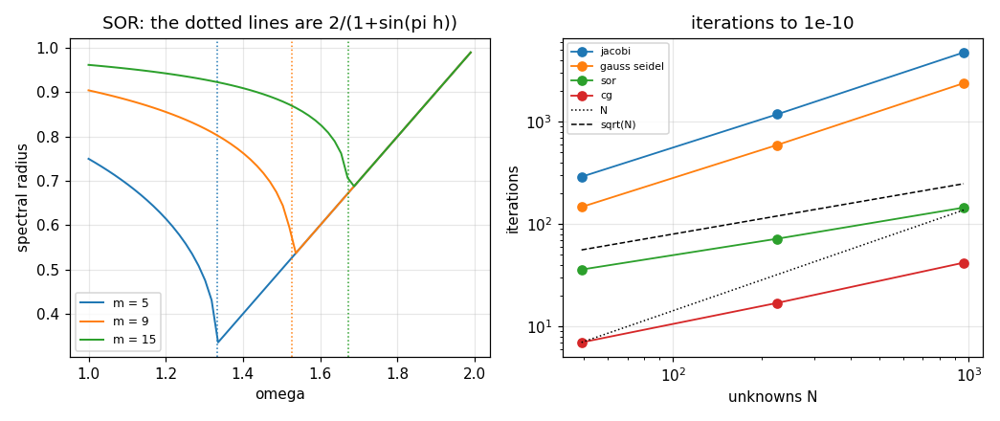

# 82. Elliptic Equations

**Part 11: Partial Differential Equations**

## Learning objectives

By the end of this lesson you will be able to:

1. Turn Laplace's and Poisson's equations into a sparse linear system and say what that system is.
2. Write down the spectrum of the five point matrix and get its condition number in closed form.
3. Choose a solver for it using Part 4's results, and measure the scaling rather than quoting it.
4. Find the optimal relaxation factor three independent ways and say why undershooting is worse
   than overshooting.
5. Assemble piecewise linear finite elements on a triangle mesh and say exactly when they are a
   different method from finite differences.

## Prerequisites

Lesson 77 (the five and nine point Laplacians and the ghost point boundary). Lesson 21 (banded
factorization). Lesson 23 (Jacobi, Gauss-Seidel, SOR and the spectral radius). Lesson 24
(conjugate gradients and the condition number bound). Lesson 76 (the weak form and one dimensional
assembly, which this lesson extends to two).

---

## 1. No direction to march in

$$
-(u_{xx} + u_{yy}) = f \quad\text{on a rectangle}, \qquad u \text{ given on the boundary}.
$$

There is no time here. Elliptic problems have no direction to march in: the value at every point
depends on the data everywhere, so discretizing gives not a recurrence but **one linear system**.
Using lesson 77's five point Laplacian and ordering the unknowns row by row,

$$
A u = b, \qquad A = \frac{1}{h^2}\,\text{blocktridiag}(-I,\; T,\; -I),
$$

with $N = m^2$ unknowns for $m$ interior points a side. Five nonzeros per row, symmetric, positive
definite, bandwidth $m$.

**The discretization is the easy half.** Everything Parts 3 and 4 said about a matrix like this
applies unchanged, which is why this lesson spends its time on the system rather than on the
stencil.

```python
# Standard setup, the same in every lesson of this course.
import sys, pathlib

_root = pathlib.Path.cwd()
while not (_root / "src" / "nalib").is_dir() and _root != _root.parent:
    _root = _root.parent
sys.path.insert(0, str(_root / "src"))

import numpy as np
import matplotlib.pyplot as plt

SEED = 42                                  # fixed so your numbers match the text
rng = np.random.default_rng(SEED)

np.set_printoptions(precision=6, linewidth=100, suppress=False)
plt.rcParams.update({
    "figure.figsize": (7.5, 4.5), "figure.dpi": 110,
    "axes.grid": True, "grid.alpha": 0.3, "font.size": 10,
})
```

```python
from nalib import elliptic as el
import numpy as np

problem = el.manufactured_problem()
for n in (5, 9, 17):
    system = el.assemble(problem, n)
    a = system["A"]
    print(f"points {n:>3}: {system['unknowns']**2:>4} unknowns, "
          f"{np.count_nonzero(a):>5} nonzeros "
          f"({100 * np.count_nonzero(a) / a.size:.1f}% dense), "
          f"symmetric {np.allclose(a, a.T)}")
```

*Output:*

```text
points   5:    9 unknowns,    33 nonzeros (40.7% dense), symmetric True
points   9:   49 unknowns,   217 nonzeros (9.0% dense), symmetric True
points  17:  225 unknowns,  1065 nonzeros (2.1% dense), symmetric True
```

### 1.1 Building the system from scratch

The assembly is one double loop, and the only part with any content is what happens at a row whose
neighbour is on the boundary: that term moves to the right hand side, because it is known.

```python
def assemble_from_scratch(problem, points):
    """Build A u = b for the interior of a square, folding the boundary into b."""
    line = np.linspace(problem["a"], problem["b"], points)
    h = float(line[1] - line[0])
    m = points - 2
    a = np.zeros((m * m, m * m))
    b = np.zeros(m * m)
    for i in range(m):
        for j in range(m):
            row = i * m + j
            x, y = line[i + 1], line[j + 1]
            a[row, row] = 4.0 / h ** 2
            b[row] = problem["source"](x, y)
            for di, dj in ((-1, 0), (1, 0), (0, -1), (0, 1)):
                ii, jj = i + di, j + dj
                if 0 <= ii < m and 0 <= jj < m:
                    a[row, ii * m + jj] = -1.0 / h ** 2
                else:
                    # the neighbour is on the boundary, where u is known: move it to b
                    b[row] += problem["boundary"](line[ii + 1], line[jj + 1]) / h ** 2
    return a, b

for n in (5, 9, 17):
    mine_a, mine_b = assemble_from_scratch(problem, n)
    theirs = el.assemble(problem, n)
    gap_a = float(np.max(np.abs(mine_a - theirs["A"])))
    gap_b = float(np.max(np.abs(mine_b - theirs["b"])))
    solution = np.linalg.solve(mine_a, mine_b)
    want = problem["exact"](theirs["x"], theirs["y"]).ravel()
    print(f"points {n:>3}: matrix gap {gap_a:.2e}, right hand side gap {gap_b:.2e}, "
          f"error {float(np.max(np.abs(solution - want))):.3e}")
    assert gap_a < 1e-12 and gap_b < 1e-12
```

*Output:*

```text
points   5: matrix gap 0.00e+00, right hand side gap 0.00e+00, error 5.303e-02
points   9: matrix gap 0.00e+00, right hand side gap 0.00e+00, error 1.295e-02
points  17: matrix gap 0.00e+00, right hand side gap 0.00e+00, error 3.219e-03
```

The boundary contribution is the only asymmetry in the construction, and it is the reason the
matrix stays symmetric: the term that leaves the row also leaves the corresponding column.

## 2. The spectrum, in closed form

The eigenvectors of the five point matrix are the products of one dimensional sine modes sampled
on the grid, so the eigenvalues are

$$
\lambda_{p,q} = \frac{4}{h^2}\left[\sin^2\frac{p\pi h}{2} + \sin^2\frac{q\pi h}{2}\right],
\qquad p, q = 1, \dots, m .
$$

Everything about conditioning and about iterative convergence follows from that one formula, and
it can be checked rather than trusted.

```python
out = el.the_spectrum_is_known_exactly()
print(f"{'m':>5}{'h':>9}{'formula gap':>14}{'kappa':>12}{'cot^2(pi h/2)':>16}"
      f"{'4/(pi^2 h^2)':>15}{'error':>9}")
for row in out["rows"]:
    print(f"{row['unknowns']:>5}{row['h']:>9.5f}{row['relative_gap']:>14.2e}"
          f"{row['condition_number']:>12.4f}{row['cot_squared']:>16.4f}"
          f"{row['small_h_form']:>15.4f}{row['small_h_error']:>9.4f}")
print(f"\nthe formula is exact: {out['the_formula_is_exact']}")
print(f"the condition number is exactly cot^2(pi h / 2): {out['cot_squared_is_exact']}")
print(f"fitted exponent of the condition number in h: {out['condition_exponent']:.3f}")

assert out["the_formula_is_exact"]
assert out["cot_squared_is_exact"]
```

*Output:*

```text
    m        h   formula gap       kappa   cot^2(pi h/2)   4/(pi^2 h^2)    error
    3  0.25000      3.90e-16      5.8284          5.8284         6.4846   0.1126
    5  0.16667      9.52e-16     13.9282         13.9282        14.5903   0.0475
    9  0.10000      1.17e-15     39.8635         39.8635        40.5285   0.0167
   17  0.05556      2.12e-15    130.6461        130.6461       131.3123   0.0051

the formula is exact: True
the condition number is exactly cot^2(pi h / 2): True
fitted exponent of the condition number in h: -2.064
```

Two things worth separating. The condition number is **exactly** $\cot^2(\pi h/2)$, which is a
closed form, not an asymptotic one. The familiar $4/(\pi^2h^2)$ is the small $h$ limit of that, and
it is an **overestimate** at every grid size: 11 per cent high at $m = 3$ and still half a per cent
high at $m = 17$. Both are reported here because quoting the second as if it were the first is the
usual shortcut.

$\kappa \sim h^{-2}$ is the number that drives the rest of the lesson. Refining the grid by two
quadruples the condition number, and every iterative method's cost follows from that.

## 3. Choosing a solver

Part 4 predicts: Jacobi and Gauss-Seidel take $O(N)$ iterations, SOR with the optimal factor takes
$O(\sqrt N)$, and conjugate gradients takes $O(\sqrt\kappa) = O(\sqrt N)$ with a much better
constant. Measuring all four on the same matrix is the only honest comparison.

```python
out = el.how_the_solvers_scale()
print(f"{'method':>14}" + "".join(f"{n:>10}" for n in out["unknowns"])
      + f"{'exponent':>11}{'predicted':>11}")
for row in out["rows"]:
    counts = "".join(f"{v:>10}" for v in row["iterations"])
    print(f"{row['method']:>14}{counts}{row['exponent_in_N']:>11.3f}"
          f"{row['predicted_exponent']:>11.1f}")
print(f"\ncheapest at the largest size: {out['cheapest_at_the_largest']}")
print(f"Jacobi needs {out['jacobi_over_cg']:.0f} times as many iterations as CG, "
      f"SOR {out['sor_over_cg']:.1f} times")

assert out["every_exponent_is_close_to_its_prediction"]
```

*Output:*

```text
        method        49       225       961   exponent  predicted
        jacobi       290      1182      4748      0.939        1.0
  gauss seidel       147       593      2377      0.935        1.0
           sor        36        72       145      0.468        0.5
            cg         7        17        42      0.602        0.5

cheapest at the largest size: cg
Jacobi needs 113 times as many iterations as CG, SOR 3.5 times
```

### 3.1 The test problem that proves nothing

The measurement above deliberately does **not** use the obvious test problem. Here is why.

```python
out = el.the_obvious_problem_is_degenerate_for_cg()
print(f"{'N':>6}   {'single mode: cg':>16}{'gs':>8}{'modes':>8}"
      f"   {'mixed: cg':>10}{'gs':>8}{'modes':>8}")
for row in out["rows"]:
    print(f"{row['unknowns']:>6}   {row['single mode']['cg']:>16}"
          f"{row['single mode']['gauss seidel']:>8}"
          f"{row['modes_in_the_single_mode_rhs']:>8}"
          f"   {row['mixed modes']['cg']:>10}{row['mixed modes']['gauss seidel']:>8}"
          f"{row['modes_in_the_mixed_rhs']:>8}")
print(f"\nCG finishes the single mode in one step at every size: "
      f"{out['cg_finishes_the_single_mode_in_one_step']}")
print(f"Gauss-Seidel barely notices the difference: {out['gauss_seidel_barely_notices']}")
print(out["note"])

assert out["cg_finishes_the_single_mode_in_one_step"]
assert out["gauss_seidel_barely_notices"]
```

*Output:*

```text
     N    single mode: cg      gs   modes    mixed: cg      gs   modes
    49                  1     147       1            7     147      18
   225                  1     595       1           17     593      42
   961                  1    2387       1           42    2377      90

CG finishes the single mode in one step at every size: True
Gauss-Seidel barely notices the difference: True
a Krylov method's cost depends on which eigenvectors the data contains; a stationary method's does not
```

$\sin(p\pi x)\sin(q\pi y)$ sampled on the grid is an **exact eigenvector** of the five point
matrix, so on that problem the right hand side has exactly one spectral component, the Krylov
space is one dimensional, and **conjugate gradients converges in one iteration at every grid
size**, however ill conditioned the matrix is.

That is not a fast solver, it is a degenerate test. Gauss-Seidel takes 147, 595 and 2387 on the
same problems and barely notices, because a stationary method's rate is set by the spectral radius
of its iteration matrix and not by which eigenvectors the data contains. That difference is the
practical face of what separates a Krylov method from a fixed point iteration, and it is worth
seeing once.

## 4. The optimal relaxation factor, three ways

For this matrix the optimal SOR factor is known in closed form:

$$
\omega^{*} = \frac{2}{1 + \sin(\pi h)}.
$$

Three independent routes should give the same number: the formula, a fine sweep of the spectral
radius of the iteration matrix, and Part 4's general expression
$2/(1 + \sqrt{1 - \rho_{\text{Jacobi}}^2})$ for any consistently ordered matrix.

```python
out = el.the_optimal_omega_is_where_the_formula_says()
print(f"{'m':>5}{'formula':>11}{'sweep':>11}{'general':>11}{'rho*':>10}{'rho GS':>10}"
      f"{'rate gain':>11}")
for row in out["rows"]:
    print(f"{row['unknowns']:>5}{row['predicted_omega']:>11.6f}{row['swept_omega']:>11.6f}"
          f"{row['general_formula_omega']:>11.6f}{row['best_radius']:>10.5f}"
          f"{row['gauss_seidel_radius']:>10.5f}{row['rate_gain']:>11.2f}")
print(f"\nthe Jacobi radius is exactly cos(pi h): {out['the_jacobi_radius_is_cos_pi_h']}")
print(f"the general formula agrees with the special one: {out['the_general_formula_agrees']}")
print(f"\nreal runs at m = 31: {out['iteration_counts']}")
print(f"gain over Gauss-Seidel: {out['measured_gain_over_gauss_seidel']:.1f}x")

assert out["the_sweep_finds_the_formula"]
assert out["the_general_formula_agrees"]
```

*Output:*

```text
    m    formula      sweep    general      rho*    rho GS  rate gain
    5   1.333333   1.336692   1.333333   0.33669   0.75000       3.78
    9   1.527864   1.532677   1.527864   0.53268   0.90451       6.28
   15   1.673514   1.678409   1.673514   0.67841   0.96194      10.00

the Jacobi radius is exactly cos(pi h): True
the general formula agrees with the special one: True

real runs at m = 31: {'optimal': 145, '0.05 low': 264, '0.05 high': 191, 'gauss seidel': 2377}
gain over Gauss-Seidel: 16.4x
```

The general formula reducing to the special one is the interesting part: $\rho_{\text{Jacobi}}$ for
this matrix is exactly $\cos(\pi h)$, and substituting that turns one expression into the other.

**The curve around the optimum is not symmetric.**

```python
print(f"{'m':>5}{'cost of being 0.05 low':>26}{'cost of being 0.05 high':>26}")
for row in out["rows"]:
    print(f"{row['unknowns']:>5}{row['cost_of_being_low']:>26.3f}"
          f"{row['cost_of_being_high']:>26.3f}")
print(f"\nmeasured on real runs: {out['measured_cost_of_being_low']:.2f}x for being low, "
      f"{out['measured_cost_of_being_high']:.2f}x for being high")

assert out["undershooting_costs_more_than_overshooting"]
```

*Output:*

```text
    m    cost of being 0.05 low   cost of being 0.05 high
    5                     1.624                     1.135
    9                     1.683                     1.148
   15                     1.802                     1.199

measured on real runs: 1.82x for being low, 1.32x for being high
```

Being $0.05$ **below** the optimum costs 1.82 times the iterations; being $0.05$ **above** costs
1.32 times. The practical rule follows: when you have to guess $\omega$, guess high.

```python
import numpy as np
from nalib.iterative import iteration_matrix, spectral_radius

fig, (left, right) = plt.subplots(1, 2, figsize=(9.5, 4.0))
for m in (5, 9, 15):
    h = 1.0 / (m + 1)
    a = el.five_point_matrix(m, h)
    grid = np.linspace(1.0, 1.99, 60)
    radii = [spectral_radius(iteration_matrix(a, "sor", omega=float(w))) for w in grid]
    line, = left.plot(grid, radii, lw=1.3, label=f"m = {m}")
    left.axvline(el.optimal_omega(h), color=line.get_color(), ls=":", lw=1.0)
left.set_xlabel("omega"); left.set_ylabel("spectral radius")
left.set_title("SOR: the dotted lines are 2/(1+sin(pi h))"); left.legend(fontsize=8)

out = el.how_the_solvers_scale()
sizes = np.asarray(out["unknowns"], dtype=float)
for row in out["rows"]:
    right.loglog(sizes, row["iterations"], "o-", lw=1.2, label=row["method"])
right.loglog(sizes, sizes * row["iterations"][0] / sizes[0], ":", color="k", lw=1.0,
             label="N")
right.loglog(sizes, np.sqrt(sizes) * 8.0, "--", color="k", lw=1.0, label="sqrt(N)")
right.set_xlabel("unknowns N"); right.set_ylabel("iterations")
right.set_title("iterations to 1e-10"); right.legend(fontsize=7)
fig.tight_layout(); fig.savefig("../figures/82_solvers.png", dpi=110); plt.close(fig)
print("saved ../figures/82_solvers.png")
```

*Output:*

```text
saved ../figures/82_solvers.png
```



## 5. Finite elements in two dimensions

Lesson 76 built the weak form in one dimension. In two dimensions the basis functions are the
piecewise linear "tent" functions on a triangulation, and the element matrix is exact with no
quadrature at all: the gradients are constant on each triangle, so

$$
K^{e}_{pq} = \text{area}\;\nabla\phi_p\cdot\nabla\phi_q .
$$

Split every square of a uniform grid along one diagonal and assemble.

```python
out = el.the_elements_give_the_five_point_stencil()
print(f"{'points':>8}{'triangles':>11}{'diagonal':>11}{'off diagonal':>15}{'largest gap':>15}")
for row in out["rows"]:
    print(f"{row['points']:>8}{row['triangles']:>11}{row['diagonal']:>11.4f}"
          f"{row['off_diagonal']:>15.4f}{row['largest_gap']:>15.3e}")
print(f"\nthe two matrices are the same: {out['the_matrices_are_the_same']}")
print(out["note"])

assert out["the_matrices_are_the_same"]
```

*Output:*

```text
  points  triangles   diagonal   off diagonal    largest gap
       4         18     4.0000        -1.0000      0.000e+00
       6         50     4.0000        -1.0000      8.882e-16
       9        128     4.0000        -1.0000      0.000e+00

the two matrices are the same: True
the two diagonal neighbours the triangulation creates cancel exactly between the two triangles that share them, which is why no fifth and sixth entry appears
```

**The assembled stiffness matrix is exactly $h^2$ times the five point matrix.** The diagonal is 4
and each axis neighbour is $-1$, and the two **diagonal** neighbours that the triangulation creates
contribute $+1$ and $-1$ from the two triangles they share and **cancel exactly**. That is why no
fifth and sixth entry appears, and it is the two dimensional version of lesson 76's discovery that
$hK = \mathrm{tridiag}(-1, 2, -1)$.

### 5.1 Where the two methods actually differ

In one dimension the answer was "in the right hand side". In two dimensions it is sharper than
that: it depends on the quadrature rule, and one common choice makes the two methods **identical**.

```python
out = el.the_two_methods_can_be_the_same_method()
print(f"{'points':>8}{'h':>9}{'differences':>14}{'vertex rule':>14}{'centroid rule':>16}"
      f"{'vertex gap':>13}")
for row in out["rows"]:
    print(f"{row['points']:>8}{row['h']:>9.5f}{row['finite_difference_error']:>14.3e}"
          f"{row['vertex_rule_error']:>14.3e}{row['centroid_rule_error']:>16.3e}"
          f"{row['vertex_matches_differences']:>13.2e}")
print(f"\norders: differences {out['finite_difference_order']:.3f}, "
      f"vertex {out['vertex_rule_order']:.3f}, centroid {out['centroid_rule_order']:.3f}")
print(f"the vertex rule IS the difference method: "
      f"{out['the_vertex_rule_is_the_difference_method']}")
print(f"the centroid rule is not, and is "
      f"{out['centroid_over_difference_at_the_finest']:.2f} times less accurate here")
print(f"\n{out['note']}")

assert out["the_vertex_rule_is_the_difference_method"]
assert out["the_centroid_rule_is_not"]
assert out["all_three_are_second_order"]
```

*Output:*

```text
  points        h   differences   vertex rule   centroid rule   vertex gap
       5  0.25000     5.303e-02     5.303e-02       8.525e-02     2.22e-16
       9  0.12500     1.295e-02     1.295e-02       2.139e-02     1.11e-16
      17  0.06250     3.219e-03     3.219e-03       5.353e-03     3.33e-16
      33  0.03125     8.036e-04     8.036e-04       1.339e-03     2.22e-16

orders: differences 2.014, vertex 2.014, centroid 1.998
the vertex rule IS the difference method: True
the centroid rule is not, and is 1.67 times less accurate here

six triangles of area h^2/2 meet at a node and the vertex rule gives each h^2/6 of the value there, which sums to exactly the difference method's h^2 f
```

With the **vertex** rule, area/3 times the source at each corner, the two methods agree to
$2\times10^{-16}$, which is to say they are the same program. The reason is a count: six triangles
of area $h^2/2$ meet at an interior node, the rule gives each of them $h^2/6$ of the value there,
and $6 \times h^2/6 = h^2$, which is exactly the difference method's right hand side after
multiplying through by $h^2$.

With the **centroid** rule, which is just as accurate as a quadrature, they part company: still
second order, and 67 per cent less accurate on this problem.

So "finite elements versus finite differences" is not a comparison of two methods here. It is a
comparison of two quadrature rules, with the same matrix on both sides. What finite elements buy
in general is what lesson 76 said: irregular geometry, varying coefficients, and a formulation
that exists when the strong form does not. On a uniform square with a smooth source they buy
nothing at all, and the measurement says so.

## 6. Exercises

**Level 1, understanding**

1.1 Explain why an elliptic problem gives a system rather than a recurrence.

1.2 State the eigenvalues of the five point matrix and its condition number.

1.3 Say why conjugate gradients converges in one step on the single mode problem.

1.4 State the optimal SOR factor and say what happens at $h = 1/2$.

1.5 Explain why the diagonal neighbours cancel in the triangulated stiffness matrix.

**Level 2, derivation**

2.1 Derive the eigenvalues of the five point matrix from the one dimensional ones.

2.2 Derive $\kappa = \cot^2(\pi h/2)$ and its small $h$ limit, and show the limit is an
overestimate.

2.3 Derive $\rho_{\text{Jacobi}} = \cos(\pi h)$ for this matrix and use Part 4's formula to get
$\omega^{*}$.

2.4 Derive the element stiffness matrix for a linear triangle.

2.5 Show that the vertex quadrature rule reproduces the finite difference right hand side exactly
on this mesh.

**Level 3, computational**

3.1 Implement the nine point Laplacian with the Mehrstellen correction of lesson 77 as a solve,
and measure the fourth order.

3.2 Implement the cooling fin of `cooling_fin`: three insulated edges, a flux over part of the
fourth, and a reaction term. Confirm the total heat balance.

3.3 Implement a sparse matrix version of the assembly and compare its cost and memory against the
dense one.

3.4 Implement multigrid from lesson 26 on this problem and measure whether its iteration count is
independent of $N$.

3.5 Implement the finite element method on an L shaped domain, which the difference method cannot
handle without special treatment, and measure the order at the reentrant corner.

**Level 4, experimental**

4.1 Measure the CG iteration count against $\sqrt\kappa$ across four grid sizes and fit the
constant in the bound.

4.2 Measure how the preconditioners of lesson 24 change the CG count on this matrix, and say which
is worth its cost.

4.3 Measure the effect of the ordering of the unknowns on the Gauss-Seidel rate: row by row against
red-black.

**Level 5, advanced**

5.1 **Why $\kappa \sim h^{-2}$ is unavoidable.** Show that any consistent second order
discretization of this operator has a condition number growing at least this fast, and identify
what a preconditioner is really doing about it.

5.2 **Superconvergence at the nodes.** Investigate whether the finite element solution is more
accurate at the nodes than the interpolation error would suggest, as it was in one dimension, and
say what changes in two.

5.3 **The reentrant corner.** On an L shaped domain the solution has a singularity at the corner
and the order drops. Predict the exponent from the corner angle, measure it, and describe the two
standard remedies.

## 7. Key takeaways

- **An elliptic problem is a linear system, not a march.** Five nonzeros a row, symmetric positive
  definite, bandwidth $m$, and Parts 3 and 4 apply unchanged.

- **The spectrum is exact**, and so is $\kappa = \cot^2(\pi h/2)$. The familiar $4/(\pi^2h^2)$ is
  its small $h$ limit and overestimates by 11 per cent at $m = 3$.

- **Measured scaling**: Jacobi $N^{0.94}$, Gauss-Seidel $N^{0.94}$, SOR $N^{0.47}$, CG $N^{0.60}$,
  against predictions of 1, 1, 0.5 and 0.5. At $N = 961$ Jacobi needs 113 times CG's iterations.

- **The obvious test problem proves nothing about CG.** Its right hand side is a single
  eigenvector, so CG finishes in **one** iteration at every size while Gauss-Seidel still needs
  2387.

- **The optimal $\omega$ agrees three ways**, and the general formula from Part 4 reduces to the
  special one because $\rho_{\text{Jacobi}} = \cos(\pi h)$ exactly.

- **Guess $\omega$ high.** Being $0.05$ low costs 1.82 times the iterations; being $0.05$ high
  costs 1.32.

- **Linear elements on a right triangle mesh give exactly the five point matrix**, because the
  diagonal contributions from the two triangles sharing an edge cancel.

- **With the vertex quadrature rule the two methods are the same program**, agreeing to
  $2\times10^{-16}$. With the centroid rule they differ by 67 per cent and both stay second order.
  On a uniform square the choice between them is a choice of quadrature.

## Where this goes next

Lesson 83 removes the linearity. A nonlinear elliptic problem gives a nonlinear system, which is
Part 2's Newton method applied to a very large residual with a very sparse Jacobian, and a
nonlinear time dependent problem gives a choice: discretize both variables at once, or discretize
space only and hand the result to Part 10. The second is the method of lines, and it is the bridge
back to everything the previous part built.
