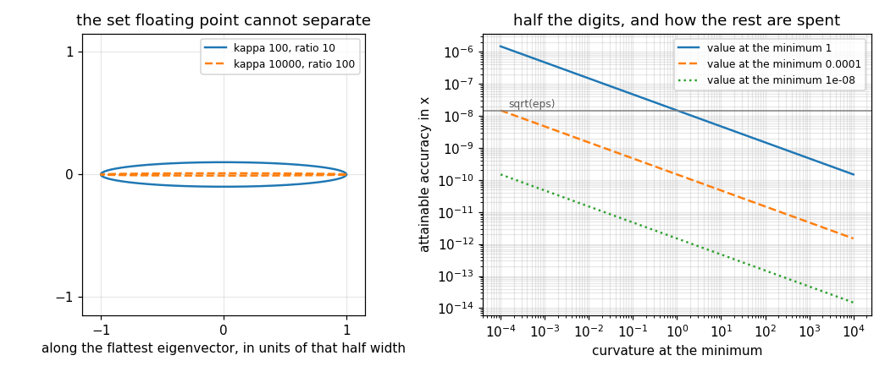

# 84. Optimization Fundamentals

**Part 12: Numerical Optimization**

## Learning objectives

By the end of this lesson you will be able to:

1. State the first and second order optimality conditions, and say exactly where the second order
   test is inconclusive and why it cannot be sharpened.
2. Explain why minimizing costs half your digits when solving an equation does not, and predict
   how many.
3. Predict the width of the flat region around a minimum from the Hessian, in any direction.
4. Say what the condition number of the Hessian does and does not tell you about an optimization
   problem.
5. Test a function for convexity by sampling, and say precisely what a clean sample proves.

## Prerequisites

Lesson 02 (floating point, machine epsilon, and relative error). Lesson 13 (Newton for systems and
the Jacobian). Lesson 61 (finite difference derivatives and the step that balances truncation
against rounding). Lesson 35 (eigenvalues of a symmetric matrix). Lesson 18 (the condition number
of a linear system, which is a different quantity with the same name).

---

## 1. Minimizing is not the same as solving

A minimum of a smooth $f$ satisfies $\nabla f(x^{*}) = 0$, so minimizing looks like a root problem
and Part 2 already solves those. Formally that is right. Numerically it is not, and the gap is the
subject of this whole part.

Expand around the minimum:

$$
f(x) = f(x^{*}) + \tfrac12 (x - x^{*})^{T} H (x - x^{*}) + O(\lVert x - x^{*}\rVert^{3}) .
$$

There is no linear term, because the gradient vanishes. So **moving away from the minimum changes
$f$ only at second order**. Turn that round. In floating point, $f$ is computed with a relative
error of about $\varepsilon_{\text{mach}}/2$, so two values of $f$ closer than
$(\varepsilon/2)\lvert f^{*}\rvert$ are the same number. Setting
$\tfrac12 c d^{2} = (\varepsilon/2)\lvert f^{*}\rvert$ gives

$$
\boxed{\;d = \sqrt{\frac{\varepsilon\,\lvert f^{*}\rvert}{c}}\;}
$$

Every point within $d$ of the minimum has the same computed value of $f$. **The minimum sits at the
bottom of a flat region whose width is the square root of the machine precision**, and no method
that reads only values of $f$ can locate it better than that.

For a root of $g$, by contrast, $g(x) \approx g'(x^{*})(x - x^{*})$ is linear, so an error
$\varepsilon$ in $g$ hides only an interval of width $\varepsilon / \lvert g'\rvert$. That is the
whole difference, and it is a square root.

```python
# Standard setup, the same in every lesson of this course.
import sys, pathlib

_root = pathlib.Path.cwd()
while not (_root / "src" / "nalib").is_dir() and _root != _root.parent:
    _root = _root.parent
sys.path.insert(0, str(_root / "src"))

import numpy as np
import matplotlib.pyplot as plt

SEED = 42                                  # fixed so your numbers match the text
rng = np.random.default_rng(SEED)

np.set_printoptions(precision=6, linewidth=100, suppress=False)
plt.rcParams.update({
    "figure.figsize": (7.5, 4.5), "figure.dpi": 110,
    "axes.grid": True, "grid.alpha": 0.3, "font.size": 10,
})
```

```python
from nalib import optimize as op

out = op.the_flat_region_is_as_wide_as_predicted()
print(f"{'curvature':>11}{'predicted width':>18}{'measured width':>17}{'ratio':>9}")
for row in out["rows"]:
    print(f"{row['curvature']:>11g}{row['predicted']:>18.4e}"
          f"{row['measured']:>17.4e}{row['ratio']:>9.4f}")
print(f"\nvalue at the minimum {out['value_at_the_minimum']}")
print(out["note"])

assert out["the_prediction_is_right"]
assert out["ratios_agree"]
```

*Output:*

```text
  curvature   predicted width   measured width    ratio
       0.01        1.4901e-07       1.4913e-07   1.0008
          1        1.4901e-08       1.4916e-08   1.0010
        100        1.4901e-09       1.4907e-09   1.0004

value at the minimum 1.0
the width scales exactly as 1/sqrt(curvature) and the constant is 1, because the half from the quadratic and the half from rounding to nearest cancel
```

Nothing here searches for anything. The measurement bisects outward from a known minimum until $f$
changes in floating point, so it is a property of the **problem**, not of any method.

### 1.1 Half the digits, measured against a root problem

The comparison that settles it runs the same three problems twice: once as a minimization, by
trisection on values of $f$, and once as a root problem, by bisection on values of $f'$. Both
searches run until their bracket is at rounding, so neither is being stopped early.

```python
out = op.you_only_get_half_the_digits()
print(f"{'problem':>34}{'min error':>12}{'root error':>12}"
      f"{'min / sqrt(eps)':>17}{'root / eps':>12}")
for row in out["rows"]:
    print(f"{row['case']:>34}{row['minimum_error']:>12.3e}{row['root_error']:>12.3e}"
          f"{row['minimum_error_over_root_eps']:>17.4f}{row['root_error_over_eps']:>12.4f}")
print(f"\nsqrt(eps) = {out['sqrt_eps']:.4e},  eps = {out['eps']:.4e}")
print(f"worst ratio between the two: {out['worst_ratio']:.3e}")

assert out["every_minimum_is_near_root_eps"]
assert out["every_root_is_near_eps"]
```

*Output:*

```text
                           problem   min error  root error  min / sqrt(eps)  root / eps
                cos, minimum at pi   1.054e-08   0.000e+00           0.7071      0.0000
     exp(x) - 2x, minimum at log 2   6.466e-09   1.110e-16           0.4340      0.5000
       x**2 - 2x + 3, minimum at 1   1.825e-08   0.000e+00           1.2247      0.0000

sqrt(eps) = 1.4901e-08,  eps = 2.2204e-16
worst ratio between the two: 8.219e+07
```

The minimizations stop about $\sqrt\varepsilon$ from the answer and the root finds stop about
$\varepsilon$ from it. That is seven orders of magnitude, and **it is not a fault of either
algorithm**. Replacing trisection with the cleverest minimizer ever written changes nothing,
because the information is not in the numbers.

### 1.2 The loss is a square root of the value at the minimum

The formula says the width scales as $\sqrt{\lvert f^{*}\rvert}$, which has a consequence worth
stating on its own: **when $f^{*} = 0$ nothing is lost at all.**

```python
out = op.the_loss_is_set_by_the_value_at_the_minimum()
print(f"{'value at the minimum':>22}{'error in x':>14}{'predicted':>14}{'ratio':>9}")
for row in out["rows"]:
    ratio = "-" if row["ratio"] != row["ratio"] else f"{row['ratio']:.4f}"
    print(f"{row['value_at_the_minimum']:>22g}{row['error']:>14.3e}"
          f"{row['predicted']:>14.3e}{ratio:>9}")
print(f"\nfitted power of the value at the minimum: "
      f"{out['fitted_power_of_the_value']:.4f}  (the prediction is 0.5)")
print(out["note"])

assert out["the_power_is_a_half"]
assert out["zero_value_is_exact"]
```

*Output:*

```text
  value at the minimum    error in x     predicted    ratio
                     0     2.220e-16     0.000e+00        -
                 1e-08     9.097e-13     1.054e-12   0.8634
                0.0001     8.232e-11     1.054e-10   0.7812
                     1     1.054e-08     1.054e-08   1.0000
                 10000     9.537e-07     1.054e-06   0.9051

fitted power of the value at the minimum: 0.5042  (the prediction is 0.5)
the error grows as the square root of the value at the minimum, and vanishes when that value is zero, which is the least squares case
```

The fitted power is $0.504$ against the predicted $0.5$, and the row at $f^{*} = 0$ locates the
minimum to $2.2\times10^{-16}$: full precision, no loss.

That row is not a curiosity. **A least squares problem has $f^{*} = 0$** when the model fits, or
close to it when it nearly fits, which is why Part 5 could report the errors it did and why
Gauss-Newton behaves better than a general purpose minimizer on the same data. If your objective is
a sum of squares, say so, and use a method that knows.

---

## 2. The optimality conditions

**First order.** If $x^{*}$ is a local minimum of a differentiable $f$, then
$\nabla f(x^{*}) = 0$. The converse is false, which is why there is a second condition.

**Second order.** At a stationary point, let $H$ be the Hessian.

- $H$ positive definite $\Rightarrow$ strict local minimum.
- $H$ negative definite $\Rightarrow$ strict local maximum.
- $H$ indefinite $\Rightarrow$ saddle, neither.
- $H$ singular $\Rightarrow$ **the test says nothing.**

The last line is not a weakness of any implementation, and the two fourth power cases prove it.

```python
out = op.stationary_points_are_classified_right()
print(f"{'case':>28}{'gradient':>10}{'eigenvalues':>22}{'verdict':>15}")
for row in out["rows"]:
    values = ", ".join(f"{v:g}" for v in row["eigenvalues"])
    print(f"{row['case']:>28}{row['gradient']:>10g}{values:>22}{row['verdict']:>15}")
print(f"\n{out['inconclusive_count']} of {len(out['rows'])} are inconclusive")
print(out["note"])

assert out["all_stationary"]
assert out["all_right"]
```

*Output:*

```text
                        case  gradient           eigenvalues        verdict
   x**2 + y**2 at the origin         0                  2, 2        minimum
   x**2 - y**2 at the origin         0                 -2, 2         saddle
  -x**2 - y**2 at the origin         0                -2, -2        maximum
          x**4 at the origin         0                     0   inconclusive
         -x**4 at the origin         0                    -0   inconclusive
          x**3 at the origin         0                     0   inconclusive

3 of 6 are inconclusive
every point here has a zero gradient, so the first order test passes on all six and separates none of them; the second order test separates three and reports the other three as inconclusive, which is the honest answer
```

Every one of the six has a zero gradient, so **the first order test passes on all six and separates
none of them.** The second order test separates three and reports the other three as inconclusive.

### 2.1 Why "inconclusive" cannot be improved

$x^{4}$ has a minimum at the origin and $-x^{4}$ has a maximum there. Both have gradient $0$ and
Hessian $0$. Their Taylor expansions agree through second order **exactly**, so no test built from
derivatives up to second order can distinguish them, no matter how it is written.

```python
out = op.the_fourth_power_cases_really_differ()
print(f"gradients agree: {out['gradients_agree']}, "
      f"Hessians agree: {out['hessians_agree']}")
print(f"x**4 rises away from the origin in every direction: "
      f"{out['one_rises_everywhere']}")
print(f"-x**4 falls away from the origin in every direction: "
      f"{out['the_other_falls_everywhere']}")
print(f"largest gap between the two on the sampled interval: "
      f"{out['largest_difference']:.4e}")
print(out["note"])

assert out["one_rises_everywhere"]
assert out["the_other_falls_everywhere"]
```

*Output:*

```text
gradients agree: True, Hessians agree: True
x**4 rises away from the origin in every direction: True
-x**4 falls away from the origin in every direction: True
largest gap between the two on the sampled interval: 1.2500e-01
both have gradient 0 and Hessian 0 at the origin, one has a minimum there and the other a maximum, so the second order test cannot be sharpened
```

A classifier that never returns "inconclusive" is not being decisive, it is guessing. The threshold
below which an eigenvalue counts as zero is $\sqrt{\varepsilon}\,\lVert H\rVert$ here, scaled by
the matrix so that multiplying $H$ by $10^{12}$ or $10^{-12}$ does not change the verdict.

---

## 3. Where the derivatives come from

Most of this part needs $\nabla f$ and some of it needs $H$. Lesson 61's balance applies directly,
and it gives the two a different accuracy that is worth knowing before it surprises you.

A central difference for a first derivative has truncation $O(h^{2})$ and rounding $O(\varepsilon/h)$,
smallest at $h \sim \varepsilon^{1/3}$, giving an error of about $\varepsilon^{2/3} \approx
4\times10^{-11}$. A central difference for a second derivative divides by $h^{2}$, so its rounding
term is $O(\varepsilon/h^{2})$, smallest at $h \sim \varepsilon^{1/4}$, giving about
$\varepsilon^{1/2} \approx 1.5\times10^{-8}$.

**The Hessian by differences is about four orders of magnitude less accurate than the gradient**, at
best, and it costs $4n^{2}$ evaluations against the gradient's $2n$.

```python
out = op.derivatives_are_right(op.rosenbrock(3))
print(f"{'trial':>7}{'gradient gap':>16}{'Hessian gap':>15}")
for k, row in enumerate(out["rows"]):
    print(f"{k:>7}{row['gradient_gap']:>16.3e}{row['hessian_gap']:>15.3e}")
print(f"\nworst gradient gap {out['worst_gradient_gap']:.3e}, "
      f"worst Hessian gap {out['worst_hessian_gap']:.3e}")
print(out["note"])

assert out["gradient_agrees"]
assert out["hessian_agrees"]
assert out["worst_gradient_gap"] < out["worst_hessian_gap"]
```

*Output:*

```text
  trial    gradient gap    Hessian gap
      0       1.723e-10      4.114e-08
      1       5.204e-11      2.052e-08
      2       9.518e-11      6.278e-08
      3       9.481e-10      5.143e-08
      4       1.277e-10      3.502e-08

worst gradient gap 9.481e-10, worst Hessian gap 6.278e-08
the Hessian by differences is much less accurate than the gradient, because dividing by h**2 doubles the rounding term
```

That gap is the reason every method in lessons 86 and 87 works hard to avoid forming a Hessian.
It is not only the $n^{2}$ cost, it is that the thing you paid $n^{2}$ evaluations for carries
eight digits instead of eleven.

### 3.1 Both formulas from scratch

Neither formula is more than a few lines, and writing them out makes the $2n$ against $4n^{2}$
difference concrete rather than quoted. The mixed second difference is the only piece that needs
care: it perturbs two coordinates at once, in all four sign combinations.

```python
import numpy as np


def my_gradient(f, x, step=None):
    v = np.asarray(x, dtype=float).ravel()
    base = np.finfo(float).eps ** (1.0 / 3.0) if step is None else float(step)
    out = np.zeros(v.size)
    for k in range(v.size):
        h = base * (1.0 + abs(v[k]))
        ahead, behind = v.copy(), v.copy()
        ahead[k] += h
        behind[k] -= h
        out[k] = (f(ahead) - f(behind)) / (ahead[k] - behind[k])
    return out


def my_hessian(f, x, step=None):
    v = np.asarray(x, dtype=float).ravel()
    base = np.finfo(float).eps ** 0.25 if step is None else float(step)
    steps = base * (1.0 + np.abs(v))
    out = np.zeros((v.size, v.size))
    for i in range(v.size):
        for j in range(i, v.size):
            first, second = np.zeros(v.size), np.zeros(v.size)
            first[i], second[j] = steps[i], steps[j]
            corners = (f(v + first + second) - f(v + first - second)
                       - f(v - first + second) + f(v - first - second))
            out[i, j] = out[j, i] = corners / (4.0 * steps[i] * steps[j])
    return out


rng = np.random.default_rng(42)
print(f"{'variables':>11}{'gradient calls':>16}{'Hessian calls':>15}"
      f"{'gradient gap':>15}{'Hessian gap':>14}")
for variables in (2, 4, 8):
    problem = op.rosenbrock(variables)
    where = rng.normal(size=variables)
    mine_g = my_gradient(problem["f"], where)
    mine_h = my_hessian(problem["f"], where)
    theirs_g = op.gradient(problem["f"], where)
    theirs_h = op.hessian(problem["f"], where)
    exact_g = problem["gradient"](where)
    exact_h = problem["hessian"](where)
    assert np.allclose(mine_g, theirs_g, rtol=0.0, atol=1e-14)
    assert np.allclose(mine_h, theirs_h, rtol=0.0, atol=1e-14)
    print(f"{variables:>11}{2 * variables:>16}"
          f"{4 * variables * (variables + 1) // 2:>15}"
          f"{float(np.max(np.abs(mine_g - exact_g))):>15.3e}"
          f"{float(np.max(np.abs(mine_h - exact_h))):>14.3e}")

print()
print("symmetry is imposed, not measured: the mixed difference is computed once per pair")
```

*Output:*

```text
  variables  gradient calls  Hessian calls   gradient gap   Hessian gap
          2               4             12      4.752e-09     2.044e-05
          4               8             40      2.373e-07     1.086e-04
          8              16            144      4.721e-08     4.217e-05

symmetry is imposed, not measured: the mixed difference is computed once per pair
```

The two implementations agree to $10^{-14}$, which is the check that the library is doing what it
says. The call counts are the point of the table: at eight variables the gradient costs $16$
evaluations and the Hessian costs $144$, and the Hessian's accuracy is still three orders of
magnitude worse.

---

## 4. Conditioning of an optimization problem

Lesson 18's condition number measured how much a linear solve amplifies a perturbation. The Hessian
has a condition number too, and it means something related but not identical, so it is worth being
exact about what it predicts.

Along an eigenvector of $H$ with eigenvalue $\lambda$, section 1's formula gives a flat region of
half width $\sqrt{\varepsilon \lvert f^{*}\rvert / \lambda}$. So the indistinguishable set around a
minimum is an **ellipsoid**, with axes along the eigenvectors and lengths proportional to
$1/\sqrt{\lambda}$. Its aspect ratio is

$$
\frac{\sqrt{\lambda_{\max}}}{\sqrt{\lambda_{\min}}} = \sqrt{\kappa(H)} ,
$$

the **square root** of the condition number, not the condition number.

```python
out = op.the_condition_number_is_an_aspect_ratio(op.quadratic(condition=1e4, dimension=2))
print(f"{'eigenvalue':>14}{'predicted half width':>23}{'measured half width':>22}")
for row in out["rows"]:
    print(f"{row['eigenvalue']:>14.4g}{row['predicted_half_width']:>23.4e}"
          f"{row['measured_half_width']:>22.4e}")
print(f"\ncondition number {out['condition_number']:.1f}, "
      f"sqrt of it {out['sqrt_condition']:.2f}")
print(f"measured aspect ratio {out['measured_aspect_ratio']:.2f}")

assert out["it_is_the_square_root"]
```

*Output:*

```text
    eigenvalue   predicted half width   measured half width
             1             1.4901e-08            1.4901e-08
         1e+04             1.4901e-10            1.4904e-10

condition number 10000.0, sqrt of it 100.00
measured aspect ratio 99.98
```

A condition number of $10^{4}$ shows up as an elongation of $100$. When a convergence plot looks
like the iterates are sliding along a narrow valley, that is the number to compare against.

### 4.1 Where the picture stops applying

Every statement above has $\lvert f^{*}\rvert$ in it, so when $f^{*} = 0$ there is no flat region at
all and no aspect ratio to measure. Rosenbrock is exactly that case.

```python
out = op.the_condition_number_is_an_aspect_ratio(op.rosenbrock(2))
print(f"condition number {out['condition_number']:.1f}, "
      f"sqrt of it {out['sqrt_condition']:.2f}")
print(f"is there a flat region? {out['there_is_a_flat_region']}")
for row in out["rows"]:
    print(f"  eigenvalue {row['eigenvalue']:>10.4f}  measured half width "
          f"{row['measured_half_width']:.3e}")
print(out["note"])

assert not out["there_is_a_flat_region"]
```

*Output:*

```text
condition number 2508.0, sqrt of it 50.08
is there a flat region? False
  eigenvalue     0.3994  measured half width 6.207e-17
  eigenvalue  1001.6006  measured half width 6.207e-17
the value at the minimum is zero, so there is no flat region and no aspect ratio: the widths are at the underflow edge
```

Both widths come out at $6.2\times10^{-17}$, which is where the underflow edge is rather than where
the mathematics is. The result reports that instead of dividing two meaningless numbers and quoting
the answer.

### 4.2 The condition number is not a difficulty measure

Four test problems, their Hessians at the minimum, and how many minima each has.

```python
out = op.the_conditioning_of_every_test_problem(dimension=2)
print(f"{'problem':>34}{'smallest':>12}{'largest':>12}{'condition':>12}{'minima':>8}")
for row in out["rows"]:
    print(f"{row['name']:>34}{row['smallest_eigenvalue']:>12.4g}"
          f"{row['largest_eigenvalue']:>12.4g}{row['condition']:>12.4g}"
          f"{row['minimizers']:>8}")
print(f"\nbest conditioned:  {out['best_conditioned']}")
print(f"worst conditioned: {out['worst_conditioned']}")
print(out["note"])

assert out["every_gradient_vanishes"]
assert out["every_point_is_a_minimum"]
```

*Output:*

```text
                           problem    smallest     largest   condition  minima
quadratic, condition 100, 2 variables           1         100         100       1
           Rosenbrock, 2 variables      0.3994        1002        2508       1
           Himmelblau, four minima       25.72       82.28         3.2       4
            Rastrigin, 2 variables       396.8       396.8           1       1

best conditioned:  Rastrigin, 2 variables
worst conditioned: Rosenbrock, 2 variables
the best conditioned problem here is the one with the most local minima, which is the whole reason conditioning is not a difficulty measure for optimization
```

Rastrigin's Hessian at the global minimum is a multiple of the identity, so its condition number is
exactly $1$: perfectly conditioned, and by far the hardest problem in the set, because the box
around it is full of other minima that any local method will happily stop at.

**The condition number describes the last few steps of a search and says nothing about finding the
right basin.** Both halves of that sentence are load bearing, and confusing them is how a paper
ends up reporting that its method "handles ill conditioning" when it was really tested on a bowl.

---

## 5. Convexity, and what sampling can prove

$f$ is convex exactly when its Hessian is positive semidefinite **everywhere**. That is a statement
about every point of the domain, and a finite sample touches none of it.

What sampling can do is find a counterexample. One negative eigenvalue anywhere settles the
question: the function is not convex. No negative eigenvalue in a thousand samples settles nothing.

The temptation is to believe that a large enough sample is as good as a proof. It is not, and the
experiment says how much worse.

```python
out = op.sampling_cannot_prove_convexity()
print(f"{'strip half width':>18}{'samples':>9}{'expected hits':>15}"
      f"{'smallest found':>16}{'found it':>10}{'chance of a hit':>17}")
for row in out["rows"]:
    print(f"{row['half_width']:>18g}{row['samples']:>9}{row['expected_hits']:>15.3f}"
          f"{row['smallest_found']:>16.4f}{str(row['found_the_dip']):>10}"
          f"{row['chance_of_a_hit']:>17.4f}")
print(f"\nevery function here has curvature -2 at the origin: "
      f"{out['every_function_here_is_not_convex']}")
print(f"smallest expectation that found it: "
      f"{out['smallest_expectation_that_found_it']:.3f}")
print(f"largest expectation that missed:    "
      f"{out['largest_expectation_that_missed']:.3f}")
print(f"least likely outcome in the table:  {out['least_likely_outcome']:.4f}")
print(f"shallowest fraction of the dip a successful sample reported: "
      f"{out['shallowest_fraction_of_the_dip_found']:.4f}")

assert out["every_function_here_is_not_convex"]
assert out["every_outcome_is_ordinary"]
```

*Output:*

```text
  strip half width  samples  expected hits  smallest found  found it  chance of a hit
               0.1      100          3.333         -1.9530      True           0.9643
               0.1      500         16.667         -1.9763      True           1.0000
               0.1     2000         66.667         -1.9981      True           1.0000
              0.01      100          0.333          1.1415     False           0.2835
              0.01      500          1.667          2.0000     False           0.8111
              0.01     2000          6.667         -1.9943      True           0.9987
             0.001      100          0.033          2.0000     False           0.0328
             0.001      500          0.167          2.0000     False           0.1535
             0.001     2000          0.667         -0.2712      True           0.4866

every function here has curvature -2 at the origin: True
smallest expectation that found it: 0.667
largest expectation that missed:    1.667
least likely outcome in the table:  0.1889
shallowest fraction of the dip a successful sample reported: 0.1356
```

Nine functions, all with curvature exactly $-2$ at the origin, differing only in how narrow the
non-convex strip is. Three findings, and the third is the one people miss.

**There is no sample size that suffices.** Whether the sample lands in the strip is a Poisson count
with mean $nw/3$, so a hit at $0.67$ expected hits and a miss at $1.67$ both appear in this table
and both are ordinary: the least likely outcome shown has probability $0.19$. Halve the strip and
you need twice the samples, forever.

**A clean sample is evidence about your sample size.** It tells you the non-convexity, if any, is
narrower than roughly $3/n$ of the box. That is a real statement and it is not "the function is
convex".

**Even a successful sample understates the problem.** The row that finds the dip at $0.67$ expected
hits reports a curvature of $-0.27$ where the truth is $-2$: it landed in the strip but not at the
bottom, so it found $14$ per cent of the depth. A method that adapts its step size to the measured
curvature would be badly misled.

```python
import matplotlib.pyplot as plt
import numpy as np

fig, (left, right) = plt.subplots(1, 2, figsize=(9.5, 4.0))

angle = np.linspace(0.0, 2.0 * np.pi, 600)
for condition, style in ((1e2, "-"), (1e4, "--")):
    problem = op.quadratic(condition=condition, dimension=2)
    centre = problem["minimizers"][0]
    values = np.linalg.eigvalsh(problem["hessian"](centre))
    half = np.array([op.attainable_accuracy(float(v), problem["f"](centre))
                     for v in values])
    long_axis, short_axis = float(np.max(half)), float(np.min(half))
    left.plot(np.cos(angle), (short_axis / long_axis) * np.sin(angle), style, lw=1.6,
              label=f"kappa {condition:g}, ratio {long_axis / short_axis:.0f}")
left.set_aspect("equal")
left.set_xlim(-1.15, 1.15)
left.set_ylim(-1.15, 1.15)
left.set_xticks([-1.0, 0.0, 1.0])
left.set_yticks([-1.0, 0.0, 1.0])
left.set_xlabel("along the flattest eigenvector, in units of that half width")
left.set_title("the set floating point cannot separate")
left.legend(fontsize=8, loc="upper right")
left.grid(alpha=0.3)

curvatures = np.logspace(-4.0, 4.0, 60)
for value, style in ((1.0, "-"), (1e-4, "--"), (1e-8, ":")):
    widths = [op.attainable_accuracy(float(c), value) for c in curvatures]
    right.loglog(curvatures, widths, style, lw=1.6,
                 label=f"value at the minimum {value:g}")
right.axhline(float(np.sqrt(np.finfo(float).eps)), color="0.5", lw=1.0)
right.text(1.5e-4, 1.8e-8, "sqrt(eps)", fontsize=8, color="0.35")
right.set_xlabel("curvature at the minimum")
right.set_ylabel("attainable accuracy in x")
right.set_title("half the digits, and how the rest are spent")
right.legend(fontsize=8)
right.grid(alpha=0.3, which="both")

fig.tight_layout(); fig.savefig("../figures/84_conditioning.png", dpi=110); plt.close(fig)
print("saved ../figures/84_conditioning.png")
```

*Output:*

```text
saved ../figures/84_conditioning.png
```



---

## 6. Exercises

**Level 1, understanding**

1.1 Explain why a minimum can be located only to about $\sqrt\varepsilon$ and a root to $\varepsilon$.

1.2 Say what the second order test decides and where it is silent.

1.3 Explain why $x^4$ and $-x^4$ cannot be separated by any second order test.

1.4 State what a clean convexity sample proves and what it does not.

1.5 Say why the condition number of the Hessian is not a measure of how hard a problem is.

**Level 2, derivation**

2.1 Derive $d = \sqrt{\varepsilon \lvert f^{*}\rvert / c}$ and account for both factors of a half.

2.2 Derive the aspect ratio $\sqrt{\kappa}$ of the indistinguishable set from the eigendecomposition
of $H$.

2.3 Derive the optimal step for a central second difference and show it gives $\varepsilon^{1/2}$
accuracy, against $\varepsilon^{2/3}$ for the gradient.

2.4 Show that a stationary point of a convex function is a global minimum.

2.5 Derive the Hessian of the Rosenbrock function in $n$ variables and show it is tridiagonal.

**Level 3, computational**

3.1 Implement the classification of stationary points from the Hessian and apply it to every
stationary point of Himmelblau's function, minima, maxima and saddles alike.

3.2 Implement a complex step gradient using lesson 61's routine, and measure how much of the
$\sqrt\varepsilon$ barrier it removes.

3.3 Implement automatic differentiation by dual numbers for the gradient, and compare its accuracy
and cost against differences.

3.4 Implement a check that a matrix is positive definite by Cholesky rather than by eigenvalues, and
compare the cost.

3.5 Implement the flat region measurement in $n$ dimensions and confirm the ellipsoid's axes are
the Hessian's eigenvectors.

**Level 4, experimental**

4.1 Measure the attainable accuracy against the value at the minimum over ten decades and fit the
power.

4.2 Measure how the accuracy of a finite difference gradient varies with the step, and locate the
minimum of the total error against the prediction $\varepsilon^{1/3}$.

4.3 Measure how often a uniform sample detects a narrow non-convex strip, over many repetitions, and
compare against the Poisson prediction.

**Level 5, advanced**

5.1 **When the square root does not apply.** Identify the class of problems for which the
$\sqrt\varepsilon$ barrier does not bind, and explain what a solver has to know to exploit it.

5.2 **Degenerate minima.** For $f = x^{4}$ the Hessian vanishes at the minimum. Work out the
attainable accuracy in that case and check it against a measurement.

5.3 **Conditioning and scaling.** Show that rescaling the variables changes the condition number of
the Hessian, find the rescaling that makes it 1 for a quadratic, and say why that is not available
in general.

## 7. Key takeaways

- **Minimizing costs half your digits and solving an equation does not.** The measured errors are
  $\sqrt\varepsilon$ and $\varepsilon$ on the same three problems, a factor of $10^{7}$, and no
  algorithm changes it.

- **The flat region's width is $\sqrt{\varepsilon \lvert f^{*}\rvert / c}$**, predicted to a ratio
  of $1.001$ at every curvature tried.

- **When $f^{*} = 0$ nothing is lost.** The measured error is $2.2\times10^{-16}$, and this is the
  least squares case, which is why Part 5 behaved better than this lesson would suggest.

- **The second order test is silent when the Hessian is singular**, and $x^{4}$ against $-x^{4}$
  shows that silence cannot be removed.

- **The indistinguishable set is an ellipsoid with aspect ratio $\sqrt{\kappa}$**, measured at
  $99.98$ for $\kappa = 10^{4}$.

- **Conditioning describes the last step, not the search.** Rastrigin has $\kappa = 1$ exactly and
  is the hardest problem in the set.

- **Sampling cannot prove convexity, and there is no sufficient sample size.** The hit count is
  Poisson, a hit at $0.67$ expected hits and a miss at $1.67$ both occur here, and a successful
  sample reported only $14$ per cent of the true depth.

## Where this goes next

Lesson 85 takes the $\sqrt\varepsilon$ barrier seriously and asks what can be done with values of
$f$ alone: golden section search, parabolic interpolation and the Nelder-Mead simplex. Lesson 86
brings in the gradient, where the condition number of section 4 turns from a statement about
precision into a statement about speed.
