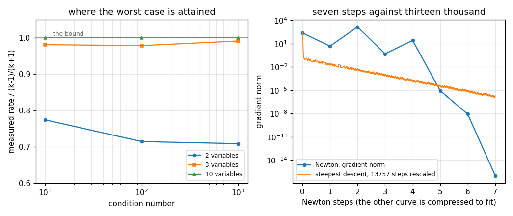

# 86. Gradient and Newton Methods

**Part 12: Numerical Optimization**

## Learning objectives

By the end of this lesson you will be able to:

1. State Kantorovich's rate bound for steepest descent, say where it is attained, and predict how
   many steps a given condition number costs.
2. Explain why a two variable test problem understates how badly steepest descent behaves.
3. Use Newton's method for a minimum, and say exactly what it does and does not guarantee.
4. Recognise the two ways the plain Newton step fails, and apply the two standard repairs.
5. Choose between the Armijo condition and the strong Wolfe conditions, and say what the second
   buys and where it is free.

## Prerequisites

Lesson 84 (the condition number of the Hessian, which changes here from a statement about
precision into a statement about speed). Lesson 85 (Nelder-Mead's failure, which the Armijo
condition is designed to rule out). Lesson 13 (Newton for systems, and its quadratic convergence).
Lesson 24 (conjugate gradients on a quadratic, whose bound has $\sqrt\kappa$ where this one has
$\kappa$). Lesson 21 (Cholesky, used here to test positive definiteness).

---

## 1. Steepest descent, and what the condition number costs

Go downhill: $x_{k+1} = x_k - \alpha_k \nabla f(x_k)$. On a quadratic
$f = \tfrac12 (x-x^{*})^{T}A(x-x^{*})$ the step that minimizes along the gradient has a closed
form, $\alpha = g^{T}g / g^{T}Ag$, so the method can be studied with no line search in the way.

Kantorovich's inequality then gives the sharp bound

$$
\frac{\lVert e_{k+1}\rVert_A}{\lVert e_k \rVert_A} \;\le\; \frac{\kappa - 1}{\kappa + 1} ,
\qquad \kappa = \frac{\lambda_{\max}}{\lambda_{\min}} .
$$

For $\kappa = 1000$ that is $0.998$ per step, so reducing the error by $10^{-8}$ needs about
$9200$ steps. **The count is linear in $\kappa$**, which is the whole story of this method and the
reason the rest of the part exists. Compare lesson 24: conjugate gradients on the same matrix has
$\sqrt\kappa$, which is $30$ times fewer steps here.

The bound is a worst case over starting points, so the useful question is whether it is ever
attained.

```python
# Standard setup, the same in every lesson of this course.
import sys, pathlib

_root = pathlib.Path.cwd()
while not (_root / "src" / "nalib").is_dir() and _root != _root.parent:
    _root = _root.parent
sys.path.insert(0, str(_root / "src"))

import numpy as np
import matplotlib.pyplot as plt

SEED = 42                                  # fixed so your numbers match the text
rng = np.random.default_rng(SEED)

np.set_printoptions(precision=6, linewidth=100, suppress=False)
plt.rcParams.update({
    "figure.figsize": (7.5, 4.5), "figure.dpi": 110,
    "axes.grid": True, "grid.alpha": 0.3, "font.size": 10,
})
```

```python
from nalib import gradient as gr

out = gr.the_kantorovich_bound_is_sharp()
print(f"{'variables':>11}{'kappa':>9}{'steps':>8}{'measured rate':>16}"
      f"{'(k-1)/(k+1)':>14}{'fraction':>11}")
for row in out["rows"]:
    print(f"{row['dimension']:>11}{row['condition']:>9g}{row['steps']:>8}"
          f"{row['measured_rate']:>16.6f}{row['bound']:>14.6f}"
          f"{row['fraction_of_the_bound']:>11.4f}")
print(f"\nsharp at the largest size tried: {out['sharp_at_the_largest_dimension']}")
print(f"worst fraction at two variables: {out['worst_fraction_at_the_smallest']:.4f}")
print(out["note"])

assert out["sharp_at_the_largest_dimension"]
assert out["not_sharp_at_the_smallest"]
```

*Output:*

```text
  variables    kappa   steps   measured rate   (k-1)/(k+1)   fraction
          2       10      57        0.633236      0.818182     0.7740
          2      100      73        0.700113      0.980198     0.7143
          2     1000      74        0.707140      0.998002     0.7086
          3       10     115        0.802449      0.818182     0.9808
          3      100     593        0.958885      0.980198     0.9783
          3     1000    2205        0.988814      0.998002     0.9908
          5       10     124        0.817947      0.818182     0.9997
          5      100    1139        0.978651      0.980198     0.9984
          5     1000    8717        0.997192      0.998002     0.9992
         10       10     123        0.818173      0.818182     1.0000
         10      100    1211        0.980184      0.980198     1.0000
         10     1000   12009        0.997988      0.998002     1.0000

sharp at the largest size tried: True
worst fraction at two variables: 0.7740
the bound is attained in enough dimensions and not in two, so a two variable test problem understates how bad steepest descent is
```

At **ten** variables the measured rate matches the bound to five digits at every condition number.
At five it is within $0.1$ per cent, at three within $2$ per cent, and at **two** it is nowhere
near: $0.633$ against $0.818$, and the gap widens as $\kappa$ grows.

**Two variables is not enough to see the worst case.** That matters more than it sounds, because
two variables is where every picture of an optimizer is drawn and where a great many quick tests
are run. On a two variable problem the gradient can only alternate between two orthogonal
directions, and the zigzag that the bound describes needs a third direction to keep re-exciting
both extremes. A method tested only in two dimensions will look better than it is.

### 1.1 The count, and the degeneracy that hides it

```python
out = gr.the_step_count_grows_with_the_condition_number()
print(f"{'kappa':>9}{'steps':>9}{'steps / kappa':>16}")
for row in out["rows"]:
    print(f"{row['condition']:>9g}{row['steps']:>9}{row['steps_over_condition']:>16.3f}")
print(f"\nfitted power of kappa: {out['fitted_power_of_the_condition_number']:.4f}")

assert out["the_growth_is_linear"]
```

*Output:*

```text
    kappa    steps   steps / kappa
       10      123          12.300
      100     1211          12.110
     1000    12009          12.009

fitted power of kappa: 0.9948
```

The fitted power is $0.995$: each factor of ten in $\kappa$ costs a factor of ten in steps, and the
constant $12$ barely moves.

Now the trap, and it is lesson 82's trap in a new costume.

```python
out = gr.an_eigenvector_start_is_degenerate()
print(f"{'kappa':>10}{'start along':>22}{'relative error after 1 step':>30}"
      f"{'over eps*kappa':>17}")
for row in out["rows"]:
    print(f"{row['condition']:>10g}{row['eigenvector']:>22}"
          f"{row['relative_error_after_one_step']:>30.3e}"
          f"{row['over_eps_times_condition']:>17.4f}")
print(f"\na start with energy in every direction takes "
      f"{out['a_spread_start_takes']} steps")
print(out["note"])

assert out["one_step_is_enough"]
assert out["the_residue_is_rounding_times_the_condition_number"]
```

*Output:*

```text
     kappa           start along   relative error after 1 step   over eps*kappa
        10   smallest eigenvalue                     6.810e-15           3.0671
        10               largest                     1.816e-16           0.0818
      1000   smallest eigenvalue                     1.217e-12           5.4829
      1000               largest                     1.541e-16           0.0007
    100000   smallest eigenvalue                     8.886e-10          40.0173
    100000               largest                     2.148e-16           0.0000

a start with energy in every direction takes 12009 steps
one exact step solves it, and what is left is rounding amplified by the condition number rather than plain rounding, so the condition number governs the residue and not the rate; the hard part of the problem is never excited, and a test problem has to be chosen rather than reached for
```

Start along a single eigenvector and steepest descent finishes in **one** step, at every condition
number, because the gradient there is a multiple of the same eigenvector and the exact line search
lands on the answer. A spread start on the same matrix takes $12009$.

What is left after that one step is worth a second look: it is not plain rounding but rounding
**amplified by $\kappa$**, $6.8\times10^{-15}$ at $\kappa = 10$ and $8.9\times10^{-10}$ at
$\kappa = 10^{5}$, both within a factor of $40$ of $\varepsilon\kappa$. So the condition number
governs the residue even where it does not govern the rate.

Lesson 82 found the same degeneracy for conjugate gradients: an eigenvector right hand side gives a
one dimensional Krylov space and one step convergence. **A test problem has to be chosen and not
reached for**, and the way to choose it is to check what the starting error looks like in the
eigenbasis.

---

## 2. Newton's method for a minimum

Model $f$ by its quadratic Taylor polynomial at $x_k$ and jump to that model's minimum:

$$
H(x_k)\,p = -\nabla f(x_k), \qquad x_{k+1} = x_k + p .
$$

Two properties follow immediately and they pull in opposite directions.

**It is scale invariant.** Replace $x$ by $Sx$ for any nonsingular $S$ and the Newton iterates are
the images of the old ones. The condition number of $H$ does not appear in the rate at all, which
is exactly what steepest descent could not manage.

**It is a root finder for $\nabla f$.** The equation solved is $\nabla f = 0$, which says nothing
about minima. Newton will converge to a maximum or a saddle just as happily, and section 3 shows it
doing so.

```python
out = gr.newton_is_quadratic_and_not_monotone()
print(f"{'variables':>11}{'steps':>7}{'rises':>7}{'biggest rise':>15}"
      f"{'e_k':>12}{'e_(k+1)':>12}{'e_(k+1)/e_k^2':>16}")
for row in out["rows"]:
    print(f"{row['variables']:>11}{row['steps']:>7}{row['rising_steps']:>7}"
          f"{row['biggest_rise']:>15.1f}{row['last_error']:>12.3e}"
          f"{row['next_error']:>12.3e}{row['quadratic_constant']:>16.1f}")
print(f"\nthe constant varies by a factor of {out['spread_in_the_constant']:.3f} "
      f"across a tenfold change in size")
print(out["note"])

assert out["every_run_rises_first"]
assert out["the_constant_is_size_independent"]
```

*Output:*

```text
  variables  steps  rises   biggest rise         e_k     e_(k+1)   e_(k+1)/e_k^2
          2      7      2          295.5   8.609e-06   8.286e-09           111.8
         10     34     11         1850.4   3.542e-04   1.820e-05           145.1
         20     46     19          178.9   1.296e-04   2.568e-06           152.8

the constant varies by a factor of 1.367 across a tenfold change in size
e_(k+1) is about 10**2 times e_k**2 at every size, which is quadratic convergence; the gradient still rises by a large factor first, so any quoted order has to say which steps it used
```

Two things, and the second is a measurement technique worth keeping.

**The gradient rises before it falls.** At two variables it goes
$2.3\times10^{2}, 4.6, 1.4\times10^{3}, 0.47, 25, 8.6\times10^{-6}, 8.3\times10^{-9}$: up by a
factor of $295$ at step 2, and by $1850$ at ten variables. Newton's method promises quadratic
convergence **near** a minimum and nothing at all away from one, and this is what that looks like.

**The convergence is quadratic, and the evidence is a ratio rather than a fitted order.** The
constant $e_{k+1}/e_k^{2}$ comes out at $112, 145, 153$ at two, ten and twenty variables, within a
factor of $1.4$ across a tenfold change in size. A fitted order cannot be quoted here for lesson
85's reason: squaring the error each step crosses from $10^{-4}$ to the floor in two steps, which
leaves two points, and a slope through two points that straddle a rise means nothing. **When there
is not enough room to fit an order, measure the constant instead.**

---

## 3. The two ways the plain step fails

### 3.1 It stops wherever the gradient vanishes

```python
out = gr.plain_newton_can_find_the_wrong_minimum()
print(f"{'variables':>11}{'steps':>7}{'final gradient':>17}{'f there':>12}"
      f"{'to (1,..,1)':>14}{'verdict':>11}")
for row in out["rows"]:
    print(f"{row['variables']:>11}{row['steps']:>7}{row['final_gradient']:>17.3e}"
          f"{row['f_there']:>12.4f}{row['to_the_global_minimum']:>14.4f}"
          f"{row['verdict']:>11}")
print(f"\nsizes that stopped somewhere else: {out['sizes_that_stopped_elsewhere']}")
print(f"of those, minima at {out['wrong_stops_that_are_minima']} "
      f"and saddles at {out['wrong_stops_that_are_saddles']}")
print(out["note"])

assert out["it_happens"]
assert out["it_stops_at_saddles_too"]
```

*Output:*

```text
  variables  steps   final gradient     f there   to (1,..,1)    verdict
          2      7        0.000e+00      0.0000        0.0000    minimum
          4     14        1.465e-14      3.7082        2.1457     saddle
          5     13        9.523e-14      3.9308        2.0182    minimum
          6     24        0.000e+00      0.0000        0.0000    minimum
          7     19        1.171e-13      3.9836        1.9948    minimum
         10     34        2.606e-13      0.0000        0.0000    minimum

sizes that stopped somewhere else: [4, 5, 7]
of those, minima at [5, 7] and saddles at [4]
the plain iteration solves grad f = 0 and does not look at the sign of the Hessian, so it stops at whatever stationary point it reaches: a second local minimum at four of these sizes and an outright saddle at one of them, both with a gradient at 10**-14 and every stopping test satisfied
```

At four, five and seven variables the plain iteration converges somewhere that is not the global
minimum, with a final gradient of $10^{-14}$ and every stopping test satisfied. At five and seven
it is a genuine second local minimum. **At four it is a saddle.**

That is the sharpest statement of what Newton's method is. It solves $\nabla f = 0$. A saddle
satisfies $\nabla f = 0$. Nothing in the iteration looks at the sign of the Hessian, so nothing
prevents it, and no stopping test built from the gradient can tell the difference. The only signal
available without knowing the answer is the value of $f$, which is $3.7$ at the saddle and $0$ at
the minimum.

### 3.2 The step is not always downhill

```python
out = gr.the_hessian_is_not_always_positive_definite(dimension=2)
print(f"at two variables, {100 * out['indefinite_in_the_box']:.1f} per cent of sampled "
      f"points have an indefinite Hessian")
for n in (5, 10):
    bigger = gr.the_hessian_is_not_always_positive_definite(dimension=n)
    print(f"at {n:>2} variables, "
          f"{100 * bigger['indefinite_in_the_box']:.1f} per cent")
```

*Output:*

```text
at two variables, 21.5 per cent of sampled points have an indefinite Hessian
at  5 variables, 48.2 per cent
at 10 variables, 71.0 per cent
```

Over the box around the Rosenbrock valley the Hessian is indefinite at $21.5$ per cent of points at
two variables, $47.7$ at five and $70.8$ at ten. Where it is indefinite, $p = -H^{-1}g$ need not
satisfy $g^{T}p < 0$ at all: the "descent" direction goes uphill.

The two standard repairs, applied together, are the usual answer.

**Shift the Hessian.** Replace $H$ by $H + \tau I$ with $\tau$ doubled until Cholesky succeeds. A
successful Cholesky is a proof of positive definiteness and costs a third of an $LU$, so this is
the cheapest available test as well as the repair. As $\tau$ grows the direction rotates from the
Newton step toward the steepest descent step, which is the right thing for it to do.

**Backtrack.** Halve the step until Armijo's condition holds,
$f(x + \alpha p) \le f(x) + c_1 \alpha\, g^{T}p$ with $c_1 = 10^{-4}$. This is what lesson 85's
Nelder-Mead failure needed and did not have: accepting any decrease at all permits a sequence of
ever smaller improvements converging to a non-stationary point, and asking for a fixed fraction of
the predicted decrease rules that out.

Together they guarantee that $f$ decreases every step and that the iterates approach a stationary
point.

Both fit in a screen, and writing them out makes the one place they interact visible: the shift has
to come first, because backtracking needs a direction that goes downhill before it can shorten it.

```python
import numpy as np


def my_newton_step(gradient_here, hessian_here):
    """Shift the Hessian until Cholesky succeeds, then solve. Returns the shift used."""
    matrix = 0.5 * (hessian_here + hessian_here.T)
    scale = max(float(np.max(np.abs(np.diag(matrix)))), 1.0)
    size = gradient_here.size
    shift = 0.0
    while True:
        try:
            np.linalg.cholesky(matrix + shift * np.eye(size))
            break
        except np.linalg.LinAlgError:
            shift = max(2.0 * shift, 1e-3 * scale)
    return np.linalg.solve(matrix + shift * np.eye(size), -gradient_here), shift


def my_backtracking(f, here, value, gradient_here, direction, c1=1e-4):
    """Halve until Armijo holds. Returns the step and how many halvings it took."""
    predicted = float(gradient_here @ direction)
    if predicted >= 0.0:
        raise ValueError("that direction goes uphill")
    step, halvings = 1.0, 0
    while f(here + step * direction) > value + c1 * step * predicted:
        step *= 0.5
        halvings += 1
        if step < 1e-20:
            break
    return step, halvings


from nalib.optimize import rosenbrock

budget = 200
for variables in (2, 5, 10):
    problem = rosenbrock(variables)
    f, g, h = problem["f"], problem["gradient"], problem["hessian"]
    x = problem["start"]
    shifts = cuts = 0
    for taken in range(budget):
        slope = g(x)
        if float(np.linalg.norm(slope)) < 1e-10:
            break
        direction, shift = my_newton_step(slope, h(x))
        if shift > 0.0:
            shifts += 1
        step, halvings = my_backtracking(f, x, float(f(x)), slope, direction)
        if halvings:
            cuts += 1
        x = x + step * direction
    theirs = gr.newton(problem, safeguard=True, max_steps=2000)
    print(f"{variables:>3} variables: mine {taken:>4} of {budget} steps to "
          f"|x-(1..1)| = {float(np.linalg.norm(x - 1.0)):.3e}, "
          f"{shifts} shifts and {cuts} cuts; "
          f"library {theirs['steps']:>4} steps to "
          f"{float(np.linalg.norm(theirs['x'] - 1.0)):.3e}")
```

*Output:*

```text
  2 variables: mine   22 of 200 steps to |x-(1..1)| = 0.000e+00, 0 shifts and 4 cuts; library   22 steps to 0.000e+00
  5 variables: mine   18 of 200 steps to |x-(1..1)| = 2.018e+00, 1 shifts and 3 cuts; library   18 steps to 2.018e+00
 10 variables: mine  199 of 200 steps to |x-(1..1)| = 1.993e+00, 1 shifts and 178 cuts; library 1999 steps to 1.993e+00
```

The two implementations stop at the same point at every size, to the last digit, and take the same
number of steps wherever neither hits its own iteration cap. At ten variables both crawl until they
run out of iterations, mine at 200 and the library's at 2000, with 178 and 1978 steps cut: the same
behaviour seen twice, which is section 3.3's finding rather than a difference between the two.

### 3.3 What that guarantee is not

```python
out = gr.the_safeguards_help_and_hurt()
print(f"{'variables':>11}{'plain steps':>13}{'plain dist':>12}{'plain':>10}"
      f"{'safe steps':>12}{'safe dist':>11}{'safe':>10}{'shifts':>8}{'cuts':>7}")
for row in out["rows"]:
    print(f"{row['variables']:>11}{row['plain_steps']:>13}"
          f"{row['plain_distance']:>12.4g}{row['plain_verdict']:>10}"
          f"{row['safe_steps']:>12}{row['safe_distance']:>11.4g}"
          f"{row['safe_verdict']:>10}{row['shifts']:>8}{row['cuts']:>7}")
print(f"\nrescued at {out['rescued']}, spoiled at {out['spoiled']}")
print(out["note"])

assert out["it_rescues_the_saddle"]
assert out["it_also_makes_things_worse"]
```

*Output:*

```text
  variables  plain steps  plain dist     plain  safe steps  safe dist      safe  shifts   cuts

          2            7           0   minimum          22          0   minimum       0      4
          4           14       2.146    saddle          26          0   minimum       2      5
          5           13       2.018   minimum          18      2.018   minimum       3      3
          6           24           0   minimum          20      1.999   minimum       2      2
          7           19       1.995   minimum          22      1.995   minimum       0      4
         10           34   4.112e-13   minimum        1999      1.993   minimum       4   1978

rescued at [4], spoiled at [6, 10]
the safeguards guarantee descent to a stationary point and nothing about which one; here they rescue the saddle, change nothing at two sizes, and take two runs that had found the global minimum to a worse one
```

Three outcomes, and reporting only the first would be the easy mistake.

**It rescues the saddle.** At four variables the plain method stopped at a saddle and the
safeguarded one reaches the global minimum. This is the case the safeguards exist for and they work.

**It changes nothing at five and seven.** Both methods land on the same second local minimum. A
globalization fixes the direction and the step length; it does not choose the basin.

**It makes six and ten worse.** At both sizes the plain method found the global minimum and the
safeguarded one does not. At ten variables it takes $1999$ steps with $1978$ of them cut, which is
the line search taking over and the method crawling along the valley floor rather than jumping
across it.

**Guaranteed descent is not guaranteed descent to the right place.** The theorem says the iterates
approach a stationary point, and every run above satisfies it. A paper reporting only that its
globalized method converged would be telling the truth and saying nothing.

---

## 4. Armijo, Wolfe, and what the second condition buys

Armijo bounds the step from **above**: do not overshoot. The other failure is a step that is too
**short**, and Armijo permits it, so a second condition is needed:

$$
\lvert \nabla f(x + \alpha p)^{T} p\rvert \;\le\; c_2\,\lvert \nabla f(x)^{T}p\rvert ,
\qquad c_2 = 0.9 ,
$$

the curvature condition. Together they are the strong Wolfe conditions, and they are what a
quasi-Newton update needs in lesson 87, because that update is only guaranteed to stay positive
definite when the curvature condition holds.

The question is what it costs, and the answer depends on the problem in a way worth measuring.

```python
out = gr.wolfe_is_stricter_than_armijo()
print(f"{'family':>28}{'Armijo step':>14}{'Wolfe step':>13}"
      f"{'Armijo had curvature':>23}{'Wolfe calls':>13}")
for row in out["rows"]:
    print(f"{row['family']:>28}{row['armijo_step']:>14.6g}{row['wolfe_step']:>13.6g}"
          f"{str(row['armijo_also_has_curvature']):>23}"
          f"{row['extra_calls_for_wolfe']:>13}")
print(f"\nbiggest ratio between the two steps: {out['biggest_step_ratio']:.0f}")
print(out["note"])

assert out["on_rosenbrock_curvature_is_free"]
assert out["on_the_flat_quadratic_armijo_is_too_short"]
```

*Output:*

```text
                      family   Armijo step   Wolfe step   Armijo had curvature  Wolfe calls
                  Rosenbrock    0.00390625   0.00390625                   True            9
                  Rosenbrock    0.00390625   0.00390625                   True            9
                  Rosenbrock   0.000976562  0.000976562                   True           11
                  Rosenbrock   0.000976562  0.000976562                   True           11
                  Rosenbrock    0.00195312   0.00195312                   True           10
                  Rosenbrock    0.00195312   0.00195312                   True           10
  flat quadratic, scale 0.01             1            8                  False            4
flat quadratic, scale 0.0001             1          512                  False           10
 flat quadratic, scale 1e-06             1        65536                  False           17

biggest ratio between the two steps: 65536
the curvature condition costs gradient evaluations and buys nothing where backtracking already had to shrink the step; it earns its keep exactly where the full step is accepted and is far too short, which is what a quasi-Newton update of lesson 87 needs
```

**On Rosenbrock the curvature condition is free and useless.** Backtracking from $\alpha = 1$ has
to halve seven or ten times before Armijo holds, and by then the step is short enough that the
curvature condition holds too. The strong Wolfe search returns the **identical** step, for nine to
eleven extra gradient evaluations.

**On a flat quadratic it is the only thing that notices.** With $f = s\,\lVert x\rVert^{2}$ and $s$
small, the full step $\alpha = 1$ passes Armijo immediately because the required decrease is tiny,
and it is $8$, $512$ and $65536$ times too short at $s = 10^{-2}, 10^{-4}, 10^{-6}$. Armijo alone
accepts all three. The curvature condition rejects them and the search extends the step instead.

So the honest summary is a conditional one. **The curvature condition earns its keep exactly where
the full step is accepted, and costs gradient evaluations for nothing where backtracking already
had to shrink.** Which of those you are in depends on the scaling of your objective, which is why
production codes use the strong Wolfe search and pay for it.

---

## 5. The cost, counted properly

Steps are the wrong unit. A steepest descent step costs one gradient, $2n$ evaluations by
differences. A Newton step costs a gradient, a Hessian at $2n(n+1)$ evaluations, and an $n^{3}$
solve. **Counting steps flatters Newton by a factor of about $2(n+1)$.**

The comparison has to be made where both methods answer the same question, which after section 3
means quadratics rather than Rosenbrock.

```python
out = gr.gradient_against_newton()
print(f"{'variables':>11}{'kappa':>8}{'descent steps':>15}{'descent evals':>15}"
      f"{'Newton steps':>14}{'Newton evals':>14}{'ratio':>10}")
for row in out["rows"]:
    print(f"{row['variables']:>11}{row['condition']:>8g}{row['descent_steps']:>15}"
          f"{row['descent_evaluations']:>15}{row['newton_steps']:>14}"
          f"{row['newton_evaluations']:>14}{row['evaluation_ratio']:>10.2f}")
print(f"\non Rosenbrock at two variables, where both find the same minimum:")
print(f"  steepest descent {out['rosenbrock_descent_steps']} steps, "
      f"Newton {out['rosenbrock_newton_steps']}")
print(out["note"])

assert out["newton_solves_a_quadratic_in_one_step"]
assert out["smallest_evaluation_ratio"] > 1.0
```

*Output:*

```text
  variables   kappa  descent steps  descent evals  Newton steps  Newton evals     ratio
          2      10             15             60             1            16      3.75
          2     100              9             36             1            16      2.25
          2    1000              7             28             1            16      1.75
          5      10             93            930             1            70     13.29
          5     100            763           7630             1            70    109.00
          5    1000           4793          47930             1            70    684.71
         10      10             91           1820             1           240      7.58
         10     100            831          16620             1           240     69.25
         10    1000           9190         183800             1           240    765.83

on Rosenbrock at two variables, where both find the same minimum:
  steepest descent 13756 steps, Newton 7
Newton takes one step on a quadratic at every condition number and every size, which is the whole point of using curvature; steepest descent takes a number of steps proportional to kappa, and the Hessian's 2n(n+1) evaluations are the price
```

**Newton takes exactly one step on a quadratic**, at every condition number and every size, because
the quadratic model is the function. That is the whole reason to pay for curvature.

The evaluation ratio runs from $1.75$ to $766$. At two variables and $\kappa = 1000$ Newton wins by
less than a factor of two, because $2n(n+1) = 12$ Hessian evaluations against steepest descent's
$28$ leaves almost nothing in it. At ten variables and $\kappa = 1000$ it wins by $766$. **The
Hessian's cost is real and the advantage has to beat it**, which is what makes lesson 87's
quasi-Newton methods, which build curvature from gradients alone, the ones that are actually used.

```python
import matplotlib.pyplot as plt
import numpy as np

fig, (left, right) = plt.subplots(1, 2, figsize=(9.5, 4.0))

for dimension, style in ((2, "o-"), (3, "s-"), (10, "^-")):
    rows = [r for r in gr.the_kantorovich_bound_is_sharp(
        dimensions=(dimension,), conditions=(10.0, 100.0, 1000.0))["rows"]]
    kappas = [r["condition"] for r in rows]
    left.semilogx(kappas, [r["fraction_of_the_bound"] for r in rows], style, ms=4,
                  lw=1.5, label=f"{dimension} variables")
left.axhline(1.0, color="0.5", lw=1.0)
left.text(12, 1.005, "the bound", fontsize=8, color="0.35")
left.set_ylim(0.6, 1.05)
left.set_xlabel("condition number")
left.set_ylabel("measured rate / (k-1)/(k+1)")
left.set_title("where the worst case is attained")
left.legend(fontsize=8, loc="lower right")
left.grid(alpha=0.3, which="both")

history = gr.newton(gr.rosenbrock(2))["gradient_history"]
history = np.maximum(history, 1e-16)
right.semilogy(np.arange(history.size), history, "o-", ms=4, lw=1.5,
               label="Newton, gradient norm")
descent = gr.steepest_descent(gr.rosenbrock(2), tol=1e-6,
                              max_steps=400000)["gradient_history"]
shown = descent[::max(1, descent.size // 400)]
right.semilogy(np.linspace(0, history.size - 1, shown.size), shown, "-", lw=1.2,
               label=f"steepest descent, {descent.size} steps rescaled")
right.set_xlabel("Newton steps (the other curve is compressed to fit)")
right.set_ylabel("gradient norm")
right.set_title("seven steps against thirteen thousand")
right.legend(fontsize=8)
right.grid(alpha=0.3, which="both")

fig.tight_layout(); fig.savefig("../figures/86_gradient.png", dpi=110); plt.close(fig)
print("saved ../figures/86_gradient.png")
```

*Output:*

```text
saved ../figures/86_gradient.png
```



---

## 6. Exercises

**Level 1, understanding**

1.1 State Kantorovich's bound and say what it predicts for $\kappa = 10^{4}$.

1.2 Explain why a two variable problem understates steepest descent's difficulty.

1.3 Say what Newton's method for a minimum actually solves, and what follows.

1.4 Explain why a converged Newton run with a gradient of $10^{-14}$ can be at a saddle.

1.5 State both Wolfe conditions and say which failure each rules out.

**Level 2, derivation**

2.1 Derive $\alpha = g^{T}g / g^{T}Ag$ for the exact line search on a quadratic.

2.2 Derive Kantorovich's inequality and the rate bound that follows from it.

2.3 Show that Newton's method is invariant under an affine change of variables and that steepest
descent is not.

2.4 Show that the Newton direction is a descent direction when $H$ is positive definite, and give a
case where it is not.

2.5 Show that $H + \tau I$ is positive definite for $\tau > -\lambda_{\min}$ and that the direction
tends to the steepest descent direction as $\tau$ grows.

**Level 3, computational**

3.1 Implement the modified Cholesky of Gill, Murray and Wright, which shifts during the
factorization rather than restarting it, and compare its cost against the doubling loop here.

3.2 Implement a Newton solver that uses conjugate gradients for the linear system, stopping early
when negative curvature is found, which is the Newton-CG method.

3.3 Implement steepest descent with the Barzilai-Borwein step and measure it against the exact line
search on the same quadratics.

3.4 Implement a gradient check by finite differences and use it to detect a deliberately wrong
gradient.

3.5 Implement a two dimensional contour plot of the Rosenbrock valley with both methods' paths on
it, and count how many steps each spends crossing the valley rather than following it.

**Level 4, experimental**

4.1 Measure the smallest number of variables at which the Kantorovich bound is attained to within
one per cent, at three different condition numbers.

4.2 Measure how often plain Newton on Rosenbrock reaches a saddle, over many random starting
points, at each dimension from 2 to 10.

4.3 Measure the Armijo constant $c_1$ against the number of iterations and the number of function
evaluations, over five decades of $c_1$.

**Level 5, advanced**

5.1 **Why $\kappa$ and not $\sqrt\kappa$.** Explain why steepest descent has $\kappa$ where
conjugate gradients has $\sqrt\kappa$, in terms of the polynomial each method implicitly builds.

5.2 **Scale invariance and preconditioning.** Show that steepest descent on $Sx$ is preconditioned
steepest descent on $x$, identify the $S$ that makes the condition number 1, and say why it is not
available.

5.3 **The saddle.** For the four variable Rosenbrock, find the saddle the plain method converges
to, verify its Hessian has exactly one negative eigenvalue, and say what a method would have to do
to escape it.

## 7. Key takeaways

- **Steepest descent costs $O(\kappa)$ steps.** The fitted power is $0.995$ and the constant is
  about $12$.

- **The Kantorovich bound is attained, but not in two variables.** Ten variables matches it to five
  digits; two variables sits at $0.63$ of it and drifts further as $\kappa$ grows.

- **An eigenvector start finishes in one step** at every condition number, where a spread start
  takes $12009$. The same degeneracy as lesson 82's conjugate gradients.

- **Newton's gradient rises before it falls**, by a factor of $295$ at two variables and $1850$ at
  ten, and then converges quadratically with $e_{k+1}/e_k^{2}$ at $112, 145, 153$.

- **Measure the constant when there is no room to fit an order.** Quadratic convergence leaves two
  usable points before the floor.

- **Newton stops wherever the gradient vanishes**, including at a saddle at four variables, with
  every stopping test satisfied.

- **The Hessian is indefinite over most of the domain** in higher dimensions: $21.5$, $47.7$ and
  $70.8$ per cent at two, five and ten variables.

- **The safeguards rescue one run and spoil two.** Guaranteed descent to a stationary point is a
  real guarantee and it is not a guarantee about which one.

- **The curvature condition is free where it is useless and essential where the full step is
  accepted**, differing by a factor of $65536$ on a flat quadratic.

- **Count evaluations, not steps.** Newton's advantage runs from $1.75$ to $766$, and the Hessian's
  $2n(n+1)$ evaluations are what it has to beat.

## Where this goes next

Lesson 87 keeps Newton's rate and drops its Hessian. Quasi-Newton methods build an approximate
curvature matrix from successive gradients, which costs $O(n^{2})$ storage and no extra
evaluations, and the curvature condition of section 4 is what keeps that approximation positive
definite. Trust regions replace the line search with a different globalization that handles the
indefinite Hessian of section 3.2 directly rather than shifting it away.
