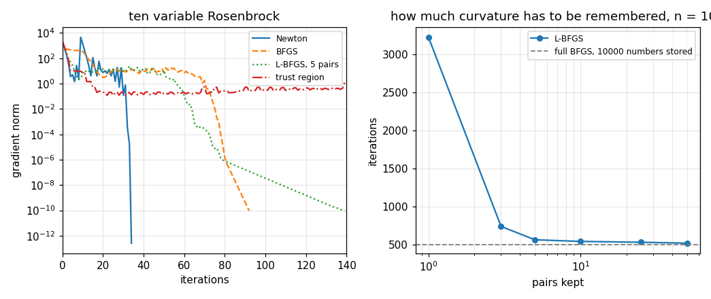

# 87. Quasi-Newton and Trust Region Methods

**Part 12: Numerical Optimization**

## Learning objectives

By the end of this lesson you will be able to:

1. Derive the secant condition, say why it does not determine the update, and name the conditions
   that do.
2. Explain why the BFGS update needs $y^{T}s > 0$ and why that makes the Wolfe line search a
   precondition rather than a refinement.
3. Distinguish superlinear from quadratic convergence by measurement, and say when the distinction
   cannot be resolved in double precision.
4. Use limited memory BFGS and say what is given up.
5. Explain how a trust region handles an indefinite Hessian without shifting it, and what it does
   not fix.

## Prerequisites

Lesson 86 (Newton's cost and its two failures, and the Wolfe conditions, all of which this lesson
is the answer to). Lesson 11 (the secant method, which the secant condition generalizes). Lesson 24
(conjugate gradients on a quadratic, whose nonlinear cousins are in section 5). Lesson 85 (why a
fast method can outrun the precision before its rate can be fitted, which happens again here).

---

## 1. The secant condition

Newton uses $H(x_k)$, which costs $2n(n+1)$ evaluations. But the gradients already computed carry
curvature information for free: if $s_k = x_{k+1} - x_k$ and $y_k = g_{k+1} - g_k$, then for a
quadratic

$$
H s_k = y_k
$$

exactly, and for a general $f$ approximately. So **ask the approximation to satisfy that**:

$$
B_{k+1}\,s_k = y_k .
$$

In one dimension this says $B = (g_{k+1} - g_k)/(x_{k+1} - x_k)$, which is the secant method of
lesson 11 applied to $f'$. In $n$ dimensions it is $n$ equations for the $n^{2}$ entries of
$B_{k+1}$, so it does not determine the update. Three more requirements do:

- **symmetry**, since a Hessian is symmetric,
- **positive definiteness**, so the direction goes downhill,
- **minimal change** from $B_k$ in a weighted Frobenius norm, since nothing has been learned about
  the other directions.

The unique answer is BFGS. In the inverse form, which avoids a solve,

$$
H_{k+1} = \left(I - \rho\,s y^{T}\right) H_k \left(I - \rho\,y s^{T}\right) + \rho\, s s^{T},
\qquad \rho = \frac{1}{y^{T}s} .
$$

Two things to check, and they are different kinds of claim.

```python
# Standard setup, the same in every lesson of this course.
import sys, pathlib

_root = pathlib.Path.cwd()
while not (_root / "src" / "nalib").is_dir() and _root != _root.parent:
    _root = _root.parent
sys.path.insert(0, str(_root / "src"))

import numpy as np
import matplotlib.pyplot as plt

SEED = 42                                  # fixed so your numbers match the text
rng = np.random.default_rng(SEED)

np.set_printoptions(precision=6, linewidth=100, suppress=False)
plt.rcParams.update({
    "figure.figsize": (7.5, 4.5), "figure.dpi": 110,
    "axes.grid": True, "grid.alpha": 0.3, "font.size": 10,
})
```

```python
from nalib import quasinewton as qn

out = qn.the_secant_condition_holds_and_needs_positive_curvature()
print(f"Rosenbrock at {out['variables']} variables: {out['steps']} steps, "
      f"final distance {out['distance']:.3e}")
print(f"worst secant residual over the run: {out['worst_secant_residual']:.3e}")
print(f"smallest y.s seen: {out['smallest_curvature']:.3e}")
print(f"every y.s positive: {out['every_curvature_positive']}")
print(f"updates skipped because y.s fell under the threshold: "
      f"{out['skipped_updates']}")
print(out["note"])

assert out["the_secant_condition_holds"]
assert out["every_curvature_positive"]
```

*Output:*

```text
Rosenbrock at 10 variables: 92 steps, final distance 8.886e-14
worst secant residual over the run: 1.146e-10
smallest y.s seen: 7.490e-23
every y.s positive: True
updates skipped because y.s fell under the threshold: 12
the secant condition is an identity and holds to rounding; positive curvature is a property of the line search and is what the Wolfe conditions of lesson 86 were for, so the two are not independent choices
```

**The secant condition is an identity.** The update was derived to satisfy it, so a residual above
rounding would mean the code is wrong. It holds to $10^{-10}$ at every step.

**Positive curvature is not.** $y^{T}s > 0$ is a property of the step the line search returned, and
it is exactly the curvature half of lesson 86's Wolfe conditions. Without it $\rho < 0$ and the
update destroys positive definiteness, so the next direction goes uphill.

That connection is the reason lesson 86 spent a section on a condition that turned out to be free
on Rosenbrock. **It is not free here: it is what makes the method work at all.** Twelve steps in
this run produced a $y^{T}s$ that was positive but below $10^{-14}$, and the update is skipped
there rather than applied, because $\rho = 1/y^{T}s$ would have been $10^{14}$ and the arithmetic
would have been meaningless.

---

## 2. What rate this buys

Newton is quadratic. Steepest descent is linear with a rate set by $\kappa$. BFGS is superlinear,
which is between them, and distinguishing the three by measurement takes two ratios rather than one.

$$
\text{superlinear:} \quad \frac{e_{k+1}}{e_k} \to 0 ,
\qquad\qquad
\text{quadratic:} \quad \frac{e_{k+1}}{e_k^{2}} \ \text{stays bounded} .
$$

A method can satisfy the first and fail the second, and reporting only the first would leave BFGS
indistinguishable from Newton.

```python
import numpy as np

out = qn.superlinear_but_not_quadratic()
print(f"the last {out['usable_points']} gradient norms:")
print("  " + " ".join(f"{v:.2e}" for v in out["tail"]))
print(f"e(k+1)/e(k):     {' '.join(f'{v:.4f}' for v in out['linear_ratios'])}")
print(f"e(k+1)/e(k)**2:  {' '.join(f'{v:.3g}' for v in out['square_ratios'])}")
print(f"\nthe second ratio grows by a factor of {out['square_ratio_growth']:.3g}")
print(f"Newton's second ratio on the same problem: "
      f"{out['newton_square_constant']:.1f}, and it stays there")
print(out["note"])

assert out["square_ratios_grow"]
assert out["ratios_are_far_below_one"]
```

*Output:*

```text
the last 6 gradient norms:
  1.67e-02 1.54e-04 6.30e-06 6.15e-08 4.74e-10 4.03e-12
e(k+1)/e(k):     0.0092 0.0409 0.0098 0.0077 0.0085
e(k+1)/e(k)**2:  0.555 265 1.55e+03 1.25e+05 1.79e+07

the second ratio grows by a factor of 3.23e+07
Newton's second ratio on the same problem: 111.8, and it stays there
the second ratio grows by seven orders of magnitude, which rules out quadratic convergence; the first stays near 0.01 over the whole visible window, so the convergence is at least fast linear, and whether that ratio actually tends to zero cannot be settled in double precision because the run reaches the floor in six steps. Newton's second ratio stays at about 10**2 on the same problem, which is the contrast that matters.
```

**It is not quadratic**, and that half is settled: $e_{k+1}/e_k^{2}$ runs
$0.56, 265, 1549, 1.25\times10^{5}, 1.79\times10^{7}$, growing by seven orders of magnitude, where
lesson 86 measured Newton's staying at $112$ across a tenfold change in problem size.

**Whether it is superlinear cannot be settled here.** The per step ratio sits near $0.01$ over the
whole visible window, which is fast, and a genuinely superlinear method would have that ratio
falling to zero. There are six points between $10^{-2}$ and the rounding floor, and six points
cannot distinguish "tending to zero" from "constant at $0.01$".

That is the **third** time this part has run into the same wall. Lesson 85 could not fit the
plastic number in double precision and needed 120 digit arithmetic. Lesson 86 could not fit
Newton's order and reported the constant instead. Here neither trick applies, so the honest report
is: not quadratic, definitely fast, and the theorem says superlinear on evidence this run cannot
supply.

---

## 3. The $n$ step property, and what it costs in practice

On a quadratic, BFGS with **exact** line searches terminates in at most $n$ steps. Both hypotheses
fail in practice, and the measurement separates them: tighten the line search and watch the gap
close.

```python
out = qn.the_n_step_property_needs_an_exact_line_search()
print(f"{'variables':>11}{'c2 = 0.9':>11}{'c2 = 0.1':>11}{'c2 = 0.01':>12}{'n':>6}")
for row in out["rows"]:
    print(f"{row['variables']:>11}{row['c2=0.9']:>11}{row['c2=0.1']:>11}"
          f"{row['c2=0.01']:>12}{row['n']:>6}")
print(f"\nworst ratio to n at the tightest search: {out['worst_ratio_to_n']:.2f}")
print(out["note"])

assert out["tightening_never_costs_steps"]
assert out["tightest_is_within_three_of_n"]
```

*Output:*

```text
  variables   c2 = 0.9   c2 = 0.1   c2 = 0.01     n
          2          3          3           3     2
          5         10          8           7     5
         10         19         13          12    10
         20         30         25          23    20

worst ratio to n at the tightest search: 1.50
the n step theorem assumes exact line searches, and the measured gap closes as the search is tightened, which is the evidence that the assumption and not the update is what the practical count is paying for
```

At the usual $c_2 = 0.9$ the counts are $3, 10, 19, 30$ against $n = 2, 5, 10, 20$, about $1.5n$.
At $c_2 = 0.01$ they are $3, 7, 12, 23$, within three of $n$. **The gap is the line search and not
the update**, and knowing that tells you which knob to turn.

### 3.1 The line search decides the rate

The same experiment on a problem that is not a quadratic makes a stronger point.

```python
out = qn.the_line_search_decides_the_rate()
print(f"{'c2':>7}{'steps':>8}{'distance':>13}{'found the global one':>22}"
      f"{'||H B - I||':>14}{'median tail ratio':>20}")
for row in out["rows"]:
    print(f"{row['wolfe_c2']:>7g}{row['steps']:>8}{row['distance']:>13.4g}"
          f"{str(row['found_the_global_minimum']):>22}"
          f"{row['curvature_model_error']:>14.4f}"
          f"{row['median_tail_ratio']:>20.4f}")
print(f"\nthe curvature model is {out['model_error_improvement']:.2f} times more "
      f"accurate at the tightest search")
print(out["note"])

assert out["tightening_improves_the_model"]
assert out["someone_found_a_different_minimum"]
```

*Output:*

```text
     c2   steps     distance  found the global one   ||H B - I||   median tail ratio
    0.9     102     1.11e-16                  True        1.5753              0.4697
    0.1      67        1.993                 False        3.7261              0.6839
   0.01      59    2.719e-16                  True        0.4163              0.0795

the curvature model is 3.78 times more accurate at the tightest search
the same update with a tighter line search builds a better curvature model, takes fewer steps and converges faster per step, so the rate is a property of the pair and not of the update alone
```

The update is identical in all three rows. Everything that differs is the line search:

- $c_2 = 0.9$: **102 steps**, curvature model error $1.58$, per step ratio $0.47$.
- $c_2 = 0.01$: **59 steps**, model error $0.42$, per step ratio $0.079$.
- $c_2 = 0.1$: 67 steps, and it lands on a **different minimum**.

So the rate is a property of the **pair**, update and line search, and a paper reporting "BFGS took
$k$ iterations" without saying which line search has not said enough to reproduce. The middle row
is the reminder from lesson 86 that the path decides the basin.

---

## 4. Limited memory

Full BFGS stores an $n \times n$ matrix. At $n = 10^{6}$ that is $8$ terabytes and the method is
simply unavailable. L-BFGS stores the last $m$ pairs $(s, y)$, applies the same operator through a
two loop recursion in $4mn$ operations, and stores $2mn$ numbers.

The question is how much curvature has to be remembered.

```python
out = qn.limited_memory_costs_little()
print(f"full BFGS at {out['variables']} variables: {out['full_bfgs_steps']} steps, "
      f"{out['full_bfgs_storage']} numbers stored")
print(f"{'memory m':>10}{'steps':>8}{'stored numbers':>17}{'steps / full':>14}"
      f"{'distance':>13}")
for row in out["rows"]:
    print(f"{row['memory']:>10}{row['steps']:>8}{row['stored_numbers']:>17}"
          f"{row['steps_over_full']:>14.3f}{row['distance']:>13.3e}")
print(f"\nspread in the step count above five pairs: "
      f"{out['spread_above_five_pairs']:.3f}")
print(f"storage saving at m = 5: {out['storage_saving_at_five']:.0f} times")
print(out["note"])

assert out["spread_above_five_pairs"] < 1.5
```

*Output:*

```text
full BFGS at 100 variables: 502 steps, 10000 numbers stored
  memory m   steps   stored numbers  steps / full     distance
         1    3225              200         6.424    1.316e-08
         3     742              600         1.478    6.083e-09
         5     567             1000         1.129    5.438e-10
        10     545             2000         1.086    2.338e-10
        25     534             5000         1.064    6.520e-11
        50     522            10000         1.040    6.626e-11

spread in the step count above five pairs: 1.086
storage saving at m = 5: 10 times
the storage falls from n**2 to 2mn, so the saving is real only when m is well below n/2; the step count is not monotone in m, because a longer memory can hold curvature from a part of the valley the iterate has already left
```

At a hundred variables, five pairs give $567$ steps against full BFGS's $502$, a penalty of $13$
per cent, for a tenth of the storage. Ten pairs give $545$ and fifty give $522$: **above five pairs
the count barely moves**, spread $1.09$ across a tenfold change in memory.

One pair is not enough: $3225$ steps, six times the full method. The curvature of a valley cannot
be represented by a single direction, which is the same reason steepest descent is slow.

This is why L-BFGS is the default in essentially every large scale optimizer. The information that
matters is recent, and keeping ten steps of it costs nothing.

### 4.1 The two loop recursion, from scratch

The recursion is the only part of L-BFGS that is not obvious, and it is eleven lines. It applies
the operator that full BFGS would have built, using only the stored pairs, without ever forming a
matrix. The check that it is the same operator is direct: build the full matrix from the same pairs
and compare what the two do to a vector.

```python
import numpy as np


def two_loop(slope, pairs):
    """Apply the L-BFGS operator to `slope`, given pairs (s, y) oldest first."""
    q = np.asarray(slope, dtype=float).copy()
    alphas = []
    for move, change in reversed(pairs):
        alpha = float(move @ q) / float(change @ move)
        alphas.append(alpha)
        q = q - alpha * change
    if pairs:
        move, change = pairs[-1]
        q = q * (float(move @ change) / float(change @ change))
    for (move, change), alpha in zip(pairs, reversed(alphas)):
        beta = float(change @ q) / float(change @ move)
        q = q + (alpha - beta) * move
    return q


def full_matrix(pairs, size):
    """The same operator, built the expensive way, for comparison only."""
    if pairs:
        move, change = pairs[-1]
        inverse = (float(move @ change) / float(change @ change)) * np.eye(size)
    else:
        inverse = np.eye(size)
    identity = np.eye(size)
    for move, change in pairs:
        rho = 1.0 / float(change @ move)
        left = identity - rho * np.outer(move, change)
        inverse = left @ inverse @ left.T + rho * np.outer(move, move)
    return inverse


rng = np.random.default_rng(42)
print(f"{'variables':>11}{'pairs':>8}{'largest gap':>15}{'matrix entries':>17}"
      f"{'stored by the recursion':>26}")
for size in (5, 20, 60):
    for kept in (1, 3, 5):
        pairs = []
        for _ in range(kept):
            move = rng.normal(size=size)
            change = move + 0.3 * rng.normal(size=size)
            if float(change @ move) > 0.0:
                pairs.append((move, change))
        if not pairs:
            continue
        probe = rng.normal(size=size)
        gap = float(np.max(np.abs(two_loop(probe, pairs)
                                  - full_matrix(pairs, size) @ probe)))
        print(f"{size:>11}{len(pairs):>8}{gap:>15.3e}{size * size:>17}"
              f"{2 * len(pairs) * size:>26}")
```

*Output:*

```text
  variables   pairs    largest gap   matrix entries   stored by the recursion
          5       1      1.110e-16               25                        10
          5       3      1.110e-16               25                        30
          5       5      4.441e-16               25                        50
         20       1      4.441e-16              400                        40
         20       3      8.049e-16              400                       120
         20       5      8.882e-16              400                       200
         60       1      1.110e-15             3600                       120
         60       3      1.554e-15             3600                       360
         60       5      1.998e-15             3600                       600
```

The two agree to rounding at every size, and the last two columns are the reason anyone bothers: at
sixty variables with five pairs the recursion holds $600$ numbers where the matrix holds $3600$,
and that gap grows like $n/2m$.

---

## 5. Nonlinear conjugate gradients

Lesson 24's conjugate gradients needs a quadratic. The nonlinear versions keep the recurrence
$p_{k+1} = -g_{k+1} + \beta_k p_k$ and differ in $\beta$:

$$
\beta^{\text{FR}} = \frac{g_{k+1}^{T}g_{k+1}}{g_k^{T}g_k}, \qquad
\beta^{\text{PR}} = \frac{g_{k+1}^{T}(g_{k+1}-g_k)}{g_k^{T}g_k}, \qquad
\beta^{\text{PR+}} = \max(\beta^{\text{PR}}, 0) .
$$

On a quadratic they are the same number. Away from one they are not, and the difference is entirely
about what happens after a **bad** direction.

```python
out = qn.which_beta_for_nonlinear_cg()
print(f"{'variables':>11}{'rule':>22}{'steps':>8}{'distance':>13}{'converged':>12}")
for row in out["rows"]:
    print(f"{row['variables']:>11}{row['rule']:>22}{row['steps']:>8}"
          f"{row['distance']:>13.3e}{str(row['converged']):>12}")
print()
for rule, summary in out["by_rule"].items():
    print(f"  {rule:>22}: converged on {summary['converged']} of 3, "
          f"{summary['total_steps']} steps in total")
print(out["note"])

assert out["best_rule"] == "polak-ribiere-plus"
```

*Output:*

```text
  variables                  rule   steps     distance   converged
          2       fletcher-reeves     129    9.082e-09        True
          2         polak-ribiere      34    2.879e-10        True
          2    polak-ribiere-plus      35    4.098e-09        True
          5       fletcher-reeves     951    1.840e-10        True
          5         polak-ribiere     166    6.508e-09        True
          5    polak-ribiere-plus     127    1.486e-09        True
         10       fletcher-reeves   49999    1.151e-09       False
         10         polak-ribiere     333    2.432e-09        True
         10    polak-ribiere-plus     166    4.654e-09        True

         fletcher-reeves: converged on 2 of 3, 51079 steps in total
           polak-ribiere: converged on 3 of 3, 533 steps in total
      polak-ribiere-plus: converged on 3 of 3, 328 steps in total
the three agree on a quadratic and separate on Rosenbrock, and the separation is about recovering from a bad direction rather than about the good ones
```

Fletcher-Reeves takes $129$, $951$ and then **fails to converge in fifty thousand steps** at ten
variables. Polak-Ribiere takes $34, 166, 333$ and PR+ takes $35, 127, 166$.

The reason is one line of algebra. If a step is short, $g_{k+1} \approx g_k$, so
$\beta^{\text{PR}} \approx 0$ and the next direction is $-g_{k+1}$: **the method restarts itself**.
Fletcher-Reeves has $\beta^{\text{FR}} \approx 1$ in the same situation, so it repeats the bad
direction, and then repeats it again. Truncating at zero keeps the self restart and recovers the
convergence proof that plain PR lacks, which is why PR+ is the one used.

---

## 6. Trust regions

Lesson 86's other problem was the indefinite Hessian. The line search approach fixes it by shifting
$H$ to $H + \tau I$ until it is positive definite, which works and is an admission that the model
was wrong.

A trust region changes the order of the two decisions. Instead of picking a direction and then a
length, bound the length first:

$$
\min_{\lVert p \rVert \le \Delta} \; g^{T}p + \tfrac12 p^{T}Hp .
$$

**A bounded quadratic has a minimum whether or not it is convex.** If $H$ is indefinite the
constrained minimum sits on the boundary, in a direction of negative curvature, and the method
walks downhill off the saddle. Negative curvature stops being a defect to repair and becomes a
direction to exploit.

The step is computed by the dogleg, and the radius by how well the model predicted:

$$
\rho = \frac{f(x) - f(x+p)}{\text{predicted decrease}} .
$$

Near 1 the model is good and $\Delta$ doubles. Near 0 it is bad, the step is rejected and $\Delta$
is quartered.

```python
out = qn.a_trust_region_escapes_the_saddle()
print(f"{'variables':>11}{'Newton distance':>17}{'Newton verdict':>16}"
      f"{'trust steps':>13}{'trust distance':>16}{'trust verdict':>15}")
for row in out["rows"]:
    print(f"{row['variables']:>11}{row['newton_distance']:>17.4g}"
          f"{row['newton_verdict']:>16}{row['trust_steps']:>13}"
          f"{row['trust_distance']:>16.4g}{row['trust_verdict']:>15}")
print(f"\nplain Newton reached a saddle at {out['newton_saddles']}")
print(f"the trust region escaped every one of them: "
      f"{out['it_escapes_every_saddle']}")
print(f"and it rescued {out['rescued']}")
print("step kinds used at ten variables: "
      f"{[r['step_kinds'] for r in out['rows'] if r['variables'] == 10][0]}")
print(out["note"])

assert out["it_escapes_every_saddle"]
assert out["rescued"]
```

*Output:*

```text
  variables  Newton distance  Newton verdict  trust steps  trust distance  trust verdict
          2                0         minimum           25               0        minimum
          4            2.146          saddle           15           2.101        minimum
          5            2.018         minimum           93        3.32e-15        minimum
          6                0         minimum          384           1.999        minimum
          7            1.995         minimum          109       6.222e-13        minimum
         10        4.112e-13         minimum          737           1.993        minimum

plain Newton reached a saddle at [4]
the trust region escaped every one of them: True
and it rescued [5, 7]
step kinds used at ten variables: {'cauchy': 686, 'edge': 30, 'newton': 13, 'dogleg': 8}
a bounded quadratic model has a minimum whether or not it is convex, so negative curvature is a direction to exploit rather than a defect to repair
```

Three results, and reporting only the first would be lesson 86's mistake repeated.

**It escapes the saddle.** At four variables lesson 86's plain Newton stopped at a saddle with a
gradient of $10^{-14}$. The trust region ends at a genuine minimum, and **no Hessian was shifted
anywhere**: the step kinds show it simply took Cauchy and boundary steps where the model was not
convex.

**It rescues five and seven variables**, where Newton had converged to a worse local minimum.

**It makes six and ten worse.** At both, Newton found the global minimum and the trust region does
not. At ten variables it takes $737$ steps of which $686$ are Cauchy steps and $242$ are rejected,
which is the picture of a method crawling along a valley whose model it does not trust.

The step kind counts are the diagnostic worth keeping. A run dominated by Cauchy steps is a run
where the quadratic model is useless, and no amount of tuning the radius rule will fix that.

---

## 7. What curvature costs

```python
out = qn.the_cost_of_curvature()
print(f"{'variables':>11}{'Newton steps':>14}{'Newton evals':>14}{'BFGS steps':>12}"
      f"{'BFGS evals':>12}{'L-BFGS steps':>14}{'BFGS / Newton':>15}")
for row in out["rows"]:
    print(f"{row['variables']:>11}{row['newton_steps']:>14}"
          f"{row['newton_evaluations']:>14}{row['bfgs_steps']:>12}"
          f"{row['bfgs_evaluations']:>12}{row['lbfgs_steps']:>14}"
          f"{row['bfgs_over_newton']:>15.4f}")
print(f"\nBFGS is cheaper at {out['sizes_where_bfgs_is_cheaper']} variables")
print(out["note"])

assert out["bfgs_is_cheaper_somewhere"]
```

*Output:*

```text
  variables  Newton steps  Newton evals  BFGS steps  BFGS evals  L-BFGS steps  BFGS / Newton

          2             6            96          35         140            36         1.4583
          5            13           910          45         450            51         0.4945
         10            34          8160          86        1720           108         0.2108
         20            46         40480         136        5440           390         0.1344

BFGS is cheaper at [5, 10, 20] variables
the Hessian costs 2(n+2) gradients, so Newton has to be that many times faster in steps before it is faster at all, and the crossover is measured here rather than asserted
```

A gradient costs $2n$ evaluations and a Hessian $2n(n+1)$, so a Newton step costs $2(n+2)$ times a
BFGS step. Newton needs far fewer steps, and which wins is arithmetic:

- **2 variables**: Newton wins, ratio $1.46$. Six steps at $96$ evaluations against thirty five at
  $140$.
- **5, 10, 20 variables**: BFGS wins, ratios $0.49, 0.21, 0.13$, and the advantage keeps growing.

At five variables there is a second reason, and it is not about cost: Newton converged to the wrong
minimum, $2.02$ away, while BFGS found the right one. **The Hessian is expensive and it is not even
a guarantee.**

That table is why production optimizers are L-BFGS and not Newton, and why the exact Hessian
appears mainly where it is available analytically and cheap.

### 7.1 What it is for: a molecular cluster

Sauer's application for this material is molecular conformation, and it is a good one because it is
where every property in this part shows up at once. Place $N$ atoms in space and let each pair
interact through the Lennard-Jones potential $4(r^{-12} - r^{-6})$, repulsive close in and
attractive far out. The energy of the cluster is the sum over pairs, the variables are the $3N$
coordinates, and the minimum is the shape the cluster actually takes.

The gradient is available in closed form. The Hessian is $3N$ by $3N$ and nobody forms it. So the
method is L-BFGS, which is exactly what computational chemistry uses.

```python
out = qn.a_cluster_has_many_minima()
print(f"{out['tries']} random starts at each size")
print(f"{'atoms':>7}{'variables':>11}{'converged':>11}{'hit the cap':>13}"
      f"{'distinct energies':>20}{'lowest found':>15}{'found it':>11}")
for row in out["rows"]:
    print(f"{row['atoms']:>7}{row['variables']:>11}{row['runs_that_converged']:>11}"
          f"{row['failed']:>13}{row['distinct_energies']:>20}"
          f"{row['lowest']:>15.4f}{row['how_often_the_best_was_found']:>11.2%}")
print()
print(f"published global minima: {out['known_global_minima']}")
print(f"the lowest found matches them: {out['matches_the_published_values']}")
print(out["note"])

assert out["matches_the_published_values"]
assert out["the_count_grows_with_the_atoms"]
```

*Output:*

```text
25 random starts at each size
  atoms  variables  converged  hit the cap   distinct energies   lowest found   found it
      3          9         25            0                   2        -3.0000     80.00%
      5         15         24            1                   4        -9.1039     41.67%
      7         21         25            0                   6       -16.5054     12.00%

published global minima: {3: -3.0, 5: -9.1039, 7: -16.5054}
the lowest found matches them: True
nearly every run converges and they do not agree, so a converged local method on a cluster answers a question about the starting point; the lowest energy found does match the published global minimum at each size, and how often it is found falls from 80 per cent to 12 as the atoms go from three to seven
```

Three readings, and the third is the one this part has been building toward.

**The method works.** Nearly every run converges, and the lowest energy found at each size is the
published global minimum: $-3.0000$, $-9.1039$, $-16.5054$ at three, five and seven atoms. That is
an external check, against a value from the literature rather than from this repository.

**The problem is not the rate.** L-BFGS handles $21$ variables without difficulty. Nothing in this
lesson's convergence theory is being tested.

**The problem is the basins, and it gets worse fast.** The runs converge to $2$, $4$ and $6$
distinct energies, and the global one is found $80$, $42$ and $12$ per cent of the time. At seven
atoms, seven runs out of eight land somewhere else and every one of them reports success.

For a real cluster of a hundred atoms the number of local minima is estimated in the billions, and
no amount of quasi-Newton machinery touches that. **This part can make the local question fast and
it cannot make the global question easy**, and lesson 88's constraints do not change that either.

```python
import matplotlib.pyplot as plt
import numpy as np

from nalib.optimize import rosenbrock
from nalib import gradient as gr

fig, (left, right) = plt.subplots(1, 2, figsize=(9.5, 4.0))

problem = rosenbrock(10)
for run, label, style in (
        (gr.newton(problem, tol=1e-10), "Newton", "-"),
        (qn.bfgs(problem, tol=1e-10), "BFGS", "--"),
        (qn.lbfgs(problem, memory=5, tol=1e-10), "L-BFGS, 5 pairs", ":"),
        (qn.trust_region(problem, tol=1e-10, max_steps=2000), "trust region", "-.")):
    history = np.maximum(run["gradient_history"], 1e-16)
    left.semilogy(np.arange(history.size), history, style, lw=1.5, label=label)
left.set_xlim(0, 140)
left.set_xlabel("iterations")
left.set_ylabel("gradient norm")
left.set_title("ten variable Rosenbrock")
left.legend(fontsize=8)
left.grid(alpha=0.3, which="both")

table = qn.limited_memory_costs_little()
memories = [r["memory"] for r in table["rows"]]
right.semilogx(memories, [r["steps"] for r in table["rows"]], "o-", ms=5, lw=1.5,
               label="L-BFGS")
right.axhline(table["full_bfgs_steps"], color="0.5", lw=1.2, ls="--",
              label=f"full BFGS, {table['full_bfgs_storage']} numbers stored")
right.set_xlabel("pairs kept")
right.set_ylabel("iterations")
right.set_title(f"how much curvature has to be remembered, n = {table['variables']}")
right.legend(fontsize=8)
right.grid(alpha=0.3, which="both")

fig.tight_layout(); fig.savefig("../figures/87_quasinewton.png", dpi=110); plt.close(fig)
print("saved ../figures/87_quasinewton.png")
```

*Output:*

```text
saved ../figures/87_quasinewton.png
```



---

## 8. Exercises

**Level 1, understanding**

1.1 State the secant condition and explain why it does not determine the update.

1.2 Say why $y^{T}s > 0$ is needed and where it comes from.

1.3 Distinguish superlinear from quadratic convergence, and say what has to be measured to tell
them apart.

1.4 Explain how a trust region handles an indefinite Hessian.

1.5 Say why Fletcher-Reeves stalls where Polak-Ribiere does not.

**Level 2, derivation**

2.1 Derive the BFGS inverse update from the secant condition plus symmetry and minimal change.

2.2 Show that $H_{k+1}$ is positive definite when $H_k$ is and $y^{T}s > 0$, and that it is not
otherwise.

2.3 Derive the two loop recursion and count its operations.

2.4 Derive the Cauchy point and show it always exists.

2.5 Show that on a quadratic with exact line searches BFGS generates conjugate directions and
terminates in at most $n$ steps.

**Level 3, computational**

3.1 Implement the DFP update, which is BFGS with $s$ and $y$ exchanged, and compare the two on the
same problems.

3.2 Implement the symmetric rank one update, which does not preserve positive definiteness, and
measure how often it fails and what it buys inside a trust region where that does not matter.

3.3 Implement the exact trust region subproblem solve by the Moré-Sorensen method and compare its
step against the dogleg's.

3.4 Implement L-BFGS-B with simple bound constraints and test it on a bounded Rosenbrock.

3.5 Implement a scaled initial $H_0 = \gamma I$ with $\gamma = y^{T}s/y^{T}y$ and measure how many
iterations the scaling saves.

**Level 4, experimental**

4.1 Measure the BFGS iteration count against $c_2$ over four decades, at three problem sizes.

4.2 Measure the L-BFGS memory against the iteration count at $n = 10, 100, 1000$ and find where the
curve flattens.

4.3 Measure how often the trust region rejects a step, against the dimension, and relate it to the
fraction of indefinite Hessians measured in lesson 86.

**Level 5, advanced**

5.1 **Why superlinear and not quadratic.** Explain, from the Dennis-Moré condition, what BFGS
achieves and what it does not, and say what would have to be true for it to be quadratic.

5.2 **The trust region and negative curvature.** Show that the constrained minimum of an indefinite
quadratic on a ball lies on the boundary, and identify the direction it uses.

5.3 **When the memory hurts.** Construct a problem where L-BFGS with a longer memory is slower than
with a shorter one, and explain what the stale pairs are doing.

## 9. Key takeaways

- **The secant condition is an identity and holds to $10^{-10}$.** Positive curvature is not: it is
  a property of the line search, and it is why lesson 86's Wolfe conditions were needed.

- **BFGS is not quadratic.** $e_{k+1}/e_k^{2}$ grows through seven orders of magnitude where
  Newton's stays at $112$.

- **Whether it is superlinear cannot be settled in double precision.** Six points between
  $10^{-2}$ and the floor cannot separate a ratio tending to zero from one sitting at $0.01$.

- **The $n$ step property needs an exact line search.** $c_2 = 0.9$ costs about $1.5n$ steps and
  $c_2 = 0.01$ comes within three of $n$.

- **The line search decides the rate.** The same update takes $102$ or $59$ steps and builds a
  curvature model $3.8$ times more accurate, depending only on $c_2$.

- **Five stored pairs are worth almost the whole matrix**: a $13$ per cent step penalty for a tenth
  of the storage, and the count barely moves above five.

- **One pair is not enough**, at six times the iterations. A valley's curvature is not one number.

- **Polak-Ribiere restarts itself and Fletcher-Reeves does not**, which is the difference between
  $166$ steps and not converging in fifty thousand.

- **A trust region escapes the saddle with no Hessian shift**, and it also makes two of the six
  sizes worse. Both belong in the report.

- **BFGS is cheaper than Newton from five variables up**, by $0.49$, $0.21$ and $0.13$, because a
  Hessian costs $2(n+2)$ gradients.

## Where this goes next

Lesson 88 adds constraints, where the question changes from "which direction goes downhill" to
"which directions are allowed at all". The Lagrange conditions turn a constrained problem into a
stationarity condition much like the ones in this lesson, and projected gradient turns out to be
the special case of lesson 90's proximal gradient that this part reaches two lessons later.
