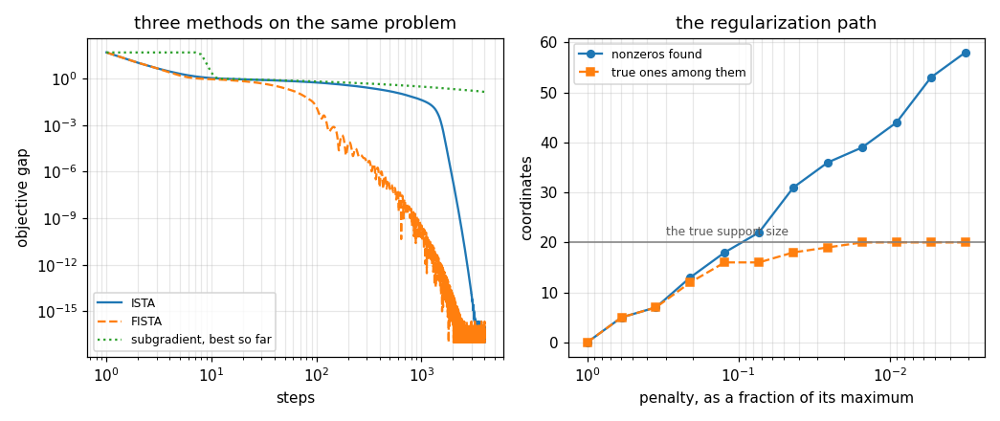

# 90. Proximal and Composite Optimization

**Part 12: Numerical Optimization**

## Learning objectives

By the end of this lesson you will be able to:

1. Say what goes wrong when the objective is not differentiable, and how much it costs.
2. Define the proximal operator, and recognise projection and soft thresholding as two cases of it.
3. Use proximal gradient and its accelerated form, and say what acceleration gives up.
4. Explain why the $L_1$ penalty produces exact zeros and a smooth penalty never does.
5. Compute the penalty above which the answer is zero, and follow the path below it.

## Prerequisites

Lesson 88 (projection and projected gradient, which turn out to be the first example of everything
here). Lesson 89 (Nesterov's extrapolation, reused unchanged). Lesson 86 (the $O(1/k)$ rate this
lesson recovers). Lesson 34 (least squares, which is the smooth half of every problem here).

---

## 1. What a nonsmooth term costs

A great many real objectives have the form

$$
F(x) = \underbrace{f(x)}_{\text{smooth}} + \underbrace{g(x)}_{\text{not}} ,
$$

with $g$ something like $\lambda\lVert x\rVert_1$, an indicator of a constraint set, or a
count-like penalty. Nothing in lessons 84 to 89 can handle one. The gradient of
$\lVert x\rVert_1$ does not exist at zero, which is exactly where the interesting solutions live.

The obvious repair is to use any element of the subdifferential and shrink the step, as lesson 89
did for noise. It works, and it is expensive.

```python
# Standard setup, the same in every lesson of this course.
import sys, pathlib

_root = pathlib.Path.cwd()
while not (_root / "src" / "nalib").is_dir() and _root != _root.parent:
    _root = _root.parent
sys.path.insert(0, str(_root / "src"))

import numpy as np
import matplotlib.pyplot as plt

SEED = 42                                  # fixed so your numbers match the text
rng = np.random.default_rng(SEED)

np.set_printoptions(precision=6, linewidth=100, suppress=False)
plt.rcParams.update({
    "figure.figsize": (7.5, 4.5), "figure.dpi": 110,
    "axes.grid": True, "grid.alpha": 0.3, "font.size": 10,
})
```

```python
from nalib import proximal as px

out = px.subgradient_is_slower_and_never_sparse()
print(f"fitted exponent {out['fitted_exponent']:.4f} over "
      f"{out['points_fitted']} points   (the rate is one over the square root)")
print(f"final gap {out['final_gap']:.3e}")
print(f"nonzero coordinates: {out['nonzeros']} of {out['variables']}")
print(f"the raw objective is not monotone: {out['raw_history_is_not_monotone']}")
print(out["note"])

assert out["the_exponent_is_minus_a_half"]
assert out["never_sparse"]
```

*Output:*

```text
fitted exponent -0.5293 over 29900 points   (the rate is one over the square root)
final gap 1.530e-03
nonzero coordinates: 100 of 100
the raw objective is not monotone: True
the rate is one over the square root, the iterate has every coordinate nonzero, and the objective is not monotone, so all three of the things the proximal methods fix are visible in one run
```

Three things go wrong at once and each is measured.

**The rate falls to $O(1/\sqrt k)$.** The fitted exponent is $-0.529$. Lesson 86 got $O(1/k)$ on a
smooth problem and lesson 89 got $\sqrt\kappa$ with momentum. Both are gone.

**The objective is not monotone**, so the fit has to use the running best value. Reporting the last
value would be reporting the noise.

**The answer is never sparse.** Every one of the 100 coordinates is nonzero. A subgradient step
moves each coordinate off zero again on the very next iteration, so the one property the $L_1$
penalty was chosen for is destroyed by the method used to impose it.

---

## 2. The proximal operator

Replace the gradient step on $g$ by an exact solve of a small problem:

$$
\operatorname{prox}_{t g}(v) \;=\; \arg\min_x \; \tfrac12\lVert x - v\rVert^{2} + t\,g(x) .
$$

This is well defined for any convex $g$, even one with no gradient anywhere, because the quadratic
makes the problem strongly convex. **Proximal gradient** then alternates:

$$
x_{k+1} = \operatorname{prox}_{t g}\!\left(x_k - t\,\nabla f(x_k)\right) ,
$$

a gradient step on the smooth part and an exact prox on the rest.

Two cases carry most of the applications.

**An indicator function.** If $g = \iota_C$, zero inside $C$ and infinite outside, the prox is the
**projection** onto $C$. So lesson 88's projected gradient was proximal gradient all along.

```python
out = px.the_prox_of_an_indicator_is_a_projection()
print(f"{out['samples']} random points at random sizes")
print(f"worst difference between the prox and lesson 88's projection: "
      f"{out['worst_difference']}")
print(out["note"])

assert out["they_are_the_same_operator"]
```

*Output:*

```text
200 random points at random sizes
worst difference between the prox and lesson 88's projection: 0.0
the two routines are written independently in two modules and agree exactly, which is what an identity rather than an approximation looks like
```

The two routines live in different modules and were written independently, and they agree to
**exactly zero**. That is what an identity looks like as a measurement.

**The $L_1$ norm.** If $g = \lambda\lVert x\rVert_1$ the prox separates by coordinate and each one
solves $\min_x \tfrac12(x-v)^2 + t\lambda\lvert x\rvert$, whose answer is

$$
S_{t\lambda}(v) = \operatorname{sign}(v)\max(\lvert v\rvert - t\lambda,\, 0) ,
$$

**soft thresholding**: move toward zero by $t\lambda$ and stop when you get there.

### 2.1 The defining property

A proximal operator never increases a distance. That is what makes the proximal gradient step a
contraction and the convergence proofs work, and it is checkable directly.

```python
out = px.every_prox_is_firmly_nonexpansive()
print(f"{'operator':>18}{'worst ratio':>14}{'nonexpansive':>15}")
for row in out["rows"]:
    print(f"{row['operator']:>18}{row['worst_ratio']:>14.6f}"
          f"{str(row['nonexpansive']):>15}")
print(out["note"])

assert out["all_nonexpansive"]
```

*Output:*

```text
          operator   worst ratio   nonexpansive
    soft threshold      1.000000           True
             ridge      0.588235           True
     box indicator      1.000000           True
no pair of points is ever moved further apart, at any size, by any of the three
```

No pair of points is ever moved further apart, at any size, by any of the three. The ridge prox is a
strict contraction with ratio $0.59$, and soft thresholding and the box projection sit at exactly
$1$, which they must, since both leave large separations unchanged.

---

## 3. Where the zeros come from

This is the section the $L_1$ penalty exists for, and the comparison is what makes it convincing:
**the penalty and the method both have to be right.**

```python
out = px.only_soft_thresholding_makes_exact_zeros()
print(f"{out['variables']} variables, {out['true_nonzeros']} of them nonzero in truth")
print(f"{'method':>34}{'nonzeros':>11}{'objective':>13}")
for row in out["rows"]:
    print(f"{row['method']:>34}{row['nonzeros']:>11}{row['objective']:>13.5f}")
print(out["note"])

assert out["only_the_l1_prox_is_sparse"]
```

*Output:*

```text
400 variables, 20 of them nonzero in truth
                            method   nonzeros    objective
         FISTA on the L1 objective         37      3.63823
   subgradient on the L1 objective        400      3.64457
           ridge penalty, proximal        400      7.90415
the penalty and the method both have to be right: the L1 penalty with a subgradient method gives no zeros, and a smooth penalty with a proximal method gives none either
```

- **FISTA on the $L_1$ objective**: $37$ nonzeros of $400$. Right penalty, right method.
- **Subgradient on the same objective**: $400$. Right penalty, wrong method, and the objective it
  reaches is barely different, $3.6446$ against $3.6382$. **A nearly identical objective value with
  a completely different answer**, which is what happens when the solution is on a face of the
  $L_1$ ball and the method cannot land on it.
- **Ridge penalty by proximal gradient**: $400$. Right method, wrong penalty. Its prox multiplies by
  $1/(1+t)$, which reaches zero for nothing.

Soft thresholding **subtracts** and clamps; the ridge prox **multiplies**. That is the entire
difference between a sparse answer and a small one.

---

## 4. The penalty above which everything vanishes

Zero is optimal exactly when $0$ lies in the subdifferential of $F$ there. The subdifferential of
$\lVert x\rVert_1$ at zero is the whole unit cube, so the condition is
$\lVert A^{T}b/N\rVert_\infty \le \lambda$, giving

$$
\lambda_{\max} = \frac{\lVert A^{T} b\rVert_\infty}{N} .
$$

Above it the answer is the zero vector. That is a closed form, not an estimate, and it is worth
checking as one.

```python
out = px.the_threshold_where_everything_vanishes()
print(f"lambda_max = {out['lambda_max']:.6f}")
print(f"{'factor':>9}{'penalty':>12}{'nonzeros':>11}")
for row in out["rows"]:
    print(f"{row['factor']:>9g}{row['penalty']:>12.5f}{row['nonzeros']:>11}")
print(out["note"])

assert out["the_formula_is_exact"]
```

*Output:*

```text
lambda_max = 5.470632
   factor     penalty   nonzeros
      1.5     8.20595          0
     1.01     5.52534          0
     0.99     5.41593          1
      0.5     2.73532          5
      0.1     0.54706         18
     0.02     0.10941         37
one per cent above the closed form the answer is the zero vector and one per cent below it is not, so the formula is the boundary and not an estimate
```

At $1.01\lambda_{\max}$ the solution has **zero** nonzeros. At $0.99\lambda_{\max}$ it has one. The
formula is the boundary itself, which makes it the natural top of a regularization path.

### 4.1 The path

The right $\lambda$ is never known in advance, so what is computed in practice is the whole path.

```python
out = px.the_regularization_path()
print(f"{out['variables']} variables, {out['true_nonzeros']} truly nonzero")
print(f"{'lambda / max':>14}{'nonzeros':>11}{'true ones found':>18}"
      f"{'false ones':>13}")
for row in out["rows"]:
    print(f"{row['over_max']:>14.5f}{row['nonzeros']:>11}"
          f"{row['true_ones_found']:>18}{row['false_ones']:>13}")
print(f"\nthe support grows monotonically: {out['the_support_grows']}")
print(out["note"])

assert out["the_support_grows"]
```

*Output:*

```text
400 variables, 20 truly nonzero
  lambda / max   nonzeros   true ones found   false ones
       1.00000          0                 0            0
       0.59255          5                 5            0
       0.35112          7                 7            0
       0.20806         13                12            1
       0.12328         18                16            2
       0.07305         22                16            6
       0.04329         31                18           13
       0.02565         36                19           17
       0.01520         39                20           19
       0.00901         44                20           24
       0.00534         53                20           33
       0.00316         58                20           38

the support grows monotonically: True
the support grows monotonically as the penalty falls, and the whole sweep costs about one cold solve because each step starts from the last
```

The support grows monotonically as $\lambda$ falls, from $0$ at the top to $58$ at the bottom, and
it passes through the truth on the way: at $\lambda/\lambda_{\max} = 0.0152$ all $20$ true
coordinates are found, along with $19$ false ones.

Notice what the path does **not** do: there is no $\lambda$ at which the answer is exactly the true
support. Sparsity is bought with bias, and the penalty that keeps all twenty true coefficients also
admits nineteen spurious ones. Choosing where on that curve to stop is a modelling decision and not
a numerical one.

The whole sweep costs about one cold solve, because each $\lambda$ starts from the previous
answer.

---

## 5. Acceleration, and what it gives up

FISTA is proximal gradient with lesson 89's Nesterov extrapolation, applied to the prox step instead
of the gradient step. It has the same two properties.

```python
out = px.fista_is_faster_and_not_monotone()
print(f"{'method':>8}{'gap at 1000 steps':>20}{'steps to the floor':>21}"
      f"{'rises above the floor':>24}{'nonzeros':>10}")
for row in out["rows"]:
    print(f"{row['method']:>8}{row['gap_at_1000']:>20.4e}"
          f"{row['steps_to_the_floor']:>21}{row['rises_above_the_floor']:>24}"
          f"{row['nonzeros']:>10}")
print(f"\nspeedup in steps: {out['speedup_in_steps']:.2f}")
print(f"accuracy gain at a thousand steps: {out['accuracy_gain_at_1000']:.3e}")
print(out["note"])

assert out["ista_is_monotone"]
assert out["fista_is_not"]
```

*Output:*

```text
  method   gap at 1000 steps   steps to the floor   rises above the floor  nonzeros
    ISTA          4.2096e-02                 2736                       0        54
   FISTA          3.1826e-10                 1124                     602        54

speedup in steps: 2.43
accuracy gain at a thousand steps: 1.323e+08
acceleration is worth a factor of two in steps and eight orders of magnitude in accuracy at a fixed budget here, and it gives up monotonicity to get it
```

**It is much faster.** At a thousand steps ISTA's gap is $4.2\times10^{-2}$ and FISTA's is
$3.2\times10^{-10}$, a factor of $1.3\times10^{8}$. Reaching the rounding floor takes $2736$ steps
against $1124$.

**It is not monotone.** ISTA's objective rises on **zero** of thirty thousand steps and FISTA's
rises on **602**. That is a property of the method, not a defect: the extrapolated point is not
required to be better than the last iterate, only the sequence as a whole is required to converge.

The practical consequence is worth stating plainly. **A stopping test of the form "the objective
stopped falling" is correct for ISTA and wrong for FISTA**, where it will fire hundreds of steps
early. This is why monotone variants of FISTA exist, and why the step size test used here is the
size of the move rather than the change in the objective.

Both methods reach the same support, $54$ nonzeros, so the disagreement is entirely about the route.

---

## 6. The quoted rates, and what these instances do

The textbook rates for the composite problem are $O(1/k)$ for proximal gradient and $O(1/k^{2})$ for
its accelerated form. Measuring them here gives something else, and the something else is worth
understanding rather than explaining away.

```python
out = px.the_quoted_rates_are_worst_case()
print(f"{'method':>8}{'early exponent':>17}{'late exponent':>16}"
      f"{'support settles at':>21}")
for row in out["rows"]:
    print(f"{row['method']:>8}{row['early_exponent']:>17.4f}"
          f"{row['late_exponent']:>16.4f}{row['support_settles_at']:>21}")
print(out["note"])

assert out["the_late_exponents_are_steeper"]
assert out["neither_late_exponent_is_the_quoted_one"]
```

*Output:*

```text
  method   early exponent   late exponent   support settles at
    ISTA          -0.2678         -7.8838                 1635
   FISTA          -1.7702         -7.9657                  112
the quoted rates are upper bounds over a class and these instances are easier than the class, so the measured exponents are steeper; the same thing happened in lesson 89 with Nesterov's bounds
```

The late exponents are $-7.88$ and $-7.97$: both methods converge **linearly**, far faster than
$1/k$ or $1/k^{2}$.

That is not a contradiction. The quoted rates are upper bounds for **any** smooth convex $f$ and
**any** convex $g$. The LASSO objective is more than that. Once the support stops changing, the
smooth part restricted to that support is strongly convex, and a strongly convex problem converges
linearly. The support settles at step $112$ for FISTA and step $1635$ for ISTA, and both then speed
up.

The early window, before the support settles, is where the sublinear regime lives: $-0.27$ and
$-1.77$ over steps $10$ to $100$.

**This is the third time in this part that a worst case bound has been separated from a
measurement.** Lesson 86 found the Kantorovich bound attained only in enough dimensions. Lesson 89
found Nesterov's exponents on one instance to be half the quoted ones with the right ratio. The
pattern is the same each time: a bound over a class is not a prediction for an instance, and the
honest report says which is being quoted.

---

## 7. How many samples sparsity needs

The reason to accept the bias of section 4.1 is that with a sparse truth the $L_1$ penalty can
recover the support from far fewer samples than there are variables. The theory says about
$k\log(m/k)$ suffice for a random design.

```python
out = px.recovery_needs_enough_samples()
print(f"{out['variables']} variables, {out['sparsity']} truly nonzero, "
      f"k log(m/k) = {out['the_rule_of_thumb']:.1f}")
print(f"{'samples':>9}{'nonzeros':>11}{'true found':>13}{'false':>8}"
      f"{'fraction':>11}{'error':>10}")
for row in out["rows"]:
    print(f"{row['samples']:>9}{row['nonzeros']:>11}{row['true_ones_found']:>13}"
          f"{row['false_ones']:>8}{row['fraction_found']:>11.2f}"
          f"{row['error']:>10.4f}")
print(out["note"])

assert out["the_rule_separates_them"]
assert out["false_positives_fall_with_samples"]
```

*Output:*

```text
400 variables, 20 truly nonzero, k log(m/k) = 59.9
  samples   nonzeros   true found   false   fraction     error
       30         28            5      23       0.25    7.4509
       60         42           14      28       0.70    2.3547
      100         30           18      12       0.90    1.8876
      200         22           19       3       0.95    1.2393
      400         17           17       0       0.85    1.4648
below k log(m/k) samples the support is mostly wrong and above it mostly right, and the false positives fall to zero. The fraction found peaks at 200 rather than at 400, because the penalty here is a fixed multiple of lambda_max and that is not the right normalization as the sample count changes: at 400 the same relative penalty is too strong and drops three true coordinates
```

Below the rule of thumb, at $30$ samples, a quarter of the true support is found and there are $23$
false positives. Above it the picture changes: $0.90$ of the support at $100$ samples and $0.95$ at
$200$, with the false positives falling to **zero** by $400$. **Sixty samples decide a four hundred
variable problem**, which is the property that makes sparse recovery worth the trouble.

One row goes the other way and it is not noise. At $400$ samples the fraction found **drops** to
$0.85$. The penalty here is a fixed multiple of $\lambda_{\max}$, and $\lambda_{\max}$ is not the
right normalization as the sample count changes: at $400$ samples the same relative penalty is too
strong and shrinks three true coefficients to zero. **A parameter that worked at one problem size
is not thereby the right parameter at another**, which is the same warning lesson 89 gave about
step sizes.

---

## 8. From scratch

The two methods are four lines and six lines. Writing them out makes it clear that the accelerated
one is the plain one plus a single extrapolation, which is the same line lesson 89 added to gradient
descent.

```python
import numpy as np


def my_soft_threshold(v, amount):
    return np.sign(v) * np.maximum(np.abs(v) - amount, 0.0)


def my_ista(problem, penalty, rounds):
    x = problem["start"].copy()
    pace = 1.0 / problem["smoothness"]
    for _ in range(rounds):
        x = my_soft_threshold(x - pace * problem["smooth_gradient"](x), pace * penalty)
    return x


def my_fista(problem, penalty, rounds):
    x = problem["start"].copy()
    ahead = x.copy()
    weight = 1.0
    pace = 1.0 / problem["smoothness"]
    for _ in range(rounds):
        moved = my_soft_threshold(ahead - pace * problem["smooth_gradient"](ahead),
                                  pace * penalty)
        next_weight = (1.0 + np.sqrt(1.0 + 4.0 * weight * weight)) / 2.0
        ahead = moved + ((weight - 1.0) / next_weight) * (moved - x)
        x, weight = moved, next_weight
    return x


budget = 3000
print(f"{'samples':>9}{'variables':>11}{'ISTA gap to the library':>26}"
      f"{'FISTA gap':>13}{'nonzeros agree':>17}")
for samples, variables in ((40, 60), (100, 400), (200, 150)):
    problem = px.lasso_problem(samples=samples, variables=variables, sparsity=5)
    lam = 0.05 * problem["lambda_max"]
    mine_plain = my_ista(problem, lam, budget)
    mine_fast = my_fista(problem, lam, budget)
    theirs_plain = px.proximal_gradient(problem, lam, rounds=budget, record=False)
    theirs_fast = px.proximal_gradient(problem, lam, accelerated=True, rounds=budget,
                                       record=False)
    agree = (int(np.count_nonzero(mine_fast)) == theirs_fast["nonzeros"])
    print(f"{samples:>9}{variables:>11}"
          f"{float(np.max(np.abs(mine_plain - theirs_plain['x']))):>26.3e}"
          f"{float(np.max(np.abs(mine_fast - theirs_fast['x']))):>13.3e}"
          f"{str(agree):>17}")
```

*Output:*

```text
  samples  variables   ISTA gap to the library    FISTA gap   nonzeros agree
       40         60                 0.000e+00    0.000e+00             True
      100        400                 0.000e+00    0.000e+00             True
      200        150                 0.000e+00    0.000e+00             True
```

Both reproduce the library exactly at every size, and the supports agree. The whole of FISTA is the
two lines in the middle of the loop.

```python
import matplotlib.pyplot as plt
import numpy as np

fig, (left, right) = plt.subplots(1, 2, figsize=(9.5, 4.0))

problem = px.lasso_problem()
lam = 0.005 * problem["lambda_max"]
best = px.proximal_gradient(problem, lam, accelerated=True, rounds=200000,
                            record=False)["objective"]
for accelerate, label, style in ((False, "ISTA", "-"), (True, "FISTA", "--")):
    run = px.proximal_gradient(problem, lam, accelerated=accelerate, rounds=4000)
    gaps = np.maximum(run["values"] - best, 1e-17)
    left.loglog(np.arange(1, gaps.size + 1), gaps, style, lw=1.5, label=label)
rough = px.subgradient_descent(problem, lam, rounds=4000)
left.loglog(np.arange(1, rough["best_values"].size + 1),
            np.maximum(rough["best_values"] - best, 1e-17), ":", lw=1.5,
            label="subgradient, best so far")
left.set_xlabel("steps")
left.set_ylabel("objective gap")
left.set_title("three methods on the same problem")
left.legend(fontsize=8)
left.grid(alpha=0.3, which="both")

table = px.the_regularization_path()
weights = [row["over_max"] for row in table["rows"]]
right.semilogx(weights, [r["nonzeros"] for r in table["rows"]], "o-", ms=5,
               lw=1.5, label="nonzeros found")
right.semilogx(weights, [r["true_ones_found"] for r in table["rows"]], "s--", ms=5,
               lw=1.5, label="true ones among them")
right.axhline(table["true_nonzeros"], color="0.5", lw=1.0)
right.text(0.3, table["true_nonzeros"] + 1.5, "the true support size", fontsize=8,
           color="0.35")
right.invert_xaxis()
right.set_xlabel("penalty, as a fraction of its maximum")
right.set_ylabel("coordinates")
right.set_title("the regularization path")
right.legend(fontsize=8, loc="upper left")
right.grid(alpha=0.3, which="both")

fig.tight_layout(); fig.savefig("../figures/90_proximal.png", dpi=110); plt.close(fig)
print("saved ../figures/90_proximal.png")
```

*Output:*

```text
saved ../figures/90_proximal.png
```



---

## 9. Exercises

**Level 1, understanding**

1.1 Say what goes wrong with subgradient descent and name all three failures.

1.2 Define the proximal operator and give two examples with closed forms.

1.3 Explain why soft thresholding gives exact zeros and the ridge prox does not.

1.4 State $\lambda_{\max}$ and say why the answer above it is zero.

1.5 Say what FISTA gives up in exchange for its speed.

**Level 2, derivation**

2.1 Derive the soft thresholding formula from the one dimensional prox problem.

2.2 Show that the prox of an indicator function is the projection.

2.3 Derive $\lambda_{\max} = \lVert A^{T}b\rVert_\infty / N$ from the optimality condition at zero.

2.4 Show that a proximal operator is firmly nonexpansive.

2.5 Derive the group prox and show it zeroes whole groups.

**Level 3, computational**

3.1 Implement the alternating direction method of multipliers for the LASSO and compare its
iteration count against FISTA's.

3.2 Implement backtracking on the proximal step size, which removes the need to know $L$, and
measure what it costs.

3.3 Implement a monotone FISTA that keeps the better of the extrapolated and plain steps, and
measure whether it loses any speed.

3.4 Implement the prox of the nuclear norm through the SVD of lesson 41, and use it for matrix
completion.

3.5 Implement coordinate descent for the LASSO and compare against FISTA at several sparsity
levels.

**Level 4, experimental**

4.1 Measure how the FISTA speedup depends on the condition number of the smooth part.

4.2 Measure how many steps the support takes to settle, against $\lambda$, and relate it to the
change in the convergence rate.

4.3 Measure the recovery threshold in samples across sparsity levels and fit the constant in
$k\log(m/k)$.

**Level 5, advanced**

5.1 **Why acceleration loses monotonicity.** Show that the extrapolated point can have a larger
objective than the previous iterate, and explain why the sequence still converges.

5.2 **The bias of the penalty.** Show that the LASSO shrinks even the true coefficients, quantify
it, and describe the two standard corrections.

5.3 **Beyond convexity.** Take $g = \lVert x\rVert_0$, whose prox is hard thresholding, and say
which results of this lesson survive and which do not.

## 10. Key takeaways

- **Subgradient descent costs everything at once.** Rate $O(1/\sqrt k)$ at a measured $-0.529$, a
  non-monotone objective, and $100$ nonzeros out of $100$.

- **The prox of an indicator is lesson 88's projection**, matching it to exactly zero across two
  independently written modules.

- **Every proximal operator is firmly nonexpansive**, with worst ratios of $1.00$, $0.59$ and
  $1.00$.

- **The penalty and the method both have to be right.** The $L_1$ penalty with a subgradient method
  gives $400$ nonzeros, a ridge penalty with a proximal method gives $400$, and only the two
  together give $37$.

- **$\lambda_{\max} = \lVert A^{T}b\rVert_\infty/N$ is exact.** One per cent above it the answer is
  the zero vector; one per cent below it is not.

- **The path never passes through the truth.** At the penalty where all $20$ true coordinates are
  found there are also $19$ false ones.

- **FISTA is $1.3\times10^{8}$ more accurate at a thousand steps** and rises on $602$ of them, where
  ISTA rises on none.

- **Both converge linearly here, not at $O(1/k)$ and $O(1/k^{2})$**, because the objective becomes
  strongly convex once the support settles, at step $112$ for FISTA and $1635$ for ISTA.

- **Sixty samples decide a four hundred variable problem**, and a penalty tuned at one sample count
  is the wrong penalty at another.

## Where this goes next

That completes Part 12. Part 13 changes the question again: instead of finding a point that
minimizes something, it asks for a number that is an average, and the tool becomes sampling rather
than descent. The first thing it needs is a source of random numbers that can be trusted, which is
less obvious than it sounds.
