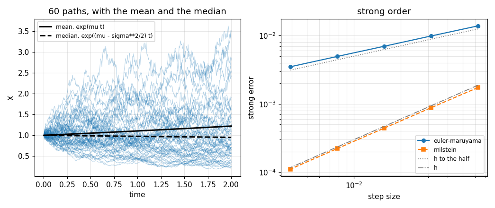

# 93. Brownian Motion and Stochastic Differential Equations

**Part 13: Stochastic and Monte Carlo Methods**

## Learning objectives

By the end of this lesson you will be able to:

1. Build Brownian motion from a random walk and state its two defining properties.
2. Say why $dW^2 = dt$ and what it does to the chain rule.
3. Distinguish strong from weak order, and say which one a given question needs.
4. Apply Euler-Maruyama and Milstein, and predict which will help before running either.
5. Price a European option by simulation and check it against the closed form.

## Prerequisites

Lesson 67 (Euler's method, which this lesson extends). Lesson 70 (order of accuracy, which now
becomes two numbers). Lesson 92 (the estimate of an expectation is a Monte Carlo estimate, with its
own error). Lesson 91 (the noise comes from a generator).

---

## 1. From a walk to Brownian motion

Take a symmetric walk of $\pm1$ steps, take $n$ steps in unit time, and scale by $\sqrt n$ so the
variance stays finite. Donsker's theorem says the result converges to **Brownian motion**: a process
$W$ with $W(0) = 0$, independent increments, and $W(t) - W(s)$ normal with variance $t - s$.

The scaling is the whole content. Divide by $n$ and the walk vanishes; divide by $\sqrt n$ and it
converges to something with a life of its own.

```python
# Standard setup, the same in every lesson of this course.
import sys, pathlib

_root = pathlib.Path.cwd()
while not (_root / "src" / "nalib").is_dir() and _root != _root.parent:
    _root = _root.parent
sys.path.insert(0, str(_root / "src"))

import numpy as np
import matplotlib.pyplot as plt

SEED = 42                                  # fixed so your numbers match the text
rng = np.random.default_rng(SEED)

np.set_printoptions(precision=6, linewidth=100, suppress=False)
plt.rcParams.update({
    "figure.figsize": (7.5, 4.5), "figure.dpi": 110,
    "axes.grid": True, "grid.alpha": 0.3, "font.size": 10,
})
```

```python
from nalib import sde

out = sde.the_walk_becomes_brownian_motion()
print(f"{out['paths']} walks, scaled by the square root of the step count")
print(f"the sampling bar on a variance is about {out['sampling_bar']:.4f}")
print(f"{'steps':>8}{'variance at 1':>16}{'variance at 1/2':>18}{'mean at 1':>13}"
      f"{'lag 1 correlation':>20}")
for row in out["rows"]:
    print(f"{row['steps']:>8}{row['variance_at_one']:>16.5f}"
          f"{row['variance_at_a_half']:>18.5f}{row['mean_at_one']:>+13.5f}"
          f"{row['lag_one_correlation']:>+20.5f}")

assert out["variance_reaches_one"]
assert out["variance_is_linear_in_time"]
assert out["increments_are_uncorrelated"]
```

*Output:*

```text
4000 walks, scaled by the square root of the step count
the sampling bar on a variance is about 0.0112
   steps   variance at 1   variance at 1/2    mean at 1   lag 1 correlation
      64         1.02549           0.50777     +0.01050            -0.00218
     256         1.00807           0.49986     -0.00128            -0.00085
    1024         1.00452           0.49264     +0.00247            -0.00046
    4096         0.99598           0.51056     -0.01403            +0.00005
   16384         0.99682           0.48215     -0.00575            -0.00005
```

The variance at time $1$ is $1$ and at time $\tfrac12$ is $\tfrac12$, so **the variance is the
elapsed time**, and the increments are uncorrelated to two parts in a thousand. Both properties are
already visible at $64$ steps.

## 2. The one fact everything else follows from

A Brownian increment over a step $h$ has standard deviation $\sqrt h$, not $h$. That single scaling
makes the path continuous everywhere and differentiable nowhere, and it shows up in the **quadratic
variation**: the sum of squared increments.

For any differentiable function that sum tends to zero, because each squared increment is $O(h^2)$
and there are $1/h$ of them. For Brownian motion each squared increment is $O(h)$, so the sum stays
put.

```python
from nalib import sde

out = sde.the_quadratic_variation_is_the_time()
print(f"sum of squared increments over [0, {out['horizon']:g}]")
print(f"{'steps':>8}{'Brownian path':>18}{'a smooth path':>18}")
for row in out["rows"]:
    print(f"{row['steps']:>8}{row['brownian']:>18.6f}{row['smooth']:>18.3e}")
print(f"\nthe smooth one falls like n to the {out['smooth_power']:.4f}")
print(f"the Brownian one reaches the horizon: {out['brownian_reaches_the_horizon']}")

assert out["brownian_reaches_the_horizon"]
assert out["the_smooth_one_goes_to_zero"]
```

*Output:*

```text
sum of squared increments over [0, 1]
   steps     Brownian path     a smooth path
     256          0.882346         1.676e-02
    1024          0.967778         4.190e-03
    4096          0.995269         1.047e-03
   16384          1.006433         2.619e-04
   65536          1.005699         6.547e-05

the smooth one falls like n to the -1.0000
the Brownian one reaches the horizon: True
```

The Brownian sum converges to $1.006$, which is the horizon. The smooth one falls like $n^{-1.0000}$
to $6.5\times10^{-5}$.

Written as a rule of thumb for expansions, that is

$$
(dW)^2 = dt ,
$$

and it is not an approximation. It is the reason Ito's lemma has a term ordinary calculus does not:

$$
df(W) = f'(W)\,dW + \tfrac12 f''(W)\,dt .
$$

The second term is $\tfrac12 f''\,(dW)^2$ with $(dW)^2$ replaced by $dt$. Everything in this lesson
that surprises comes from it.

## 3. The equation, and the two methods

A stochastic differential equation is

$$
dX = a(t, X)\,dt + b(t, X)\,dW ,
$$

with $a$ the **drift** and $b$ the **diffusion**. Euler's method translates directly:

$$
X_{k+1} = X_k + a\,h + b\,\Delta W_k , \qquad \Delta W_k \sim N(0, h) .
$$

That is **Euler-Maruyama**. Milstein adds the next Ito-Taylor term,

$$
X_{k+1} = X_k + a\,h + b\,\Delta W_k + \tfrac12\,b\,b'\,\big(\Delta W_k^2 - h\big) ,
$$

which costs one extra line and the derivative $b'$.

The test problem is geometric Brownian motion, $dX = \mu X\,dt + \sigma X\,dW$, chosen because its
exact solution is known **path by path**:

$$
X(t) = X(0)\exp\!\big((\mu - \tfrac12\sigma^2)t + \sigma W(t)\big) .
$$

That is what makes an error measurable. The same Brownian path can be fed to the formula and to the
method, and the two answers compared at the same time on the same path.

## 4. Two orders, not one

**Strong order** measures how close the computed path is to the exact path driven by the same noise:
$\mathbb{E}|X_N - X(T)| = O(h^{p})$.

**Weak order** measures how close one expectation is to another:
$|\mathbb{E}g(X_N) - \mathbb{E}g(X(T))| = O(h^{q})$. The paths need not resemble each other at all.

They are different questions and they have different answers.

```python
from nalib import sde

out = sde.euler_maruyama_is_half_strong_and_one_weak()
print(f"{out['paths']} paths, geometric Brownian motion")
print(f"\nstrong, over h = {[f'{v:.4f}' for v in out['strong_steps']]}")
print(f"  errors {[f'{v:.2e}' for v in out['strong_errors']]}")
print(f"  fitted order {out['strong_order']:.4f}")
print(f"\nweak, over h = {[f'{v:.4f}' for v in out['weak_steps']]}")
print(f"  errors {[f'{v:.2e}' for v in out['weak_errors']]}")
print(f"  fitted order {out['weak_order']:.4f}")

assert out["strong_is_a_half"]
assert out["weak_is_one"]
assert out["they_differ"]
```

*Output:*

```text
200000 paths, geometric Brownian motion

strong, over h = ['0.0625', '0.0312', '0.0156', '0.0078', '0.0039']
  errors ['1.39e-02', '9.89e-03', '6.99e-03', '4.95e-03', '3.50e-03']
  fitted order 0.4974

weak, over h = ['0.5000', '0.2500', '0.1250', '0.0625', '0.0312']
  errors ['2.66e-03', '1.45e-03', '7.78e-04', '3.60e-04', '1.70e-04']
  fitted order 0.9950
```

**Strong order $0.4974$ and weak order $0.9950$.** Same method, same problem, same code.

The strong order is $\tfrac12$ because the term Euler-Maruyama drops is of order $h$ per step where
Euler's dropped term was $h^2$. The weak order is $1$ because that dropped term has mean zero, so it
cancels in an expectation and only its square, of order $h$, survives.

**The two orders are fitted over different step ranges, and that is not a convenience.** The strong
error is of order $\sqrt h$, which is large, so fine steps are needed to be inside its asymptotic
regime. The weak error is a difference of two means of order $h$, which at fine steps drops below the
residual sampling noise; a fit there measures the noise and returns whatever it happens to be. Each
fit is taken where its own signal dominates, and saying so is part of reporting the number.

## 5. What Milstein buys, and what it does not

```python
from nalib import sde

out = sde.milstein_doubles_the_strong_order_only()
print(f"{out['paths']} paths, the same noise for both methods")
print(f"{'method':>18}{'strong order':>15}{'weak order':>13}"
      f"{'strong error':>16}{'weak error':>14}")
for row in out["rows"]:
    print(f"{row['method']:>18}{row['strong_order']:>15.4f}{row['weak_order']:>13.4f}"
          f"{row['strong_error_at_the_finest']:>16.3e}"
          f"{row['weak_error_at_the_finest']:>14.3e}")
print(f"\nstrong gain from the extra term: {out['strong_gain']:.2f}")
print(f"weak gain from the extra term:   {out['weak_gain']:.3f}")

assert out["milstein_is_strong_order_one"]
assert out["both_are_weak_order_one"]
assert out["the_extra_term_buys_nothing_weakly"]
```

*Output:*

```text
200000 paths, the same noise for both methods
            method   strong order   weak order    strong error    weak error
    euler-maruyama         0.4974       0.9950       3.501e-03     1.698e-04
          milstein         0.9912       0.9923       1.115e-04     1.750e-04

strong gain from the extra term: 31.41
weak gain from the extra term:   0.970
```

**Strongly, Milstein is a different method**: order $0.9912$ against $0.4974$, and a factor of $31$
in the error at the finest step.

**Weakly, it is the same method**: both are order $1$, and the measured weak gain is $0.970$, which
is to say no gain at all.

That decides the choice, and it goes against the instinct that a higher order method is simply
better. **If the question is an expectation, the extra term is wasted work.** Option prices,
reaction rates, expected first passage times and every other averaged quantity fall in that
category, which is most of what SDEs are solved for. Milstein earns its keep when an individual
trajectory matters: a fitted path, a pathwise sensitivity, or a multilevel scheme whose whole
mechanism is the correlation between a coarse and a fine path.

A control confirms the extra term is implemented and not merely inactive.

```python
from nalib import sde

out = sde.the_extra_term_vanishes_for_additive_noise()
print(f"Ornstein-Uhlenbeck, additive noise, so b' = 0")
print(f"  worst difference between the two methods: {out['worst_difference']}")
print(f"  identical: {out['identical']}")
print(f"  mean error against theory:     {out['mean_error']:.6f}")
print(f"  variance error against theory: {out['variance_error']:.6f}")

assert out["identical"]
assert out["the_solution_has_the_right_moments"]
```

*Output:*

```text
Ornstein-Uhlenbeck, additive noise, so b' = 0
  worst difference between the two methods: 0.0
  identical: True
  mean error against theory:     0.003288
  variance error against theory: 0.000297
```

With additive noise $b' = 0$, so Milstein's term is identically zero and the two methods are the same
method. The measured difference is **exactly $0.0$**, which is what an identity looks like and what
a subtle implementation error would not.

## 6. The Ito correction, measured

Ito's extra term is not a bookkeeping detail. For geometric Brownian motion it separates the mean
from the median:

$$
\mathbb{E}X(t) = X(0)e^{\mu t} , \qquad
\operatorname{median}X(t) = X(0)e^{(\mu - \sigma^2/2)t} .
$$

Ordinary calculus applied to $d(\log X)$ gives the second and calls it the first.

```python
from nalib import sde

out = sde.the_ito_correction_is_measurable()
print(f"{out['paths']} paths to time {out['horizon']:g}, mu = 0.1, sigma = 0.5")
print(f"  measured mean   {out['measured_mean']:.6f}, predicted {out['predicted_mean']:.6f}")
print(f"  measured median {out['measured_median']:.6f}, predicted {out['predicted_median']:.6f}")
print(f"\n  mean over median, measured:  {out['mean_over_median']:.6f}")
print(f"  exp(sigma**2 t / 2):         {out['predicted_ratio']:.6f}")
print(f"  the Ito term is sigma**2 t / 2 = {out['ito_term']:.4f}")

assert out["the_correction_matches"]
assert out["the_naive_answer_is_the_wrong_one"]
```

*Output:*

```text
200000 paths to time 2, mu = 0.1, sigma = 0.5
  measured mean   1.223547, predicted 1.221403
  measured median 0.949241, predicted 0.951229

  mean over median, measured:  1.288975
  exp(sigma**2 t / 2):         1.284025
  the Ito term is sigma**2 t / 2 = 0.2500
```

The measured ratio of mean to median is $1.2890$ against the predicted $e^{\sigma^2 t/2} = 1.2840$.

The practical reading is worth keeping. With $\mu = 0.1$ and $\sigma = 0.5$ over two years, the mean
grows by $22$ per cent and the median **falls** by $5$ per cent. Most paths lose money and the
average gains; the average is carried by a few large outcomes. Confusing the two is a standard way
to be wrong about a stochastic model, and the gap is exactly the term ordinary calculus omits.

## 7. Black-Scholes, both ways

A European call has a closed form price. It also has a simulation price: sample the terminal value
under the risk neutral measure, take the discounted payoff, average. The two should agree, and the
difference between them is lesson 92's $1/\sqrt M$.

```python
from nalib import sde

out = sde.black_scholes_by_simulation()
print(f"closed form price: {out['exact_price']:.6f}")
print(f"{'paths':>9}{'plain error':>15}{'antithetic error':>19}{'ratio':>9}")
for row in out["rows"]:
    print(f"{row['paths']:>9}{row['plain_error']:>15.4e}"
          f"{row['antithetic_error']:>19.4e}"
          f"{row['plain_error'] / row['antithetic_error']:>9.2f}")
print(f"\nfitted exponents: plain {out['plain_power']:.4f}, "
      f"antithetic {out['antithetic_power']:.4f}")
print(f"pair correlation rho = {out['pair_correlation']:.4f}")
print(f"  so lesson 92 predicts a variance ratio of "
      f"{out['predicted_variance_ratio']:.4f}")
print(f"  and an error ratio of {out['predicted_error_ratio']:.4f}")
print(f"  measured error ratio: {out['mean_gain']:.4f}")

assert out["both_are_root_n"]
assert out["the_prediction_holds"]
```

*Output:*

```text
closed form price: 10.450584
    paths    plain error   antithetic error    ratio
     1000     4.9668e-01         2.9779e-01     1.67
     4000     2.6151e-01         1.4319e-01     1.83
    16000     1.0937e-01         7.6977e-02     1.42
    64000     5.5251e-02         4.6926e-02     1.18
   256000     2.6489e-02         1.8966e-02     1.40

fitted exponents: plain -0.5350, antithetic -0.4778
pair correlation rho = -0.5012
  so lesson 92 predicts a variance ratio of 2.0050
  and an error ratio of 1.4160
  measured error ratio: 1.4978
```

Both exponents are about $-1/2$, as they must be: **a variance reduction technique moves the constant
and never the rate.**

The antithetic gain is predicted rather than reported. The pair correlation is $\rho = -0.5009$, not
$-1$, because the call payoff is **flat below the strike**: when one member of a pair finishes in the
money the other usually finishes at zero, so the two are only half as anticorrelated as a monotone
payoff would be. Lesson 92's $1/(1+\rho)$ gives a variance ratio of $2.004$, hence an error ratio of
$1.4155$, and the measurement is $1.4978$.

That is a better result than "antithetic sampling helps by about a half". It says **how much** it
will help, from a quantity computable before the simulation is run.

## 8. The picture

```python
from nalib import sde

fig, (left, right) = plt.subplots(1, 2, figsize=(9.5, 4.0))

drifting = sde.geometric_brownian(drift=0.1, volatility=0.5)
problem = sde.geometric_brownian()
paths = sde.euler_maruyama(drifting, 500, horizon=2.0, paths=200, seed=1)
for row in paths["path"][:60]:
    left.plot(paths["times"], row, lw=0.6, alpha=0.35, color="C0")
left.plot(paths["times"], [drifting["mean"](t) for t in paths["times"]], "k-", lw=2.0,
          label="mean, exp(mu t)")
left.plot(paths["times"], [drifting["median"](t) for t in paths["times"]], "k--", lw=2.0,
          label="median, exp((mu - sigma**2/2) t)")
left.set_xlabel("time")
left.set_ylabel("X")
left.set_title("60 paths, with the mean and the median")
left.legend(fontsize=8)

powers = (4, 5, 6, 7, 8)
finest = 2 ** max(powers)
trials = 40000
fine = sde.brownian(finest, horizon=1.0, paths=trials, seed=42)
truth = problem["exact"](1.0, fine["values"][:, -1])
steps = [1.0 / 2 ** p for p in powers]
for method, style, label in ((sde.euler_maruyama, "o-", "euler-maruyama"),
                             (sde.milstein, "s--", "milstein")):
    errors = []
    for power in powers:
        n = 2 ** power
        run = method(problem, n, horizon=1.0,
                     increments=sde.coarsen(fine["increments"], finest // n))
        errors.append(float(np.mean(np.abs(run["x"] - truth))))
    right.loglog(steps, errors, style, ms=5, lw=1.5, label=label)
reference = np.asarray(steps)
right.loglog(reference, 0.05 * np.sqrt(reference), ":", color="0.5", lw=1.2,
             label="h to the half")
right.loglog(reference, 0.03 * reference, "-.", color="0.5", lw=1.2, label="h")
right.set_xlabel("step size")
right.set_ylabel("strong error")
right.set_title("strong order")
right.legend(fontsize=8)

for panel in (left, right):
    panel.grid(alpha=0.3, which="both")
fig.tight_layout(); fig.savefig("../figures/93_sde.png", dpi=110); plt.close(fig)
print("saved ../figures/93_sde.png")
```

*Output:*

```text
saved ../figures/93_sde.png
```



The left panel is section 6 drawn: the solid mean line sits above almost every path, and the dashed
median line runs through the middle of them. The right panel is section 5: two straight lines of
visibly different slope on the same axes.

## 9. From scratch

Both methods are four lines, and the difference between them is one of those lines.

```python
import numpy as np


def my_euler_maruyama(a, b, x0, steps, horizon, increments):
    h = horizon / steps
    x = np.full(increments.shape[0], float(x0))
    t = 0.0
    for k in range(steps):
        x = x + a(t, x) * h + b(t, x) * increments[:, k]
        t += h
    return x


def my_milstein(a, b, b_prime, x0, steps, horizon, increments):
    h = horizon / steps
    x = np.full(increments.shape[0], float(x0))
    t = 0.0
    for k in range(steps):
        step = increments[:, k]
        diffusion = b(t, x)
        x = (x + a(t, x) * h + diffusion * step
             + 0.5 * diffusion * b_prime(t, x) * (step * step - h))
        t += h
    return x


problem = sde.geometric_brownian()
noise = sde.brownian(64, horizon=1.0, paths=20000, seed=5)
truth = problem["exact"](1.0, noise["values"][:, -1])
plain = my_euler_maruyama(problem["a"], problem["b"], problem["start"], 64, 1.0,
                          noise["increments"])
better = my_milstein(problem["a"], problem["b"], problem["b_prime"], problem["start"],
                     64, 1.0, noise["increments"])
print(f"strong error, Euler-Maruyama: {float(np.mean(np.abs(plain - truth))):.6e}")
print(f"strong error, Milstein:       {float(np.mean(np.abs(better - truth))):.6e}")
print(f"the extra line is worth a factor of "
      f"{float(np.mean(np.abs(plain - truth)) / np.mean(np.abs(better - truth))):.2f}")

library = sde.euler_maruyama(problem, 64, paths=20000,
                             increments=noise["increments"])
print(f"\nthe library agrees: "
      f"{float(np.max(np.abs(library['x'] - plain))) < 1e-12}")

assert float(np.mean(np.abs(better - truth))) < float(np.mean(np.abs(plain - truth)))
```

*Output:*

```text
strong error, Euler-Maruyama: 6.983850e-03
strong error, Milstein:       4.412687e-04
the extra line is worth a factor of 15.83

the library agrees: True
```

## 10. Exercises

**Level 1, understanding**

1.1 State the two defining properties of Brownian motion.

1.2 Say why a Brownian path has no derivative, in terms of the increment scaling.

1.3 Define strong and weak order and give a question that needs each.

1.4 Say what Milstein adds to Euler-Maruyama and when it is worth adding.

1.5 Explain why the mean and the median of geometric Brownian motion differ.

**Level 2, derivation**

2.1 Derive the quadratic variation of Brownian motion and show it is $t$ almost surely.

2.2 Derive Ito's lemma for $f(W)$ from a Taylor expansion with $(dW)^2 = dt$.

2.3 Derive the exact solution of geometric Brownian motion using Ito's lemma on $\log X$.

2.4 Derive Milstein's extra term from the Ito-Taylor expansion.

2.5 Show that Euler-Maruyama has weak order 1 by showing the dropped term has mean zero.

**Level 3, computational**

3.1 Implement the stochastic Runge-Kutta method that reaches strong order 1 without needing $b'$,
and compare it against Milstein.

3.2 Implement multilevel Monte Carlo and measure the cost of a fixed weak accuracy against plain
simulation.

3.3 Implement an implicit Euler-Maruyama scheme and find a stiff SDE where the explicit one fails.

3.4 Implement an Asian option and a barrier option by simulation, and say why Milstein now matters
for one of them.

3.5 Implement the Heston stochastic volatility model and handle the negative variance problem three
ways.

**Level 4, experimental**

4.1 Measure the balance between the number of steps and the number of paths at a fixed total cost,
and find where the optimum sits.

4.2 Measure the strong and weak orders of both methods on a problem with multiplicative and
additive noise together.

4.3 Measure the weak error's dependence on the payoff smoothness, from a smooth function through a
call payoff to a digital one.

**Level 5, advanced**

5.1 **Why multilevel works.** Explain how the strong order enters the cost of a multilevel estimator
even though the quantity wanted is a weak one.

5.2 **Ito against Stratonovich.** State the difference, give the conversion between them, and say
which one a physical model should use and why.

5.3 **The discretization bias is not a rounding error.** Explain why refining the step in an SDE
solver is not like refining it in Part 10, and what stops you refining forever.

## 11. Key takeaways

- **The scaled random walk becomes Brownian motion.** The variance at time $t$ is $t$ to three
  digits and the increments are uncorrelated to $0.002$, already at $64$ steps.

- **The quadratic variation is the elapsed time**, measured at $1.006$, while the same sum on a
  differentiable path falls like $n^{-1.0000}$. That contrast is $dW^2 = dt$.

- **Euler-Maruyama has strong order $0.4974$ and weak order $0.9950$**, on the same runs. Two
  questions, two answers.

- **The two orders must be fitted over different step ranges.** At fine steps the weak bias falls
  below the sampling noise, and a fit there measures the noise.

- **Milstein is strong order $0.9912$**, a factor of $31$ better than Euler-Maruyama on the same
  noise.

- **Milstein buys nothing weakly.** Both are weak order $1$ and the measured weak gain is $0.970$,
  so for an expectation the extra term is wasted work.

- **With additive noise the two methods are bit identical**, worst difference exactly $0.0$.

- **The Ito correction is measurable**: mean over median is $1.2890$ against a predicted
  $e^{\sigma^2t/2} = 1.2840$, and over two years the mean rises $22$ per cent while the median falls
  $5$ per cent.

- **Antithetic pairing on the option price gains $1.4978$ against a predicted $1.4155$**, and the
  prediction comes from a correlation of $-0.5009$ rather than $-1$ because the payoff is flat below
  the strike.

## Where this goes next

That completes Part 13. Part 14 turns to machine learning, where every part of this course reappears
at once: lesson 89's optimizers train the model, lesson 92's sampling estimates its gradients, this
lesson's noise is what stochastic gradient descent actually is, and Part 6's singular value
decomposition decides what a trained network has learned.
