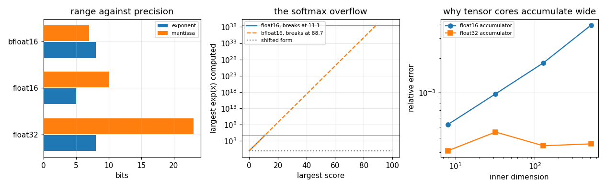

# 96. Floating Point in Deep Learning

**Part 14: Numerical Analysis in Machine Learning and AI**

## Learning objectives

By the end of this lesson you will be able to:

1. Read a floating point format's exponent and mantissa widths and predict what will break.
2. Explain why a softmax overflows, locate the input at which it does, and give the exact fix.
3. Say what loss scaling is, why it introduces no rounding, and how wide its window is.
4. Explain why every mixed precision system stores in 16 bits and accumulates in 32, with the
   integer that proves it.
5. Say precisely where the non-determinism in a GPU reduction comes from.

## Prerequisites

Lesson 03 (IEEE 754, machine epsilon, the exponent range). Lesson 04 (summation, stagnation, the
error growth of a long sum). Lesson 05 (cancellation). Lesson 89 and 95 supply the setting, but the
numerical content here is Part 1's.

---

## 1. The same 16 bits, spent differently

Everything in this lesson comes from one table. A floating point format splits its bits between an
exponent, which sets the **range**, and a mantissa, which sets the **precision**. Two formats use
16 bits and split them differently.

```python
# Standard setup, the same in every lesson of this course.
import sys, pathlib

_root = pathlib.Path.cwd()
while not (_root / "src" / "nalib").is_dir() and _root != _root.parent:
    _root = _root.parent
sys.path.insert(0, str(_root / "src"))

import numpy as np
import matplotlib.pyplot as plt

SEED = 42                                  # fixed so your numbers match the text
rng = np.random.default_rng(SEED)

np.set_printoptions(precision=6, linewidth=100, suppress=False)
plt.rcParams.update({
    "figure.figsize": (7.5, 4.5), "figure.dpi": 110,
    "axes.grid": True, "grid.alpha": 0.3, "font.size": 10,
})
```

```python
from nalib import mixedprecision as mp

out = mp.the_same_bits_spent_differently()
print(f"{'format':>10}{'bits':>6}{'exp':>5}{'mant':>6}{'unit roundoff':>16}"
      f"{'largest':>14}{'smallest normal':>18}{'digits':>9}")
for row in out["rows"]:
    print(f"{row['name']:>10}{row['bits']:>6}{row['exponent_bits']:>5}{row['mantissa_bits']:>6}"
          f"{row['unit_roundoff']:>16.3e}{row['largest']:>14.3e}"
          f"{row['smallest_normal']:>18.3e}{row['decimal_digits']:>9.2f}")
print(f"\nbetween the two 16 bit formats: a factor of {out['precision_ratio']:.0f} in precision "
      f"against {out['range_ratio']:.2e} in range")

assert out["the_two_halves_have_the_same_width"]
assert out["one_is_more_precise_and_one_has_more_range"]
```

*Output:*

```text
    format  bits  exp  mant   unit roundoff       largest   smallest normal   digits
   float64    64   11    52       1.110e-16    1.798e+308        2.225e-308    15.65
   float32    32    8    23       5.960e-08     3.403e+38         1.175e-38     6.92
   float16    16    5    10       4.883e-04     6.550e+04         6.104e-05     3.01
  bfloat16    16    8     7       3.906e-03     3.390e+38         1.175e-38     2.11

between the two 16 bit formats: a factor of 8 in precision against 5.17e+33 in range
```

`float16` spends $5$ bits on the exponent and $10$ on the mantissa. `bfloat16` spends $8$ and $7$.
So `float16` has $8$ times the precision and `bfloat16` has $5.2\times10^{33}$ times the range, and
**every practical difference between them is one of those two numbers**.

`bfloat16` is worth a moment. Its exponent field is `float32`'s, so converting `float32` to
`bfloat16` is a truncation of the low 16 bits and nothing else: no range check, no overflow, no
special handling. That is a hardware argument rather than a numerical one, and it is why the format
exists.

Note also the last column. `bfloat16` carries $2.1$ decimal digits. That is fewer digits than a
slide rule.

## 2. Where a softmax overflows

The softmax of a score vector is

$$
p_i = \frac{e^{x_i}}{\sum_j e^{x_j}} .
$$

Written that way it computes $e^{x_i}$, and $e^{x}$ leaves a format when $x$ passes
$\log(\text{largest})$. That is lesson 03's exponent range and has nothing to do with softmax.

```python
from nalib import mixedprecision as mp

out = mp.a_softmax_overflows_where_the_exponent_runs_out()
print(f"{'format':>10}{'largest value':>16}{'bisected input':>17}"
      f"{'log(largest)':>15}{'ratio':>10}")
for row in out["rows"]:
    print(f"{row['format']:>10}{row['largest']:>16.3e}{row['measured']:>17.4f}"
          f"{row['predicted']:>15.4f}{row['ratio']:>10.6f}")

assert out["the_threshold_is_log_of_the_largest"]
assert out["float16_is_the_tight_one"]
```

*Output:*

```text
    format   largest value   bisected input   log(largest)     ratio
   float16       6.550e+04          11.0898        11.0899  0.999998
  bfloat16       3.390e+38          88.7500        88.7189  1.000350
   float32       3.403e+38          88.7228        88.7228  1.000000
```

**A `float16` softmax overflows at an input of $11.09$.** Not $10^{4}$, not $10^{38}$: eleven. A
logit of $12$ is entirely ordinary, so the direct formula is not a thing that occasionally fails on
extreme data. It is a thing that fails.

`bfloat16` and `float32` both hold out to $88.7$, which is the same number because they have the
same exponent field.

## 3. The shift is an identity, not a trade

Softmax is invariant under adding a constant to every score:

$$
\frac{e^{x_i - m}}{\sum_j e^{x_j - m}}
= \frac{e^{-m}e^{x_i}}{e^{-m}\sum_j e^{x_j}}
= \frac{e^{x_i}}{\sum_j e^{x_j}} .
$$

Take $m = \max_j x_j$ and every exponent is at most $0$, so $e^{x_i - m} \le 1$ and nothing can
overflow, ever, for any input. The same shift gives the **logsumexp** identity:

$$
\log\sum_j e^{x_j} = m + \log\sum_j e^{x_j - m} .
$$

```python
from nalib import mixedprecision as mp

out = mp.the_shift_is_exact_and_it_fixes_the_overflow()
print("adding a constant to every score, in double precision:")
print(f"{'offset':>12}{'change in the softmax':>25}{'offset times u':>18}")
for row in out["invariance"]:
    print(f"{row['offset']:>12.0e}{row['change']:>25.3e}{row['predicted']:>18.3e}")
print(f"\n{'format':>10}{'largest input':>16}{'direct finite':>16}"
      f"{'shifted finite':>17}{'shifted sums to':>18}")
for row in out["rows"]:
    print(f"{row['format']:>10}{row['input']:>16.1f}{str(row['direct_finite']):>16}"
          f"{str(row['shifted_finite']):>17}{row['shifted_sums_to']:>18.6f}")

assert out["the_identity_is_exact"]
assert out["the_only_error_is_the_shift_itself"]
assert out["the_shifted_form_never_overflows"]
```

*Output:*

```text
adding a constant to every score, in double precision:
      offset    change in the softmax    offset times u
       0e+00                0.000e+00         0.000e+00
       1e+00                2.776e-17         1.110e-16
       1e+03                4.274e-15         1.110e-13
       1e+06                6.632e-12         1.110e-10

    format   largest input   direct finite   shifted finite   shifted sums to
   float16            10.0            True             True          1.000318
   float16            12.0           False             True          1.000043
   float16           100.0           False             True          1.000000
   float16         10000.0           False             True          1.000000
  bfloat16            10.0            True             True          1.000317
  bfloat16            12.0            True             True          1.000043
  bfloat16           100.0           False             True          1.000000
  bfloat16         10000.0           False             True          1.000000
```

**At offset $0$ the change is exactly $0.0$**, and at offset $10^6$ it is $6.6\times10^{-12}$,
which is bounded by the rounding of the shifted input itself, $10^6 u$. The identity is exact; what
is not exact is representing $x + 10^6$ in the first place.

And the shifted form returns a finite answer at an input of $10^{4}$ in both 16 bit formats, where
the direct form has been returning `inf` since $11.09$.

This is worth stating flatly because it is unusual. **Most numerical fixes trade something.** The
stable quadratic formula of lesson 05 costs an extra operation, the augmented ridge form of lesson
94 costs a taller matrix. This one costs a maximum and a subtraction, and gives up nothing at all.
It should be the only way anyone writes a softmax.

## 4. Underflow, which is the same field from the other end

An exponent range has two ends. Activations sit near $1$ and gradients do not, so the small end is
the one training meets.

```python
from nalib import mixedprecision as mp

out = mp.gradients_underflow_before_activations_do()
print(f"smallest positive float16 : {out['float16_smallest']:.3e}")
print(f"smallest positive bfloat16: {out['bfloat16_smallest']:.3e}")
print(f"\nfraction of a gradient that becomes exactly zero")
print(f"{'gradient scale':>16}" + "".join(f"{name:>14}" for name in out["names"]))
for row in out["rows"]:
    print(f"{row['scale']:>16.0e}"
          + "".join(f"{row[f'{name} zeros']:>14.6f}" for name in out["names"]))

assert out["float16_fails"]
assert out["bfloat16_survives"]
```

*Output:*

```text
smallest positive float16 : 5.960e-08
smallest positive bfloat16: 9.184e-41

fraction of a gradient that becomes exactly zero
  gradient scale       float16      bfloat16
           1e-02      0.000000      0.000000
           1e-04      0.000244      0.000000
           1e-06      0.023438      0.000000
           1e-08      0.998291      0.000000
           1e-10      1.000000      0.000000
```

**At a gradient scale of $10^{-8}$, $99.8$ per cent of a `float16` gradient is exactly zero**, and
none of a `bfloat16` one is. The gap between the two smallest positive numbers, $6\times10^{-8}$
against $9\times10^{-41}$, is $33$ orders of magnitude, and it is entirely the exponent field.

The failure mode matters. An underflowed gradient is not an inaccurate gradient. It is a zero, so
the parameter does not move, and no amount of averaging over steps recovers it.

## 5. Loss scaling

The fix is a change of units. Multiply the loss by $S$ before differentiating, so every gradient is
multiplied by $S$ too, and divide by $S$ after the cast back to `float32`. Choose $S$ to be a power
of two and **neither the multiplication nor the division rounds at all**: they only change the
exponent field.

```python
from nalib import mixedprecision as mp

out = mp.loss_scaling_has_a_window()
print("relative error after multiplying by 2**p, rounding to the format, and dividing back")
print(f"{'p':>5}{'scale':>13}" + "".join(f"{name + ' error':>18}{name + ' zeros':>18}"
                                         for name in out["names"]))
for row in out["rows"]:
    line = f"{row['power']:>5}{row['scale']:>13.3e}"
    for name in out["names"]:
        error = row[f"{name} error"]
        line += ("{:>18}".format("overflow") if not np.isfinite(error)
                 else f"{error:>18.6f}")
        line += f"{row[f'{name} zeros']:>18.6f}"
    print(line)
for name, window in out["windows"].items():
    print(f"\n{name}: works from 2**{window['lowest']} to 2**{window['highest']}, "
          f"overflows at 2**{window['overflows_above']}")

assert out["float16_needs_scaling"]
assert out["bfloat16_does_not"]
assert out["the_window_has_a_top"]
```

*Output:*

```text
relative error after multiplying by 2**p, rounding to the format, and dividing back
    p        scale     float16 error     float16 zeros    bfloat16 error    bfloat16 zeros
    0    1.000e+00          0.998161          0.998291          0.001688          0.000000
    5    3.200e+01          0.054675          0.078369          0.001688          0.000000
   10    1.024e+03          0.001698          0.002197          0.001688          0.000000
   15    3.277e+04          0.000203          0.000244          0.001688          0.000000
   20    1.049e+06          0.000202          0.000000          0.001688          0.000000
   25    3.355e+07          0.000202          0.000000          0.001688          0.000000
   30    1.074e+09          0.000202          0.000000          0.001688          0.000000
   35    3.436e+10          0.000202          0.000000          0.001688          0.000000
   40    1.100e+12          0.000202          0.000000          0.001688          0.000000
   45    3.518e+13          overflow          0.000000          0.001688          0.000000
   50    1.126e+15          overflow          0.000000          0.001688          0.000000

float16: works from 2**10 to 2**40, overflows at 2**45

bfloat16: works from 2**0 to 2**50, overflows at 2**None
```

**The `float16` window is $30$ powers of two wide**, from $2^{10}$ to $2^{40}$, with zeros below it
and `inf` above. That width is why the standard automatic implementation works: it starts high,
halves the scale whenever a step produces an `inf`, and doubles it after a few hundred clean steps.
A window of $30$ doublings gives that search plenty of room.

**And `bfloat16` needs none of it.** Its error is $0.0017$ at every scale from $2^0$ to $2^{50}$,
because the value never leaves the representable range. That single row is why `bfloat16` displaced
`float16` for training: not because it is better arithmetic, it is eight times worse, but because
it deletes a whole piece of machinery.

## 6. Stagnation, and why the accumulator is always wider

Lesson 04 showed what happens when a running total gets much larger than the term being added. Once
the total exceeds $\text{term}/u$, the sum $\text{total} + \text{term}$ rounds back to
$\text{total}$ and the loop stops making progress.

In double precision $1/u = 9\times10^{15}$ and this is a curiosity. In `float16` it is $2048$.

```python
from nalib import mixedprecision as mp

out = mp.a_low_precision_sum_stagnates()
print("add 1.0 repeatedly until the total stops changing")
print(f"{'format':>10}{'terms added':>14}{'total':>14}{'1/u':>16}{'stagnated':>12}")
for row in out["rows"]:
    print(f"{row['format']:>10}{row['terms']:>14}{row['total']:>14.1f}"
          f"{row['predicted']:>16.0f}{str(row['stagnated']):>12}")
print(f"\nstoring in float16 and accumulating in float32: "
      f"{out['mixed_precision_terms']} terms give {out['mixed_precision_total']:.1f}")

assert out["the_stagnation_point_is_one_over_u"]
assert out["mixed_precision_is_exact"]
```

*Output:*

```text
add 1.0 repeatedly until the total stops changing
    format   terms added         total             1/u   stagnated
   float16          2048        2048.0            2048        True
  bfloat16           256         256.0             256        True
   float32        200000      200000.0        16777216       False

storing in float16 and accumulating in float32: 20000 terms give 20000.0
```

**A `float16` sum of ones stops at exactly $2048$ and a `bfloat16` one at exactly $256$**, both
equal to $1/u$ to the digit. `float32` has not stagnated after $200000$; its limit is
$1.7\times10^{7}$.

Read that `bfloat16` row again. **A `bfloat16` running total cannot count past $256$.** A layer with
$512$ inputs cannot have its activations summed in `bfloat16` at all, and every transformer layer is
much wider than that.

The last line is the fix, and it is the definition of mixed precision: **store in 16 bits and
accumulate in 32**. Same data, same memory traffic, and the sum is exact at $20000$ terms.

## 7. Two orderings, two answers

Floating point addition is not associative, so a sum has as many answers as it has orderings. This
is lesson 04 again, and in a parallel setting it stops being a curiosity.

```python
from nalib import mixedprecision as mp

out = mp.the_order_of_a_reduction_changes_the_answer()
print(f"summing the same numbers in {out['orders']} random orders, in {out['format']}")
print(f"{'n':>10}{'distinct answers':>19}{'sequential spread':>20}"
      f"{'pairwise spread':>18}{'sqrt(n) u bound':>18}")
for row in out["rows"]:
    print(f"{row['size']:>10}{row['distinct']:>19}{row['sequential_spread']:>20.3e}"
          f"{row['pairwise_spread']:>18.3e}{row['predicted']:>18.3e}")
print(f"\nsequential spread grows like n to the {out['sequential_slope']:.4f}")
print(f"pairwise   spread grows like n to the {out['pairwise_slope']:.4f}")
print(f"pairwise is tighter by up to {out['largest_gain_from_pairwise']:.1f}")
print(f"the sqrt(n) u bound is loose by up to {out['worst_bound_slack']:.0f}")

assert out["the_answers_differ"]
assert out["the_sequential_spread_grows_like_the_square_root"]
assert out["pairwise_is_much_flatter"]
```

*Output:*

```text
summing the same numbers in 200 random orders, in float32
         n   distinct answers   sequential spread   pairwise spread   sqrt(n) u bound
      1000                  7           2.641e-06         3.961e-07         5.101e-05
     10000                  9           9.149e-06         7.038e-07         5.507e-04
    100000                  8           4.178e-05         5.613e-07         3.959e-03
   1000000                 14           9.918e-05         9.889e-07         5.502e-02

sequential spread grows like n to the 0.5384
pairwise   spread grows like n to the 0.1094
pairwise is tighter by up to 100.3
the sqrt(n) u bound is loose by up to 555
```

Three separate facts here.

**The answers differ.** Same numbers, same code, $7$ to $14$ distinct results depending on the
order.

**The sequential spread follows the square root law**, at a fitted exponent of $0.538$. That is the
random-sign version of lesson 04's bound, not the worst case $nu$, because the rounding errors have
independent signs on random data.

**Pairwise summation does not follow that law at all**, at a fitted $0.109$, so at a million terms it
is $100$ times tighter. NumPy's `sum` is pairwise, which is why a naive experiment here understates
the problem: you have to write the sequential loop yourself, or use `cumsum`, to see it.

And the classic $\sqrt n\,u$ bound is loose by a factor of $555$ even against sequential summation.
It is a bound and it is not an estimate.

## 8. Where the non-determinism actually comes from

"The same training run gives different numbers on different days" is usually blamed on the
arithmetic. The arithmetic is deterministic. What varies is the **grouping**.

A parallel reduction splits the array into blocks, sums each block, then sums the blocks. The number
of blocks depends on the hardware, on the launch configuration, and sometimes on a library's
autotuner. Every grouping computes a correct sum of the same numbers, and they are not the same
number.

```python
from nalib import mixedprecision as mp

out = mp.chunking_is_what_makes_a_reduction_nondeterministic()
print(f"the exact sum is {out['exact']:.10f}")
print(f"{'chunks':>10}{'answer':>20}{'relative error':>18}")
for row in out["rows"]:
    print(f"{row['chunks']:>10}{row['answer']:>20.10f}{row['error']:>18.3e}")
print(f"\n{out['distinct']} distinct answers, spread {out['spread']:.3e}")
print(f"best: {out['best']['chunks']} chunks, worst: {out['worst']['chunks']} chunks")

assert out["chunking_changes_the_answer"]
assert out["more_chunks_is_usually_better"]
```

*Output:*

```text
the exact sum is -423.2930278923
    chunks              answer    relative error
         1     -423.2934570312         1.014e-06
         2     -423.2937927246         1.807e-06
         8     -423.2939453125         2.167e-06
        64     -423.2932434082         5.091e-07
       512     -423.2929077148         2.839e-07
      4096     -423.2932434082         5.091e-07

5 distinct answers, spread 1.038e-03
best: 512 chunks, worst: 8 chunks
```

**Five distinct answers from six block counts.** And the direction is worth noting: more blocks is
both **less reproducible and more accurate**, because a block count of $k$ is a step towards
pairwise summation.

So bitwise reproducibility and accuracy pull against each other here. A deterministic reduction
fixes the block count, which usually means giving up some parallelism or accepting a fixed and
possibly suboptimal grouping. That is the trade, and it is not "turn off the randomness", because
there was never any randomness.

## 9. A matrix product needs a wider accumulator

A dot product of length $k$ is a sum of $k$ terms, so section 6 applies to every entry of every
matrix product in a network. This is the single most important consequence of this lesson, because
it is what the hardware is built around.

```python
from nalib import mixedprecision as mp

out = mp.a_half_precision_product_needs_a_wider_accumulator()
print("inputs stored in float16, accumulator in float16 or float32")
print(f"{'inner k':>10}{'half accumulator':>20}{'single accumulator':>21}"
      f"{'ratio':>9}{'excess':>14}")
for row in out["rows"]:
    print(f"{row['inner']:>10}{row['half_accumulator']:>20.6e}"
          f"{row['single_accumulator']:>21.6e}"
          f"{row['half_accumulator'] / row['single_accumulator']:>9.2f}"
          f"{row['excess']:>14.3e}")
print(f"\nthe float16 accumulator's extra error grows like k to the {out['excess_slope']:.4f}")
print(f"the float32 accumulator's total error grows like k to the {out['wide_slope']:.4f}")

assert out["the_narrow_one_grows"]
assert out["the_wide_one_is_flat"]
```

*Output:*

```text
inputs stored in float16, accumulator in float16 or float32
   inner k    half accumulator   single accumulator    ratio        excess
         8        5.261377e-04         3.101605e-04     1.70     2.160e-04
        32        9.762027e-04         4.523154e-04     2.16     5.239e-04
       128        1.819087e-03         3.430098e-04     5.30     1.476e-03
       512        3.891855e-03         3.563382e-04    10.92     3.536e-03

the float16 accumulator's extra error grows like k to the 0.6797
the float32 accumulator's total error grows like k to the 0.0101
```

**The `float32` accumulator's error is flat**, at a fitted exponent of $0.010$. It does not depend on
$k$ at all, because the only rounding left is the one-off cast of the inputs.

**The `float16` accumulator's extra error grows like $k^{0.68}$**, and by an inner dimension of $512$
it is $10.9$ times the other. In a real layer $k$ is in the thousands.

That is why every tensor core in every accelerator multiplies in 16 bits and accumulates in 32. It
is not a compromise or a safety margin. It is the difference between an error that depends on the
layer width and one that does not.

## 10. The picture

```python
from nalib import mixedprecision as mp

fig, axes = plt.subplots(1, 3, figsize=(11.5, 3.6))

names = ("float32", "float16", "bfloat16")
positions = np.arange(len(names))
axes[0].barh(positions - 0.18, [mp.describe(n)["exponent_bits"] for n in names],
             height=0.34, label="exponent")
axes[0].barh(positions + 0.18, [mp.describe(n)["mantissa_bits"] for n in names],
             height=0.34, label="mantissa")
axes[0].set_yticks(positions)
axes[0].set_yticklabels(names)
axes[0].set_xlabel("bits")
axes[0].set_title("range against precision")
axes[0].legend(fontsize=7)

grid = np.linspace(0.0, 100.0, 400)
for name, style in (("float16", "-"), ("bfloat16", "--")):
    limit = mp.describe(name)["overflow_input_for_exp"]
    axes[1].semilogy(grid, np.where(grid < limit, np.exp(np.minimum(grid, limit)), np.nan),
                     style, label=f"{name}, breaks at {limit:.1f}")
    axes[1].axhline(mp.describe(name)["largest"], color="0.6", lw=0.8)
axes[1].semilogy(grid, np.ones_like(grid), ":", color="0.5", label="shifted form")
axes[1].set_xlabel("largest score")
axes[1].set_ylabel("largest exp(x) computed")
axes[1].set_title("the softmax overflow")
axes[1].legend(fontsize=7)

product = mp.a_half_precision_product_needs_a_wider_accumulator()
inner = [row["inner"] for row in product["rows"]]
axes[2].loglog(inner, [row["half_accumulator"] for row in product["rows"]], "o-",
               label="float16 accumulator")
axes[2].loglog(inner, [row["single_accumulator"] for row in product["rows"]], "s-",
               label="float32 accumulator")
axes[2].set_xlabel("inner dimension")
axes[2].set_ylabel("relative error")
axes[2].set_title("why tensor cores accumulate wide")
axes[2].legend(fontsize=7)

fig.tight_layout(); fig.savefig("../figures/96_precision.png", dpi=110); plt.close(fig)
print("saved ../figures/96_precision.png")
```

*Output:*

```text
saved ../figures/96_precision.png
```



The left panel is section 1: the two 16 bit bars have the same total length and different splits. The
middle is section 2, with each curve stopping where its format's largest value is reached and the
shifted form running flat at $1$ forever. The right is section 9: one line rising, one flat.

## 11. From scratch

The three fixes in this lesson are each two lines. Writing them out shows that none of them is
clever.

```python
def my_softmax(scores):
    """The only correct way to write it."""
    shifted = scores - np.max(scores)
    raised = np.exp(shifted)
    return raised / np.sum(raised)


def my_logsumexp(scores):
    """The same shift, one step earlier."""
    peak = np.max(scores)
    return peak + np.log(np.sum(np.exp(scores - peak)))


def my_scaled_backward(gradient, scale, dtype):
    """Loss scaling: two exact operations around one inexact one."""
    stored = np.asarray(np.asarray(gradient) * scale, dtype=dtype)
    return np.asarray(stored, dtype=np.float64) / scale


from nalib import mixedprecision as mp

scores = np.array([1000.0, 999.0, 998.0, -50.0])
mine = my_softmax(scores)
print(f"softmax of a vector around 1000: {mine}")
print(f"it sums to {float(np.sum(mine)):.15f}")
print(f"logsumexp {my_logsumexp(scores):.10f}, against the largest score {scores.max():.1f}")

with np.errstate(over="ignore", invalid="ignore"):
    naive = np.exp(scores) / np.sum(np.exp(scores))
print(f"the direct formula gives {naive}")

tiny = np.array([1e-8, -3e-8, 5e-9])
print(f"\nunscaled in float16 : {my_scaled_backward(tiny, 1.0, np.float16)}")
print(f"scaled by 2**20     : {my_scaled_backward(tiny, 2.0 ** 20, np.float16)}")
print(f"the truth           : {tiny}")

assert abs(float(np.sum(mine)) - 1.0) < 1e-15
assert not np.all(np.isfinite(naive))
assert np.allclose(my_scaled_backward(tiny, 2.0 ** 20, np.float16), tiny, rtol=1e-3)
```

*Output:*

```text
softmax of a vector around 1000: [0.665241 0.244728 0.090031 0.      ]
it sums to 1.000000000000000
logsumexp 1000.4076059644, against the largest score 1000.0
the direct formula gives [nan nan nan  0.]

unscaled in float16 : [ 0.000000e+00 -5.960464e-08  0.000000e+00]
scaled by 2**20     : [ 9.997166e-09 -3.000605e-08  4.998583e-09]
the truth           : [ 1.e-08 -3.e-08  5.e-09]
```

The shifted softmax handles scores of $1000$ without noticing. The direct one returns `nan`. Loss
scaling turns three zeros into three correct gradients, and the only difference between the two
calls is a power of two.

## 12. Exercises

**Level 1, understanding**

1.1 Give the exponent and mantissa widths of `float16` and `bfloat16`, and say which failure each
one is prone to.

1.2 Say why $\exp$ overflows a format at $\log$ of its largest value, and give that number for
`float16`.

1.3 Explain why the softmax shift costs nothing, unlike most numerical fixes.

1.4 Say why loss scaling introduces no rounding when the scale is a power of two.

1.5 Give the number of terms after which a `float16` sum of ones stagnates, and derive it.

**Level 2, derivation**

2.1 Derive the largest representable value of a format from its exponent width and bias.

2.2 Derive the stagnation point $\text{term}/u$ for a running sum, and say what changes if the terms
shrink.

2.3 Derive the $\sqrt n\, u$ estimate for the error of a sequential sum with random signs, and say
where the worst case $nu$ comes from instead.

2.4 Show that pairwise summation has error $O(u \log n)$ and explain the measured exponent of
$0.109$.

2.5 Show that softmax is invariant under a constant shift and that the shifted form's exponents are
all in $[e^{x_{\min} - x_{\max}}, 1]$.

**Level 3, computational**

3.1 Implement `float8` in the two splits used in practice, E4M3 and E5M2, and repeat section 1's
table for them.

3.2 Implement dynamic loss scaling with the skip-and-halve rule, and measure how often it skips a
step at each starting scale.

3.3 Implement stochastic rounding and measure whether it removes the stagnation of section 6.

3.4 Implement Kahan summation in `float16` and measure how far it moves the stagnation point.

3.5 Implement a deterministic reduction with a fixed block count and measure what it costs against
the fastest available grouping.

**Level 4, experimental**

4.1 Measure the largest logit that appears in a real softmax over a training run and compare it
against $11.09$.

4.2 Measure the accuracy of a matrix product as a function of the inner dimension for every
combination of storage and accumulator format, and find which combinations are usable.

4.3 Measure how much of the total error in a forward pass comes from storage rounding and how much
from accumulation, by varying the two independently.

**Level 5, advanced**

5.1 **Why bfloat16 won.** Given that `bfloat16` has eight times the rounding error of `float16`, give
the argument for why it is the default for training and say what would have to change to reverse
that.

5.2 **Stochastic rounding.** Explain what it does to the expected value of a sum, why that removes
stagnation, and what it costs in variance.

5.3 **Reproducibility against speed.** Given section 8, state precisely what a "deterministic mode"
in a deep learning framework has to fix, and why it cannot be free.

## 13. Key takeaways

- **The two 16 bit formats are the same bits split differently**: `float16` has $8$ times the
  precision, `bfloat16` has $5.2\times10^{33}$ times the range, and every difference between them
  follows from that.

- **`bfloat16` carries $2.1$ decimal digits.**

- **A `float16` softmax overflows at an input of $11.09$**, which is $\log$ of $65504$, matched to
  $4$ parts in $10^4$. In `bfloat16` and `float32` it is $88.7$.

- **The shift by the maximum is an identity**, changing the answer by exactly $0$, and the shifted
  form is finite at inputs of $10^4$ where the direct one has failed since $11.09$. It gives up
  nothing.

- **Gradients underflow before activations do.** At a scale of $10^{-8}$, $99.8$ per cent of a
  `float16` gradient is exactly zero and none of a `bfloat16` one is.

- **Loss scaling is a change of units with no rounding**, and its `float16` window is $30$ powers of
  two wide, from $2^{10}$ to $2^{40}$. `bfloat16` needs none at all.

- **A `float16` sum of ones stagnates at exactly $2048$ and a `bfloat16` one at exactly $256$**,
  both $1/u$ to the digit. A `bfloat16` accumulator cannot count past a layer width of $256$.

- **Storing in 16 bits and accumulating in 32 is exact at $20000$ terms**, which is the whole
  definition of mixed precision.

- **A reduction has one answer per ordering.** The sequential spread grows like $n^{0.538}$ and the
  pairwise spread like $n^{0.109}$, so pairwise is $100$ times tighter at a million terms.

- **The $\sqrt n\,u$ bound is loose by $555$** on random data, because it is a bound.

- **Non-determinism comes from the grouping, not the arithmetic.** Six block counts give five
  distinct answers, and more blocks is both less reproducible and more accurate.

- **A matrix product needs a wider accumulator.** The extra error from a `float16` accumulator grows
  like $k^{0.68}$ and reaches $10.9$ times the `float32` one by $k = 512$, while the `float32`
  accumulator's error is flat at $k^{0.010}$.

## Where this goes next

Lesson 97 takes the other thing a training system does with numbers: differentiating them. Automatic
differentiation is neither symbolic differentiation nor the finite differences of lesson 68, and the
distinction is exact rather than a matter of degree.
