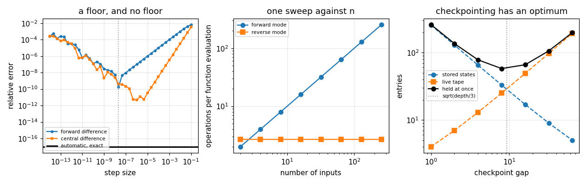

# 97. Automatic Differentiation

**Part 14: Numerical Analysis in Machine Learning and AI**

## Learning objectives

By the end of this lesson you will be able to:

1. Say what separates automatic differentiation from both symbolic differentiation and finite
   differences, and why it has no step size.
2. Implement forward mode with dual numbers and reverse mode with a tape, from nothing.
3. Choose between the two modes from the shape of the Jacobian, with a counted cost rather than a
   guess.
4. Explain what checkpointing buys, what it costs, and where its optimum is.
5. Name three situations in which automatic differentiation returns a confident wrong answer.

## Prerequisites

Lesson 68 (finite differences and the step size trade). Lesson 84 (the $\varepsilon^{1/3}$ step and
the accuracy floor). Lesson 20 (Newton's method, which section 10 differentiates through). Lesson 07
(Taylor expansion). No machine learning is assumed.

---

## 1. Three ways to differentiate a program

Given a function written as code, there are three ways to get its derivative, and they are different
objects rather than three approximations to one.

```text
symbolic         transform the expression into another expression
                 exact, and can grow exponentially: the product rule duplicates subexpressions

finite           evaluate at nearby points and divide
difference       has a step size, so it trades truncation against rounding, and has a floor

automatic        apply the chain rule to the elementary operations the program performed
                 exact to rounding, no step size, cost a small multiple of the function itself
```

The middle one is lesson 68. This lesson is about the third, and the first thing to establish is
that it is not a clever finite difference. **It has no step size at all**, so there is nothing to
tune and no truncation error to trade.

## 2. Forward mode: dual numbers

Extend the reals with a symbol $\epsilon$ satisfying $\epsilon^2 = 0$, and write numbers as
$a + b\epsilon$. Multiplication gives

$$
(a + b\epsilon)(c + d\epsilon) = ac + (ad + bc)\epsilon + bd\epsilon^2 = ac + (ad + bc)\epsilon .
$$

The $\epsilon$ part of the answer is $ad + bc$, which is the product rule. It is the product rule
**because** $\epsilon^2$ vanishes, and every other rule of calculus appears the same way. Evaluate a
function at $x + 1\cdot\epsilon$ and the $\epsilon$ part of the result is $f'(x)$.

```python
# Standard setup, the same in every lesson of this course.
import sys, pathlib

_root = pathlib.Path.cwd()
while not (_root / "src" / "nalib").is_dir() and _root != _root.parent:
    _root = _root.parent
sys.path.insert(0, str(_root / "src"))

import numpy as np
import matplotlib.pyplot as plt

SEED = 42                                  # fixed so your numbers match the text
rng = np.random.default_rng(SEED)

np.set_printoptions(precision=6, linewidth=100, suppress=False)
plt.rcParams.update({
    "figure.figsize": (7.5, 4.5), "figure.dpi": 110,
    "axes.grid": True, "grid.alpha": 0.3, "font.size": 10,
})
```

```python
from nalib import autodiff as ad

x = ad.Dual(3.0, 1.0)
print(f"x = {x}, seeded with derivative 1")
print(f"x * x       -> {x * x}          (2x = 6)")
print(f"x ** 4      -> {x ** 4}       (4x^3 = 108)")
print(f"sin(x)      -> {ad.sin(x)}")
print(f"  against cos(3) = {np.cos(3.0):.15f}")
print(f"exp(x)/x    -> {ad.exp(x) / x}")
predicted = np.exp(3.0) / 3.0 - np.exp(3.0) / 9.0
print(f"  against exp(3)/3 - exp(3)/9 = {predicted:.12f}")

assert (x * x).derivative == 6.0
assert abs(ad.sin(x).derivative - np.cos(3.0)) < 1e-15
assert abs((ad.exp(x) / x).derivative - predicted) < 1e-12
```

*Output:*

```text
x = Dual(3.0, 1.0), seeded with derivative 1
x * x       -> Dual(9.0, 6.0)          (2x = 6)
x ** 4      -> Dual(81.0, 108.0)       (4x^3 = 108)
sin(x)      -> Dual(0.1411200080598672, -0.9899924966004454)
  against cos(3) = -0.989992496600445
exp(x)/x    -> Dual(6.69517897439589, 4.46345264959726)
  against exp(3)/3 - exp(3)/9 = 4.463452649597
```

Nothing is approximated. The product rule is exact arithmetic on a pair of numbers, and so is every
other rule.

## 3. It is exact, and a finite difference cannot be

Lesson 68 gave the finite difference trade. A forward difference has truncation error
$O(h)$ and rounding error $O(\varepsilon|f|/h)$, so the best it can do is around
$\sqrt{\varepsilon}$; a central difference has truncation $O(h^2)$ and reaches about
$\varepsilon^{2/3}$.

```python
from nalib import autodiff as ad

out = ad.forward_mode_is_exact_with_no_step_size()
print(f"{'function':>14}{'inputs':>8}{'forward mode':>16}{'reverse mode':>16}"
      f"{'they agree to':>16}")
for row in out["rows"]:
    print(f"{row['name']:>14}{row['inputs']:>8}{row['forward_error']:>16.3e}"
          f"{row['reverse_error']:>16.3e}{row['modes_agree']:>16.3e}")

assert out["both_are_exact"]
assert out["the_modes_agree"]
```

*Output:*

```text
      function  inputs    forward mode    reverse mode   they agree to
    polynomial       1       0.000e+00       0.000e+00       0.000e+00
       product       3       0.000e+00       0.000e+00       0.000e+00
          trig       2       0.000e+00       0.000e+00       0.000e+00
   exponential       2       1.342e-16       1.342e-16       1.897e-16
         layer       3       5.772e-18       5.772e-18       0.000e+00
```

Three of the five come out **exactly** right, at $0.0$, and the worst is $1.3\times10^{-16}$.

Now the comparison, over forty step sizes.

```python
from nalib import autodiff as ad

out = ad.a_finite_difference_has_a_floor_and_this_does_not()
print(f"{'step':>12}{'forward difference':>22}{'central difference':>22}")
for row in out["rows"][::5]:
    print(f"{row['step']:>12.3e}{row['forward']:>22.3e}{row['central']:>22.3e}")
print(f"\nbest forward: {out['best_forward']['forward']:.3e} at h = "
      f"{out['best_forward']['step']:.3e}")
print(f"best central: {out['best_central']['central']:.3e} at h = "
      f"{out['best_central']['step']:.3e}")
print(f"automatic differentiation: {out['automatic']:.3e}, with no step at all")
print(f"\nthe predicted optimal forward step, 2 sqrt(eps |f| / |f''|), is "
      f"{out['detailed_forward_step']:.3e}")
print(f"the measured one is {out['forward_step_over_the_detailed_one']:.4f} times that")
print(f"the plain sqrt(eps) rule would say {out['predicted_forward_floor']:.3e} for the floor, "
      f"and the measured floor is {out['forward_floor_over_root_eps']:.4f} of it")

assert out["automatic_beats_both"]
assert out["the_best_step_is_where_it_was_predicted"]
```

*Output:*

```text
        step    forward difference    central difference
   1.000e-01             6.680e-03             3.222e-03
   2.154e-03             2.132e-04             1.501e-06
   4.642e-05             4.625e-06             6.969e-10
   1.000e-06             9.970e-08             4.859e-12
   2.154e-08             1.858e-10             4.137e-10
   4.642e-10             1.079e-07             5.227e-08
   1.000e-11             6.437e-07             6.437e-07
   2.154e-13             2.102e-04             9.033e-05

best forward: 1.858e-10 at h = 2.154e-08
best central: 4.859e-12 at h = 1.000e-06
automatic differentiation: 0.000e+00, with no step at all

the predicted optimal forward step, 2 sqrt(eps |f| / |f''|), is 2.118e-08
the measured one is 1.0173 times that
the plain sqrt(eps) rule would say 1.490e-08 for the floor, and the measured floor is 0.0125 of it
```

The finite difference curves are the V of lesson 68: truncation falling on the left, rounding rising
on the right, a minimum in between. **The best forward difference reaches
$1.9\times10^{-10}$ and the best central difference $4.9\times10^{-12}$, and automatic
differentiation's error is exactly $0$.**

Two details worth keeping.

**The optimal step is exactly where the theory puts it.** The prediction
$h^\star = 2\sqrt{\varepsilon|f|/|f''|}$ gives $2.12\times10^{-8}$ and the measured argmin is
$2.15\times10^{-8}$, a ratio of $1.017$.

**The plain $\sqrt\varepsilon$ rule is a scale, not a number.** The measured floor is $0.0125$ of
$\sqrt\varepsilon$, a factor of $80$ better, because the real floor carries the function's own $|f|$
and $|f''|$. Quoting $\sqrt\varepsilon$ without them is quoting the exponent and dropping the
constant.

## 4. Reverse mode: the tape

Forward mode carries a derivative along with each value, in one input direction. A gradient of $n$
inputs therefore needs $n$ sweeps. For a neural network $n$ is the parameter count, and that is
hopeless.

Reverse mode turns the computation around. Record every elementary operation and its local partial
derivatives on a **tape**, then walk the tape backwards accumulating **adjoints**
$\bar v = \partial(\text{output})/\partial v$. Starting from $\bar y = 1$ and applying

$$
\bar u \;\mathrel{+}=\; \bar v \, \frac{\partial v}{\partial u}
$$

for every operation $v$ that used $u$, one backward pass gives $\partial y/\partial x_i$ for
**every** $i$ at once.

```python
from nalib import autodiff as ad

tape = ad.Tape()
x = tape.variable(2.0)
y = tape.variable(3.0)
z = x * y + ad.sin(x)
print(f"z = x*y + sin(x) at (2, 3) is {z.value:.12f}")
print(f"the tape holds {len(tape)} entries")

adjoint = tape.backward(z.index)
print(f"dz/dx = {adjoint[x.index]:.12f}, against y + cos(x) = {3.0 + np.cos(2.0):.12f}")
print(f"dz/dy = {adjoint[y.index]:.12f}, against x = 2")

assert abs(adjoint[x.index] - (3.0 + np.cos(2.0))) < 1e-14
assert abs(adjoint[y.index] - 2.0) < 1e-14
```

*Output:*

```text
z = x*y + sin(x) at (2, 3) is 6.909297426826
the tape holds 5 entries
dz/dx = 2.583853163453, against y + cos(x) = 2.583853163453
dz/dy = 2.000000000000, against x = 2
```

Two variables, two derivatives, one backward pass. **That the count does not grow with the number of
inputs is the whole reason a model with a billion parameters can be trained.**

## 5. What a gradient costs

The theory says: forward mode costs $n$ times a function evaluation, reverse mode costs a small
constant times one. Both are statements about counted operations, so both can be checked exactly.

```python
from nalib import autodiff as ad

out = ad.a_gradient_costs_one_reverse_sweep()
print(f"{'inputs':>8}{'one evaluation':>17}{'forward ops':>14}{'reverse ops':>14}"
      f"{'forward / f':>14}{'reverse / f':>14}{'tape':>8}")
for row in out["rows"]:
    print(f"{row['inputs']:>8}{row['one_evaluation']:>17}{row['forward_operations']:>14}"
          f"{row['reverse_operations']:>14}{row['forward_ratio']:>14.1f}"
          f"{row['reverse_ratio']:>14.4f}{row['tape']:>8}")
print(f"\nat the largest size reverse mode is {out['largest_saving']:.0f} times cheaper")

assert out["reverse_is_flat"]
assert out["forward_grows_with_the_dimension"]
```

*Output:*

```text
  inputs   one evaluation   forward ops   reverse ops   forward / f   reverse / f    tape

       2                6            12            16           2.0        2.6667       8
       4               12            48            32           4.0        2.6667      16
       8               24           192            64           8.0        2.6667      32
      16               48           768           128          16.0        2.6667      64
      32               96          3072           256          32.0        2.6667     128
      64              192         12288           512          64.0        2.6667     256
     128              384         49152          1024         128.0        2.6667     512
     256              768        196608          2048         256.0        2.6667    1024

at the largest size reverse mode is 96 times cheaper
```

**Reverse mode is flat at $2.67$ times one function evaluation** from $2$ inputs to $256$, and
forward mode's ratio is exactly the input count, to nine digits. At $256$ inputs reverse mode is
$96$ times cheaper, and the factor keeps growing.

The constant $2.67$ is worth noting. It is not $1$, and in a real framework it is usually quoted as
"about 2 to 4 times the forward pass". **A gradient is not free, it is a small constant, and the
constant does not depend on the number of parameters.**

## 6. The tape is the price

Nothing is free. Reverse mode has to keep every intermediate value until the backward pass reaches
it, so its memory grows with the length of the computation. Forward mode carries two numbers.

```python
from nalib import autodiff as ad

out = ad.the_tape_is_the_price()
print(f"{'depth':>8}{'tape entries':>15}{'forward memory':>17}{'the two agree to':>19}")
for row in out["rows"]:
    print(f"{row['depth']:>8}{row['tape']:>15}{row['forward_memory']:>17}"
          f"{row['agree']:>19.1e}")
print(f"\nthe tape grows at {out['slope']:.4f} entries per step")

assert out["the_tape_grows_linearly"]
assert out["forward_memory_is_constant"]
```

*Output:*

```text
   depth   tape entries   forward memory   the two agree to
       8             25                2            0.0e+00
      16             49                2            3.3e-24
      32             97                2            4.9e-32
      64            193                2            2.2e-47
     128            385                2            2.7e-79
     256            769                2            0.0e+00

the tape grows at 3.0000 entries per step
```

**Exactly three tape entries per step**, fitted at $3.0000$, because each step here is a multiply, an
add and a `tanh`. Forward mode's memory is $2$ at every depth.

That is the real trade between the modes, and it is why forward mode has not disappeared. A long
recurrent computation in reverse mode holds its whole history in memory, and the activations of a
deep network are exactly that history.

## 7. Checkpointing

The fix is to not store everything. Keep every $k$-th state, and when the backward pass reaches a
segment, recompute that segment's tape from the stored state at its start.

```python
from nalib import autodiff as ad

out = ad.checkpointing_trades_memory_for_time()
print(f"depth {out['depth']}, full tape {out['full_tape']} entries")
print(f"{'gap':>6}{'checkpoints':>14}{'segment tape':>15}{'held at once':>15}"
      f"{'forward passes':>17}{'saving':>10}{'error':>12}")
for row in out["rows"]:
    print(f"{row['gap']:>6}{row['checkpoints']:>14}{row['segment_tape']:>15}"
          f"{row['held_at_once']:>15}{row['forward_passes']:>17.4f}"
          f"{row['memory_saving']:>10.2f}{row['error']:>12.1e}")
print(f"\nbest gap {out['best_gap']}, holding {out['best_memory']}, against a predicted "
      f"sqrt(depth/3) = {out['predicted_gap']:.2f}")

assert out["answers_are_unchanged"]
assert out["the_work_is_two_passes_whatever_the_gap"]
assert out["the_optimum_is_near_the_square_root"]
```

*Output:*

```text
depth 256, full tape 769 entries
   gap   checkpoints   segment tape   held at once   forward passes    saving       error
     1           257              4            261           2.0000      2.95     2.9e-15
     2           129              7            136           2.0000      5.65     2.4e-15
     4            65             13             78           2.0000      9.86     1.1e-14
     8            33             25             58           2.0000     13.26     3.0e-15
    16            17             49             66           2.0000     11.65     2.1e-15
    32             9             97            106           2.0000      7.25     1.5e-16
    64             5            193            198           2.0000      3.88     4.5e-16

best gap 8, holding 58, against a predicted sqrt(depth/3) = 9.24
```

Three separate facts, and the first is the surprising one.

**The extra work is exactly one forward pass, at every gap.** Not more for a small gap and less for
a large one: the forward pass is done exactly twice, once to lay the checkpoints and once during the
backward walk, whatever $k$ is.

**The memory has an interior minimum.** Checkpoints cost $\text{depth}/k$ and the live segment
costs about $3k$, so the sum is smallest near $k = \sqrt{\text{depth}/3} = 9.2$, and the measured
best gap is $8$. Memory falls from $769$ to $58$, a factor of $13.3$.

**The answer does not change**, to $10^{-14}$. Checkpointing is not an approximation.

## 8. Which mode wins is only the shape

A Jacobian of a function from $n$ inputs to $m$ outputs needs $n$ forward sweeps or $m$ backward
sweeps. That is the entire decision rule.

```python
from nalib import autodiff as ad

out = ad.which_mode_wins_is_only_the_shape()
print(f"{'inputs':>8}{'outputs':>9}{'forward ops':>14}{'reverse ops':>14}"
      f"{'ratio':>10}{'winner':>10}")
for row in out["rows"]:
    print(f"{row['inputs']:>8}{row['outputs']:>9}{row['forward_operations']:>14}"
          f"{row['reverse_operations']:>14}{row['ratio']:>10.4f}{row['winner']:>10}")
print(f"\nlargest forward advantage {out['largest_forward_advantage']:.1f}, "
      f"largest reverse advantage {out['largest_reverse_advantage']:.1f}")

assert out["forward_wins_tall"]
assert out["reverse_wins_wide"]
assert out["the_modes_agree"]
```

*Output:*

```text
  inputs  outputs   forward ops   reverse ops     ratio    winner
       2       64           896         29250    0.0306   forward
       8       32          6400         26664    0.2400   forward
      16       16         12544         13600    0.9224   forward
      32        8         24832          7272    3.4147   reverse
      64        2         24704          1350   18.2993   reverse

largest forward advantage 32.6, largest reverse advantage 18.3
```

**Forward mode wins by $32.6$ at $2$ inputs and $64$ outputs, reverse wins by $18.3$ at $64$ inputs
and $2$ outputs**, and at $16$ by $16$ the two counts are within $8$ per cent of each other. The
Jacobian is the same matrix either way, to $10^{-17}$.

A training loss has **one** output. That is why deep learning is reverse mode and why the question
never comes up there. It does come up in sensitivity analysis, in uncertainty propagation and in
anything with few parameters and many outputs, and forward mode is the right answer to those.

## 9. It differentiates the program, not the function

Here is the failure that matters, and it does not announce itself.

```python
from nalib import autodiff as ad

out = ad.it_differentiates_the_program_not_the_function()
print("the derivative of |x| at x = 0, written four ways")
print(f"{'written as':>30}{'value':>10}{'derivative':>13}")
for row in out["rows"]:
    print(f"{row['written_as']:>30}{row['value']:>10.1f}{row['derivative']:>13.1f}")
print(f"\n{out['distinct_answers']} distinct answers for one mathematical function")
print(f"\n{'input':>12}{'derivative':>13}")
for row in out["nearby"]:
    print(f"{row['at']:>12.1e}{row['derivative']:>13.1f}")

assert out["the_answer_depends_on_how_it_was_written"]
assert out["it_answers_without_complaining"]
```

*Output:*

```text
the derivative of |x| at x = 0, written four ways
                    written as     value   derivative
    abs, positive branch first      -0.0         -1.0
    abs, negative branch first       0.0          1.0
                          relu       0.0          0.0
                a smoothed abs       0.0          0.0

3 distinct answers for one mathematical function

       input   derivative
    -1.0e-08         -1.0
    -1.0e-16         -1.0
     0.0e+00         -1.0
     1.0e-16          1.0
     1.0e-08          1.0
```

$|x|$ has no derivative at $0$. Automatic differentiation does not say so. It returns
$-1$, $+1$ or $0$ depending on which branch the source code happened to test first, **with no
warning of any kind**, and the answer flips between an input of $-10^{-16}$ and $+10^{-16}$.

Every value it returns there is a defensible subgradient, and none of them is the derivative,
because there is not one. Three consequences:

- **It is a property of the source, not of the mathematics.** Rewriting `abs(x)` as
  `x if x > 0 else -x` and as `-x if x < 0 else x` gives different answers at one point.
- **Every ReLU network is differentiated this way.** It works because the set of inputs sitting
  exactly on a kink has measure zero, which is a statement about how unlikely the problem is rather
  than about it not existing.
- **The smoothed version has a genuine derivative**, $0$ at the origin, and it is the derivative of a
  different function.

## 10. Differentiating through an iterative solver

A more subtle version. Suppose the program solves $g(x, t) = 0$ for $x$ by Newton's method and you
want $dx/dt$. There are two routes.

**Unroll**: differentiate through the iterations. The tape records every Newton step.

**Implicit**: differentiate the *equation*. The implicit function theorem gives

$$
\frac{dx}{dt} = -\left(\frac{\partial g}{\partial x}\right)^{-1}\frac{\partial g}{\partial t} ,
$$

which is one linear solve at the answer, with no record of how the answer was found.

```python
from nalib import autodiff as ad

out = ad.unrolling_a_solver_converges_to_the_implicit_answer()
print(f"solving x^3 + t x - 1 = 0 at t = 0.7, root {out['root']:.12f}")
print(f"the implicit derivative is {out['implicit_derivative']:.12f}")
print(f"\n{'newton steps':>14}{'x':>14}{'x error':>13}{'dx/dt':>14}"
      f"{'derivative error':>19}{'tape':>7}")
for row in out["rows"]:
    print(f"{row['steps']:>14}{row['x']:>14.10f}{row['solution_error']:>13.2e}"
          f"{row['derivative']:>14.10f}{row['derivative_error']:>19.2e}{row['tape']:>7}")
print(f"\nthe implicit route needs {out['implicit_tape']} tape entries at any iteration count")

assert out["one_step_is_wrong"]
assert out["it_converges"]
```

*Output:*

```text
solving x^3 + t x - 1 = 0 at t = 0.7, root 0.771799135420
the implicit derivative is -0.310330677999

  newton steps             x      x error         dx/dt   derivative error   tape
             1  0.8108108108     5.05e-02 -0.2191380570           2.94e-01      8
             2  0.7731622501     1.77e-03 -0.3043505640           1.93e-02     17
             3  0.7718008629     2.24e-06 -0.3103159200           4.76e-05     26
             4  0.7717991354     3.60e-12 -0.3103306780           1.51e-10     35
             5  0.7717991354     1.44e-16 -0.3103306780           0.00e+00     44
             6  0.7717991354     1.44e-16 -0.3103306780           1.79e-16     53

the implicit route needs 4 tape entries at any iteration count
```

**After one Newton step the derivative is wrong by $29$ per cent**, and after five it is exactly
right. Unrolling gives the derivative of the *approximation*, which is the right answer only once the
approximation has converged, and the tape grows from $8$ entries to $44$ while the implicit route
needs $4$ at any count.

So the rule is: **if the program computes a fixed point, differentiate the fixed point equation, not
the iteration.** That is the whole content of implicit layers, of differentiable optimization, and of
the adjoint method for differential equations, which lesson 98 will use.

## 11. Second derivatives, for free

Nothing in the tape knows what kind of number it is holding. Put dual numbers in it, and the
adjoints come out as dual numbers whose derivative parts are second derivatives. **Forward over
reverse, with no new code in either mode.**

```python
from nalib import autodiff as ad

out = ad.forward_over_reverse_gives_an_exact_hessian()
print("Hessian of sum_i (i+1) x_i^2, which is diag(2, 4, 6, 8, 10)")
print(out["hessian"])
print(f"\nerror against the exact one : {out['error']:.3e}")
print(f"asymmetry, unasked for      : {out['asymmetry']:.3e}")
print(f"sweeps for the full Hessian : {out['sweeps_for_the_full_hessian']}")
print(f"sweeps for one H v product  : {out['sweeps_for_one_product']}, "
      f"error {out['product_error']:.3e}")
print(f"\na finite difference Hessian of Rosenbrock at h = "
      f"{out['finite_difference_step']:.0e} is off by {out['rosenbrock_gap']:.3e}")

assert out["it_is_exact"]
assert out["it_comes_out_symmetric_on_its_own"]
assert out["the_product_is_cheaper"]
```

*Output:*

```text
Hessian of sum_i (i+1) x_i^2, which is diag(2, 4, 6, 8, 10)
[[ 2.  0.  0.  0.  0.]
 [ 0.  4.  0.  0.  0.]
 [ 0.  0.  6.  0.  0.]
 [ 0.  0.  0.  8.  0.]
 [ 0.  0.  0.  0. 10.]]

error against the exact one : 0.000e+00
asymmetry, unasked for      : 0.000e+00
sweeps for the full Hessian : 10
sweeps for one H v product  : 2, error 0.000e+00

a finite difference Hessian of Rosenbrock at h = 1e-05 is off by 7.417e-06
```

**Exact, to $0.0$, and symmetric to $0.0$ without being told to be.** Symmetry was not imposed; it
came out of the algebra, which is the strongest evidence that the composition is doing what it
claims.

The last two lines are the practical point. A Hessian-vector product costs **two sweeps** against the
$2n$ a full Hessian needs, so Newton-CG from lesson 87 can run on a problem where the Hessian will
never be formed. And a finite difference Hessian of the same function is off by $7.4\times10^{-6}$,
because it is differencing twice and the errors of lesson 68 compound.

## 12. The picture

```python
from nalib import autodiff as ad

fig, axes = plt.subplots(1, 3, figsize=(11.5, 3.6))

floors = ad.a_finite_difference_has_a_floor_and_this_does_not()
steps = [row["step"] for row in floors["rows"]]
axes[0].loglog(steps, [row["forward"] for row in floors["rows"]], "o-", ms=3,
               label="forward difference")
axes[0].loglog(steps, [row["central"] for row in floors["rows"]], "s-", ms=3,
               label="central difference")
axes[0].axhline(max(floors["automatic"], 1e-17), color="k", lw=2.0,
                label="automatic, exact")
axes[0].axvline(floors["detailed_forward_step"], color="0.6", ls=":", lw=1.2)
axes[0].set_xlabel("step size")
axes[0].set_ylabel("relative error")
axes[0].set_title("a floor, and no floor")
axes[0].legend(fontsize=7)

costs = ad.a_gradient_costs_one_reverse_sweep()
inputs = [row["inputs"] for row in costs["rows"]]
axes[1].loglog(inputs, [row["forward_ratio"] for row in costs["rows"]], "o-",
               label="forward mode")
axes[1].loglog(inputs, [row["reverse_ratio"] for row in costs["rows"]], "s-",
               label="reverse mode")
axes[1].set_xlabel("number of inputs")
axes[1].set_ylabel("operations per function evaluation")
axes[1].set_title("one sweep against n")
axes[1].legend(fontsize=7)

marks = ad.checkpointing_trades_memory_for_time()
gaps = [row["gap"] for row in marks["rows"]]
axes[2].loglog(gaps, [row["checkpoints"] for row in marks["rows"]], "o--",
               label="stored states")
axes[2].loglog(gaps, [row["segment_tape"] for row in marks["rows"]], "s--",
               label="live tape")
axes[2].loglog(gaps, [row["held_at_once"] for row in marks["rows"]], "k-o",
               label="held at once")
axes[2].axvline(marks["predicted_gap"], color="0.6", ls=":", lw=1.2,
                label="sqrt(depth/3)")
axes[2].set_xlabel("checkpoint gap")
axes[2].set_ylabel("entries")
axes[2].set_title("checkpointing has an optimum")
axes[2].legend(fontsize=7)

fig.tight_layout(); fig.savefig("../figures/97_autodiff.png", dpi=110); plt.close(fig)
print("saved ../figures/97_autodiff.png")
```

*Output:*

```text
saved ../figures/97_autodiff.png
```



The left panel is section 3: two V curves and a flat line at the bottom. The middle is section 5: one
line with slope $1$ and one flat. The right is section 7, with two straight lines crossing and their
sum having a minimum where they do.

## 13. From scratch

A working forward mode is about thirty lines and a working reverse mode about forty. Here is enough
of each to differentiate a small network.

```python
class Tiny:
    """Forward mode in one class: a value and its derivative, and the rules that combine them."""
    def __init__(self, value, derivative=0.0):
        self.value, self.derivative = value, derivative

    def __add__(self, other):
        other = other if isinstance(other, Tiny) else Tiny(other)
        return Tiny(self.value + other.value, self.derivative + other.derivative)

    def __mul__(self, other):
        other = other if isinstance(other, Tiny) else Tiny(other)
        return Tiny(self.value * other.value,
                    self.derivative * other.value + self.value * other.derivative)

    __radd__, __rmul__ = __add__, __mul__


def my_tanh(t):
    value = np.tanh(t.value)
    return Tiny(value, (1.0 - value * value) * t.derivative)


def network(inputs, weights):
    """One hidden unit, one output, so the whole thing fits in a line."""
    hidden = my_tanh(weights[0] * inputs[0] + weights[1] * inputs[1])
    return hidden * weights[2]


from nalib import autodiff as ad

point = np.array([0.4, -0.7, 1.3])
data = (0.9, -0.2)


def as_function(v):
    hidden = ad.tanh(v[0] * data[0] + v[1] * data[1])
    return hidden * v[2]


mine = []
for i in range(point.size):
    seeded = [Tiny(float(point[j]), 1.0 if j == i else 0.0) for j in range(point.size)]
    mine.append(network(data, seeded).derivative)
mine = np.array(mine)

library = ad.gradient_reverse(as_function, point)["gradient"]
print(f"my forward mode : {mine}")
print(f"library reverse : {library}")
print(f"they agree to     {float(np.max(np.abs(mine - library))):.3e}")

step = 1e-6
numeric = np.array([(as_function(list(point + step * np.eye(point.size)[i]))
                     - as_function(list(point - step * np.eye(point.size)[i]))) / (2 * step)
                    for i in range(point.size)])
print(f"central difference: {numeric}")
print(f"which is off by     {float(np.max(np.abs(numeric - library))):.3e}")

assert np.allclose(mine, library, atol=1e-14)
assert float(np.max(np.abs(numeric - library))) > 1e-12
```

*Output:*

```text
my forward mode : [ 0.920144 -0.204476  0.462117]
library reverse : [ 0.920144 -0.204476  0.462117]
they agree to     0.000e+00
central difference: [ 0.920144 -0.204476  0.462117]
which is off by     5.278e-11
```

Thirty lines of dual number arithmetic reproduce the library's reverse mode gradient **exactly**, to
$0.0$, while the central difference with a well chosen step is off by $5.3\times10^{-11}$. **The
whole of automatic differentiation is the chain rule and some bookkeeping**, and the bookkeeping is
what the two modes disagree about.

## 14. Exercises

**Level 1, understanding**

1.1 Say what $\epsilon^2 = 0$ buys, and derive the product rule from it.

1.2 Give the cost of a gradient in each mode, in sweeps, and say what decides which to use.

1.3 Say what a tape holds and why reverse mode needs one.

1.4 Explain why automatic differentiation has no step size.

1.5 Say what automatic differentiation returns at a kink and why it does not warn you.

**Level 2, derivation**

2.1 Derive the quotient rule and the chain rule from dual number arithmetic.

2.2 Derive the reverse mode accumulation rule from the chain rule for a function of several
variables.

2.3 Derive the optimal finite difference step and floor with the function's constants in them, and
compare against the plain $\sqrt\varepsilon$.

2.4 Derive the checkpointing memory $\text{depth}/k + ck$ and minimize it over $k$.

2.5 Derive the implicit function theorem's formula for $dx/dt$ and say what it needs to hold.

**Level 3, computational**

3.1 Extend the tape to arrays rather than scalars, so a matrix product is one entry rather than
$n^3$.

3.2 Implement reverse over reverse for a Hessian and compare its cost against forward over reverse.

3.3 Implement multi-level checkpointing, the Griewank scheme, and compare its memory against the
single-level version of section 7.

3.4 Implement an implicit layer: solve a fixed point forward and differentiate the equation
backward, and check it against unrolling.

3.5 Implement the adjoint method for an ODE, which is section 10's argument applied to lesson 67's
solver, and compare it against differentiating through the time steps.

**Level 4, experimental**

4.1 Measure how far from a kink the automatic derivative becomes trustworthy, as a function of the
smoothing parameter.

4.2 Measure the memory and time of a reverse mode gradient as the depth grows, with and without
checkpointing, and locate the crossover.

4.3 Measure the accuracy of a Hessian-vector product from forward over reverse against one from
finite differences of the gradient, over a range of step sizes.

**Level 5, advanced**

5.1 **Why reverse mode is not free.** Explain where the factor of about 3 comes from, and say what
would have to be true for it to be 1.

5.2 **Differentiating a solver.** Given section 10, explain when unrolling is the right choice
anyway, and what it gives you that the implicit route does not.

5.3 **Kinks in practice.** ReLU networks are differentiated at kinks constantly and it works.
Explain why, and say precisely what could go wrong and how you would detect it.

## 15. Key takeaways

- **Automatic differentiation is not a finite difference.** It has no step size, so it has no
  truncation error, and both modes match analytic derivatives to $1.3\times10^{-16}$ or exactly.

- **The finite difference floor is real and the step that reaches it is predictable.** The measured
  optimum $2.15\times10^{-8}$ matches $2\sqrt{\varepsilon|f|/|f''|}$ to a factor of $1.017$.

- **The plain $\sqrt\varepsilon$ rule is off by $80$ here**, because the floor carries the
  function's own constants.

- **A gradient costs one reverse sweep**, flat at $2.67$ times a function evaluation from $2$ inputs
  to $256$, against forward mode's exactly $n$ times.

- **The tape is the price**, at exactly $3$ entries per elementary step, against forward mode's
  constant $2$ numbers.

- **Checkpointing costs exactly one extra forward pass**, at every gap, and takes the memory from
  $769$ to $58$. Its optimum, gap $8$, is next to the predicted $\sqrt{\text{depth}/3} = 9.2$.

- **The choice of mode is the shape of the Jacobian and nothing else.** Forward wins by $32.6$ at
  $2\times64$, reverse by $18.3$ at $64\times2$, and they tie at $16\times16$.

- **It differentiates the program, not the function.** One mathematical function written three ways
  gives $-1$, $+1$ and $0$ at a kink, with no warning, and the answer jumps across $10^{-16}$.

- **Unrolling a solver differentiates the approximation.** One Newton step gives a derivative wrong
  by $29$ per cent; the implicit function theorem gives the exact one from $4$ tape entries at any
  iteration count.

- **Forward over reverse gives an exact Hessian** with no new code, symmetric to $0.0$ without being
  asked, and a Hessian-vector product costs $2$ sweeps against $2n$.

## Where this goes next

Lesson 98 closes the course. It takes the tools of this part and points them back at the problems of
Parts 10 and 11: inverse problems, physics-informed networks as collocation, and neural ODEs, where
this lesson's implicit differentiation becomes the adjoint method.
