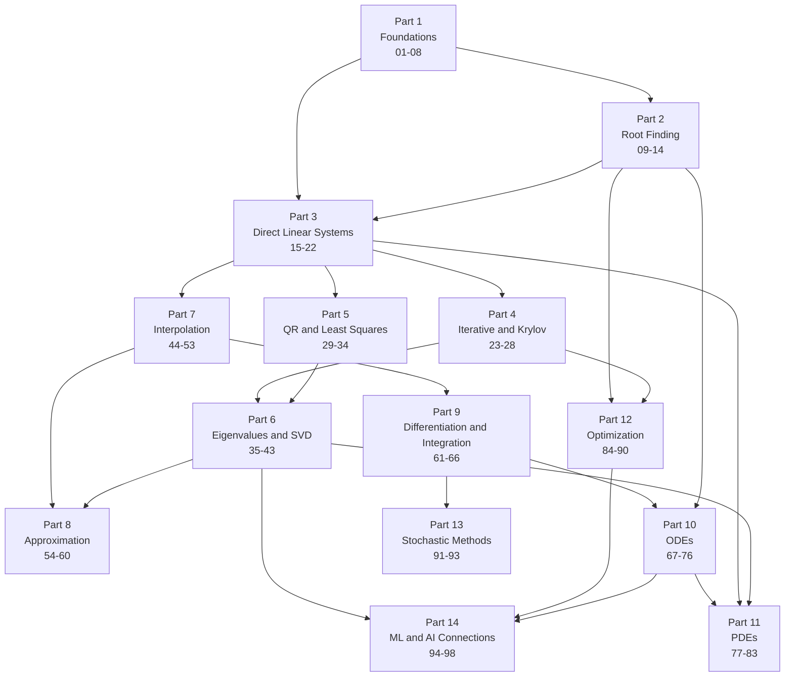

# Course Dependencies

What you need before each part, and what each part unlocks. Use this if you want to skip
around instead of going straight through.

The rule used throughout: a lesson may only rely on ideas from a lower-numbered lesson.
There is exactly one forward reference in the whole course, and it is flagged where it
happens (lesson 27 on GMRES points forward to Part 5 for the QR machinery it uses).

---

## Outside knowledge assumed

You need these before lesson 01. The course does not teach them.

| Area | What is assumed |
|---|---|
| Calculus | limits, derivatives, integrals, Taylor series, the mean value theorem |
| Linear algebra | vectors, matrices, matrix multiplication, rank, determinant, eigenvalues as a definition, solving small systems by hand |
| Differential equations | what an ODE is and what a solution means (only needed from Part 10) |
| Probability | random variables, expectation, variance (only needed from Part 13) |
| Python | functions, loops, NumPy arrays and slicing |

Nothing beyond this. All the numerical content is built up from lesson 01.

---

## Part level dependency graph



---

## Why each edge exists

| From | To | Reason |
|---|---|---|
| Part 1 | Part 2 | Root finding needs floating point, error, conditioning and convergence order |
| Part 1 | Part 3 | Elimination needs the roundoff model and cost analysis |
| Part 2 | Part 3 | Newton in one variable is the model for everything iterative that follows |
| Part 3 | Part 4 | Iterative methods are judged against the direct solve they replace, and Krylov methods need the projectors from lesson 16 |
| Part 3 | Part 5 | Least squares needs matrix norms, the condition number, and the projectors from lesson 16 |
| Part 4 | Part 6 | Krylov eigensolvers reuse Arnoldi and Lanczos from Part 4 |
| Part 5 | Part 6 | The QR algorithm needs the QR factorization |
| Part 3 | Part 7 | Vandermonde conditioning and the spline tridiagonal solve |
| Part 7 | Part 8 | Approximation is what you do when exact interpolation is the wrong goal |
| Part 6 | Part 8 | Orthogonal polynomials and the DFT are orthogonality arguments |
| Part 7 | Part 9 | Quadrature and difference formulas are derived by integrating interpolants |
| Part 9 | Part 10 | Multistep ODE methods come from quadrature rules |
| Part 2 | Part 10 | Implicit ODE steps and the shooting method call a root finder |
| Part 10 | Part 11 | PDE time stepping is ODE time stepping, and method of lines makes that explicit |
| Part 3 | Part 11 | Implicit PDE schemes solve a large sparse linear system every step |
| Part 6 | Part 11 | The matrix method for scheme stability is an eigenvalue argument |
| Part 2 | Part 12 | Optimization is root finding on the gradient |
| Part 4 | Part 12 | Nonlinear conjugate gradient comes straight from linear CG |
| Part 9 | Part 13 | Monte Carlo is presented as an integration method |
| Part 6 | Part 14 | PCA, low-rank methods and embeddings are the SVD |
| Part 12 | Part 14 | Training is optimization |
| Part 10 | Part 14 | Gradient descent is read as an ODE discretization, and neural ODEs are literal |

---

## Lesson level chains

These are the tight chains. If you skip a lesson in one of these, the next one will not
make sense.

**Floating point chain**

```
03 floating point -> 04 error and propagation -> 05 cancellation -> 06 conditioning and stability
```

Lesson 06 is the single most reused lesson in the course. Parts 3, 4, 5, 6, 9, 10 and 11
all lean on it.

**Elimination chain**

```
17 Gaussian elimination and LU -> 18 pivoting and PA=LU -> 19 conditioning of Ax=b
                                                             -> 20 Cholesky -> 21 sparse
                                                             -> 22 condition estimation
```

**Iterative chain**

```
23 classical iterative -> 24 conjugate gradient -> 25 preconditioning
                                                -> 26 Krylov, Arnoldi, Lanczos -> 27 GMRES
                                                                                -> 39 Krylov eigensolvers
23 classical iterative -> 28 multigrid
```

**Orthogonality chain**

This is the chain Trefethen and Bau is built on, and lesson 16 is where it starts.

```
15 norms -> 16 orthogonality and projectors -> 29 least squares (a projection)
                                            -> 30 Gram-Schmidt and QR (applies projectors)
                                            -> 31 Householder and Givens (orthogonal maps)
                                            -> 32 solving least squares
                                            -> 33 rank revealing QR
                                            -> 37 QR algorithm
16 orthogonality and projectors -> 26 Arnoldi and Lanczos (orthogonalizing a Krylov basis)
                                -> 39 Krylov eigensolvers (Rayleigh-Ritz is a projection)
                                -> 41 SVD theory (an orthogonal change of basis)
```

**Eigenvalue chain**

```
35 theory and localization -> 36 power methods -> 37 QR algorithm -> 38 symmetric problem
                                                                  -> 40 generalized problem
26 Arnoldi and Lanczos -----> 39 Krylov eigensolvers
37 QR algorithm ------------> 42 computing the SVD
41 SVD theory --------------> 42 computing the SVD -> 43 applications and low rank
```

**Interpolation chain**

```
44 polynomial forms -> 45 divided differences -> 46 error and Runge -> 47 Chebyshev
44 polynomial forms -> 48 finite difference operators -> 49 equal interval formulas
45 divided differences -> 50 Hermite and piecewise -> 51 cubic splines -> 52 Bezier and B-splines
44 polynomial forms -> 53 bivariate
```

**Quadrature chain**

```
44 polynomial forms -> 62 Newton-Cotes -> 63 Richardson and Romberg -> 64 adaptive
55 orthogonal polynomials -> 65 Gaussian quadrature
26 Arnoldi and Lanczos ---> 65 Gaussian quadrature
62 Newton-Cotes -> 66 improper and multiple integrals
```

The edge from 26 to 65 is the one people find surprising. The tridiagonal matrix that Lanczos
produces is the Jacobi matrix of the orthogonal polynomials, so its eigenvalues are the Gauss
quadrature nodes. Computing a quadrature rule and computing eigenvalues of a sparse matrix turn
out to be the same computation.

**ODE chain**

```
67 IVP theory and Euler -> 68 Taylor and Picard -> 69 Runge-Kutta -> 70 adaptive step size
                                                62 quadrature ---> 71 multistep
35 eigenvalues ----------> 72 stability and stiffness
69 Runge-Kutta ----------> 73 systems -> 74 symplectic integrators
09 bracketing + 17 LU ---> 75 boundary value problems -> 76 collocation and finite elements
```

**PDE chain**

```
77 classification and stencils -> 78 parabolic -> 79 consistency and stability -> 80 ADI
                                                81 hyperbolic and CFL
21 sparse + 23 iterative ------> 82 elliptic
14 Newton for systems ---------> 83 nonlinear PDEs and method of lines
```

**Optimization chain**

```
84 fundamentals -> 85 derivative free
84 fundamentals -> 86 gradient and Newton -> 87 quasi-Newton and trust region -> 88 constrained
24 conjugate gradient --------------------> 87 quasi-Newton and trust region
```

---

## What you can safely skip

If you are here for one thing in particular, these are the minimum routes.

| Goal | Minimum route |
|---|---|
| Understand floating point and error properly | 01, 03, 04, 05, 06 |
| Solve linear systems well | 01, 03, 06, 15, 17, 18, 19, 20, 21 |
| Understand the SVD and PCA | 06, 15, 16, 29, 30, 31, 35, 41, 43, 94 |
| Large sparse solvers | 15, 16, 17, 19, 21, 23, 24, 25, 26, 27, 28 |
| Eigenvalue algorithms end to end | 15, 16, 30, 31, 35, 36, 37, 38, 39 |
| Interpolation and splines | 44, 45, 46, 47, 51 |
| Quadrature | 44, 61, 62, 63, 64, 65 |
| Solve ODEs numerically | 06, 07, 67, 69, 70, 72, 73 |
| Solve PDEs numerically | 17, 21, 61, 67, 77, 78, 79, 82 |
| Optimization for machine learning | 06, 15, 24, 84, 86, 87, 89, 90, 95 |
| Numerical issues in deep learning | 03, 04, 05, 06, 96, 97 |

Parts 13 and 14 are the only parts nothing else depends on. Everything before them feeds
forward.
